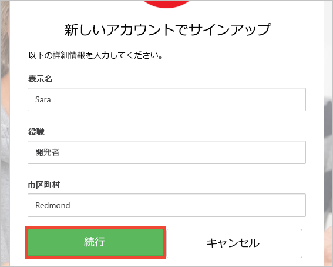
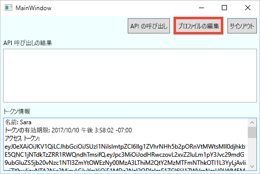

# Azure AD B2C で構成されているデスクトップ アプリケーションの試用

Azure Active Directory B2C は、アプリケーション、ビジネス、顧客を保護するためのクラウド ID 管理を提供します。  このクイックスタートでは、サンプルの Windows Presentation Foundation (WPF) デスクトップ アプリを使用して、以下のデモンストレーションを行います。

* **サインアップまたはサインイン** ポリシーを使用した、ソーシャル ID プロバイダー アカウントまたはメール アドレスを使用したローカル アカウントの作成またはサインイン。 
* **API の呼び出し**による、Azure AD B2C のセキュリティで保護されたリソースからの表示名の取得。

## 前提条件

* 次のワークロードを使って、[Visual Studio 2017](https://www.visualstudio.com/downloads/) をインストールします。
    - **.NET デスクトップ開発**

* Facebook、Google、Microsoft、または Twitter のソーシャル アカウント。 ソーシャル アカウントを持っていない場合は、有効なメール アドレスが必要です。

[!INCLUDE [quickstarts-free-trial-note](../../includes/quickstarts-free-trial-note.md)]

## サンプルのダウンロード

GitHub から[サンプル アプリケーションをダウンロードまたは複製](https://github.com/Azure-Samples/active-directory-b2c-dotnet-desktop)します。

## Visual Studio でのアプリの実行

サンプル アプリケーションのプロジェクト フォルダーにある `active-directory-b2c-wpf.sln` ソリューションを Visual Studio で開きます。 

**[デバッグ]、[デバッグの開始]** の順に選択し、アプリケーションをビルドして実行します。 

## アカウントの作成

**[Sign in]\(サインイン\)** をクリックして、**サインアップまたはサインイン** ワークフローを開始します。 アカウントの作成時に、既存のソーシャル ID プロバイダー アカウントまたは電子メール アカウントを使用することができます。

### ソーシャル ID プロバイダーを使用してサインアップする

ソーシャル ID プロバイダーを使用してサインアップするには、使用する ID プロバイダーのボタンをクリックします。 メール アドレスを使用する場合は、「[メール アドレスを使用してサインアップする](#sign-up-using-an-email-address)」セクションに進んでください。

ソーシャル アカウントの資格情報を使用して認証 (サインイン) し、アプリケーションがソーシャル アカウントから情報を読み取ることを承認する必要があります。 アクセスを許可することにより、アプリケーションはソーシャル アカウントからプロファイル情報 (名前やお住まいの都市など) を取得できるようになります。 

新しいアカウントのプロファイルの詳細には、ソーシャル アカウントからの情報があらかじめ設定されています。 必要に応じて詳細を変更し、**[Continue]\(続行\)** をクリックします。

ID プロバイダーを使用する新しい Azure AD B2C ユーザー アカウントが正常に作成されました。 サインイン後に、アクセス トークンが *[Token info]\(トークン情報\)* テキスト ボックスに表示されます。 アクセス トークンは、API リソースにアクセスするときに使用されます。

次の手順: 「[プロファイルの編集](#edit-your-profile)」セクションに進みます。

### メール アドレスを使用してサインアップする

認証の提供にソーシャル アカウントを使用しない場合は、有効なメール アドレスを使用して Azure AD B2C ユーザー アカウントを作成できます。 Azure AD B2C ローカル ユーザー アカウントは、ID プロバイダーとして Azure Active Directory を使用します。 メール アドレスを使用するには、**[Don't have an account? Sign up now]\(アカウントをお持ちでない場合は今すぐサインアップ\)** リンクをクリックします。

有効なメール アドレスを入力し、**[Send verification code]\(確認コードの送信\)** をクリックします。 Azure AD B2C から確認コードを受信するには、有効なメール アドレスが必要です。

電子メールで受け取った確認コードを入力し、**[Verify code]\(コードの確認\)** をクリックします。

プロファイル情報を追加し、**[Create]\(作成\)** をクリックします。

新しい Azure AD B2C ローカル ユーザー アカウントが正常に作成されました。 サインイン後に、アクセス トークンが *[Token info]\(トークン情報\)* テキスト ボックスに表示されます。 アクセス トークンは、API リソースにアクセスするときに使用されます。

## プロファイルの編集

Azure Active Directory B2C には、ユーザーが自分のプロファイルを更新することができる機能があります。 作成したプロファイルを編集するには、**[Edit profile]\(プロファイルの編集\)** をクリックします。

作成したアカウントに関連付けられている ID プロバイダーを選択します。 たとえば、アカウントの作成時に ID プロバイダーとして Twitter を使用した場合は、関連付けられているプロファイルの詳細を変更するために Twitter を選択します。

**表示名**や**都市**を変更します。 

新しいアクセス トークンが *[Token info]\(トークン情報\)* テキスト ボックスに表示されます。 プロファイルに対する変更を確認する場合は、アクセス トークンをコピーしてトークン デコーダー https://jwt.ms に貼り付けます。

## リソースへのアクセス

**[Call API]\(API の呼び出し\)** をクリックして、Azure AD B2C のセキュリティで保護されたリソース https://fabrikamb2chello.azurewebsites.net/hello に対して要求を送信します。 

アプリケーションにより、*[Token info]\(トークン情報\)* テキスト ボックスに表示されているアクセス トークンが要求に含まれます。 API からは、アクセス トークンに含まれている表示名が返されます。

## 次のステップ

次のステップでは、独自の Azure AD B2C テナントを作成し、そのテナントを使用して実行するようにサンプルを構成します。 

> [!div class="nextstepaction"]
> [Azure Portal で Azure Active Directory B2C テナントを作成する](active-directory-b2c-get-started.md)
