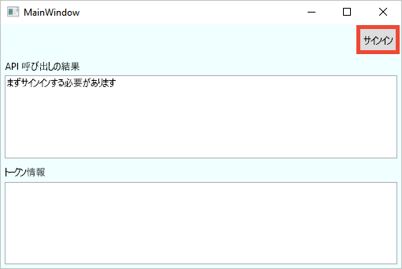
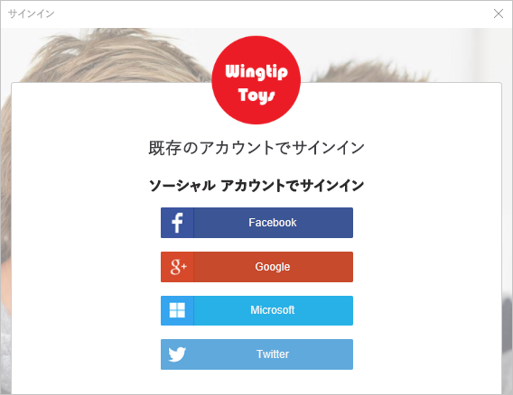
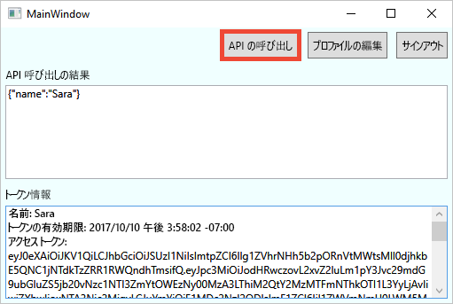

# <a name="quickstart-set-up-sign-in-for-a-desktop-app-using-azure-active-directory-b2c"></a>クイック スタート:Azure Active Directory B2C を使用したデスクトップ アプリのサインインの設定

Azure Active Directory (Azure AD) B2C は、アプリケーション、ビジネス、顧客を保護するためのクラウド ID 管理を提供します。 Azure AD B2C に対応したアプリケーションは、オープンな標準プロトコルを使用し、ソーシャル アカウントやエンタープライズ アカウントで認証を行うことができます。 このクイック スタートでは、WPF (Windows Presentation Foundation) デスクトップ アプリケーションにソーシャル ID プロバイダーを使ってサインインし、Azure AD B2C で保護された Web API を呼び出します。

[!INCLUDE [quickstarts-free-trial-note](../../includes/quickstarts-free-trial-note.md)]

## <a name="prerequisites"></a>前提条件

- **[ASP.NET および Web の開発]** ワークロードを含む [Visual Studio 2019](https://www.visualstudio.com/downloads/)。
- Facebook、Google、Microsoft、または Twitter のソーシャル アカウント。
- [ZIP ファイルをダウンロード](https://github.com/Azure-Samples/active-directory-b2c-dotnet-desktop/archive/master.zip)するか、GitHub からサンプル Web アプリを複製します。

    ```
    git clone https://github.com/Azure-Samples/active-directory-b2c-dotnet-desktop.git
    ```

## <a name="run-the-application-in-visual-studio"></a>Visual Studio でアプリケーションを実行する

1. サンプル アプリケーションのプロジェクト フォルダーにある **active-directory-b2c-wpf.sln** ソリューションを Visual Studio で開きます。
2. **F5** キーを押してアプリケーションをデバッグします。

## <a name="sign-in-using-your-account"></a>自分のアカウントを使用してサインインする

1. **[Sign in]\(サインイン\)** をクリックして、**サインアップまたはサインイン** ワークフローを開始します。

    

    このサンプルは、いくつかのサインアップ オプションをサポートしています。 これらのオプションには、ソーシャル ID プロバイダーの使用や、メール アドレスを使用したローカル アカウントの作成が含まれます。 このクイック スタートでは、Facebook、Google、Microsoft、または Twitter のいずれかのソーシャル ID プロバイダー アカウントを使用します。


2. このサンプル Web アプリでは、Wingtip Toys という架空のブランドのカスタム ログイン ページが Azure AD B2C により表示されます。 ソーシャル ID プロバイダーを使用してサインアップするには、使用する ID プロバイダーのボタンをクリックします。

    

    ユーザーは、ソーシャル アカウントの資格情報を使用して認証 (サインイン) し、アプリケーションがそのソーシャル アカウントから情報を読み取ることを承認します。 アクセスを許可することにより、アプリケーションはソーシャル アカウントからプロファイル情報 (名前やお住まいの都市など) を取得できるようになります。

2. ID プロバイダーのサインイン プロセスを完了します。

    新しいアカウントのプロファイルの詳細には、ソーシャル アカウントからの情報があらかじめ設定されています。

## <a name="edit-your-profile"></a>プロファイルの編集

Azure AD B2C には、ユーザーが自分のプロファイルを更新することができる機能があります。 このサンプル Web アプリのワークフローには、Azure AD B2C の編集プロファイル ユーザー フローが使用されます。

1. 作成したプロファイルを編集するには、アプリケーションのメニュー バーで **[プロファイルの編集]** をクリックします。

    ![[プロファイルの編集] ボタンが強調表示されている WPF サンプル アプリ](media/active-directory-b2c-quickstarts-desktop-app/edit-profile-wpf.png)

2. 作成したアカウントに関連付けられている ID プロバイダーを選択します。 たとえば、アカウントの作成時に ID プロバイダーとして Twitter を使用した場合は、関連付けられているプロファイルの詳細を変更するために Twitter を選択します。

3. **表示名**や**都市**を変更し、 **[Continue]\(続行\)** をクリックします。

    新しいアクセス トークンが *[Token info]\(トークン情報\)* テキスト ボックスに表示されます。 プロファイルに対する変更を確認する場合は、アクセス トークンをコピーしてトークン デコーダー https://jwt.ms に貼り付けます。

## <a name="access-a-protected-api-resource"></a>保護された API リソースにアクセスする

**[Call API]\(API の呼び出し\)** をクリックして、保護されたリソースに対して要求を送信します。

    

    The application includes the Azure AD access token in the request to the protected web API resource. The web API sends back the display name contained in the access token.

Azure AD B2C ユーザー アカウントを使用して、Azure AD B2C で保護された Web API の承認済みの呼び出しを正しく行いました。

## <a name="clean-up-resources"></a>リソースのクリーンアップ

他の Azure AD B2C クイックスタートやチュートリアルを試す場合は、Azure AD B2C テナントを使用できます。 不要になったら、[Azure AD B2C テナントを削除する](active-directory-b2c-faqs.md#how-do-i-delete-my-azure-ad-b2c-tenant)ことができます。

## <a name="next-steps"></a>次の手順

このクイック スタートでは、サンプルのデスクトップ アプリケーションを使用して次のことを行いました。

* カスタム ログイン ページを使用してサインインする
* ソーシャル ID プロバイダーを使用してサインインする
* Azure AD B2C アカウントを作成する
* Azure AD B2C によって保護された Web API を呼び出す

独自の Azure AD B2C テナントを作成してみましょう。

> [!div class="nextstepaction"]
> [Azure Portal で Azure Active Directory B2C テナントを作成する](tutorial-create-tenant.md)
