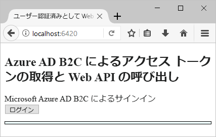
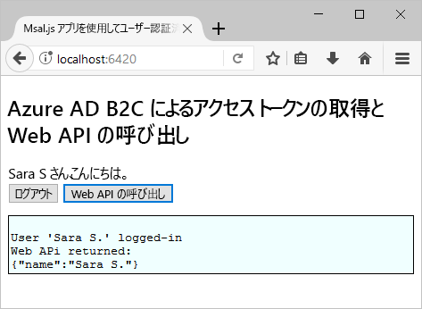

# <a name="quickstart-set-up-sign-in-for-a-single-page-app-using-azure-active-directory-b2c"></a>クイック スタート: Azure Active Directory B2C を使用したシングルページ アプリのサインインの設定

Azure Active Directory (Azure AD) B2C は、アプリケーション、ビジネス、顧客を保護するためのクラウド ID 管理を提供します。 Azure AD B2C に対応したアプリは、オープンな標準プロトコルを使用し、ソーシャル アカウントやエンタープライズ アカウントで認証を行うことができます。

このクイックスタートでは、Azure AD B2C 対応のサンプル シングル ページ アプリにソーシャル ID プロバイダーを使ってサインインし、Azure AD B2C で保護された Web API を呼び出します。

[!INCLUDE [quickstarts-free-trial-note](../../includes/quickstarts-free-trial-note.md)]

## <a name="prerequisites"></a>前提条件

* [Visual Studio 2017](https://www.visualstudio.com/downloads/) と **ASP.NET および開発**ワークロード。
* [Node.js](https://nodejs.org/en/download/)
* Facebook アカウント。

## <a name="download-the-sample"></a>サンプルのダウンロード

[ZIP ファイルをダウンロード](https://github.com/Azure-Samples/active-directory-b2c-javascript-msal-singlepageapp/archive/master.zip)するか、GitHub からサンプル Web アプリを複製します。

```
git clone https://github.com/Azure-Samples/active-directory-b2c-javascript-msal-singlepageapp.git
```

## <a name="run-the-sample-application"></a>サンプル アプリケーションの実行

このサンプルを Node.js コマンド プロンプトから実行するには、次のようにします。 

```
cd active-directory-b2c-javascript-msal-singlepageapp
npm install && npm update
node server.js
```

この Node.js アプリは、localhost でリッスンしているポート番号を出力します。

```
Listening on port 6420...
```

Web ブラウザーでアプリの URL (`http://localhost:6420`) にアクセスします。



## <a name="create-an-account"></a>アカウントの作成

**[Login]\(ログイン\)** ボタンをクリックすると、Azure AD B2C のポリシーに基づく Azure AD B2C の**サインアップまたはサインイン** ワークフローが開始されます。 

このサンプルは、メール アドレスを使用してローカル アカウントを作成する方法など、複数のサインアップ オプションをサポートすることを目的としています。 このクイック スタートでは、Facebook アカウントを使用します。 

### <a name="sign-up-using-a-social-identity-provider"></a>ソーシャル ID プロバイダーを使用してサインアップする

このサンプル Web アプリでは、Wingtip Toys という架空のブランドのカスタム ログイン ページが Azure AD B2C により表示されます。 

1. ソーシャル ID プロバイダーを使用してサインアップするには、Facebook ID プロバイダーのボタンをクリックします。

    ユーザーは、ソーシャル アカウントの資格情報を使用して認証 (サインイン) を行うと共に、ソーシャル アカウントから情報を読み取ることについての承認をアプリケーションに与えることになります。 アクセスを許可することにより、アプリケーションはソーシャル アカウントからプロファイル情報 (名前やお住まいの都市など) を取得できるようになります。 

2. 資格情報を入力して、ID プロバイダーのサインイン プロセスを完了します。

    新しいアカウントのプロファイルの詳細には、ソーシャル アカウントからの情報があらかじめ設定されています。 

3. [Display Name]\(表示名\)、[Job Title]\(役職\)、[City]\(都市) フィールドを更新し、**[Continue]\(続行\)** をクリックします。  入力した値は、Azure AD B2C ユーザー アカウントのプロファイルに使用されます。

    ID プロバイダーを使用する新しい Azure AD B2C ユーザー アカウントが正常に作成されました。 

## <a name="access-a-protected-web-api-resource"></a>保護された Web API リソースにアクセスする

**[Call Web API]\(Web API の呼び出し\)** ボタンをクリックすると、Web API 呼び出しから表示名が JSON オブジェクトとして返されます。 



このサンプル シングル ページ アプリは、保護された Web API リソースへの要求に、JSON オブジェクトの取得操作を実行するための Azure AD アクセス トークンを追加します。

## <a name="clean-up-resources"></a>リソースのクリーンアップ

他の Azure AD B2C クイックスタートやチュートリアルを試す場合は、Azure AD B2C テナントを使用できます。 不要になったら、[Azure AD B2C テナントを削除する](active-directory-b2c-faqs.md#how-do-i-delete-my-azure-ad-b2c-tenant)ことができます。

## <a name="next-steps"></a>次の手順

このクイックスタートでは、Azure AD B2C 対応のサンプル ASP.NET アプリを使用して、カスタム ログイン ページでのサインインとソーシャル ID プロバイダーでのサインイン、Azure AD B2C アカウントの作成を行った後、Azure AD B2C で保護された Web API を呼び出しました。 

次のステップでは、独自の Azure AD B2C テナントを作成し、そのテナントを使用して実行するようにサンプルを構成します。 

> [!div class="nextstepaction"]
> [Azure Portal で Azure Active Directory B2C テナントを作成する](tutorial-create-tenant.md)