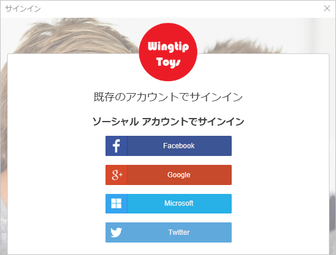

# <a name="quickstart-set-up-sign-in-for-a-single-page-app-using-azure-active-directory-b2c"></a>クイック スタート:Azure Active Directory B2C を使用したシングルページ アプリのサインインの設定

Azure Active Directory B2C (Azure AD B2C) は、アプリケーション、ビジネス、顧客を保護するためのクラウド ID 管理を提供します。 Azure AD B2C に対応したアプリケーションは、オープンな標準プロトコルを使用し、ソーシャル アカウントやエンタープライズ アカウントで認証を行うことができます。 このクイック スタートでは、シングル ページ アプリケーションにソーシャル ID プロバイダーを使ってサインインし、Azure AD B2C で保護された Web API を呼び出します。

[!INCLUDE [quickstarts-free-trial-note](../../includes/quickstarts-free-trial-note.md)]

## <a name="prerequisites"></a>前提条件

- **[ASP.NET および Web の開発]** ワークロードを含む [Visual Studio 2019](https://www.visualstudio.com/downloads/)
- [Node.JS](https://nodejs.org/en/download/)
- Facebook、Google、または Microsoft のソーシャル アカウント
- GitHub のコード サンプル: [active-directory-b2c-javascript-msal-singlepageapp](https://github.com/Azure-Samples/active-directory-b2c-javascript-msal-singlepageapp)
    
    [zip アーカイブをダウンロードする](https://github.com/Azure-Samples/active-directory-b2c-javascript-msal-singlepageapp/archive/master.zip)か、リポジトリを複製することができます。

    ```
    git clone https://github.com/Azure-Samples/active-directory-b2c-javascript-msal-singlepageapp.git
    ```

## <a name="run-the-application"></a>アプリケーションの実行

1. Node.js のコマンド プロンプトから次のコマンドを実行してサーバーを起動します。

    ```
    cd active-directory-b2c-javascript-msal-singlepageapp
    npm install && npm update
    node server.js
    ```

    Server.js が localhost でリッスンしているポート番号を出力します。

    ```
    Listening on port 6420...
    ```

2. ブラウザーでアプリケーションの URL にアクセスします。 たとえば、「 `http://localhost:6420` 」のように入力します。

## <a name="sign-in-using-your-account"></a>自分のアカウントを使用してサインインする

1. **[Login]\(ログイン\)** をクリックしてワークフローを開始します。

    

    このサンプルは、ソーシャル ID プロバイダーを使用する方法や、メール アドレスを使用してローカル アカウントを作成する方法など、複数のサインアップ方法に対応しています。 このクイック スタートでは、Facebook、Google、Microsoft のいずれかのソーシャル ID プロバイダー アカウントを使用します。

2. Azure AD B2C では、サンプルの Web アプリケーションに対する Fabrikam と呼ばれる架空の会社のサインイン ページが提供されます。 ソーシャル ID プロバイダーを使用してサインアップするには、使用する ID プロバイダーのボタンをクリックします。

    

    ユーザーは、ソーシャル アカウントの資格情報を使用して認証 (サインイン) し、アプリケーションがそのソーシャル アカウントから情報を読み取ることを承認します。 アクセスを許可することにより、アプリケーションはソーシャル アカウントからプロファイル情報 (名前やお住まいの都市など) を取得できるようになります。

3. ID プロバイダーのサインイン プロセスを完了します。

## <a name="access-a-protected-api-resource"></a>保護された API リソースにアクセスする

**[Call Web API]\(Web API の呼び出し\)** をクリックすると、Web API 呼び出しから表示名が JSON オブジェクトとして返されます。


このシングルページ アプリケーション サンプルは、保護された Web API リソースへの要求にアクセス トークンを追加します。

## <a name="clean-up-resources"></a>リソースのクリーンアップ

他の Azure AD B2C クイックスタートやチュートリアルを試す場合は、Azure AD B2C テナントを使用できます。 不要になったら、[Azure AD B2C テナントを削除する](active-directory-b2c-faqs.md#how-do-i-delete-my-azure-ad-b2c-tenant)ことができます。

## <a name="next-steps"></a>次の手順

このクイック スタートでは、サンプルのシングルページ アプリケーションを使用して次のことを行いました。

* カスタム ログイン ページを使用してサインインする
* ソーシャル ID プロバイダーを使用してサインインする
* Azure AD B2C アカウントを作成する
* Azure AD B2C によって保護された Web API を呼び出す

独自の Azure AD B2C テナントを作成してみましょう。

> [!div class="nextstepaction"]
> [Azure Portal で Azure Active Directory B2C テナントを作成する](tutorial-create-tenant.md)
