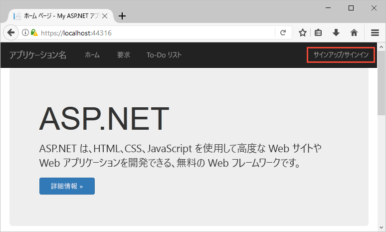
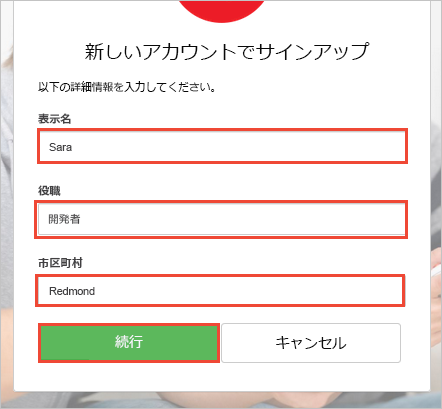
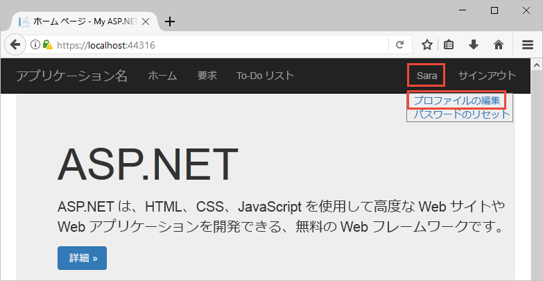

# Azure AD B2C 対応 Web アプリの試用

Azure Active Directory B2C は、アプリケーション、ビジネス、顧客を保護するためのクラウド ID 管理を提供します。 このクイック スタートでは、サンプルの To-Do リスト アプリを使用して、以下のデモンストレーションを行います。

> [!div class="checklist"]
> * カスタム ログイン ページからサインインする。
> * ソーシャル ID プロバイダーを使用してサインインする。
> * Azure AD B2C アカウントとユーザー プロファイルを作成し管理する。
> * Azure AD B2C によって保護された Web API を呼び出す。

## 前提条件

* [Visual Studio 2017](https://www.visualstudio.com/downloads/) と **ASP.NET および開発**ワークロード。 
* Facebook、Google、Microsoft、または Twitter のソーシャル アカウント。

[!INCLUDE [quickstarts-free-trial-note](../../includes/quickstarts-free-trial-note.md)]

## サンプルのダウンロード

GitHub から[サンプル アプリケーションをダウンロードまたは複製](https://github.com/Azure-Samples/active-directory-b2c-dotnet-webapp-and-webapi)します。

## Visual Studio でのアプリの実行

サンプル アプリケーションのプロジェクト フォルダーにある `B2C-WebAPI-DotNet.sln` ソリューションを Visual Studio で開きます。 

このソリューションは、2 つのプロジェクトから構成される To Do リスト アプリケーション例です。

* **TaskWebApp** - ユーザーが To-Do リスト項目を管理できる ASP.NET MVC Web アプリケーション。  
* **TaskService** - ユーザーの To-Do リスト項目に対して実行される操作を管理する ASP.NET Web API バックエンド。 Web アプリはこの Web API を呼び出し、結果を表示します。

このクイック スタートでは、`TaskWebApp` プロジェクトと `TaskService` プロジェクトの両方を同時に実行する必要があります。 

1. Visual Studio のメニューで、**[プロジェクト]、[スタートアップ プロジェクトの設定]** の順に選択します。 
2. **[マルチ スタートアップ プロジェクト]** を選択します。
3. 両方のプロジェクトの **[アクション]** を **[開始]** に変更します。 **[OK]**をクリックします。

**[デバッグ]、[デバッグの開始]** の順に選択し、両方のアプリケーションをビルドして実行します。 各アプリケーションは、それぞれ別のブラウザー タブで開かれます。

`https://localhost:44316/` - このページは、ASP.NET Web アプリケーションです。 このクイック スタートでは、このアプリケーションを直接操作します。
`https://localhost:44332/` - このページは、ASP.NET Web アプリケーションによって呼び出される Web API です。

## アカウントの作成

ASP.NET Web アプリケーションの **[Sign up / Sign in]\(サインアップ/サインイン\)** リンクをクリックして、**サインアップまたはサインイン** ワークフローを開始します。 アカウントの作成時に、既存のソーシャル ID プロバイダー アカウントまたは電子メール アカウントを使用することができます。 このクイック スタートでは、Facebook、Google、Microsoft、または Twitter のいずれかのソーシャル ID プロバイダー アカウントを使用します。

### ソーシャル ID プロバイダーを使用してサインアップする

ソーシャル ID プロバイダーを使用してサインアップするには、使用する ID プロバイダーのボタンをクリックします。 

ソーシャル アカウントの資格情報を使用して認証 (サインイン) し、アプリケーションがソーシャル アカウントから情報を読み取ることを承認する必要があります。 アクセスを許可することにより、アプリケーションはソーシャル アカウントからプロファイル情報 (名前やお住まいの都市など) を取得できるようになります。 

ID プロバイダーのサインイン プロセスを完了します。 たとえば、Twitter を選択した場合、Twitter の資格情報を入力し、**[サインイン]** をクリックします。

新しい Azure AD B2C アカウントのプロファイルの詳細には、ソーシャル アカウントからの情報があらかじめ設定されています。

[Display Name]\(表示名\)、[Job Title]\(役職\)、[City]\(都市) フィールドを更新し、**[Continue]\(続行\)** をクリックします。  入力した値は、Azure AD B2C ユーザー アカウントのプロファイルに使用されます。

次の操作に成功しました。

> [!div class="checklist"]
> * ID プロバイダーを使用した認証。
> * Azure AD B2C ユーザー アカウントの作成。 

## プロファイルの編集

Azure Active Directory B2C には、ユーザーが自分のプロファイルを更新することができる機能があります。 Web アプリケーションのメニュー バーでプロファイル名をクリックし、**[Edit Profile]\(プロファイルの編集\)** を選択して、作成したプロファイルを編集します。

**[Display name]\(表示名\)** と **[City]\(都市\)** を変更します。  **[Continue]\(続行\)** をクリックして、プロファイルを更新します。

ページの右上部分の表示名には、更新した名前が表示されることに注意してください。 

## セキュリティで保護された Web API リソースにアクセスする

To-Do リスト項目を入力および変更するには、**[To-Do List]\(To-Do リスト\)** をクリックします。 ASP.NET Web アプリケーションは、ユーザーの To-Do リスト項目に対する操作を実行するためのアクセス許可を求めるアクセス トークンを Web API リソースへの要求に含めます。 

**[New Item]\(新しい項目\)** テキスト ボックスにテキストを入力します。 **[Add]\(追加\)** をクリックして、To-do リスト項目を追加する、Azure AD B2C のセキュリティで保護された Web API を呼び出します。

Azure AD B2C ユーザー アカウントを使用して、Azure AD B2C のセキュリティで保護された Web API の承認済みの呼び出しを正しく行いました。

## 次のステップ

このクイック スタートで使用されるサンプルは、次のようなその他の Azure AD B2C シナリオの実行に使用できます。

* メール アドレスを使用した、新しいローカル アカウントの作成。
* ローカル アカウント パスワードのリセット。

独自の Azure AD B2C テナントの作成について掘り下げ、独自のテナントを使用して実行するようにサンプルを構成する準備ができたら、次のチュートリアルを試してください。

> [!div class="nextstepaction"]
> [Azure Active Directory B2C のサインアップ、サインイン、プロファイル編集、パスワード リセットを使用する ASP.NET Web アプリケーションの構築](active-directory-b2c-devquickstarts-web-dotnet-susi.md)