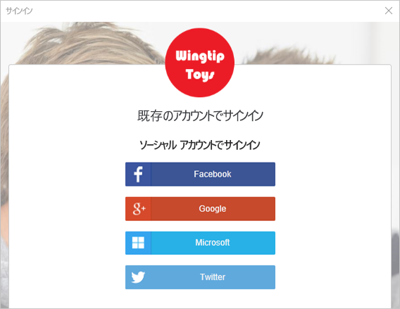
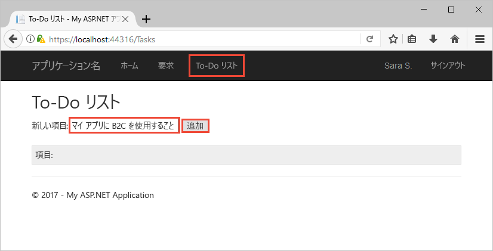

# <a name="quickstart-set-up-sign-in-for-an-aspnet-application-using-azure-active-directory-b2c"></a>クイック スタート:Azure Active Directory B2C を使用して ASP.NET アプリケーションへのサインインを設定する

Azure Active Directory (Azure AD) B2C は、アプリケーション、ビジネス、顧客を保護するためのクラウド ID 管理を提供します。 Azure AD B2C に対応したアプリケーションは、オープンな標準プロトコルを使用し、ソーシャル アカウントやエンタープライズ アカウントで認証を行うことができます。 このクイック スタートでは、ASP.NET アプリケーションにソーシャル ID プロバイダーを使ってサインインし、Azure AD B2C で保護された Web API を呼び出します。

[!INCLUDE [quickstarts-free-trial-note](../../includes/quickstarts-free-trial-note.md)]

## <a name="prerequisites"></a>前提条件

- **[ASP.NET および Web の開発]** ワークロードを含む [Visual Studio 2019](https://www.visualstudio.com/downloads/)。
- Facebook、Google、Microsoft、または Twitter のソーシャル アカウント。
- [ZIP ファイルをダウンロード](https://github.com/Azure-Samples/active-directory-b2c-dotnet-webapp-and-webapi/archive/master.zip)するか、GitHub からサンプル Web アプリケーションを複製します。

    ```
    git clone https://github.com/Azure-Samples/active-directory-b2c-dotnet-webapp-and-webapi.git
    ```

    サンプル ソリューションには次の 2 つのプロジェクトがあります。

    - **TaskWebApp** - タスク リストの作成と編集を行う Web アプリケーション。 この Web アプリケーションは、**サインアップまたはサインイン**のユーザー フローを使用してユーザーをサインアップまたはサインインします。
    - **TaskService** - タスク リストの作成、読み取り、更新、削除機能をサポートする Web API。 この Web API は Azure AD B2C によって保護されており、Web アプリケーションによって呼び出されます。

## <a name="run-the-application-in-visual-studio"></a>Visual Studio でアプリケーションを実行する

1. サンプル アプリケーションのプロジェクト フォルダーにある **B2C-WebAPI-DotNet.sln** ソリューションを Visual Studio で開きます。
2. このクイック スタートでは、**TaskWebApp** プロジェクトと **TaskService** プロジェクトの両方を同時に実行します。 ソリューション エクスプローラーで **B2C-WebAPI-DotNet** ソリューションを右クリックし、 **[スタートアップ プロジェクトの設定]** を選択します。
3. **[マルチ スタートアップ プロジェクト]** を選択し、両方のプロジェクトの **[アクション]** を **[開始]** に変更します。
4. Click **OK**.
5. **F5** キーを押して両方のアプリケーションをデバッグします。 各アプリケーションは、それぞれ別のブラウザー タブで開かれます。

    - `https://localhost:44316/` - ASP.NET Web アプリケーション。 このクイック スタートでは、このアプリケーションを直接操作します。
    - `https://localhost:44332/` - ASP.NET Web アプリケーションによって呼び出される Web API。

## <a name="sign-in-using-your-account"></a>自分のアカウントを使用してサインインする

1. ASP.NET Web アプリケーションの **[Sign up / Sign in]\(サインアップ/サインイン\)** をクリックして、ワークフローを開始します。

    ![[Sign up / Sign in]\(サインアップ/サインイン\) リンクが強調表示されている、ブラウザー内のサンプル ASP.NET Web アプリ](media/active-directory-b2c-quickstarts-web-app/web-app-sign-in.png)

    このサンプルは、ソーシャル ID プロバイダーを使用する方法や、メール アドレスを使用してローカル アカウントを作成する方法など、複数のサインアップ方法に対応しています。 このクイック スタートでは、Facebook、Google、Microsoft、または Twitter のいずれかのソーシャル ID プロバイダー アカウントを使用します。

2. Azure AD B2C は、サンプルの Web アプリケーションに対する Wingtip Toys と呼ばれる架空のブランドのカスタム サインイン ページを提供します。 ソーシャル ID プロバイダーを使用してサインアップするには、使用する ID プロバイダーのボタンをクリックします。

    

    ユーザーは、ソーシャル アカウントの資格情報を使用して認証 (サインイン) し、アプリケーションがそのソーシャル アカウントから情報を読み取ることを承認します。 アクセスを許可することにより、アプリケーションはソーシャル アカウントからプロファイル情報 (名前やお住まいの都市など) を取得できるようになります。

3. ID プロバイダーのサインイン プロセスを完了します。

## <a name="edit-your-profile"></a>プロファイルの編集

Azure Active Directory B2C には、ユーザーが自分のプロファイルを更新することができる機能があります。 このサンプル Web アプリのワークフローには、Azure AD B2C の編集プロファイル ユーザー フローが使用されます。

1. アプリケーションのメニュー バーでプロファイル名をクリックし、 **[Edit Profile]\(プロファイルの編集\)** を選択して、作成したプロファイルを編集します。

    ![[Edit Profile]\(プロファイルの編集\) リンクが強調表示されている、ブラウザー内のサンプル Web アプリ](media/active-directory-b2c-quickstarts-web-app/edit-profile-web.png)

2. **表示名**や**都市**を変更し、 **[Continue]\(続行\)** をクリックして、プロファイルを更新します。

    変更内容が、Web アプリケーションのホーム ページの右上の領域に表示されます。

## <a name="access-a-protected-api-resource"></a>保護された API リソースにアクセスする

1. To-Do リスト項目を入力および変更するには、 **[To-Do List]\(To-Do リスト\)** をクリックします。

2. **[New Item]\(新しい項目\)** テキスト ボックスにテキストを入力します。 **[Add]\(追加\)** をクリックして、To-do リスト項目を追加する、Azure AD B2C で保護された Web API を呼び出します。

    

    ASP.NET Web アプリケーションは、保護された Web API リソースへの要求に、ユーザーの To Do リスト項目に対する操作を実行するための Azure AD アクセス トークンを追加します。

Azure AD B2C ユーザー アカウントを使用して、Azure AD B2C で保護された Web API の承認済みの呼び出しを正しく行いました。

## <a name="clean-up-resources"></a>リソースのクリーンアップ

他の Azure AD B2C クイックスタートやチュートリアルを試す場合は、Azure AD B2C テナントを使用できます。 不要になったら、[Azure AD B2C テナントを削除する](active-directory-b2c-faqs.md#how-do-i-delete-my-azure-ad-b2c-tenant)ことができます。

## <a name="next-steps"></a>次の手順

このクイック スタートでは、サンプルの ASP.NET アプリケーションを使用して次のことを行いました。

* カスタム ログイン ページを使用してサインインする
* ソーシャル ID プロバイダーを使用してサインインする
* Azure AD B2C アカウントを作成する
* Azure AD B2C によって保護された Web API を呼び出す

独自の Azure AD B2C テナントを作成してみましょう。

> [!div class="nextstepaction"]
> [Azure Portal で Azure Active Directory B2C テナントを作成する](tutorial-create-tenant.md)
