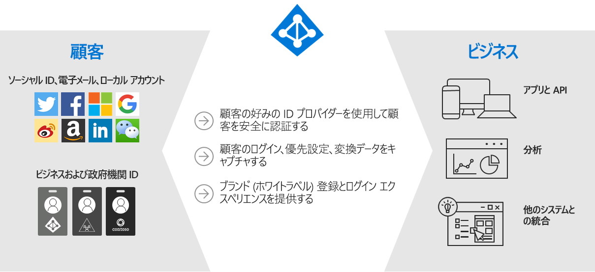
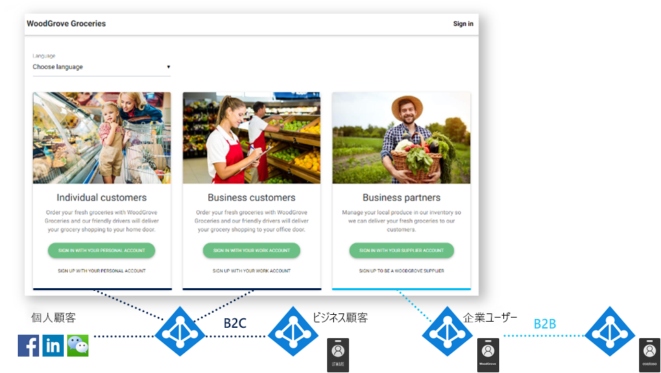

# Azure Active Directory B2C とは

Azure Active Directory B2C は、サービスとしての企業-消費者間 (B2C) ID が提供されます。 顧客は、好みのソーシャル、エンタープライズ、またはローカル アカウント ID を使用して、アプリケーションや API にシングル サインオン アクセスできます。

Azure AD B2C は、1 日あたり何百万ものユーザーと何十億もの認証をサポートできる顧客 ID アクセス管理 (CIAM) ソリューションです。 認証プラットフォームのスケーリングと安全性が処理され、サービス拒否、パスワード スプレー、ブルート フォース攻撃などの脅威の監視と自動処理が行われます。

Azure AD B2C は、[Azure Active Directory (Azure AD)](../active-directory/fundamentals/active-directory-whatis.md) とは別のサービスです。 Azure AD と同じテクノロジをベースにして構築されていますが、目的が異なります。 企業が顧客向けのアプリケーションを構築し、ユーザー アカウントに制限をかけずに、だれでもそのアプリケーションにサインアップできるようにします。
   
## Azure AD B2C の利用者
ホワイト ラベルの認証ソリューションを使用して、Web/モバイル アプリケーションのエンド ユーザーを認証したい企業または個人。 Azure AD B2C サービスは、認証とは別に、認証されたユーザーによる API リソースへのアクセスなどの承認に使用されます。 Azure AD B2C は、**IT 管理者** と **開発者** によって使用されることを想定しています。

## カスタム ブランドの ID ソリューション

Azure AD B2C は、ホワイトラベルの認証ソリューションです。 ユーザー エクスペリエンス全体を貴社のブランドでカスタマイズし、貴社の Web アプリケーションやモバイル アプリケーションとシームレスに融合できます。

ユーザーがサインアップ、サインイン、プロファイル情報の変更を行うときに Azure AD B2C によって表示されるすべてのページをカスタマイズします。 ユーザー体験の HTML、CSS、JavaScript をカスタマイズして、Azure AD B2C のエクスペリエンスがアプリケーションのネイティブ部分と同じルック アンド フィールになるようにします。

## ユーザー指定の ID によるシングル サインオン アクセス

Azure AD B2C では、OpenID Connect、OAuth 2.0、Security Assertion Markup Language (SAML) などの標準ベースの認証プロトコルが使用されます。 最新のアプリケーションや市販の既製ソフトウェアと統合します。

:::image type="content" source="./media/overview/scenario-singlesignon.png" alt-text="サードパーティ ID の Azure AD B2C へのフェデレーションの図。":::

Web アプリケーション、モバイル アプリ、API に対する中央認証機関として機能する Azure AD B2C を使用することにより、それらすべてに対するシングル サインオン (SSO) ソリューションを構築できます。 ユーザー プロファイルとユーザー設定情報の収集が一元化され、サインイン動作とサインアップ変換に関する詳細な分析情報が取得されます。

## 外部ユーザー ストアとの統合

Azure AD B2C で提供されているディレクトリには、ユーザーごとに 100 個のカスタム属性を保持できます。 ただし、外部システムと統合することもできます。 たとえば、認証には Azure AD B2C を使用しても、顧客データの信頼できる単一の情報源としての機能は、外部の顧客関係管理 (CRM) や顧客ロイヤルティ データベースに委任します。

もう 1 つの外部ユーザー ストアのシナリオは、アプリケーションの認証は Azure AD B2C で処理しますが、ユーザー プロファイルまたは個人データを格納する外部システムと統合する場合です。 たとえば、地域やオンプレミスのデータ ストレージ ポリシーのようなデータ保存場所要件を満たす場合です。 ただし、Azure AD B2C サービス自体は、Azure パブリック クラウドを介して全世界で提供されています。 

:::image type="content" source="./media/overview/scenario-remoteprofile.png" alt-text="外部ユーザー ストアと通信する Azure AD B2C の論理図。":::

Azure AD B2C により、ユーザーが登録またはプロファイルを編集している間に容易に情報を収集でき、そのデータを API を介して外部システムに渡すことができます。 その後、将来の認証時には、Azure AD B2C で外部システムからデータを取得し、必要に応じて、アプリケーションに送信する認証トークンの応答の一部としてそのデータを含めることができます。

## プログレッシブ プロファイリング

もう 1 つのユーザー体験オプションには、プログレッシブ プロファイリングが含まれます。 プログレッシブ プロファイリングを使用すると、顧客は最小限の情報を収集するだけで、最初のトランザクションをすばやく完了できます。 その後、将来のサインイン時に、より多くのプロファイル データを顧客から徐々に収集します。

:::image type="content" source="./media/overview/scenario-progressive.png" alt-text="プログレッシブ プロファイリングの視覚的な説明。":::

## サードパーティの ID の検証と証明

Azure AD B2C を使用して、ユーザー データを収集してサードパーティのシステムに渡し、ユーザー アカウント作成に対して検証、信頼スコアリング、承認を実行することで、ID の検証と証明を容易にします。

:::image type="content" source="./media/overview/scenario-idproofing.png" alt-text="サードパーティの ID 証明のユーザー フローを示す図。":::

企業-消費者間 ID プラットフォームとして Azure AD B2C を使用して実行できることをいくつか説明しました。 この概要の以下のセクションでは、Azure AD B2C を使用するデモ アプリケーションについて説明します。 さらに詳しい [Azure AD B2C の技術的詳細](technical-overview.md)に直接進んでもかまいません。

## 例:WoodGrove Groceries

[WoodGrove Groceries][woodgrove] は、Azure AD B2C のいくつかの機能を示すために Microsoft によって作成されたライブ Web アプリケーションです。 次のいくつかのセクションでは、Azure AD B2C によって WoodGrove の Web サイトに提供されている認証オプションの一部を確認します。

### ビジネスの概要

WoodGrove は、個人消費者と企業顧客の両方に食料品を販売するオンライン食料品ストアです。 企業顧客は、自分の会社または管理している企業の代理として食料品を購入します。

### サインイン オプション

WoodGrove Groceries では、顧客とストアの関係に基づいて、いくつかのサインイン オプションが提供されています。

* **個人** の顧客は、ソーシャル ID プロバイダーやメール アドレスとパスワードなど、個人アカウントを使用してサインアップまたはサインインできます。
* **企業** 顧客は、会社の資格情報を使用してサインアップまたはサインインできます。
* **パートナー** と仕入先は、販売する商品を食料品ストアに提供する個人です。 パートナー ID は、[Azure Active Directory B2B](../active-directory/external-identities/what-is-b2b.md) によって提供されます。

### 個人の顧客を認証する

顧客が **[Sign in with your personal account]** を選択すると、Azure AD B2C によってホストされているカスタマイズされたサインイン ページにリダイレクトされます。 次の図では、WoodGrove Groceries の Web サイトに合わせたルック アンド フィールにユーザー インターフェイス (UI) がカスタマイズされていることがわかります。 WoodGrove の顧客は、認証エクスペリエンスが Azure AD B2C によってホストおよび保護されていることを意識しないはずです。

WoodGrove では、顧客が自分の Google、Facebook、または Microsoft アカウントを ID プロバイダーとして使用して、サインアップおよびサインインできるようになっています。 または、メール アドレスとパスワードを使用してサインアップし、"*ローカル アカウント*" と呼ばれるものを作成することもできます。

顧客が **[Sign up with your personal account]** を選択してから **[Sign up now]** を選択すると、カスタム サインアップ ページが表示されます。

メール アドレスを入力し、**[Send verification code]** を選択すると、Azure AD B2C によってコードが顧客に送信されます。 顧客は、コードを入力し、**[Verify code]** を選択して、フォームに他の情報を入力した後、サービス使用条件に同意する必要があります。

**[Create]** ボタンをクリックすると、Azure AD B2C によってユーザーは WoodGrove Groceries の Web サイトにリダイレクトされます。 Azure AD B2C では、リダイレクトのとき、WoodGrove の Web アプリケーションに OpenID Connect の認証トークンが渡されます。 ユーザーは、サインインが済んで操作できる状態になり、右上隅に表示名が表示されることでサインインしていることが示されます。

### 企業顧客を認証する

顧客が **[Business customers]** の下にあるいずれかのオプションを選択すると、WoodGrove Groceries の Web サイトから、個人顧客の場合とは異なる Azure AD "*B2C ポリシー*" が呼び出されます。 *B2C ポリシー* については、[Azure AD B2C の技術的概要](technical-overview.md)に関する記事をご覧ください

このポリシーでは、サインアップとサインインに会社の資格情報を使用するオプションが、ユーザーに提示されます。 WoodGrove の例では、ユーザーの職場または学校アカウントを使用してサインインするように求められます。 このポリシーでは、[マルチテナント Azure AD アプリケーション](../active-directory/develop/howto-convert-app-to-be-multi-tenant.md)と `/common` Azure AD エンドポイントを使用して、Azure AD B2C と世界中の Microsoft 365 顧客がフェデレーションされます。

### パートナーを認証する

**[Sign in with your supplier account]** リンクでは、Azure Active Directory B2B のコラボレーション機能が使用されます。 Azure AD B2B は、パートナー ID を管理するための Azure Active Directory の機能のファミリです。 Azure AD B2C で保護されたアプリケーションにアクセスするため、Azure Active Directory からそれらの ID をフェデレーションすることができます。

Azure AD B2B について詳しくは、「[Azure Active Directory B2B のゲスト ユーザー アクセスとは](../active-directory/external-identities/what-is-b2b.md)」をご覧ください。

<!-- UNCOMMENT WHEN REPO IS UPDATED WITH LATEST DEMO CODE
### Sample code

If you'd like to jump right into the code to see how the WoodGrove Groceries application is built, you can find the repository on GitHub:

[Azure-Samples/active-directory-external-identities-woodgrove-demo][woodgrove-repo] (GitHub)
-->

## 次の手順

Azure AD B2C とはどのようなものか、そしてそれが役に立ついくつかのシナリオがわかったので、その機能と技術的側面についてもう少し掘り下げて説明します。

> [!div class="nextstepaction"]
> [Azure AD B2C の技術的概要 >](technical-overview.md)

<!-- LINKS - External -->
[woodgrove]: https://aka.ms/ciamdemo
[woodgrove-repo]: https://github.com/Azure-Samples/active-directory-external-identities-woodgrove-demo
