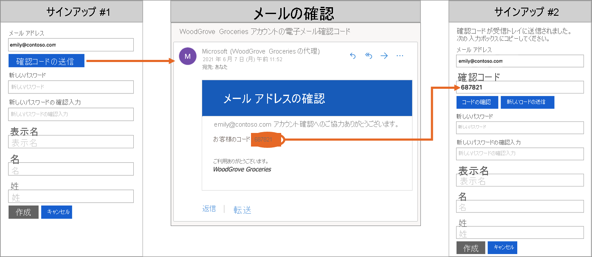
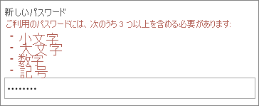

# Azure Active Directory B2C の技術と機能の概要

[Azure Active Directory B2C の概要](overview.md)に関する記事と併せて、この記事ではサービスについてさらに詳しく説明します。 ここでは、サービスで使用する主要なリソースとその機能について説明します。 これらの機能を使用して、アプリケーションの顧客に完全なカスタム ID エクスペリエンスを提供する方法について説明します。

## Azure AD B2C テナント

Azure Active Directory B2C (Azure AD B2C) では、"*テナント*" は組織を表しており、ユーザーのディレクトリです。 各 Azure AD B2C テナントは、他の Azure AD B2C テナントと区別され分離されています。 Azure AD B2C テナントは、既にお持ちかもしれない Azure Active Directory テナントとは別のものです。

Azure AD B2C テナントで使用する主なリソースは次のとおりです。

* **ディレクトリ** - "*ディレクトリ*" は、Azure AD B2C によって、ユーザーの資格情報、プロファイル データ、アプリケーションの登録が保存される場所です。
* **アプリケーションの登録** - ID を管理できるようにするには、Azure AD B2C に Web アプリケーション、モバイル アプリケーション、およびネイティブ アプリケーションを登録します。 また、Azure AD B2C で保護する API を登録することもできます。
* **ユーザー フロー** と **カスタム ポリシー** - 組み込みのユーザー フローと完全に構成可能なカスタム ポリシーを使用して、アプリケーションの ID エクスペリエンスを作成します。
  * **ユーザー フロー** では、サインアップ、サインイン、プロファイルの編集など、一般的な ID タスクをすばやく実行できます。
  * **カスタム ポリシー** では、組織、顧客、従業員、パートナー、市民に固有の複雑な ID ワークフローを作成できます。
* **サインイン オプション** - Azure AD B2C には、アプリケーションのユーザー向けに、さまざまな [サインアップ オプションとサインイン オプション](sign-in-options.md)が用意されています。
  * **ユーザー名、メール、電話のサインイン** - ユーザー名、メール アドレス、電話番号のほか、複数の方法の組み合わせを使用したサインアップとサインインに対応できるように Azure AD B2C ローカル アカウントを構成します。
  * **ソーシャル ID プロバイダ** - Facebook、LinkedIn、Twitter のようなソーシャル プロバイダーとフェデレーションします。
  * **外部 ID プロバイダー** - OAuth 2.0、OpenID Connect などの標準 ID プロトコルとフェデレーションします。
* **キー** - クライアント シークレット、証明書、パスワード、トークンの署名と検証のための暗号化キーを追加および管理します。

Azure AD B2C テナントは、Azure AD B2C の使用を始めるために最初に作成する必要があるリソースです。 具体的には、次の方法を学習します。

* [Azure Active Directory B2C テナントを作成する](tutorial-create-tenant.md)。
* [Azure AD B2C テナントを管理する](tenant-management.md)

## Azure AD B2C のアカウント

Azure AD B2C では、複数の種類のユーザー アカウントが定義されています。 Azure Active Directory、Azure Active Directory B2B、Azure Active Directory B2C で、これらのアカウントの種類が共有されます。

* **職場アカウント** - 職場アカウントを持つユーザーは、テナントのリソースを管理でき、管理者ロールを使用してテナントも管理できます。 職場アカウントを持つユーザーは、新しいコンシューマー アカウントの作成、パスワードのリセット、アカウントのブロック/ブロック解除、アクセス許可の設定、セキュリティ グループへのアカウントの割り当てを行うことができます。
* **ゲスト アカウント** - ゲストとしてテナントに招待する外部ユーザーです。 ゲスト ユーザーを Azure AD B2C テナントに招待する一般的なシナリオは、管理責任を共有することです。
* **コンシューマー アカウント** - Azure AD B2C ユーザー フローおよびカスタム ポリシーによって管理されるアカウント。

 *図:Azure portal での Azure AD B2C テナント内のユーザー ディレクトリ*

### コンシューマー アカウント

"*コンシューマー*" アカウントを使用すると、ユーザーは Azure AD B2C でセキュリティ保護されているアプリケーションにサインインできます。 ただし、コンシューマー アカウントを持つユーザーは、Azure portal などの Azure リソースにアクセスすることはできません。

コンシューマー アカウントは、次の種類の ID に関連付けることができます。

* **ローカル** ID。ユーザー名とパスワードは、Azure AD B2C ディレクトリにローカルに格納されます。 これらの ID は、"ローカル アカウント" とよく呼ばれます。
* **ソーシャル** ID または **エンタープライズ** ID。ユーザーの ID は、フェデレーション ID プロバイダーによって管理されます。 たとえば、Facebook、Google、Microsoft、ADFS、Salesforce などです。

コンシューマー アカウントを持つユーザーは、複数の ID でサインインできます。 たとえば、ユーザー名、電子メール、従業員 ID、政府 ID などです。 1 つのアカウントで、ローカルとソーシャル両方の ID を持つことができます。

:::image type="content" source="media/technical-overview/identities.png" alt-text="コンシューマー アカウントの ID。":::
 *図:Azure AD B2C に複数の ID を持つ単一のコンシューマー アカウント*

詳細については、「[Azure Active Directory B2C のユーザー アカウントの概要](user-overview.md)」をご覧ください。

## ローカル アカウントのサインイン オプション

Azure AD B2C には、ユーザーの認証に使用できるさまざまな方法が用意されています。 ユーザーは、ユーザー名とパスワードまたは電話による確認 (パスワードレス認証とも呼ばれます) を使用して、ローカル アカウントにサインインできます。 ローカル アカウント ID プロバイダーの設定では、メール アドレスでのサインアップが既定で有効になっています。

[サインイン オプション](sign-in-options.md)の詳細または[ローカル アカウント ID プロバイダーを設定する](identity-provider-local.md)方法を参照してください。

## ユーザー プロファイルの属性

Azure AD B2C を使用すると、コンシューマー アカウント プロファイルの一般的な属性を管理できます。 たとえば、表示名、姓、名、都市などです。

また、ユーザーに関する追加情報を格納するように、Azure AD スキーマを拡張することもできます。 たとえば、居住地の国または地域、優先言語や、ニュースレターを購読するか、多要素認証を有効にするかといった設定などです。 詳細については、次を参照してください。

* [ユーザー プロファイルの属性](user-profile-attributes.md)
* [ユーザー属性を追加してユーザー入力をカスタマイズする](configure-user-input.md)

## 外部 ID プロバイダーを使用してサインインする

ユーザーがソーシャルおよびエンタープライズの ID プロバイダーの資格情報を使用してアプリケーションにサインインできるように、Azure AD B2C を構成できます。 Azure AD B2C は、OAuth 1.0、OAuth 2.0、OpenID Connect、SAML の各プロトコルをサポートする ID プロバイダーとフェデレーションできます。 たとえば、Facebook、Microsoft アカウント、Google、Twitter、AD FS などです。

:::image type="content" source="media/technical-overview/external-idps.png" alt-text="外部 ID プロバイダー。":::

外部 ID プロバイダーのフェデレーションを使用すると、アプリケーション用だけに新しいアカウントを作成する必要なしに、既存のソーシャルまたはエンタープライズ アカウントを使用してサインインする機能を、コンシューマーに提供できます。

サインアップまたはサインイン ページには、Azure AD B2C によって、ユーザーがサインインのために選択できる外部 ID プロバイダーの一覧が表示されます。 外部 ID プロバイダーの 1 つを選択すると、選択したプロバイダーの Web サイトに誘導 (リダイレクト) されるので、そこでサインイン プロセスを完了します。 正常にサインインしたユーザーは、お使いのアプリケーションでアカウントを認証するために、Azure AD B2C に戻されます。

:::image type="content" source="media/technical-overview/external-idp.png" alt-text="ソーシャル アカウント (Facebook) でのモバイル サインインの例。":::

Azure AD B2C で ID プロバイダーを追加する方法については、[Azure Active Directory B2C でアプリケーションに ID プロバイダーを追加する方法](add-identity-provider.md)に関するページを参照してください。

## ID エクスペリエンス: ユーザー フローまたはカスタム ポリシー

Azure AD B2C では、ユーザーがアプリケーションにアクセスするために従うビジネス ロジックを定義できます。 たとえば、ユーザーがサインイン、サインアップ、プロファイルの編集、またはパスワードのリセットを行うときに実行する手順の順序を決定できます。 シーケンスが完了すると、ユーザーはトークンを取得し、アプリケーションにアクセスできるようになります。

Azure AD B2C では、次の 2 つの方法で ID ユーザーのエクスペリエンスを実現できます。

* **ユーザー フロー** は、事前に定義された組み込みの構成可能なポリシーであり、サインアップ、サインイン、ポリシー編集のエクスペリエンスを数分で作成できるように用意されています。

* **カスタム ポリシー** を使用すると、複雑な ID エクスペリエンス シナリオ用に独自のユーザー体験を作成できます。

次のスクリーンショットは、ユーザー フロー設定の UI とカスタム ポリシー構成ファイルを示しています。

記事「[ユーザー フローとカスタム ポリシーの概要](user-flow-overview.md)」を参照してください。 ユーザー フローとカスタム ポリシーの概要と、どちらの方法がビジネス ニーズに最適かを判断するのに役立つ情報が提供されています。

## ユーザー インターフェイス

Azure AD B2C では、ユーザーに表示されるページがブランドのルック アンド フィールとシームレスに融合されるように、ユーザーの ID エクスペリエンスを作成できます。 アプリケーションの ID 体験の過程でユーザーに表示される HTML および CSS コンテンツを、ほぼ完全に制御できます。 この柔軟性により、アプリケーションと Azure AD B2C との間で、ブランドと視覚的な一貫性を維持することができます。

:::image type="content" source="media/technical-overview/seamless-ux.png" alt-text="ブランドでカスタマイズされたサインアップおよびサインイン ページのスクリーンショット。":::

UI のカスタマイズについては、以下を参照してください。

* [ユーザー インターフェイスをカスタマイズする](customize-ui.md)
* [HTML テンプレートを使用したユーザー インターフェイスのカスタマイズ](customize-ui-with-html.md)
* [JavaScript を有効にし、ページ レイアウトのバージョンを選択する](javascript-and-page-layout.md)

## カスタム ドメイン

Azure AD B2C のリダイレクト URL で Azure AD B2C ドメインをカスタマイズできます。 カスタム ドメインを使用すると、表示されるページとアプリケーションのドメイン名がシームレスに組み合わさるように、シームレスなエクスペリエンスを作成することができます。

ユーザーから見ると、サインイン プロセスの間、Azure AD B2C の既定ドメイン .b2clogin.com にリダイレクトされるのでなく、ドメインにとどまっています。 詳細については、[カスタム ドメインの有効化](custom-domain.md)に関する記事を参照してください。
 
## ローカリゼーション

Azure AD B2C の言語のカスタマイズを使用すると、顧客のニーズに応じて、さまざまな言語に対応することができます。 Microsoft では 36 の言語の翻訳が提供されていますが、どの言語についてもユーザーが自分で翻訳を提供できます。 1 つの言語でのみページが提供されている場合でも、ページ上の任意のテキストをカスタマイズできます。

ローカライズのしくみについては、「[Azure Active Directory B2C での言語のカスタマイズ](language-customization.md)」をご覧ください。

## メールによる確認

Azure AD B2C を使用すると、サインアップおよびパスワード リセットのフローの間に、メール アドレスの確認が顧客に要求され、メール アドレスが有効であることが保証されます。 また、悪意のあるアクターが自動化されたプロセスを使用してアプリケーションに不正なアカウントを生成することを防ぐことができます。

アプリケーションを使用するためにサインアップするユーザーへのメールをカスタマイズできます。 サード パーティのメール プロバイダーを使用すると、独自のメール テンプレートおよび差出人アドレスと件名を使用し、ローカライズとカスタム ワンタイム パスワード (OTP) の設定をサポートすることができます。 詳細については、次を参照してください。

* [Mailjet を使用するカスタム メール確認](custom-email-mailjet.md)
* [SendGrid を使用するカスタム メール確認](custom-email-sendgrid.md)

## 独自のビジネス ロジックを追加して RESTful API を呼び出す

ユーザー フローとカスタム ポリシーの両方で RESTful API と統合できます。 この違いは、ユーザー フローでは、指定された場所で呼び出しを行うのに対し、カスタム ポリシーでは、独自のビジネス ロジックを体験に追加することです。 この機能を使用すると、外部 ID ソースのデータを取得して使用できます。 Azure AD B2C では、RESTful サービスとデータを交換して次のことを実行できます。

* わかりやすいカスタム エラー メッセージを表示する。
* ユーザー入力を検証して、不正なデータがユーザー ディレクトリに存在しないようにする。 たとえば、ユーザーが入力したデータを修正できます (すべて小文字で入力された場合に、姓を大文字にするなど)。
* 企業の基幹業務アプリケーションとさらに緊密に統合することでユーザー データを拡充する。
* RESTful の呼び出しを使用して、プッシュ通知の送信、企業データベースの更新、ユーザーの移行プロセスの実行、アクセス許可の管理、データベースの監査などを行う。

REST API 呼び出しに対する Azure AD B2C のサポートによって有効になるもう 1 つのシナリオは、ロイヤルティ プログラムです。 たとえば、RESTful サービスでは、ユーザーのメール アドレスを受け取り、顧客のデータベースを照会し、ユーザーのロイヤルティ番号を Azure AD B2C に返すことができます。 

返されたデータは、Azure AD B2C のユーザーのディレクトリ アカウントに保存できます。 その後、そのデータをポリシーの後続の手順でさらに評価したり、アクセス トークンに含めたりすることができます。

:::image type="content" source="media/technical-overview/lob-integration.png" alt-text="モバイル アプリケーションでの基幹業務統合。":::

カスタム ポリシーによって定義されているユーザー体験の任意のステップで、REST API 呼び出しを追加できます。 たとえば、次のタイミングで REST API を呼び出すことができます。

* サインイン時の、Azure AD B2C によって資格情報が検証される直前
* サインインの直後
* Azure AD B2C によってディレクトリに新しいアカウントが作成される前
* Azure AD B2C によってディレクトリに新しいアカウントが作成された後
* Azure AD B2C によってアクセス トークンが発行される前

Azure AD B2C で RESTful API 統合に対してカスタム ポリシーを使用する方法については、「[REST API 要求交換を Azure AD B2C カスタム ポリシーに統合する](api-connectors-overview.md)」を参照してください。

## プロトコルとトークン

- アプリケーションのユーザー体験に関して、Azure AD B2C では、[OAuth 2.0](protocols-overview.md)、[OpenID Connect](openid-connect.md)、[SAML プロトコル](saml-service-provider.md)がサポートされています。 アプリケーションは Azure AD B2C に認証要求を発行することで、このユーザー体験を開始します。 Azure AD B2C に対する要求の結果として、[ID トークンやアクセス トークン](tokens-overview.md)、SAML トークンなどのセキュリティ トークンが作成されます。 このセキュリティ トークンでは、アプリケーションにおけるユーザーの ID が定義されています。

- 外部 ID の場合、Azure AD B2C では、OAuth 1.0、OAuth 2.0、OpenID Connect、SAML ID プロバイダーとのフェデレーションがサポートされています。

次の図は、Azure AD B2C が同じ認証フローでさまざまなプロトコルを使用して通信する方法を示しています。

1. 証明書利用者アプリケーションでは、OpenID Connect を使用して Azure AD B2C への認可要求が開始されます。
1. アプリケーションのユーザーが、SAML プロトコルを使用する外部 ID プロバイダーでのサインインを選択すると、Azure AD B2C によって、その ID プロバイダーと通信するために SAML プロトコルが呼び出されます。
1. ユーザーが外部 ID プロバイダーとのサインイン操作を完了すると、Azure AD B2C では、OpenID Connect を使用して証明書利用者アプリケーションにトークンが返されます。

## アプリケーションの統合

ユーザーがアプリケーションにサインインしようとすると、アプリケーションによって、ユーザー フローまたはカスタム ポリシーで提供されるエンドポイントへの認可要求が開始されます。 ユーザー フローまたはカスタム ポリシーによって、ユーザーのエクスペリエンスが定義および制御されます。 ユーザー フロー (たとえば、"*サインアップまたはサインイン*" のフロー)が完了すると、Azure AD B2C によってトークンが生成され、ユーザーはアプリケーションにリダイレクトされます。

:::image type="content" source="media/technical-overview/app-integration.png" alt-text="モバイル アプリと、Azure AD B2C のサインイン ページ間のフローを示す矢印。":::

複数のアプリケーションで、同じユーザー フローまたはカスタム ポリシーを使用できます。 1 つのアプリケーションで、複数のユーザー フローまたはカスタム ポリシーを使用できます。

たとえば、アプリケーションへのサインインの場合は、アプリケーションでは "*サインアップまたはサインイン*" のユーザー フローが使用されます。 ユーザーは、サインインした後で、自分のプロファイルを編集したい場合があります。そのため、アプリケーションでは、今度は "*プロファイル編集*" のユーザー フローを使用して、別の認可要求が開始されます。

## 多要素認証 (MFA)

Azure AD B2C の多要素認証 (MFA) を利用すれば、データやアプリケーションへのアクセスを保護し、ユーザーには簡単なサインイン プロセスを提供できます。 第 2 の認証方式を要求することでセキュリティが強化され、簡単に使用できるさまざまな認証方法を提供することによって強力な認証が実現されます。 

ユーザーは、管理者が行う構成上の決定に基づいて、MFA で認証が行われる場合と行われない場合があります。

ユーザー フローで MFA を有効にする方法については、[Azure Active Directory B2C での多要素認証](multi-factor-authentication.md)に関する記事を参照してください。

## 条件付きアクセス

危険なユーザーや危険なサインインなど、Azure AD Identity Protection のリスク検出機能が自動的に検出されて、Azure AD B2C テナントに表示されます。 これらのリスク検出を使用して修復アクションを決定したり組織のポリシーを適用したりする、条件付きアクセス ポリシーを作成することができます。 

Azure AD B2C では、各サインイン イベントが評価され、すべてのポリシーの要件が満たされていることを確認したうえで、ユーザー アクセスが許可されます。 多要素認証 (MFA) などの具体的な改善によって、危険なユーザーや危険なサインインをブロックしたりチャレンジしたりすることができます。 詳細については、「[Identity Protection と条件付きアクセス](conditional-access-identity-protection-overview.md)」を参照してください。

## パスワードの複雑さ

サインアップ時またはパスワードのリセット時に、ユーザーは、複雑さのルールを満たすパスワードを指定する必要があります。 既定では、Azure AD B2C によって強力なパスワード ポリシーが適用されます。 また、Azure AD B2C では、顧客が使用するパスワードの複雑さの要件を指定するための構成オプションも提供されます。

詳細については、「[Azure Active Directory B2C でパスワードの複雑さの要件を構成する](password-complexity.md)」を参照してください。

## パスワードの強制的なリセット

ユーザーが自分のパスワードを忘れた場合は、Azure AD B2C テナント管理者が[ユーザーのパスワードをリセットする](manage-users-portal.md#reset-a-users-password)ことができます。 または、ユーザーにパスワードを定期的にリセットさせることができます。 詳細については、[パスワードの強制リセット フローの設定](force-password-reset.md)に関する記事を参照してください。

:::image type="content" source="media/technical-overview/force-password-reset-flow.png" alt-text="パスワードの強制リセット フロー。":::

## スマート アカウント ロックアウト

ブルートフォース パスワード推測の試行を防ぐため、Azure AD B2C では、高度な戦略を使用して、要求の IP、入力されたパスワード、その他のいくつかの要因に基づいてアカウントがロックされます。 ロックアウトの期間は、リスクと試行回数に基づいて自動的に延長されます。

パスワード保護設定の管理の詳細については、[Azure AD B2C での資格情報攻撃の緩和](threat-management.md)に関するページを参照してください。

## リソースと顧客 ID を保護する

Azure AD B2C は、[Microsoft Azure セキュリティ センター](https://www.microsoft.com/trustcenter/cloudservices/azure)で説明されているセキュリティ、プライバシー、その他のコミットメントに準拠しています。

セッションは暗号化されたデータとしてモデル化され、解読キーは Azure AD B2C のセキュリティ トークン サービスのみが認識しています。 強力な暗号化アルゴリズムである AES-192 が使用されます。 すべての通信パスは、機密性と整合性のために TLS で保護されます。 セキュリティ トークン サービスでは、TLS に拡張検証 (EV) 証明書が使用されます。 一般に、セキュリティ トークン サービスにより、信頼されていない入力を提供しないことでクロスサイト スクリプティング (XSS) 攻撃が軽減されます。

:::image type="content" source="media/technical-overview/user-data.png" alt-text="転送中および保存中の安全なデータの図。":::

### ユーザー データにアクセスする

Azure AD B2C テナントでは、従業員やパートナーに使用されるエンタープライズ Azure Active Directory テナントと多くの特性が共有されます。 共有される部分としては、管理者ロールの表示、ロールの割り当て、監査アクティビティなどがあります。

ロールを割り当てることにより、次のような Azure AD B2C での特定の管理操作を実行できるユーザーを制御できます。

* ユーザー フローのすべての側面の作成と管理
* すべてのユーザー フローに使用可能な属性スキーマの作成と管理
* 直接フェデレーションで使用するための ID プロバイダーの構成
* Identity Experience Framework での信頼フレームワーク ポリシーの作成と管理 (カスタム ポリシー)
* Identity Experience Framework でのフェデレーションのシークレットと暗号化の管理 (カスタム ポリシー)

Azure AD B2C 管理ロールのサポートなど、Azure AD のロールについて詳しくは、「[Azure Active Directory での管理者ロールのアクセス許可](../active-directory/roles/permissions-reference.md)」をご覧ください。

## 監査とログ

Azure AD B2C では、そのリソース、発行されたトークン、および管理者のアクセスに関するアクティビティ情報が含まれる監査ログが出力されます。 監査ログを使用して、プラットフォームの利用状況を把握し、問題を診断することができます。 監査ログのエントリは、イベントを生成したアクティビティが発生した直後に使用できます。

Azure AD B2C テナントまたは特定のユーザーに対して使用できる監査ログでは、次のような情報を見つけることができます。

* B2C リソースにアクセスするユーザー (例: B2C ポリシーの一覧にアクセスする管理者) の承認に関するアクティビティ
* 管理者が Azure portal を使用してサインインするときに取得されるディレクトリ属性に関連するアクティビティ
* B2C アプリケーションでの作成、読み取り、更新、削除 (CRUD) 操作
* B2C キー コンテナーに格納されたキーに対する CRUD 操作
* B2C リソース (例: ポリシーや ID プロバイダー) に対する CRUD 操作
* ユーザー資格情報とトークン発行の検証

監査ログの詳細については、「[Azure AD B2C 監査ログへのアクセス](view-audit-logs.md)」をご覧ください。

## Usage analytics

Azure AD B2C では、ユーザーが Web アプリにいつサインアップまたはサインインしたか、ユーザーの所在地、使用されているブラウザーやオペレーティング システムを確認できます。 

Azure Application Insights を Azure AD B2C カスタム ポリシーに統合することにより、ユーザーによるサインアップ、サインイン、パスワードのリセット、プロファイルの編集の状況に関する分析情報を取得できます。 この知識により、将来の開発サイクルに関してデータ駆動型の意思決定を行うことができます。

詳細については、「[Application Insights を使用して Azure AD B2C でのユーザーの動作を追跡する](analytics-with-application-insights.md)」をご覧ください。

## 利用可能なリージョンとデータの保存場所
Azure AD B2C サービスは世界中で一般提供されており、「[リージョン別の利用可能な製品](https://azure.microsoft.com/regions/services/)」に示されているリージョンをデータ所在地として選択できます。 データ所在地は、[テナントの作成](tutorial-create-tenant.md)時に選択した国または地域によって決まります。 

[Azure Active Directory B2C サービス: 利用可能なリージョンとデータの保存場所](data-residency.md)と [Azure Active Directory B2C のサービス レベル アグリーメント (SLA)](https://azure.microsoft.com/support/legal/sla/active-directory-b2c/v1_1) に関するページで詳細情報を参照してください。

## Microsoft Graph API を使用した自動化

MS Graph API を使用して、Azure AD B2C ディレクトリを管理します。 Azure AD B2C ディレクトリ自体を作成することもできます。 ユーザー、ID プロバイダー、ユーザー フロー、カスタム ポリシーなどを管理することができます。 

[Microsoft Graph を使用して Azure AD B2C を管理する](microsoft-graph-operations.md)方法の詳細を確認してください。 

## Azure AD B2C サービスの制限と制約
「[Azure AD B2C サービスの制限と制約](service-limits.md)」の詳細を確認します。

## 次のステップ

Azure Active Directory B2C の機能と技術的な側面について詳しく見てきました。
- 次はまず、[Azure Active Directory B2C テナントを作成](tutorial-create-tenant.md)します。
- [Azure Active Directory B2C を使用してシングルページ アプリのサインインを設定](quickstart-single-page-app.md)します。
- [Azure Active Directory B2C 概念](application-types.md) 
