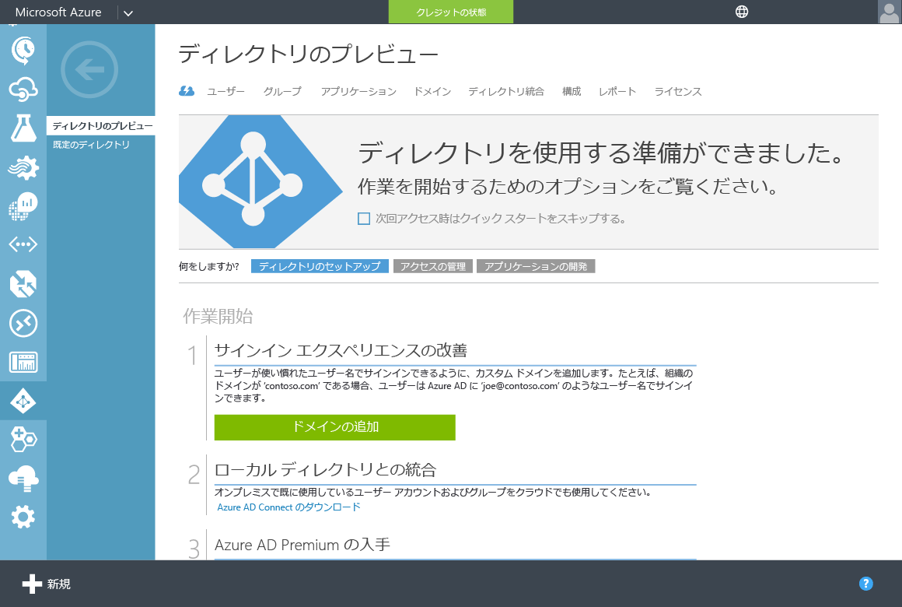

# Azure AD ドメイン サービスの管理対象ドメインに対するセキュリティで保護された LDAP (LDAPS) の構成
この記事では、Azure AD ドメイン サービスの管理対象ドメインに対して、セキュリティで保護されたライトウェイト ディレクトリ アクセス プロトコル (LDAPS) を有効にする方法について説明します。 セキュリティで保護された LDAP は、「Secure Sockets Layer (SSL)/トランスポート層セキュリティ (TLS) 経由のライトウェイト ディレクトリ アクセス プロトコル (LDAP)」としても知られています。

## 開始する前に
この記事に記載されているタスクを実行するには、次が必要です。

1. 有効な **Azure サブスクリプション**。
2. オンプレミス ディレクトリまたはクラウド専用ディレクトリのいずれかと同期されている **Azure AD ディレクトリ** 。
3. **Azure AD ドメイン サービス** が Azure AD ディレクトリに対して有効である必要があります。 有効になっていない場合は、 [作業の開始に関するガイド](active-directory-ds-getting-started.md)に記載されているすべてのタスクを実行してください。
4. **セキュリティで保護された LDAP を有効にするために使用する証明書**。

   * **推奨** - 信頼できる開証明機関から証明書を取得します。 この構成方法の方が安全です。
   * または、この記事で後ほど説明するように、 [自己署名証明書を作成](#task-1---obtain-a-certificate-for-secure-ldap) することもできます。

 

### セキュリティで保護された LDAP 証明書の要件
セキュリティで保護された LDAP を有効にする前に、以下のガイドラインに従って有効な証明書を取得します。 管理対象ドメインに対して、セキュリティで保護された LDAP を無効な証明書または正しくない証明書で有効にしようとすると、エラーが発生します。

1. **信頼された発行者** - 証明書は、セキュリティで保護された LDAP を使用してドメインに接続する必要があるコンピューターによって信頼された機関から発行される必要があります。 この機関は、こうしたコンピューターによって信頼された公開証明機関です。
2. **有効期間** - 証明書は少なくとも、今後 3 ～ 6 か月間有効である必要があります。 証明書の有効期限が切れると、管理対象ドメインへのセキュリティで保護された LDAP のアクセスが切断されます。
3. **サブジェクト名** - 証明書のサブジェクト名は、管理対象ドメインに対してワイルドカードにする必要があります。 たとえば、ドメインが contoso100.com という名前の場合、証明書のサブジェクト名は *.contoso100.com にする必要があります。 DNS 名 (サブジェクト代替名) はこのワイルドカード名に設定します。
4. **キー使用法** - 証明書は、デジタル署名およびキーの暗号化に対して構成される必要があります。
5. **証明書の目的** - 証明書は、SSL サーバー認証に対して有効である必要があります。

> [!NOTE]
> **エンタープライズ証明機関:** Azure AD Domain Services では、現在、組織のエンタープライズ証明機関によって発行された、セキュリティで保護された LDAP 証明書の使用はサポートされていません。 この制限が適用されるのは、サービスが、エンタープライズ CA をルート証明機関として信頼していないためです。 エンタープライズ CA のサポートは今後追加する予定です。 エンタープライズ CA によって発行された証明書を使用する必要がある場合は、対処方法について[お問い合わせください](active-directory-ds-contact-us.md)。
>
>

 

## タスク 1 - セキュリティで保護された LDAP 用の証明書の取得
最初のタスクでは、セキュリティで保護された LDAP からの管理対象ドメインへのアクセスに使用する証明書を取得します。 2 つのオプションがあります。

* 証明機関から証明書を取得する。 公開証明機関を使用できます。
* 自己署名証明書を作成します。

### オプション A (推奨) - セキュリティで保護された LDAP 証明書を証明機関から取得する
組織が公開証明機関から証明書を取得する場合は、その公開証明機関からセキュリティで保護された LDAP の証明書を取得する必要があります。

証明書を請求する場合は、「 [セキュリティで保護された LDAP 証明書の要件](#requirements-for-the-secure-ldap-certificate)」で説明されている要件に従ってください。

> [!NOTE]
> セキュリティで保護された LDAP を使用して管理対象ドメインに接続する必要があるクライアント コンピューターでは、セキュリティで保護された LDAP 証明書の発行者を信頼する必要があります。
>
>

### オプション B - セキュリティで保護された LDAP 用の自己署名証明書を作成する
公開証明機関からの証明書の使用を見込めない場合は、セキュリティで保護された LDAP 用の自己署名証明書を作成することができます。

**PowerShell を使用した自己署名証明書の作成**

Windows コンピューターで **管理者** として新しい PowerShell ウィンドウを開き、次のコマンドを入力して新しい自己署名証明書を作成します。

    $lifetime=Get-Date

    New-SelfSignedCertificate -Subject *.contoso100.com -NotAfter $lifetime.AddDays(365) -KeyUsage DigitalSignature, KeyEncipherment -Type SSLServerAuthentication -DnsName *.contoso100.com

上記のサンプルの 'contoso100.com' は、Azure AD Domain Services の管理対象ドメインの DNS ドメイン名に置き換えます。

新しく作成した自己署名証明書は、ローカル コンピューターの証明書ストアに配置されます。

## タスク 2 - セキュリティで保護された LDAP 証明書を .PFX ファイルにエクスポートする
このタスクを開始する前に、公開証明機関からセキュリティで保護された LDAP 証明書を取得していること、または自己署名証明書を作成していることを確認します。

次の手順を実行して、LDAPS 証明書を .PFX ファイルにエクスポートします。

1. **[スタート]** をクリックして「**R**」と入力します。**[ファイル名を指して実行]** ダイアログで、「**mmc**」と入力して **[OK]** をクリックします。

    
2. **[ユーザー アカウント制御]** ダイアログで **[はい]** をクリックし、管理者として MMC (Microsoft 管理コンソール) を起動します。
3. **[ファイル]** メニューの **[スナップインの追加と削除]** をクリックします。

    
4. **[スナップインの追加と削除]** ダイアログで **[証明書]** スナップインを選択して、**[追加 >]** をクリックします。

    
5. **証明書スナップイン** ウィザードで **[コンピューター アカウント]** を選択し、**[次へ]** をクリックします。

    
6. **[コンピューターの選択]** ページで **[ローカル コンピューター (このコンソールを実行しているコンピューター)]** を選択し、**[完了]** をクリックします。

    
7. **[スナップインの追加と削除]** ダイアログで **[OK]** をクリックし、証明書スナップインを MMC に追加します。

    
8. MMC のウィンドウで **[コンソール ルート]**をクリックして展開します。 証明書スナップインが読み込まれます。 **[証明書 (ローカル コンピューター)]** をクリックして展開します。 **[個人]** ノード、**[証明書]** ノードの順にクリックします。

    
9. 前の手順で作成した自己署名証明書が表示されます。 証明書のプロパティを確認して、証明書を作成したときに PowerShell ウィンドウで報告されたものと拇印が一致することを確認します。
10. 目的の自己署名証明書を選択して **右クリック**します。 右クリック メニューの **[すべてのタスク]** を選択し、**[エクスポート...]** を選択します。

    
11. **証明書のエクスポート ウィザード**で **[次へ]** をクリックします。

    
12. **[秘密キーのエクスポート]** ページで **[はい、秘密キーをエクスポートします]** を選択し、**[次へ]** をクリックします。

    

    > [!WARNING]
    > 証明書とともに秘密キーをエクスポートする必要があります。 証明書の秘密キーが含まれない PFX を指定した場合、管理対象ドメインに対してセキュリティで保護された LDAP を有効にできません。
    >
    >
13. **[エクスポート ファイルの形式]** ページで、エクスポートする証明書のファイル形式として **[Personal Information Exchange - PKCS #12 (.PFX)]** を選択します。

    

    > [!NOTE]
    > .PFX ファイル形式のみがサポートされています。 証明書を .CER ファイル形式にエクスポートしないでください。
    >
    >
14. **[セキュリティ]** ページで **[パスワード]** オプションを選択し、.PFX ファイルを保護するためのパスワードを入力します。 次のタスクで必要になるので、このパスワードを覚えておいてください。 **[次へ]** をクリックして続行します。

    

    > [!NOTE]
    > このパスワードを書き留めておいてください。 「 [タスク 3 - 管理対象ドメインに対してセキュリティで保護された LDAP を有効にする](#task-3---enable-secure-ldap-for-the-managed-domain)
    >
    >
15. **[エクスポートするファイル]** ページで、ファイル名と証明書のエクスポート先を指定します。

    
16. 次のページで **[完了]** をクリックして、証明書を PFX ファイルにエクスポートします。 証明書がエクスポートされると、確認のダイアログが表示されます。

    

## タスク 3 - 管理対象ドメインに対してセキュリティで保護された LDAP を有効にする
セキュリティで保護された LDAP を有効にするには、次の構成手順を実行します。

1. **[Azure クラシック ポータル](https://manage.windowsazure.com)**に移動します。
2. 左ウィンドウで、 **[Active Directory]** を選択します。
3. Azure AD ドメイン サービスを有効にした Azure AD ディレクトリ ("テナント" とも呼ばれる) を選択します。

    
4. [ **構成** ] タブをクリックします。

    ![ディレクトリの [構成] タブ](./media/active-directory-domain-services-getting-started/configure-tab.png)
5. **[ドメイン サービス]**というセクションまでスクロールします。 次のスクリーンショットで示すように、 **[セキュリティで保護された LDAP (LDAPS)]** というオプションが表示されます。

    
6. **[証明書の構成...]** をクリックして **[セキュリティで保護された LDAP 用の証明書の構成]** ダイアログを表示します。

    ![[セキュリティで保護された LDAP 用の証明書の構成]](./media/active-directory-domain-services-admin-guide/secure-ldap-configure-cert-page.png)
7. **[証明書を含む PFX ファイル]** の下にあるフォルダー アイコンをクリックし、セキュリティで保護された LDAP からの管理対象ドメインへのアクセスに使用する証明書を含む PFX ファイルを指定します。 また、証明書を PFX ファイルにエクスポートするときに指定したパスワードを入力します。 選択後、下部にある完了ボタンをクリックします。

    
8. **[構成]** タブの **[ドメイン サービス]** セクションが淡色表示になり、数分間 **[保留中...]** の状態になります。 この期間中に、LDAPS 証明書の精度が検証され、セキュリティで保護された LDAP が管理対象ドメインに対して構成されます。

    

   > [!NOTE]
   > 管理対象ドメインに対してセキュリティで保護された LDAP を有効にするには、約 10 - 15 分かかります。 指定した LDAPS 証明書が必須条件を満たしていない場合、ディレクトリに対してセキュリティで保護された LDAP は有効化されず、エラーが表示されます。 たとえば、ドメイン名が正しくない場合や、証明書の有効期限が切れているか、まもなく切れる場合です。
   >
   >

9. セキュリティで保護された LDAP が管理対象ドメインに対して有効になると、**[保留中...]** のメッセージは表示されなくなり、 証明書の拇印が表示されます。

    

 

## タスク 4 - インターネット経由でのセキュリティで保護された LDAP アクセスを有効にする
**オプションのタスク** - インターネット経由で LDAPS を使用して管理対象ドメインにアクセスする予定がない場合、この構成タスクは飛ばしてください。

このタスクを開始する前に、 [タスク 3](#task-3---enable-secure-ldap-for-the-managed-domain)で説明した手順が完了していることを確認してください。

1. **[構成]** ページの **[ドメイン サービス]** セクションに、**[インターネット経由でのセキュリティで保護された LDAP アクセスを有効にする]** ためのオプションが表示されます。 既定ではセキュリティで保護された LDAP 経由での管理対象ドメインへのインターネット アクセスは無効になっているので、このオプションは既定で **[いいえ]** に設定されています。

    
2. **[インターネット経由でのセキュリティで保護された LDAP アクセスを有効にする]** を **[はい]** に切り替えます。 下部のパネルの **[保存]** をクリックします。
    
3. **[構成]** タブの **[ドメイン サービス]** セクションが淡色表示になり、数分間 **[保留中...]** の状態になります。 しばらくすると、セキュリティで保護された LDAP 経由での管理対象ドメインへのインターネット アクセスが有効になります。

    

   > [!NOTE]
   > 管理対象ドメインに対してセキュリティで保護された LDAP 経由でのインターネット アクセスが有効になるまでには、約 10 分かかります。
   >
   >
4. インターネット経由での管理対象ドメインへのセキュリティで保護された LDAP のアクセスが有効になると、 **[保留中...]** のメッセージは表示されなくなります。 LDAPS 経由でのディレクトリへのアクセスに使用できる外部 IP アドレスが、 **[LDAPS アクセスのための外部 IP アドレス]**フィールドに表示されます。

    

 

## タスク 5 - インターネットから管理対象ドメインにアクセスできるように DNS を構成する
**オプションのタスク** - インターネット経由で LDAPS を使用して管理対象ドメインにアクセスする予定がない場合、この構成タスクは飛ばしてください。

このタスクを開始する前に、 [タスク 4](#task-4---enable-secure-ldap-access-over-the-internet)で説明した手順が完了していることを確認してください。

管理対象ドメインに対してインターネット経由でのセキュリティで保護された LDAP アクセスを有効にしたら、クライアント コンピューターがこの管理対象ドメインを見つけられるようにするために、DNS を更新する必要があります。 タスク 4 の最後で、**[構成]** タブの **[LDAPS アクセスのための外部 IP アドレス]** に外部 IP アドレスが表示されます。

管理対象ドメインの DNS 名 (例: ldaps.contoso100.com) がこの外部 IP アドレスをポイントするように、外部 DNS プロバイダーを構成します。 この例では、次の DNS エントリを作成する必要があります。

    ldaps.contoso100.com  -> 52.165.38.113

これで、インターネット経由でセキュリティで保護された LDAP を使用して管理対象ドメインに接続する準備ができました。

> [!WARNING]
> LDAPS を使用して管理対象ドメインに正常に接続できるようにするには、クライアント コンピューターで LDAPS 証明書の発行者を信頼する必要があることに注意してください。 エンタープライズ証明機関または公的に信頼された証明機関を使用している場合は、クライアント コンピューターでこれらの証明書発行者が信頼されるため、特に設定を行う必要はありません。 自己署名証明書を使用している場合は、自己署名証明書の公開部分をクライアント コンピューター上の信頼された証明書ストアにインストールする必要があります。
>
>

 

## 関連コンテンツ
* [Azure AD ドメイン サービス - 作業開始ガイド](active-directory-ds-getting-started.md)
* [Azure AD ドメイン サービスで管理されているドメインの管理](active-directory-ds-admin-guide-administer-domain.md)
* [Azure Active Directory Domain Services によって管理されるドメインのグループ ポリシーの管理](active-directory-ds-admin-guide-administer-group-policy.md)

