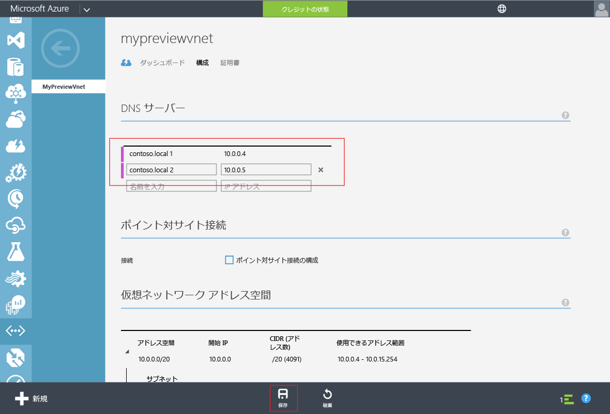

# Azure AD Domain Services - Azure 仮想ネットワークの DNS 設定を更新する
## タスク 4: Azure 仮想ネットワークの DNS 設定を更新する
前の構成タスクで、ディレクトリの Azure AD Domain Services を正常に有効にしました。 次のタスクでは、仮想ネットワーク内のコンピューターがこれらのサービスに接続してそれを使用できるようにします。 仮想ネットワーク上で Azure AD Domain Services を使用できる&2; つの IP アドレスを指すように、仮想ネットワークの DNS サーバー設定を更新します。

> [!NOTE]
> ディレクトリの Azure AD ドメイン サービスを有効にしたら、ディレクトリの **[構成]** タブに表示される Azure AD ドメイン サービスの IP アドレスをメモしておきます。
>
>

Azure AD Domain Services を有効にした仮想ネットワークの DNS サーバー設定を更新するには、次の構成手順を実行します。

1. **Azure クラシック ポータル** ([https://manage.windowsazure.com](https://manage.windowsazure.com)) に移動します。
2. 左側のウィンドウで、 **[ネットワーク]** ノードを選択します。

    ![[Virtual Networks] ノード](./media/active-directory-domain-services-getting-started/virtual-network-select.png)
3. **[Virtual Networks]** タブで、Azure AD ドメイン サービスを有効にした仮想ネットワークを選択してプロパティを表示します。
4. [ **構成** ] タブをクリックします。

    ![[Virtual Networks] ノード](./media/active-directory-domain-services-getting-started/virtual-network-configure-tab.png)
5. **[DNS サーバー]** セクションで、Azure AD ドメイン サービスの IP アドレスを入力します。
6. ディレクトリの **[構成]** タブの **[ドメイン サービス]** セクションに表示されていた両方の IP アドレスが入力されていることを確認します。
7. この仮想ネットワークの DNS サーバー設定を保存するには、ページの下部にあるタスク ウィンドウで **[保存]** をクリックします。

   

> [!NOTE]
> 仮想ネットワークの DNS サーバー設定の更新後、ネットワーク上の仮想マシンが、更新された DNS 構成を取得するのにしばらく時間がかかる場合があります。 仮想マシンがドメインに接続できない場合は、仮想マシンの DNS キャッシュをフラッシュすることができます (例:  'ipconfig/flushdns')。 このコマンドにより、仮想マシンの DNS 設定が強制的に更新されます。
>
>

## タスク 5 - Azure AD ドメイン サービスとのパスワード同期を有効にする
次に、 [Azure AD Domain Services とのパスワード同期を有効](active-directory-ds-getting-started-password-sync.md)にします。

