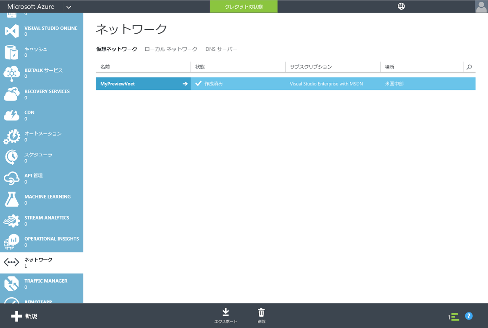
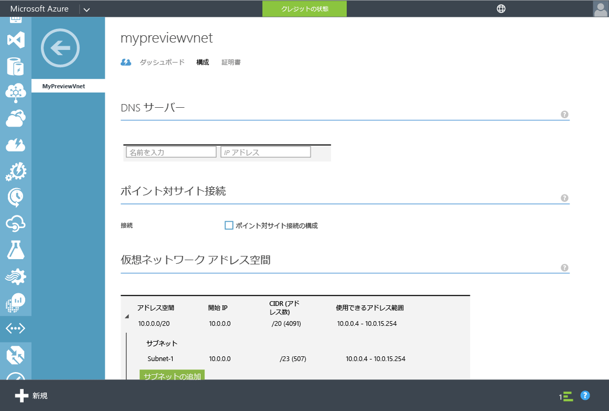

# Azure 仮想ネットワークの DNS 設定を更新する
## タスク 4: Azure 仮想ネットワークの DNS 設定を更新する
前の構成タスクでは、ディレクトリに対して Azure Active Directory Domain Services を有効にしました。 次のタスクでは、仮想ネットワーク内のコンピューターがこれらのサービスに接続してそれを使用できるようにします。 この記事では、仮想ネットワーク上で Azure Active Directory Domain Services を利用できる 2 つの IP アドレスを指すように、仮想ネットワークの DNS サーバー設定を更新します。

> [!NOTE]
> ディレクトリに対して Azure Active Directory Domain Services を有効にしたら、ディレクトリの **[構成]** タブに表示される Azure Active Directory Domain Services の IP アドレスをメモしておきます。
>
>

Azure Active Directory Domain Services を有効にした仮想ネットワークの DNS サーバー設定を更新するには、次の手順に従います。

1. [Azure クラシック ポータル](https://manage.windowsazure.com)に移動します。
2. 左側のウィンドウで、**[ネットワーク]** を選択します。  
    **[ネットワーク]** ウィンドウが開きます。

    
3. **[Virtual Networks]** タブで、Azure Active Directory Domain Services を有効にした仮想ネットワークを選択してプロパティを表示します。
4. [ **構成** ] タブをクリックします。

    
5. **[DNS サーバー]** セクションで、ディレクトリの **[構成]** タブの **[ドメイン サービス]** セクションに表示されていた 2 つの IP アドレスを両方とも入力します。
6. この仮想ネットワークの DNS サーバー設定を保存するには、ウィンドウ下部にある作業ウィンドウで **[保存]** をクリックします。

   

> [!NOTE]
> ネットワーク内の仮想マシンは、再起動時に新しい DNS 設定のみを取得します。 すぐに更新後の DNS 設定を取得する必要がある場合は、ポータル、PowerShell、または CLI のいずれかの再起動をトリガーします。
>
>

## 次のステップ
タスク 5: [Azure Active Directory Domain Services とのパスワード同期を有効にする](active-directory-ds-getting-started-password-sync.md)

