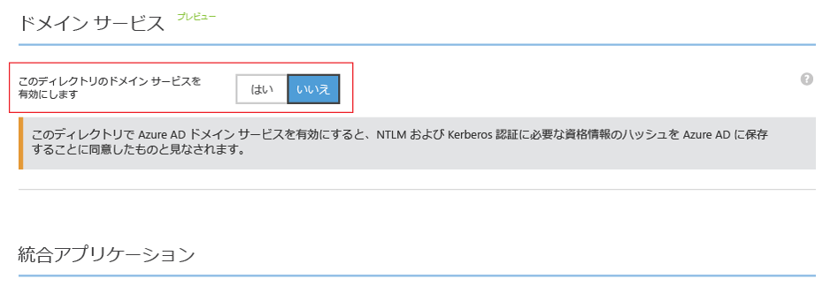
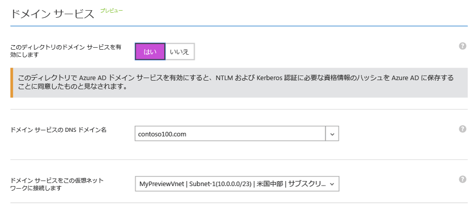
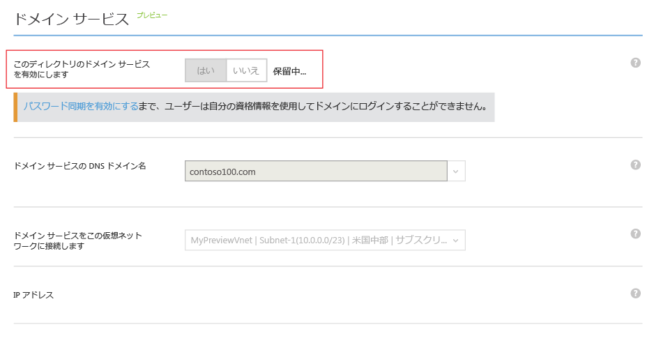
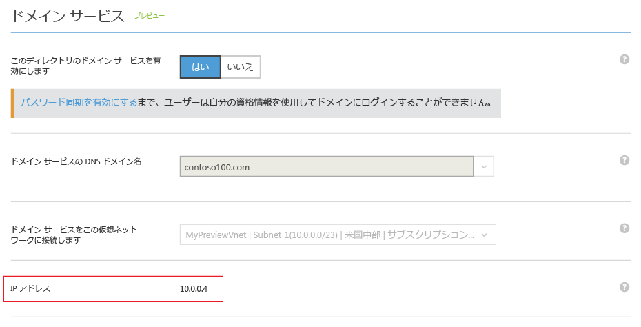
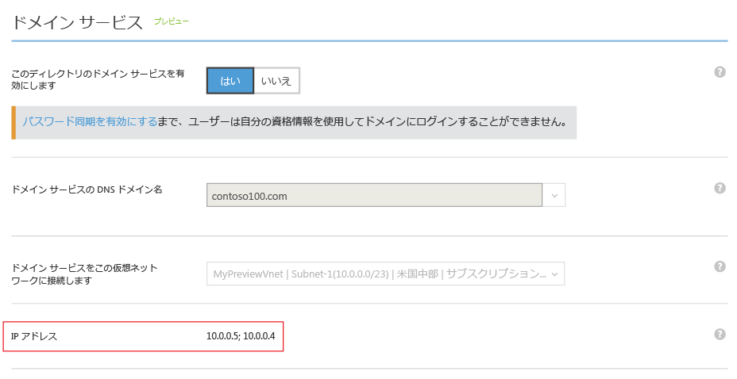

# Azure AD Domain Services を有効にする
## タスク 3: Azure AD ドメイン サービスを有効にする
このタスクではディレクトリに対して Azure AD Domain Services を有効にします。 ディレクトリに対して Azure AD Domain Services を有効にするには、次の構成手順を実行します。

1. **Azure クラシック ポータル** ([https://manage.windowsazure.com](https://manage.windowsazure.com)) に移動します。
2. 左ウィンドウで、 **[Active Directory]** を選択します。
3. Azure AD Domain Services を有効にする Azure AD テナント (ディレクトリ) を選択します。

    
4. [ **構成** ] タブをクリックします。

    ![ディレクトリの [構成] タブ](./media/active-directory-domain-services-getting-started/configure-tab.png)
5. **[domain services]**というタイトルのセクションまで下にスクロールします。

    
6. **[このディレクトリのドメイン サービスを有効にします]** というタイトルのオプションを **[はい]** に切り替えます。 ページに Azure AD Domain Services 用の構成オプションがさらにいくつかページに表示されます。

    

   > [!NOTE]
   > テナントに対して Azure AD Domain Services を有効にすると、ユーザーを認証するために必要な Kerberos と NTLM の資格情報のハッシュが Azure AD によって生成され、保存されます。
   >
   >
7. **[ドメイン サービスの DNS ドメイン名]**を指定します。

   * ディレクトリの既定のドメイン名 ( **.onmicrosoft.com** ドメイン サフィックスで終わる名前) が既定で選択されます。
   * 一覧には、Azure AD ディレクトリに対して構成されたすべてのドメインが含まれます。検証対象のドメインおよび [ドメイン] タブで構成する検証対象外のドメインなどがあります。
   * さらに、カスタム ドメイン名を入力することもできます。 この例では、"contoso100.com" というカスタム ドメイン名を入力しました。

     > [!WARNING]
     > 指定したドメイン名のドメイン プレフィックス (たとえば、"contoso100.com" ドメイン名の "contoso100") が 15 文字未満であることを確認します。 ドメイン プレフィックスが 15 文字より長いと、Azure AD Domain Services ドメインを作成することはできません。
     >
     >
8. 管理対象ドメイン用に選択した DNS ドメイン名がまだ仮想ネットワークに存在しないことを確認します。 具体的には、以下のことを確認します。

   * 同じ DNS ドメイン名のドメインが仮想ネットワーク上に既にあるかどうか。
   * 選択した仮想ネットワークにオンプレミス ネットワークとの VPN 接続があり、オンプレミス ネットワーク上に同じ DNS ドメイン名のドメインがあるかどうか。
   * 仮想ネットワーク上に、その名前の付いたクラウド サービスが既にあるかどうか。
9. 次の手順は、Azure AD Domain Services を利用できる仮想ネットワークを選択することです。 作成した仮想ネットワークと専用サブネットを、**[ドメイン サービスをこの仮想ネットワークに接続します]** というタイトルのボックスの一覧から選択します。

   * 指定した仮想ネットワークが Azure AD Domain Services でサポートされている Azure リージョンに属することを確認します。 Azure AD Domain Services を使用できる Azure リージョンを確認するには、 [リージョン別の Azure サービス](https://azure.microsoft.com/regions/#services/) に関するページを参照してください。
   * Azure AD Domain Services がサポートされていないリージョンに属している仮想ネットワークはドロップダウン リストに表示されません。
   * Azure AD ドメイン サービスには仮想ネットワーク内の専用サブネットを使用します。 ゲートウェイ サブネットは選択しないでください。 [ネットワークに関する考慮事項](active-directory-ds-networking.md)を参照してください。
   * 同様に、Azure Resource Manager を使用して作成された仮想ネットワークは、ドロップダウン リストに表示されません。 現在、Resource Manager ベースの仮想ネットワークは Azure AD Domain Services でサポートされていません。
10. Azure AD Domain Services を有効にするには、ページ下部のタスク ウィンドウで **[保存]** をクリックします。
11. ディレクトリに対して Azure AD ドメイン サービスを有効にしている間、 ページに [保留中] と表示されます。

    

    > [!NOTE]
    > Azure AD Domain Services は、管理対象ドメインに対して高可用性を提供します。 Azure AD Domain Services を有効にすると、仮想ネットワーク上で Domain Services を利用できる IP アドレスが 1 つずつ表示されます。 2 番目の IP アドレスは、このサービスでドメインに対する高可用性が有効になるとすぐに表示されます。 ドメインに対する高可用性が構成され、アクティブになると、**[構成]** タブの **[domain services]** セクションに 2 つの IP アドレスが表示されます。
    >
    >
12. 約 20 ～ 30 分後に、仮想ネットワーク上で Domain Services を利用できる最初の IP アドレスが、**[構成]** ページの **[IP アドレス]** フィールドに表示されます。

    
13. 高可用性がドメインで運用されると、2 つの IP アドレスがページに表示されます。 管理対象ドメインには、選択した仮想ネットワーク上の、この 2 つの IP アドレスでアクセスできます。 仮想ネットワークの DNS 設定を更新できるように、これらの IP アドレスをメモしておきます。 この手順は、仮想ネットワーク上の仮想マシンが、ドメインへの参加などの操作のためにドメインに接続できるようにします。

    

> [!NOTE]
> Azure AD テナントのサイズ (ユーザー数、グループ数など) によっては、管理対象ドメインの同期に時間がかかる場合があります。 この同期処理は、バック グラウンドで発生します。 数万のオブジェクトがある大きなテナントの場合、すべてのユーザー、グループ メンバーシップ、資格情報が同期されるまでに 1 ～ 2 日かかることがあります。
>
>

 

## タスク 4: Azure 仮想ネットワークの DNS 設定を更新する
次に、 [Azure 仮想ネットワークの DNS 設定を更新](active-directory-ds-getting-started-dns.md)します。

