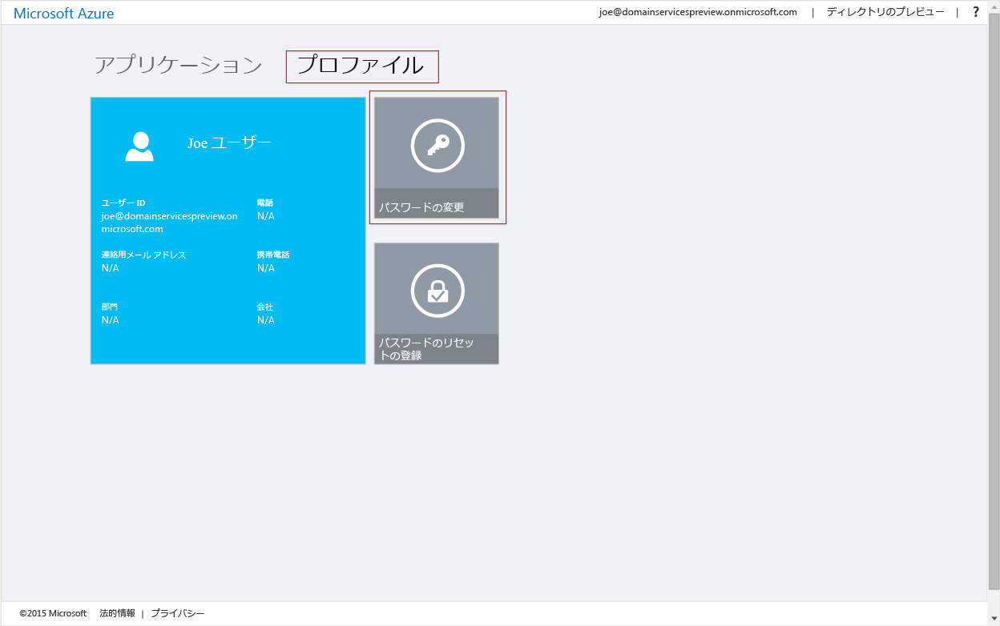

# Azure AD Domain Services とのパスワード同期を有効にする
ここまでの作業では、自分の Azure AD テナントの Azure AD Domain Services を有効にしました。 次のタスクでは、Azure AD Domain Services と同期するために、NTLM および Kerberos 認証に必要な資格情報ハッシュを有効にします。 資格情報の同期が設定されると、ユーザーは企業の資格情報を使用して、管理対象ドメインにサインインできます。

実行する手順は、組織がクラウド専用 Azure AD テナントであるか、Azure AD Connect を使用してオンプレミスのディレクトリに同期するように設定されているかによって異なります。

 

> [!div class="op_single_selector"]
> * [クラウド専用 Azure AD テナント](active-directory-ds-getting-started-password-sync.md)
> * [同期された Azure AD テナント](active-directory-ds-getting-started-password-sync-synced-tenant.md)
>
>

 

## タスク 5: AAD Domain Services とのパスワード同期を有効にする (クラウド専用 Azure AD テナントの場合)
Azure AD Domain Services では、管理対象ドメインでユーザーを認証するために、NTLM および Kerberos 認証に適した形式の資格情報ハッシュが必要です。 テナントの AAD Domain Services を有効にしない限り、Azure AD は、NTLM または Kerberos 認証に必要な形式の資格情報ハッシュを生成または保存しません。 明らかなセキュリティ上の理由から、Azure AD は資格情報をクリア テキスト形式でも保存しません。 そのため、Azure AD には、これらの NTLM または Kerberos 資格情報ハッシュをユーザーの既存の資格情報に基づいて生成する方法がありません。

> [!NOTE]
> 組織にクラウド専用 Azure AD テナントがある場合、Azure AD Domain Services を使用する必要があるユーザーは、自分のパスワードを変更する必要があります。
>
>

このパスワード変更プロセスにより、Azure AD ドメイン サービスの Kerberos/NTLM 認証に必要な資格情報のハッシュが Azure AD 内に生成されます。 Azure AD ドメイン サービスを使用する必要があるテナントの全ユーザーのパスワードの有効期限を無効にするか、これらのユーザーにパスワードを変更するように指示できます。

### NTLM と Kerberos の資格情報ハッシュの生成を有効にする (クラウド専用 Azure AD テナント)
エンド ユーザーがパスワードを変更できるようにするための手順を次に示します。

1. [http://myapps.microsoft.com](http://myapps.microsoft.com)で、組織の Azure AD アクセス パネル ページに移動します。
2. そのページで **[プロファイル]** タブを選択します。
3. そのページで **[パスワードの変更]** タイルをクリックします。

    

   > [!NOTE]
   > アクセス パネル ページに **[パスワードの変更]** オプションが表示されない場合は、組織が [Azure AD でのパスワード管理](../active-directory/active-directory-passwords-getting-started.md)を構成してあることを確認します。
   >
   >
4. **[パスワードの変更]** ページで既存の (古い) パスワードを入力した後、新しいパスワードを入力して、それを確認します。 **[送信]**をクリックします。

    

自分のパスワードを変更すると、Azure AD Domain Services ですぐに新しいパスワードを使用できるようになります。 また、数分 (通常は約 20 分) 経つと、新しく変更したパスワードを使用して、管理対象ドメインに参加しているコンピューターにサインインできるようになります。

 

## 関連コンテンツ
* [自分のパスワードを更新する方法](../active-directory/active-directory-passwords-update-your-own-password.md#reset-your-password)
* [Azure AD でのパスワード管理の概要](../active-directory/active-directory-passwords-getting-started.md)
* [AAD Domain Services とのパスワード同期を有効にする (同期された Azure AD テナントの場合)](active-directory-ds-getting-started-password-sync-synced-tenant.md)
* [Azure AD ドメイン サービスで管理されているドメインの管理](active-directory-ds-admin-guide-administer-domain.md)
* [Azure AD ドメイン サービスで管理されているドメインに Windows 仮想マシンを参加させる](active-directory-ds-admin-guide-join-windows-vm.md)
* [Azure AD ドメイン サービスで管理されているドメインに Red Hat Enterprise Linux 仮想マシンを参加させる](active-directory-ds-admin-guide-join-rhel-linux-vm.md)

