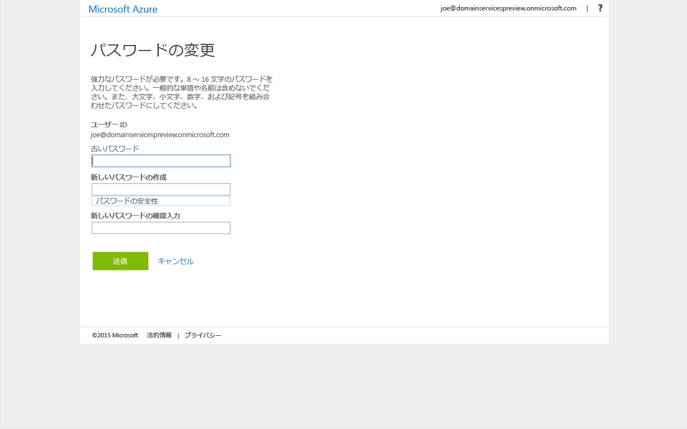

# Azure Active Directory Domain Services とのパスワード ハッシュの同期を有効にする
前のタスクでは、Azure Active Directory (Azure AD) テナントに対して Azure Active Directory Domain Services を有効にしました。 次のタスクでは、NT LAN Manager (NTLM) および Kerberos 認証に必要なパスワード ハッシュを Azure AD Domain Services との間で同期できるようにします。 パスワード ハッシュの同期をセットアップすると、ユーザーは自社の資格情報を使用して、マネージド ドメインにサインインできます。

対象となるユーザー アカウントがクラウド専用のアカウントであるか、オンプレミス ディレクトリとの間で Azure AD Connect を使って同期されたアカウントであるかによって、必要な手順は異なります。 

 
| **ユーザー アカウントの種類** | **実行する手順** |
| --- |---|
| **Azure AD に作成されたクラウド ユーザー アカウント** |**&#x2713;** [この記事の手順に従う](active-directory-ds-getting-started-password-sync.md#task-5-enable-password-hash-synchronization-to-your-managed-domain-for-cloud-only-user-accounts) |
| **オンプレミス ディレクトリとの間で同期されるユーザー アカウント** |**&amp;#x2713;**[オンプレミス AD との間で同期されたユーザー アカウントのパスワード ハッシュをマネージド ドメインとの間で同期する](active-directory-ds-getting-started-password-sync-synced-tenant.md) | 

 

> [!TIP]
> **両方の手順を実行することが必要になる場合があります。**
> Azure AD テナントにクラウドのみのユーザーとオンプレミス AD からのユーザーとが混在している場合、両方の手順を実行する必要があります。
>

## タスク 5: マネージド ドメインとの間でクラウド専用ユーザー アカウントのパスワード ハッシュの同期を有効にする
Azure Active Directory Domain Services では、マネージド ドメインでユーザーを認証するために、NTLM および Kerberos 認証に適した形式のパスワード ハッシュが必要です。 テナントに対して Azure Active Directory Domain Services を有効にしない限り、Azure AD で NTLM または Kerberos 認証に必要な形式のパスワード ハッシュが生成または保存されることはありません。 明らかなセキュリティ上の理由から、Azure AD はパスワード資格情報をクリア テキスト形式でも保存しません。 そのため、Azure AD には、これらの NTLM または Kerberos パスワード ハッシュをユーザーの既存の資格情報に基づいて自動的に生成する方法がありません。

> [!NOTE]
> **組織にクラウド専用ユーザー アカウントが存在する場合、Azure Active Directory Domain Services を使用する必要があるすべてのユーザーは、自分のパスワードを変更しなければなりません。** クラウド専用ユーザー アカウントとは、Azure Portal または Azure AD PowerShell コマンドレットを使って Azure AD ディレクトリに作成されたアカウントです。 そのようなユーザー アカウントは、オンプレミス ディレクトリとの間で同期されません。
>
>

このパスワード変更プロセスにより、Azure Active Directory Domain Services での Kerberos および NTLM 認証に必要なパスワード ハッシュが Azure AD 内に生成されます。 パスワードの変更を促す方法として、Azure Active Directory Domain Services を使用する必要があるテナント内の全ユーザーのパスワードを有効期限切れにすることも、それらのユーザーにパスワードを変更するように指示することもできます。

### NTLM と Kerberos のパスワード ハッシュの生成を有効にする (クラウド専用ユーザー アカウント)
ユーザーがパスワードを変更できるように、以下の手順をユーザーに伝える必要があります。

1. 組織の [Azure AD アクセス パネル](http://myapps.microsoft.com)のページに移動します。

    

2. 右上隅に表示される自分の名前をクリックし、メニューから **[プロファイル]** を選択します。

    

3. **[プロファイル]** ページの **[パスワードの変更]** をクリックします。

    ![[パスワードの変更] をクリック](./media/active-directory-domain-services-getting-started/user-change-password.png)

   > [!TIP]
   > アクセス パネル ウィンドウに **[パスワードの変更]** オプションが表示されない場合は、組織で [Azure AD でのパスワード管理](../active-directory/authentication/quickstart-sspr.md)を構成済みであることを確認します。
   >
   >
4. **[パスワードの変更]** ページで既存の (古い) パスワードを入力し、新しいパスワードを入力して、それを確認します。

    

5. **[送信]** をクリックします。

パスワードを変更すると、数分後に Azure Active Directory Domain Services で新しいパスワードを使用できるようになります。 約 20 分後には、新しく変更したパスワードを使用して、マネージド ドメインに参加しているコンピューターにサインインできるようになります。

## 関連コンテンツ
* [自分のパスワードを更新する方法](../active-directory/user-help/active-directory-passwords-update-your-own-password.md)
* [Azure AD でのパスワード管理の概要](../active-directory/authentication/quickstart-sspr.md)
* [Azure Active Directory Domain Services とのパスワード ハッシュの同期を有効にする (同期された Azure AD テナントの場合)](active-directory-ds-getting-started-password-sync-synced-tenant.md)
* [Azure Active Directory Domain Services で管理されているドメインを管理する](active-directory-ds-admin-guide-administer-domain.md)
* [Azure Active Directory Domain Services で管理されているドメインに Windows 仮想マシンを参加させる](active-directory-ds-admin-guide-join-windows-vm.md)
* [Azure Active Directory Domain Services で管理されているドメインに Red Hat Enterprise Linux 仮想マシンを参加させる](active-directory-ds-admin-guide-join-rhel-linux-vm.md)
