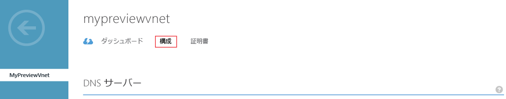
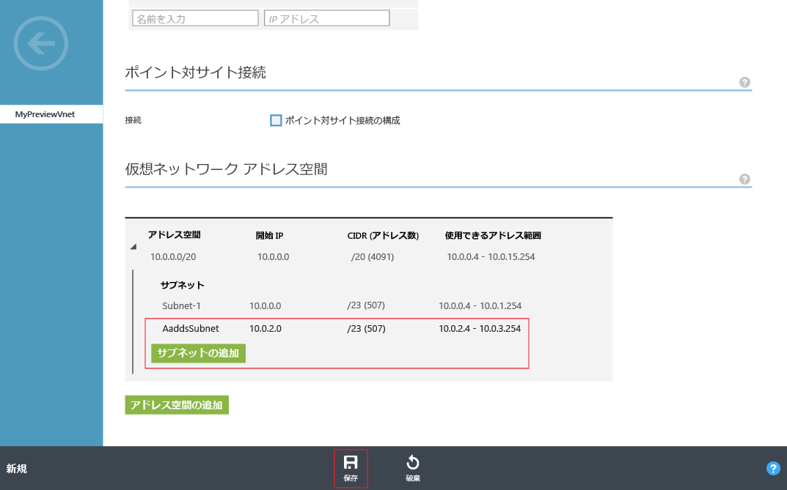

# Azure AD Domain Services の仮想ネットワークの作成または選択
## Azure Virtual Network を選択するためのガイドライン
> [!NOTE]
> **開始する前に**: 「 [Azure AD Domain Services のネットワークに関する考慮事項](active-directory-ds-networking.md)」を参照してください。
>
>

## タスク 2: Azure 仮想ネットワークを作成する
次の構成タスクでは、Azure 仮想ネットワークを作成し、その中にサブネットを作成します。 仮想ネットワーク内のこのサブネットで、Azure AD Domain Services を有効にします。 希望する仮想ネットワークが既にある場合は、この手順を省略してかまいません。

> [!NOTE]
> Azure AD ドメイン サービス用に作成 (または選択) する Azure Virtual Network が、Azure AD ドメイン サービスによってサポートされている Azure リージョンに属していることを確認してください。 Azure AD Domain Services を使用できる Azure リージョンを確認するには、 [リージョン別の Azure サービス](https://azure.microsoft.com/regions/#services/) に関するページを参照してください。
>
>

仮想ネットワークの名前は書き留めておいてください。この後の構成手順で Azure AD Domain Services を有効にする際、適切な仮想ネットワークを選択する必要があります。

Azure AD Domain Services が利用できる Azure 仮想ネットワークを作成するには、次の構成手順を実行します。

1. **Azure クラシック ポータル** ([https://manage.windowsazure.com](https://manage.windowsazure.com)) に移動します。
2. 左側のウィンドウで、 **[ネットワーク]** ノードを選択します。

    
3. ページ下部の作業ウィンドウの **[新規]** をクリックします。

    ![[Virtual Networks] ノード](./media/active-directory-domain-services-getting-started/virtual-networks.png)
4. **[Network Services]** ノードの **[Virtual Network]** を選択します。
5. 仮想ネットワークを作成するには、 **[簡易作成]** をクリックします。

    
6. 仮想ネットワークの **名前** を指定します。 このネットワークの **[アドレス空間]** や **[最大 VM 数]** を構成することもできます。 現時点では、**[DNS サーバー]**設定は [なし] のままでかまいません。 DNS サーバー設定は、Azure AD ドメイン サービスを有効にした後で更新できます。
7. **[場所]** ボックスの一覧で、サポート対象の Azure リージョンを確実に選択します。 Azure AD Domain Services を使用できる Azure リージョンを確認するには、 [リージョン別の Azure サービス](https://azure.microsoft.com/regions/#services/) に関するページを参照してください。
8. 仮想ネットワークを作成するには、 **[仮想ネットワークの作成]** ボタンをクリックします。

    
9. 仮想ネットワークが作成されたら、仮想ネットワークを選択し、**[構成]** タブをクリックします。

    
10. **[仮想ネットワーク アドレス空間]** セクションに移動します。 **[サブネットの追加]** をクリックし、サブネット名として「**AaddsSubnet**」と指定します。 **[保存]** をクリックすると、サブネットが作成されます。

    

 

## タスク 3: Azure AD ドメイン サービスを有効にする
次に、 [Azure AD Domain Services を有効](active-directory-ds-getting-started-enableaadds.md)にします。

