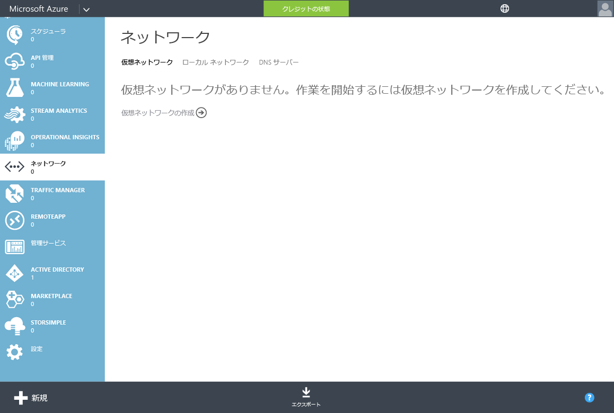

<properties
	pageTitle="Azure Active Directory ドメイン サービス プレビュー: 作業の開始 | Microsoft Azure"
	description="Azure Active Directory ドメイン サービスの概要"
	services="active-directory-ds"
	documentationCenter=""
	authors="mahesh-unnikrishnan"
	manager="udayh"
	editor="inhenk"/>

<tags
	ms.service="active-directory-ds"
	ms.workload="identity"
	ms.tgt_pltfrm="na"
	ms.devlang="na"
	ms.topic="article"
	ms.date="10/12/2015"
	ms.author="maheshu"/>

# Azure AD Domain Services *(プレビュー)* - 作業の開始

## Azure Virtual Network を選択するためのガイドライン
Azure AD ドメイン サービスで使用する仮想ネットワークは、次のガイドラインに従って選んでください。

- Azure AD ドメイン サービスでサポートされているリージョンの仮想ネットワークを選択します。現在サポートされている Azure リージョンについては、[リージョン](active-directory-ds-regions.md)に関するページを参照してください。
- 既存の仮想ネットワークを使用する場合は、リージョン仮想ネットワークであることを確認してください。従来のアフィニティ グループ機構を使った仮想ネットワークは、Azure AD ドメイン サービスでは使用できません。[従来の仮想ネットワークはリージョン仮想ネットワークに移行](../virtual-networks-migrate-to-regional-vnet.md)する必要があります。
- Azure AD ドメイン サービスにアクセスする必要のある仮想マシンを現在ホストしている (または今後ホストする予定の) 仮想ネットワークを選択します。ドメイン サービスを後から他の仮想ネットワークに移動することはできません。

## ステップ 2: Azure の仮想ネットワークを作成する
次に、Azure AD ドメイン サービスが利用できる Azure Virtual Network を作成します。希望する仮想ネットワークが既にある場合は、この手順を省略してかまいません。

> [AZURE.NOTE]Azure AD ドメイン サービス用に作成 (または選択) する Azure Virtual Network が、Azure AD ドメイン サービスによってサポートされている Azure リージョンに属していることを確認してください。Azure AD ドメイン サービスが利用できる Azure リージョンについては、[リージョン](active-directory-ds-regions.md)に関するページを参照してください。

仮想ネットワークの名前は書き留めておいてください。この後の構成手順で Azure AD ドメイン サービスを有効にする際、適切な仮想ネットワークを選択する必要があります。

Azure AD ドメイン サービスが利用できる Azure Virtual Network を作成するには、次の構成手順を実行します。

1. **Microsoft Azure 管理ポータル** ([https://manage.windowsazure.com](https://manage.windowsazure.com)) に移動します。
2. 左側のウィンドウで、**[ネットワーク]** ノードを選択します。
3. ページ下部の作業ウィンドウの **[新規]** をクリックします。

    

4. **[Network Services]** ノードの **[Virtual Network]** を選択します。
5. 仮想ネットワークを作成するには、**[簡易作成]** をクリックします。

    

6. 仮想ネットワークの**名前**を指定します。このネットワークの **[アドレス空間]** や **[最大 VM 数]** を構成することもできます。DNS サーバーの設定は差し当たり、[なし] のままでかまいません。この設定は、Azure AD ドメイン サービスを有効にした後で更新されます。
7. **[場所]** ボックスの一覧で、サポート対象の Azure リージョンを確実に選択します。Azure AD ドメイン サービスが利用できる Azure リージョンについては、[リージョン](active-directory-ds-regions.md)に関するページを参照してください。これは重要な手順です。Azure AD ドメイン サービスでサポートされていない Azure リージョンの仮想ネットワークを選択した場合、その仮想ネットワークでドメイン サービスを有効にすることができません。
8. **[Virtual Network の作成]** ボタンをクリックして仮想ネットワークを作成します。

    

---
[**次のステップ - Azure AD ドメイン サービスを有効にする**](active-directory-ds-getting-started-enableaadds.md)

<!---HONumber=Oct15_HO4-->