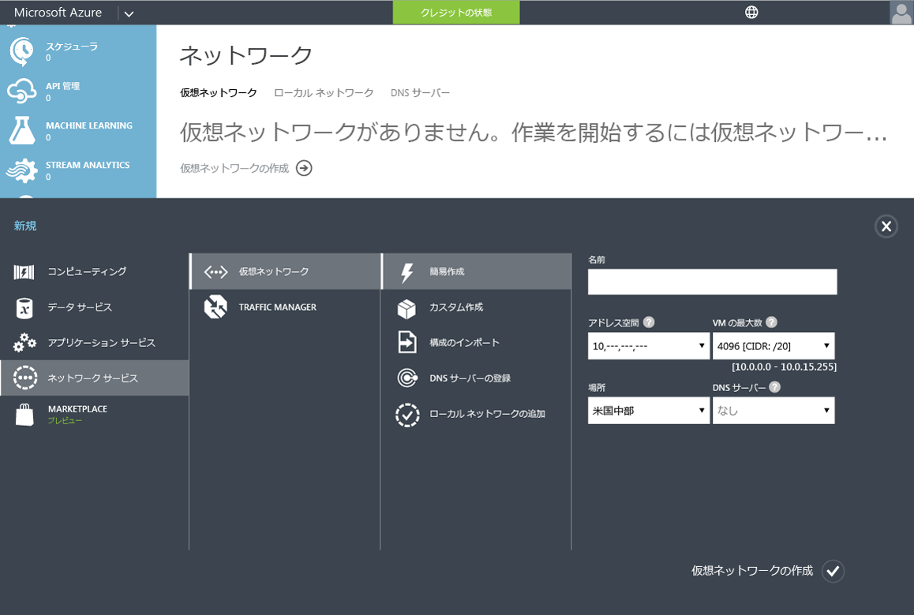
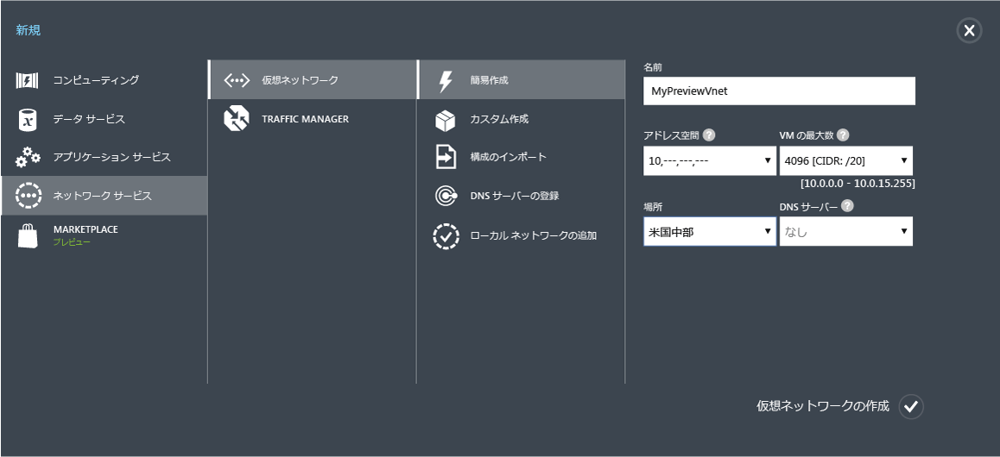

<properties
	pageTitle="Azure AD ドメイン サービス: 仮想ネットワークの作成または選択 | Microsoft Azure"
	description="Azure Active Directory ドメイン サービスの概要"
	services="active-directory-ds"
	documentationCenter=""
	authors="mahesh-unnikrishnan"
	manager="stevenpo"
	editor="curtand"/>

<tags
	ms.service="active-directory-ds"
	ms.workload="identity"
	ms.tgt_pltfrm="na"
	ms.devlang="na"
	ms.topic="get-started-article"
	ms.date="09/20/2016"
	ms.author="maheshu"/>

# Azure AD Domain Services の仮想ネットワークの作成または選択

## Azure Virtual Network を選択するためのガイドライン
> [AZURE.NOTE] **開始する前に**: 「[Azure AD Domain Services のネットワークに関する考慮事項](active-directory-ds-networking.md)」を参照してください。

## タスク 2: Azure 仮想ネットワークを作成する
次に、Azure AD ドメイン サービスが利用できる Azure 仮想ネットワークを作成します。希望する仮想ネットワークが既にある場合は、この手順を省略してかまいません。

> [AZURE.NOTE] Azure AD ドメイン サービス用に作成 (または選択) する Azure Virtual Network が、Azure AD ドメイン サービスによってサポートされている Azure リージョンに属していることを確認してください。Azure AD Domain Services を使用できる Azure リージョンを確認するには、[リージョン別の Azure サービス](https://azure.microsoft.com/regions/#services/)に関するページを参照してください。

仮想ネットワークの名前は書き留めておいてください。この後の構成手順で Azure AD Domain Services を有効にする際、適切な仮想ネットワークを選択する必要があります。

Azure AD Domain Services が利用できる Azure 仮想ネットワークを作成するには、次の構成手順を実行します。

1. **Azure クラシック ポータル** ([https://manage.windowsazure.com](https://manage.windowsazure.com)) に移動します。

2. 左側のウィンドウで、**[ネットワーク]** ノードを選択します。

3. ページ下部の作業ウィンドウの **[新規]** をクリックします。

    ![[Virtual Networks] ノード](./media/active-directory-domain-services-getting-started/virtual-networks.png)

4. **[Network Services]** ノードの **[Virtual Network]** を選択します。

5. 仮想ネットワークを作成するには、**[簡易作成]** をクリックします。

    

6. 仮想ネットワークの**名前**を指定します。このネットワークの **[アドレス空間]** や **[最大 VM 数]** を構成することもできます。DNS サーバーの設定は差し当たり、[なし] のままでかまいません。この設定は、Azure AD ドメイン サービスを有効にした後で更新されます。

7. **[場所]** ボックスの一覧で、サポート対象の Azure リージョンを確実に選択します。Azure AD Domain Services を使用できる Azure リージョンを確認するには、[リージョン別の Azure サービス](https://azure.microsoft.com/regions/#services/)に関するページを参照してください。

8. 仮想ネットワークを作成するには、**[仮想ネットワークの作成]** ボタンをクリックします。

    

 

## タスク 3: Azure AD ドメイン サービスを有効にする
次に、[Azure AD Domain Services を有効](active-directory-ds-getting-started-enableaadds.md)にします。

<!-------HONumber=AcomDC_0921_2016-->