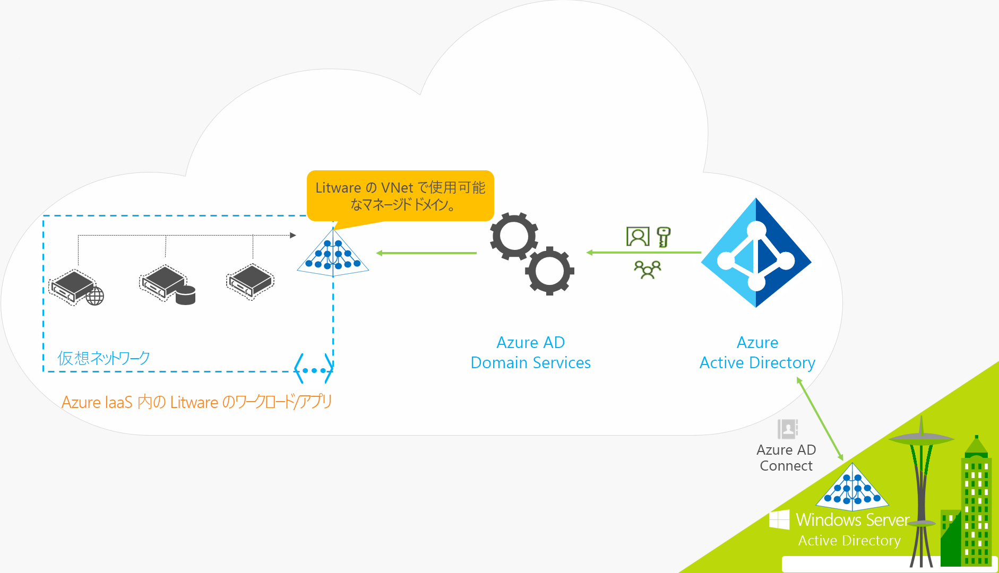
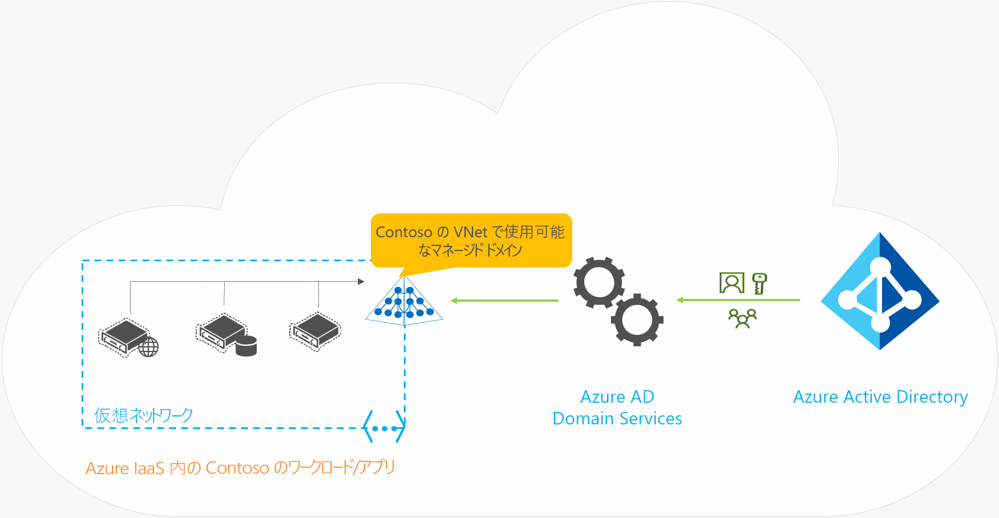

# Azure Active Directory Domain Services とは

Azure Active Directory Domain Services (Azure AD DS) では、Windows Server Active Directory と完全に互換性のあるマネージド ドメイン サービス (ドメイン参加、グループ ポリシー、ライトウェイト ディレクトリ アクセス プロトコル (LDAP)、Kerberos 認証、NTLM 認証など) が提供されます。 クラウドでドメイン コントローラーのデプロイ、管理、および修正プログラムの適用を行わなくても、これらのドメイン サービスを使用することができます。 Azure AD DS は既存の Azure AD テナントと統合されるので、ユーザーは既存の資格情報を使用してサインインできるようになります。 さらに、既存のグループおよびユーザー アカウントを使用してリソースへのアクセスをセキュリティで保護することができます。このため、リフト アンド シフト方式でオンプレミスのリソースをよりスムーズに Azure に移行できます。

使用を開始するには、[Azure portal を使用して Azure AD DS マネージド ドメインを作成][tutorial-create]します。

Azure AD DS では、ID 情報が Azure AD からレプリケートされるため、クラウド専用の Azure AD テナント、またはオンプレミスの Active Directory Domain Services (AD DS) 環境と同期される Azure AD テナントとも連携します。 両方の環境に同じ Azure AD DS 機能セットが存在します。

* オンプレミスの AD DS 環境を既に使用している場合は、ユーザー アカウント情報を同期させて、ユーザーに一貫性のある ID を提供できます。
* クラウド専用の環境では、従来のオンプレミスの AD DS 環境を必要とすることなく、Azure AD DS で提供される ID の集中管理サービスを利用できます。

次のビデオでは、Azure AD DS により、アプリケーションおよびワークロードを統合して、クラウドで ID サービスを提供する方法の概要を説明します。

 

>[!VIDEO https://www.youtube.com/embed/T1Nd9APNceQ]

## クラウドで ID ソリューションを提供する一般的な方法

既存のワークロードをクラウドに移行するとき、ディレクトリ対応アプリケーションでは、オンプレミスの AD DS ディレクトリへの読み取りまたは書き込みアクセスに LDAP が使用される場合があります。 Windows Server で実行されるアプリケーションは、通常、グループ ポリシーを使用して安全に管理できるように、ドメインに参加している仮想マシン (VM) にデプロイされます。 さらに、アプリケーションは、エンド ユーザーを認証するために、Windows 統合認証 (Kerberos 認証、NTLM 認証など) に依存する場合があります。

IT 管理者は、多くの場合、次のいずれかのソリューションを使用して、Azure で実行されるアプリケーションに ID サービスを提供します。

* Azure で実行されるワークロードとオンプレミスの AD DS 環境で実行されるワークロードの間でサイト間 VPN 接続を構成する。
    * この場合、オンプレミスのドメイン コントローラーが VPN 接続経由で認証を提供します。
* Azure 仮想マシン (VM) を使用してレプリカ ドメイン コントローラーを作成し、オンプレミスから AD DS ドメインまたはフォレストを拡張する。
    * Azure VM 上で実行されるドメイン コントローラーが認証を提供し、オンプレミス AD DS 環境間でディレクトリ情報をレプリケートします。
* Azure VM で実行されるドメイン コントローラーを使用して、Azure 内にスタンドアロンの AD DS 環境をデプロイする。
    * Azure VM 上で実行されるドメイン コントローラーによって認証は提供されますが、オンプレミス AD DS 環境からレプリケートされるディレクトリ情報はありません。

これらのアプローチでは、オンプレミスのディレクトリに VPN 接続するため、アプリケーションはネットワークの一時的な異常や停止の影響を受けやすくなります。 Azure 内の VM を使用してドメイン コントローラーをデプロイする場合、VM の管理、セキュリティ保護、パッチの適用、監視、バックアップ、トラブルシューティングは IT チームが行う必要があります。

Azure AD DS では、ID サービスを提供するため、オンプレミスの AD DS 環境への VPN 接続を作成したり、Azure で VM を実行および管理したりする必要のない代替方法が提供されます。 マネージド サービスである Azure AD DS により、ハイブリッドとクラウド専用の両方の環境に使用できる統合された ID ソリューションを作成する複雑さが軽減されます。

## Azure AD DS の機能とメリット

クラウド内のアプリケーションおよび VM に ID サービスを提供するために、Azure AD DS は従来の AD DS 環境と完全に互換性があり、ドメイン参加、Secure LDAP (LDAPS)、グループ ポリシー、DNS の管理、LDAP バインドおよび読み取りのサポートなどの運用サービスが提供されます。 LDAP 書き込みのサポートは、Azure AD DS マネージド ドメインで作成されたオブジェクトには使用できますが、Azure AD から同期されたリソースには使用できません。

ID オプションの詳細については、[Azure AD DS、Azure AD、Azure VM 上の Active Directory Domain Services、オンプレミスの Active Directory Domain Services の比較][compare]に関するページを参照してください。

Azure AD DS の次の機能により、デプロイ操作と管理操作が簡略化されます。

* **デプロイ操作の簡略化:** Azure portal の単一のウィザードを使用して、Azure AD DS を Azure AD テナントに対して有効にします。
* **Azure AD との統合:** ユーザー アカウント、グループ メンバーシップ、および資格情報は、ご利用の Azure AD テナントから自動的に利用できるようになります。 Azure AD テナントやオンプレミスの AD DS 環境で新規作成されたユーザーおよびグループ、または変更が加えられた属性は、Azure AD DS に自動的に同期されます。
    * Azure AD DS では、Azure AD にリンクされている外部ディレクトリのアカウントは使用できません。 これらの外部ディレクトリでは、資格情報を使用できないため、Azure AD DS マネージド ドメインには同期できません。
* **会社の資格情報とパスワードの使用:** Azure AD DS におけるユーザーのパスワードは、Azure AD テナントと同じです。 ユーザーは、コンピューターのドメイン参加、対話形式またはリモート デスクトップ経由によるサインイン、Azure AD DS マネージド ドメインに対する認証に会社の資格情報を使用できます。
* **NTLM と Kerberos の認証:** NTLM と Kerberos の認証がサポートされているので、Windows 統合認証を利用するアプリケーションをデプロイできます。
* **高可用性:** Azure AD DS には複数のドメイン コントローラーが含まれるため、マネージド ドメインの高可用性を実現できます。 この高可用性により、サービスの稼働時間と障害に対する復元性が保証されます。
    * [Azure Availability Zones][availability-zones] をサポートするリージョンでは、回復性を高めるため、これらのドメイン コントローラは複数のゾーンにも分散されます。

Azure AD DS マネージド ドメインの重要な特徴の一部を以下に示します。

* Azure AD DS マネージド ドメインは、スタンドアロンのドメインです。 オンプレミスのドメインの拡張機能ではありません。
    * 必要であれば、Azure AD DS からオンプレミス AD DS 環境への一方向の出力方向のフォレストの信頼を作成できます。 詳細については、「[Azure AD DS のリソース フォレストの概念と機能][ forest-trusts]」を参照してください。
* IT チームが、この Azure AD DS マネージド ドメインのドメイン コントローラーに対して管理、修正プログラムの適用、監視を行う必要はありません。

オンプレミスで AD DS を実行するハイブリッド環境では、Azure AD DS マネージド ドメインへの AD レプリケーションを管理する必要はありません。 オンプレミスのディレクトリからのユーザー アカウント、グループ メンバーシップ、および資格情報は、[Azure AD Connect][azure-ad-connect] を介して Azure AD に同期されます。 これらのユーザー アカウント、グループ メンバーシップ、および資格情報は、Azure AD DS マネージド ドメイン内で自動的に利用できるようになります。

## Azure AD DS のしくみ

Azure では、ID サービスを提供するために、選択した仮想ネットワークで AD DS インスタンスが作成されます。 見えないところで、Azure VM 上で実行される一対の Windows Server ドメイン コントローラーが作成されます。 これらのドメイン コントローラーの管理、構成、更新を自分で行う必要はありません。 ドメイン コントローラーは、Azure プラットフォームが Azure AD DS サービスの一部として管理します。

Azure ADAzure AD DS マネージド ドメインは、Azure AD からの一方向の同期を実行して、集中管理された一連のユーザー、グループ、および資格情報へのアクセスを提供するように構成されます。 Azure AD DS マネージド ドメイン内で直接リソースを作成できますが、それらは Azure AD に同期されません。 この仮想ネットワークに接続される Azure 内のアプリケーション、サービス、および VM は、共通の AD DS 機能 (ドメイン参加、グループ ポリシー、LDAP、Kerberos/NTLM 認証など) を使用することができます。

オンプレミスの AD DS 環境とのハイブリッド環境では、[Azure AD Connect][azure-ad-connect] により、ID 情報が Azure AD と同期された後、Azure AD DS と同期されます。

Azure AD DS の実際の動作を確認するために、いくつかの例を見てみましょう。

* [ハイブリッド組織向けの Azure AD DS](#azure-ad-ds-for-hybrid-organizations)
* [クラウド専用組織向けの Azure AD DS](#azure-ad-ds-for-cloud-only-organizations)

### ハイブリッド組織向けの Azure AD DS

多くの組織は、クラウドとオンプレミスの両方のアプリケーション ワークロードを含むハイブリッド インフラストラクチャを運用しています。 リフト アンド シフト戦略の一環として Azure に移行されたレガシ アプリケーションでも、従来の LDAP 接続を使用して ID 情報を提供することができます。 このハイブリッド インフラストラクチャをサポートするために、オンプレミスの AD DS 環境からの ID 情報を Azure AD テナントに同期させることができます。 Azure AD DS では、Azure 内のこれらのレガシ アプリケーションに ID ソースを提供します。オンプレミスのディレクトリ サービスへのアプリケーション接続を構成して管理する必要はありません。

オンプレミスと Azure の両方のリソースを実行するハイブリッド組織である Litware Corporation の例を見てみましょう。

* ドメイン サービスを必要とするアプリケーションおよびサーバー ワークロードは、Azure の仮想ネットワークにデプロイされています。
    * これには、リフト アンド シフト戦略の一環として Azure に移行されたレガシ アプリケーションが含まれる場合があります。
* ID 情報をオンプレミスのディレクトリから Azure AD テナントに同期するために、Litware Corporation は、[Azure AD Connect][azure-ad-connect]をデプロイしました。
    * 同期される ID 情報には、ユーザー アカウントとグループ メンバーシップが含まれます。
* Litware の IT チームは、この仮想ネットワークまたはピアリングされた仮想ネットワーク内の Azure AD テナントに対して Azure AD DS を有効にします。
* Azure 仮想ネットワーク内にデプロイされたアプリケーションと VM は、ドメイン参加、LDAP 読み取り、LDAP バインド、NTLM 認証、Kerberos 認証、グループ ポリシーなどの Azure AD DS 機能を使用できます。

> [!IMPORTANT]
> Azure AD Connect は、オンプレミスの AD DS 環境との同期のためにのみインストールおよび構成する必要があります。 オブジェクトを Azure AD に同期するために、Azure AD DS マネージド ドメインに Azure AD Connect をインストールすることはサポートされていません。

### クラウド専用組織向けの Azure AD DS

クラウド専用 Azure AD テナントには、オンプレミスの ID ソースはありません。 たとえば、ユーザー アカウントとグループ メンバーシップは、Azure AD 内で直接作成および管理されます。

ここで、ID に Azure AD を使用するクラウド専用組織である Contoso の例を見てみましょう。 ユーザー ID、ユーザーの資格情報、およびグループ メンバーシップはすべて Azure AD で作成および管理されます。 オンプレミスのディレクトリから ID 情報を同期するために Azure AD Connect を追加構成する必要はありません。

* ドメイン サービスを必要とするアプリケーションおよびサーバー ワークロードは、Azure の仮想ネットワークにデプロイされています。
* Contoso の IT チームは、この仮想ネットワークまたはピアリングされた仮想ネットワーク内の Azure AD テナントに対して Azure AD DS を有効にします。
* Azure 仮想ネットワーク内にデプロイされたアプリケーションと VM は、ドメイン参加、LDAP 読み取り、LDAP バインド、NTLM 認証、Kerberos 認証、グループ ポリシーなどの Azure AD DS 機能を使用できます。

## 次のステップ

Azure AD DS と他の ID ソリューションとの比較、および同期のしくみの詳細については、次の記事を参照してください。

* [Azure AD DS を Azure AD、Azure VM 上の Active Directory Domain Services、およびオンプレミスの Active Directory Domain Services と比較する][compare]
* [Azure AD Domain Services を Azure AD ディレクトリと同期させる方法][synchronization]

使用を開始するには、[Azure portal を使用して Azure AD DS マネージド ドメインを作成][tutorial-create]します。

<!-- INTERNAL LINKS -->
[compare]: compare-identity-solutions.md
[synchronization]: synchronization.md
[tutorial-create]: tutorial-create-instance.md
[azure-ad-connect]: ../active-directory/hybrid/whatis-azure-ad-connect.md
[password-hash-sync]: ../active-directory/hybrid/how-to-connect-password-hash-synchronization.md
[availability-zones]: ../availability-zones/az-overview.md
[forest-trusts]: concepts-resource-forest.md
