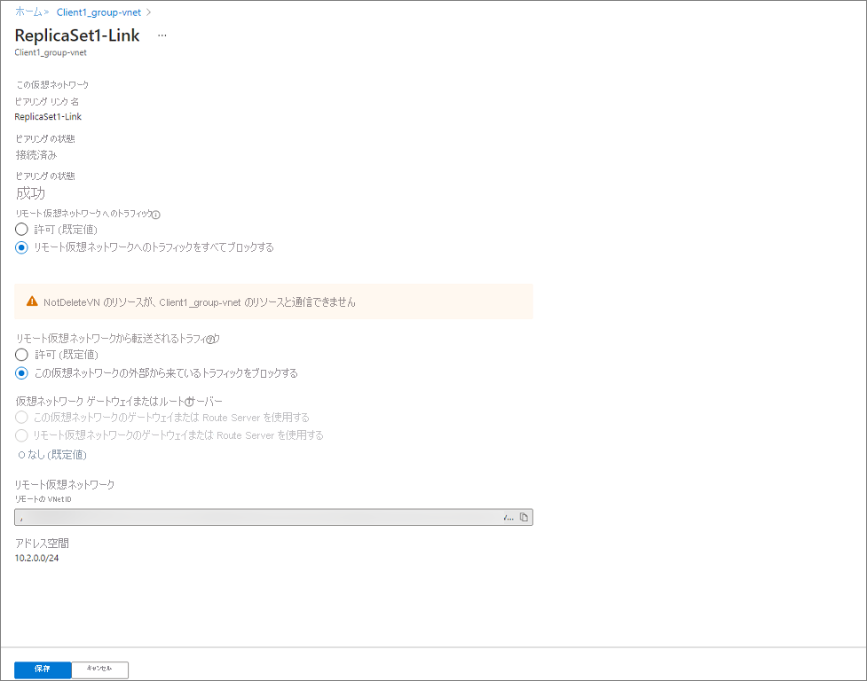

# チュートリアル: Azure Active Directory Domain Services でレプリカ セットを使用してディザスター リカバリーの訓練を実行する

このトピックでは、レプリカ セットを使用して Azure AD Domain Services (Azure AD DS) のディザスター リカバリー (DR) の訓練を実行する方法について説明します。  これにより、ネットワークの仮想ネットワーク プロパティを変更してクライアント アクセスをブロックすることで、レプリカ セットの 1 つがオフラインになるようにシミュレートされます。  レプリカ セットがオフラインにならないという点で、本当の DR の訓練ではありません。 

DR の訓練には次の内容が含まれます。 

1. クライアント コンピューターが、特定のレプリカ セットに接続されています。 ドメインに対して認証を行い、LDAP クエリを実行できます。
1. クライアントのレプリカ セットへの接続が終了します。 これはネットワーク アクセスを制限することによって行われます。
1. 次に、クライアントは別のレプリカ セットとの新しい接続を確立します。 これが行われると、クライアントはドメインに対して認証を行い、LDAP クエリを実行できるようになります。 
1. ドメイン メンバーは再起動され、ドメイン ユーザーは再起動後にログインできるようになります。
1. ネットワーク制限が解除され、クライアントが元のレプリカ セットに接続できるようになります。 

## 前提条件 

DR の訓練を実行するには、次の要件を満たす必要があります。 

- 少なくとも 1 つの追加のレプリカ セットが配置された、デプロイ済みのアクティブな Azure AD DS インスタンス。 ドメインは正常な状態である必要があります。 
- Azure AD DS ホステッド ドメインに参加しているクライアント コンピューター。  クライアントは独自の仮想ネットワークに存在する必要があります。また、両方のレプリカ セットの仮想ネットワークで仮想ネットワーク ピアリングが有効になっており、仮想ネットワークには、DNS にリストされているレプリカ セット内のすべてのドメイン コントローラーの IP アドレスが存在する必要があります。 

## 環境の検証 

1. ドメイン アカウントを使用して、クライアント コンピューターにログインします。 
1. Active Directory Domain Services の RSAT ツールをインストールします。 
1. 管理者特権の PowerShell ウィンドウを開始します。
1. 基本的なドメイン検証チェックを実行します。 
   - `nslookup [domain]` を実行して、DNS 解決が正常に機能していることを確認します 
   - `nltest /dsgetdc:` を実行して、成功が返され、現在どのドメイン コントローラーが使用されているかを確認します
   - `nltest /dclist:` を実行して、ディレクトリ内のドメイン コントローラーの完全な一覧を返します。 
1. ディレクトリ内の各ドメイン コントローラーで基本的なドメイン コントローラー検証を実行します ("nltest /dclist:" の出力から完全な一覧を取得できます)。 
   - `nltest /sc_reset:[domain name]\[domain controller name]` を実行して、ドメイン コントローラーとのセキュリティで保護された接続を確立します。 
   - `Get-AdDomain` を実行して、基本的なディレクトリ設定を取得します。 

## ディザスター リカバリーの訓練を実行する 

これらの操作は、Azure AD DS インスタンス内の各レプリカ セットに対して実行します。 これにより、各レプリカ セットの停止がシミュレートされます。 ドメイン コントローラーに到達できない場合、クライアントは到達可能なドメイン コントローラーに自動的にフェールオーバーします。そしてこのエクスペリエンスは、エンド ユーザーまたはワークロードに対してシームレスである必要があります。 そのため、アプリケーションやサービスが特定のドメイン コントローラーを指定しないことが重要です。 

1. オフラインになるようにシミュレートするレプリカ セット内のドメイン コントローラーを特定します。 
1. クライアント コンピューターで、`nltest /sc_reset:[domain]\[domain controller name]` を使用していずれかのドメイン コントローラーに接続します。 
1. Azure portal で、クライアントの仮想ネットワーク ピアリングにアクセスし、クライアントとレプリカ セットの間のすべてのトラフィックがブロックされるようにプロパティを更新します。 
   1. 更新する必要があるピアリングされたネットワークを選択します。 
   1. 仮想ネットワークに出入りするすべてのネットワーク トラフィックをブロックするよう選択します。 
      
1. クライアント コンピューターで、手順 2 と同じ nltest コマンドを使用して、両方のドメイン コントローラーとセキュリティで保護された接続の再確立を試行します。 ネットワーク接続がブロックされているため、これらの操作は失敗します。 
1. `Get-AdDomain` と `Get-AdForest` を実行して、基本的なディレクトリ プロパティを取得します。 これらの呼び出しは、他のレプリカ セット内のいずれかのドメイン コントローラーに自動的に送信されるため、成功します。 
1. クライアントを再起動し、同じドメイン アカウントでログインします。 これにより、認証が引き続き期待どおりに動作していて、ログインがブロックされないことが示されます。 
1. Azure portal で、クライアントの仮想ネットワーク ピアリングにアクセスし、すべてのトラフィックがブロック解除されるようにプロパティを更新します。 これにより、手順 3 で行った変更が元に戻されます。 
1. クライアント コンピューターで、手順 2 と同じ nltest コマンドを使用して、ドメイン コントローラーとセキュリティで保護された接続の再確立を試行します。 ネットワーク接続がブロック解除されたため、これらの操作は成功します。 

これらの操作は、クライアントがいずれかのレプリカ セットに到達できない場合でも、ドメインが引き続き使用可能であることを示しています。 Azure AD DS インスタンス内の各レプリカ セットに対して、この一連の手順を実行します。 

## まとめ 

これらの手順を実行すると、Azure AD DS 内のいずれかのレプリカ セットに到達できない場合に、ドメイン メンバーは引き続きディレクトリにアクセスできることがわかります。 クライアント コンピューターの代わりにレプリカ セットのすべてのネットワーク アクセスをブロックすることによって同じ動作をシミュレートできますが、これは推奨されません。 クライアントの観点からは動作は変更されませんが、ネットワーク アクセスが復元されるまで Azure AD DS インスタンスの正常性に影響を及ぼします。 

## 次のステップ

このチュートリアルでは、以下の内容を学習しました。

> [!div class="checklist"]
> * レプリカ セット内のドメイン コントローラーへのクライアント接続を検証する
> * クライアントとレプリカ セットの間のネットワーク トラフィックをブロックする
> * 別のレプリカ セット内のドメイン コントローラーへのクライアント接続を検証する

詳細な概念については、Azure AD DS でのレプリカ セットの動作に関するページを参照してください。

> [!div class="nextstepaction"]
> [レプリカ セットの概念と機能][concepts-replica-sets]

<!-- INTERNAL LINKS -->
[replica-sets]: concepts-replica-sets.md
[tutorial-create-instance]: tutorial-create-instance-advanced.md
[create-azure-ad-tenant]: ../active-directory/fundamentals/sign-up-organization.md
[associate-azure-ad-tenant]: ../active-directory/fundamentals/active-directory-how-subscriptions-associated-directory.md
[howto-change-sku]: change-sku.md
[concepts-replica-sets]: concepts-replica-sets.md
