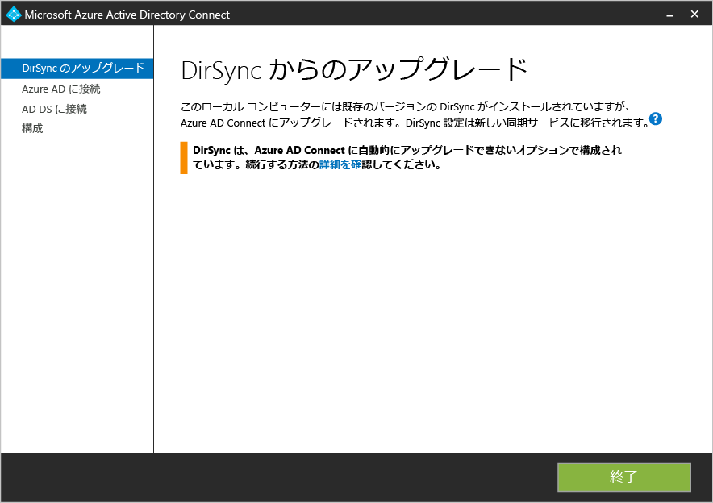
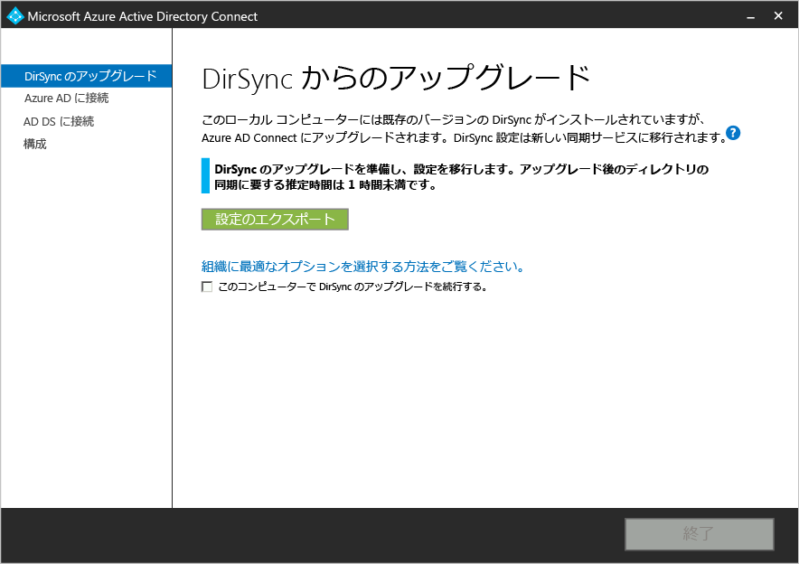
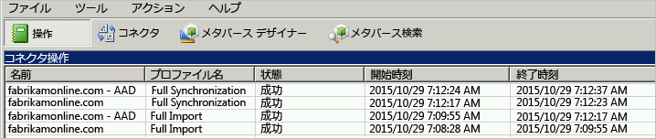

<properties
   pageTitle="Azure AD Connect: Windows Azure AD 同期ツール (DirSync) からのアップグレード | Microsoft Azure"
   description="DirSync から Azure AD Connect にアップグレードする方法について説明します。この記事では、Windows Azure AD 同期ツール (DirSync) を Azure AD Connect へアップグレードするための手順について説明します。"
   services="active-directory"
   documentationCenter=""
   authors="andkjell"
   manager="stevenpo"
   editor=""/>

<tags
   ms.service="active-directory"
   ms.workload="identity"
   ms.tgt_pltfrm="na"
   ms.devlang="na"
   ms.topic="get-started-article"
   ms.date="04/25/2016"
   ms.author="andkjell;shoatman;billmath"/>

# Azure AD Connect: Windows Azure Active Directory 同期 (DirSync) のアップグレード

次のドキュメントは、既存の DirSync インストールの Azure AD Connect へのアップグレードに役立ちます。

## 関連ドキュメント
[オンプレミス ID と Azure Active Directory の統合](active-directory-aadconnect.md)に関するドキュメントをまだお読みでない方のために、次の表に関連トピックへのリンクを示します。DirSync からのアップグレードを開始する前に、太字で表示した最初の 2 つのトピックをお読みいただく必要があります。

| トピック | |
| --------- | --------- |
| **Azure AD Connect のダウンロード** | [Azure AD Connect のダウンロード](http://go.microsoft.com/fwlink/?LinkId=615771) |
| **ハードウェアと前提条件** | [Azure AD Connect: ハードウェアと前提条件](active-directory-aadconnect-prerequisites.md) |
| **インストールで使用するアカウント** | [Azure AD Connect アカウントとアクセス許可の詳細](active-directory-aadconnect-accounts-permissions.md) |

## DirSync からのアップグレード
現在の DirSync のデプロイメントに応じて、アップグレードのさまざまなオプションがあります。予想されるアップグレード時間が 3 時間未満の場合は、インプレース アップグレードを実行することをお勧めします。予想されるアップグレード時間が 3 時間を超える場合は、別のサーバーで並列デプロイメントを行うことをお勧めします。オブジェクトの数が 50,000 を超える場合は、アップグレード時間が 3 時間を超えることが予想されます。

| シナリオ | |
| ---- | ---- |
| [インプレース アップグレード](#in-place-upgrade) | アップグレード時間が 3 時間未満と予想される場合に推奨されるオプションです。 |
| [並列デプロイ](#parallel-deployment) | アップグレード時間が 3 時間を超えると予想される場合に推奨されるオプションです。 |

>[AZURE.NOTE] DirSync から Azure AD Connect へのアップグレードを計画している場合は、アップグレードより前に DirSync を自分でアンインストールしないでください。Azure AD Connect が DirSync から構成を読み取って移行し、サーバーを検査した後に、アンインストールします。

**インプレース アップグレード**

ウィザードに、アップグレードを完了する予定時刻が表示されます。この推定値は、50,000 のオブジェクト (ユーザー、連絡先、およびグループ) を含むデータベースのアップグレードが完了するまでに 3 時間かかるという前提に基づいています。Azure AD Connect は、現在の DirSync の設定を分析し、データベース内のオブジェクトの数が 50,000 未満である場合は、インプレース アップグレードをお勧めします。続行すると、現在の設定がアップグレード中に自動的に適用され、サーバーが自動的にアクティブな同期を再開します。

構成の移行を実行して、並列デプロイメントを実行する場合は、インプレース アップグレードに関する推奨事項をオーバーライドできます。たとえば、ハードウェアとオペレーティング システムを更新することができます。詳細については、[並列デプロイメント](#parallel-deployment)のセクションを参照してください。

**並列デプロイ**

オブジェクトの数が 50,000 を超える場合は、並列デプロイメントの使用をお勧めします。これにより、ユーザーによって発生する操作時の遅延が回避されます。Azure AD Connect のインストールでは、アップグレードのためのダウンタイムを予測しますが、過去に DirSync をアップグレードしたことがある場合は、その経験が最善の指標となります。

### アップグレード対象の、サポートされている DirSync の構成
DirSync では次の構成の変更が サポートされており、アップグレードされます。

- ドメインと OU のフィルター処理
- 別の ID (UPN)
- パスワード同期と Exchange ハイブリッドの設定
- フォレスト/ドメインと Azure AD の設定
- ユーザー属性に基づくフィルター処理

次の変更をアップグレードすることはできません。この変更を加えた場合は、アップグレードがブロックされます。

- サポートされていない DirSync の変更 (削除された属性やカスタム拡張 DLL の使用など)

そのような場合、[ステージング モード](active-directory-aadconnectsync-operations.md#staging-mode)で新しい Azure AD Connect サーバーをインストールし、古い DirSync と新しい Azure AD Connect の構成を確認することが推奨されます。カスタム構成を使用して変更を再適用する場合は、「[Azure AD Connect Sync: 同期オプションのカスタマイズ](active-directory-aadconnectsync-whatis.md)」を参照してください。

DirSync がサービス アカウントで使用したパスワードは取得できず、移行されません。これらのパスワードはアップグレード中にリセットされます。

### DirSync から Azure AD Connect へのアップグレードの大まかな手順

1. Azure AD Connect へようこそ
2. 現在の DirSync 構成の分析
3. Azure AD のグローバル管理者のパスワードの収集
4. エンタープライズ管理者アカウントの資格情報の収集 (Azure AD Connect のインストール時にのみ使用)
5. Azure AD Connect のインストール
    * DirSync をアンインストールします。
	* Azure AD Connect をインストールする
	* 必要に応じて、同期を開始します。

次の場合、追加の手順が必要になります。

* 完全バージョンの SQL Server を現在使用している場合 - ローカルまたはリモート
* 同期するオブジェクトが 50,000 以上ある場合

## インプレース アップグレード

1. Azure AD Connect インストーラー (MSI) を起動します。
2. ライセンス条項とプライバシーに関する声明を確認し、同意します。
3. [次へ] をクリックして、既存の DirSync インストールを分析します。
4. 分析が完了すると、続行方法の推奨事項が提示されます。  
    - SQL Server Express を使用しており、オブジェクトの数が 50,000 未満である場合は、次の画面が表示されます。 
    - DirSync に完全バージョンの SQL Server を使用する場合、代わりに次のページが表示されます。 DirSync で使用されている既存の SQL Server データベースのサーバーに関する情報が表示されます。必要に応じて、適切に調整を行います。**[次へ]** をクリックしてインストールを続行します。
    - オブジェクトの数が 50,000 を超える場合は、代わりに次のページが表示されます。  インプレース アップグレードを続行するには、**[このコンピューター上の DirSync のアップグレードを続行する]** の横のチェックボックスをオンにします。 代わりに[並列デプロイメント](#parallel-deployment)を行うには、DirSync の構成設定をエクスポートして、新しいサーバーに移します。
5. Azure AD への接続に現在使用しているアカウントのパスワードを入力します。これは、DirSync によって現在使用されているアカウントでなければなりません。 接続の問題によってエラーが発生する場合は、「[Azure AD Connect での接続に関する問題のトラブルシューティング](active-directory-aadconnect-troubleshoot-connectivity.md)」を参照してください。
6. Active Directory のエンタープライズ管理者アカウントを指定します。
7. 構成する準備が整いました。**[アップグレード]** をクリックすると、DirSync がアンインストールされ、Azure AD Connect が構成されて、同期が開始されます。
8. インストールが完了した後、Synchronization Service Manager または同期規則エディターを使用する前に、サインアウトしてもう一度 Windows にサインインするか、他の構成の変更を試します。

## 並列デプロイ

### DirSync の構成をエクスポートする
**並列デプロイメント - 50,000 以上のオブジェクト**

50,000 以上のオブジェクトがある場合、Azure AD Connect のインストールでは並列デプロイメントが推奨されます。

次のような画面が表示されます。

並列デプロイを開始する場合は、次の手順を実行する必要があります。

- **[設定のエクスポート]** をクリックします。Azure AD Connect を別のサーバーにインストールすると、これらの設定がインポートされ、現在の DirSync から新しい Azure AD Connect インストールにすべての設定が移行されます。

設定が正常にエクスポートされたら、DirSync サーバーで、Azure AD Connect ウィザードを終了できます。次の手順に進み、[別のサーバーに Azure AD Connect をインストール](#installation-of-azure-ad-connect-on-separate-server)します

**並列デプロイメント - 50,000 未満のオブジェクト**

オブジェクトの数が 50,000 未満の場合に並列デプロイメントを実行するには、次の手順を実行します。

1. Azure AD Connect インストーラー (MSI) を実行します。
2. **[Azure AD Connect へようこそ]** 画面が表示されたら、ウィンドウの右上隅にある [X] をクリックしてインストール ウィザードを終了します。
3. コマンド プロンプトを開きます。
4. Azure AD Connect のインストール場所 (既定: C:\\Program Files\\Microsoft Azure Active Directory Connect) から、次のコマンドを実行します。`AzureADConnect.exe /ForceExport`
5. **[設定のエクスポート]** をクリックします。Azure AD Connect を別のサーバーにインストールすると、これらの設定がインポートされ、現在の DirSync から新しい Azure AD Connect インストールにすべての設定が移行されます。

設定が正常にエクスポートされたら、DirSync サーバーで、Azure AD Connect ウィザードを終了できます。次の手順に進み、[別のサーバーに Azure AD Connect をインストール](#installation-of-azure-ad-connect-on-separate-server)します

### 別のサーバーに Azure AD Connect をインストールする

Azure AD Connect を新しいサーバーにインストールする場合、Azure AD Connect のクリーン インストールを実行するものと見なされます。DirSync の構成を使用する必要があるため、実行する手順が増えます。

1. Azure AD Connect インストーラー (MSI) を実行します。
2. **[Azure AD Connect へようこそ]** 画面が表示されたら、ウィンドウの右上隅にある [X] をクリックしてインストール ウィザードを終了します。
3. コマンド プロンプトを開きます。
4. Azure AD Connect のインストール場所 (既定: C:\\Program Files\\Microsoft Azure Active Directory Connect) から、次のコマンドを実行します。`AzureADConnect.exe /migrate`Azure AD Connect のインストール ウィザードが起動し、次の画面が表示されます。
5. DirSync インストールからエクスポートされた設定ファイルを選択します。
6. 次の高度なオプションを構成します。
    - Azure AD Connect のカスタムのインストール場所。
	- SQL Server の既存のインスタンス (既定: Azure AD Connect は、SQL Server 2012 Express をインストールします)。DirSync サーバーと同じデータベース インスタンスは使用しないでください。
	- SQL Server への接続に使用するサービス アカウント (SQL Server データベースがリモートの場合、このアカウントはドメイン サービス アカウントにする必要があります)。これらのオプションは、次の画面で表示されます。
7. **[次へ]** をクリックします。
8. **[構成の準備完了]** ページで **[構成が完了したら、同期処理を開始してください。]** チェック ボックスをオンのままにします。サーバーが[ステージング モード](active-directory-aadconnectsync-operations.md#staging-mode)に移行するため、この時点では Azure AD に変更がエクスポートされません。
9. **[インストール]** をクリックします。
10. インストールが完了した後、Synchronization Service Manager または同期規則エディターを使用する前に、サインアウトしてもう一度 Windows にサインインするか、他の構成の変更を試します。

>[AZURE.NOTE] Windows Server Active Directory と Azure Active Directory の間で同期が開始されますが、変更は Azure AD にエクスポートされません。一度にアクティブにし変更をエクスポートできる同期ツールは 1 つだけです。これは[ステージング モード](active-directory-aadconnectsync-operations.md#staging-mode)と呼ばれます。

### Azure AD Connect の同期を開始する準備が完了していることを確認する

Azure AD Connect が DirSync からの引き継ぎの準備を完了しているかどうかを確認するために、[スタート] メニューから **[Azure AD Connect]** グループの **[Synchronization Service Manager]** を開く必要があります。

アプリケーション内で、**[操作]** タブを表示する必要があります。このタブでは、次の操作が完了していることを確認します。

- AD コネクタへのインポート
- Azure AD コネクタへのインポート
- AD コネクタへの完全な同期
- Azure AD コネクタへの完全な同期

これらの操作の結果を確認し、エラーが発生しないことを確認します。

どの変更が Azure AD にエクスポートされるのかを確認して検査するには、[ステージング モード](active-directory-aadconnectsync-operations.md#staging-mode)で構成を確認する方法をお読みください。予期しない内容が表示されなくなるまで構成の変更を行ってください。

上記の 4 つの操作が完了し、エラーがなくなり、エクスポートされる変更に問題がないことが確認されると、DirSync のアンインストールと、Azure AD Connect の同期の有効化ができるようになります。移行を完了するには、次の 2 つの手順を実行します。

### DirSync (古いサーバー) をアンインストールする

- **[プログラムと機能]** で **[Windows Azure Active Directory 同期ツール]** を見つけます。
- **[Windows Azure Active Directory 同期ツール]** をアンインストールします。
- アンインストールが完了するまで 15 分ほどかかる場合があります。

DirSync がアンインストールされていると、アクティブなサーバーが Azure AD にエクスポートされません。オンプレミスの Active Directory のすべての変更が引き続き Azure AD に同期されるには、次の手順を完了する必要があります。

### Azure AD Connect (新しいサーバー) を有効化する
インストール後に Azure AD Connect をもう一度開くと、追加の構成変更ができるようになります。[スタート] メニューから、またはデスクトップのショートカットから **[Azure AD Connect]** を開始します。MSI のインストールをもう一度実行しようとしないでください。

次のように表示されます。

- **[ステージング モードの構成]** を選択します。
- **[ステージング モードを有効にする]** チェックボックスをオフにして、ステージングを停止します。

- **[次へ]** をクリックします。
- [確認] ページで **[インストール]** をクリックします。

これで、Azure AD Connect がアクティブなサーバーになりました。

## 次のステップ
Azure AD Connect がインストールされたので、[インストールを確認し、ライセンスを割り当てる](active-directory-aadconnect-whats-next.md)ことができます。

「[オンプレミス ID と Azure Active Directory の統合](active-directory-aadconnect.md)」をご覧ください。

<!---HONumber=AcomDC_0427_2016-->