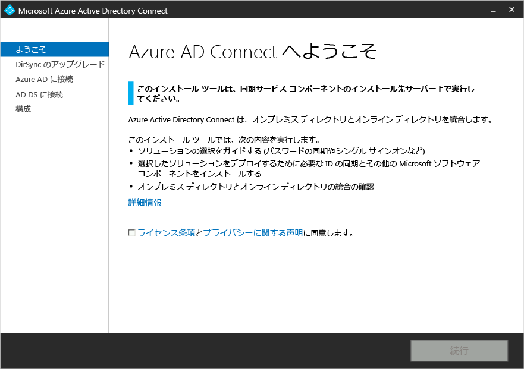
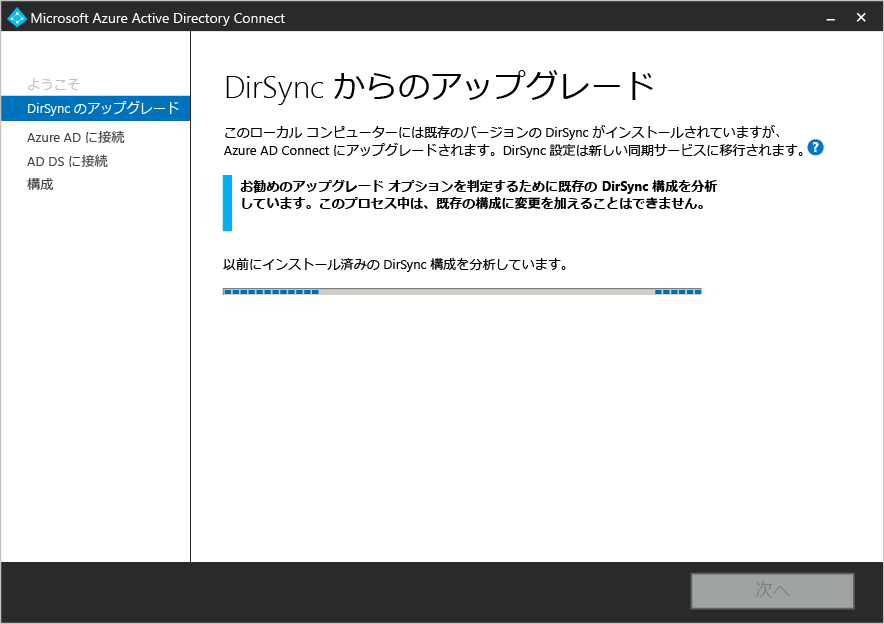
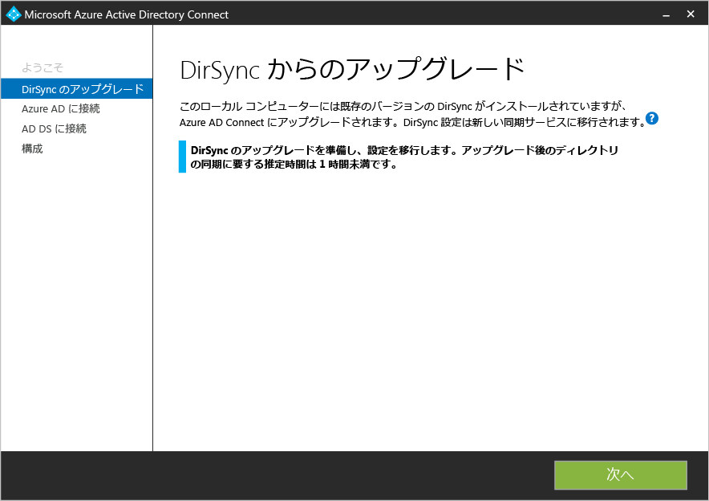
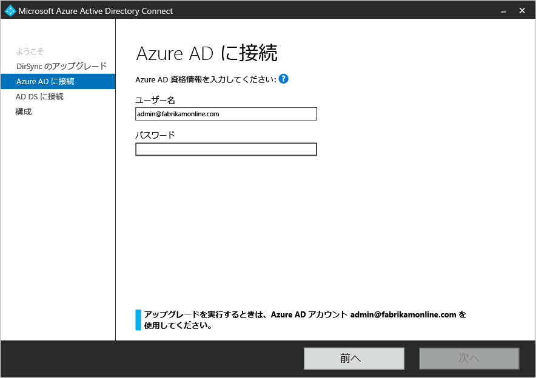
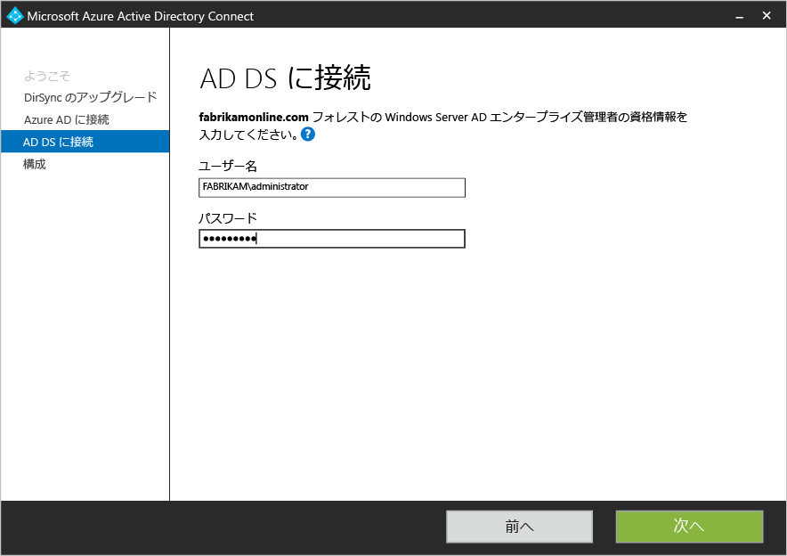
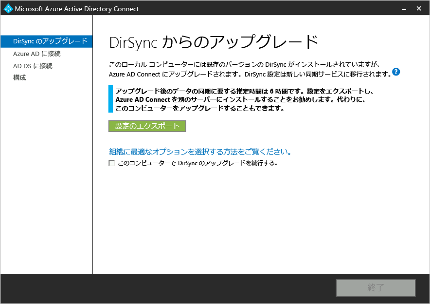
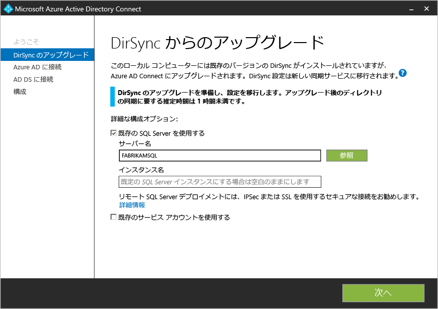
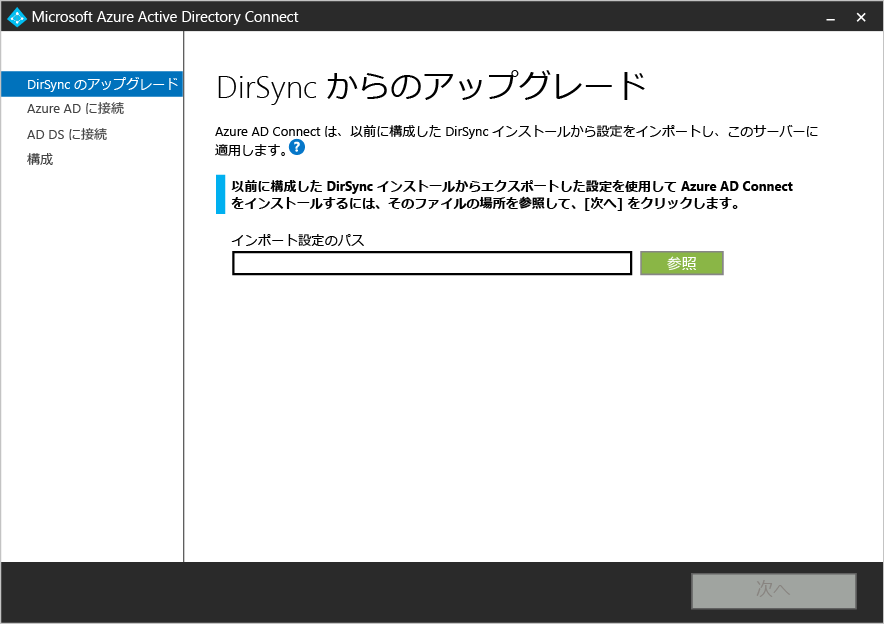
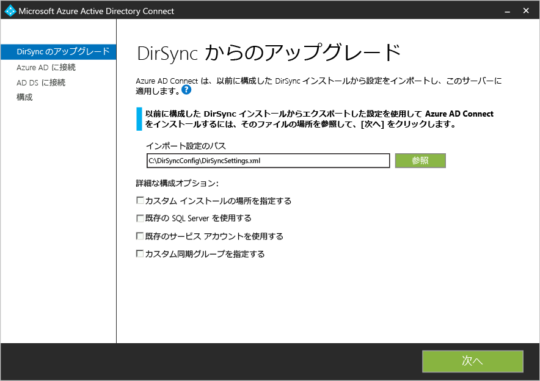
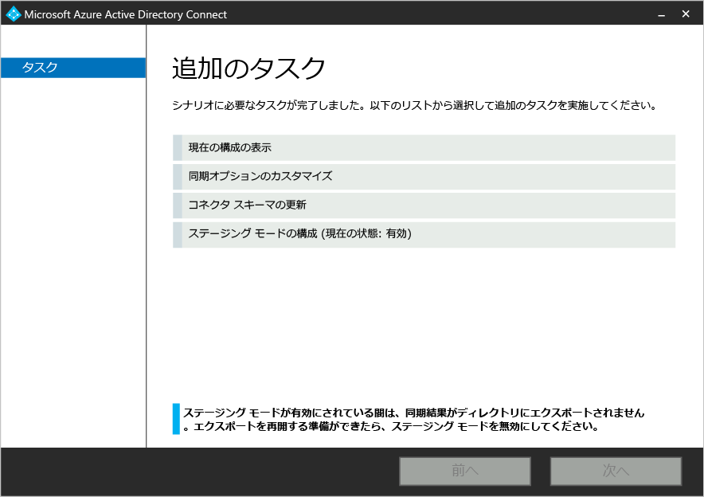

<properties 
   pageTitle="Microsoft Azure AD Connect - Windows Azure AD 同期ツール (DirSync) からのアップグレード" 
   description="DirSync から Azure AD Connect にアップグレードする方法について説明します。この記事では、Windows Azure AD 同期 ツール (DirSync) を Azure AD Connect へアップグレードするための手順について説明します。" 
   services="active-directory" 
   documentationCenter="" 
   authors="shoatman" 
   manager="terrylanfear" 
   editor="billmath"/>

<tags 
   ms.service="active-directory" 
   ms.workload="identity" 
   ms.tgt_pltfrm="na" 
   ms.devlang="na" 
   ms.topic="article" 
   ms.date="05/26/2015" 
   ms.author="shoatman"/>

# Azure Active Directory Connect に Windows Azure Active Directory 同期 (DirSync) をアップグレードします。

次のドキュメントは、既存の DirSync インストールの Azure AD Connect へのアップグレードに役立ちます。

## Azure AD Connect のダウンロード

Azure AD Connect の使用を開始するには、[Azure AD Connect のダウンロード](http://go.microsoft.com/fwlink/?LinkId=615771) のページから最新バージョンをダウンロードします。

## Azure AD Connect をインストールする前に
Azure AD Connect をインストール、および DirSync からアップグレードする前に、いくつか必要な項目があります。

- Azure AD インスタンスの既存のグローバル管理者アカウントのパスワード (どのアカウントかはインストール時に表示されます)
- ローカルの Active Directory のエンタープライズ管理者アカウント
- 省略可能: SQL Server の完全バージョンを使用するために DirSync を構成する場合 - 該当するデータベース インスタンスの情報。

### 並列展開

現在 50K 以上のオブジェクトを同期している場合、並列展開の実行オプションを選択できます。並列展開には、個別のサーバーまたはサーバーのセット (SQL Server に個別のサーバーが必要な場合) が必要です。並列展開の利点は、同期のダウンタイムを回避する機会を得られることです。Azure AD Connect のインストールでは、予期されるダウンタイムを予測しますが、過去に DirSync をアップグレードしている場合は、その経験が最善の指標となります。

## Azure AD Connect のインストール

Azure AD Connect をダウンロードし、既存の DirSync サーバーにコピーします。

1. AzureADConnect.msi を検索し、ダブルクリックします。
2. ウィザードの手順を開始します。

インプレース アップグレードでは、次の高レベルの手順を実行する必要があります。

1. Azure AD Connect へようこそ
2. 現在の DirSync 構成の分析
3. Azure AD のグローバル管理者のパスワードの収集
4. エンタープライズ管理者アカウントの資格情報の収集 (Azure AD Connect のインストール時にのみ使用)
5. AAD Connect のインストール
    * DirSync をアンインストールします。
	* AAD Connect をインストールします。
	* 必要に応じて、同期を開始します。

次の場合、追加の手順と情報が必要になります。

* 完全バージョンの SQL Server を現在使用している場合 - ローカルまたはリモート
* 同期に 50K 以上のオブジェクトがある場合

## インプレース アップグレード - 50K 未満のオブジェクト - SQL Express (チュートリアル)

0. Azure AD Connect インストーラー (MSI) を起動します。

1. ライセンス条項とプライバシーに関する声明を確認し、同意します。

2. [次へ] をクリックして、既存の DirSync インストールを分析します。

3. 分析が完了すると、続行方法の推奨事項が提示されます。このシナリオ (SQL Express を使用、50K 未満のオブジェクト) では、次の画面が表示されます。

4. Azure AD への接続に現在使用しているアカウントのパスワードを入力します。

5. Active Directory のエンタープライズ管理者アカウントを指定します。

6. 構成する準備が整いました。[次へ] をクリックすると、DirSync がアンインストールされ、Azure AD Connect が構成されて、同期が開始されます。  

## インプレース アップグレード - 50K 以上のオブジェクト
同期に 50K 以上のオブジェクトが存在する場合、手順 3 では別のメッセージが表示されます。次のような画面が表示されます。

この場合、個別のサーバーでの並列アップグレードの検討をお勧めします。これを推奨する理由は、組織の規模によっては、ローカルの Active Directory での変更がどの程度の速度で Azure AD/Office 365 に反映されるかという点で、インプレース アップグレードがビジネスのサービス レベル契約に影響を与える可能性があるためです。 Azure AD Connect を使用した最初の同期にどの程度の時間がかかるかについて推定します。前述のように、DirSync のインストールまたは DirSync へのアップグレードを実行した経験が最善の指標となります。

並列展開には、個別のサーバーまたはサーバーのセットが必要です (Azure AD Connect から SQL Server を個別のサーバーで実行する必要がある場合)。このような理由から、組織への影響を回避するようにスケジュールを設定できる場合、インプレース アップグレードを検討することは合理的なものとなります。

「このコンピューター上の DirSync のアップグレードを続行する」メッセージの横にあるチェックボックスをオンにして、インプレース アップグレードを続行します。

## インプレース アップグレード - 完全バージョンの SQL Server

DirSync のインストールにおいて、ローカルまたはリモートで完全バージョンの SQL Server を使用している場合、手順 3 では別のメッセージが表示されます。次のような画面が表示されます。

DirSync によって使用されている既存の SQL Server データベース サーバーに関する情報が表示されます。必要に応じて、適切に調整を行います。[次へ] をクリックすると、インストールが続行されます。

## 並列展開 - 50K 以上のオブジェクト

手順 3 で、50K 以上のオブジェクトがある場合、Azure AD Connect のインストールでは並列展開が推奨されます。Azure AD Connect のインプレースまたは並列展開の選択について詳しくは、上述の「インプレース アップグレード - 50K 以上のオブジェクト」を参照してください次のような画面が表示されます。

並列展開を開始する場合は、次の手順を実行する必要があります。

- [設定のエクスポート] をクリックします。個別のサーバーで Azure AD Connect をインストールすると、これらの設定がインポートされ、現在の DirSync から AAD Connect インストールへすべての設定が移行されます。

設定が正常にエクスポートされたら、DirSync サーバーで、Azure AD Connect ウィザードを終了できます。

### 個別のサーバーでの Azure AD Connect のインストール

Azure AD Connect を新しいサーバーでインストールする場合、DirSync は検出されず、Azure AD Connect のクリーン インストールを実行するものとみなされます。ここでは、いくつかの特別な手順があります。

1. Azure AD Connect インストーラー (MSI) を実行します。
2. 「Azure AD Connect へようこそ」が表示されたら、ウィンドウの右上隅で、[X] をクリックして、ウィザードを終了します。
3. コマンド プロンプトを開きます。
4. Azure AD Connect のインストール場所から (既定: C:\\Program files \\microsoft Azure Active Directory の接続)、次のコマンドを実行します。
    * AzureADConnect.exe /migrate

Azure AD Connects と、次の UI が表示されます。

5. DirSync インストールからエクスポートされた設定ファイルを選択します。
6. 次の高度なオプションを構成します。
    * Azure AD Connect のカスタム インストール場所
	* SQL Server の既存のインスタンス (既定: Azure AD Connect は、SQL Server 2012 Express をインストールします)
	* SQL Server への接続に使用するサービス アカウント (SQL Server データベースがリモートの場合、このアカウントはドメイン サービス アカウントにする必要があります)

次の UI でこれらのオプションを参照してください。

7. [次へ] をクリックします。 
8. [構成の準備完了] ページで [構成が完了したらすぐに同期プロセスを開始する] チェック ボックスをオンのままにします。[AZURE.NOTE]Windows Server Active Directory と Azure Active Directory の間で同期が開始されますが、変更は Azure AD にエクスポートされません。一度にアクティブにし変更をエクスポートできる同期ツールは 1 つだけです。
9. [インストール] をクリックします。

[AZURE.NOTE][同期の開始] チェックボックスをオフにして、DirSync (現時点ではインストールされており、実行されています) と Azure AD Connect が同時に AAD への書き込みを試行しないようにします。

### Azure AD Connect が同期の開始準備を完了していることを確認します。

Azure AD Connect が DirSync からの引き継ぎの準備を完了しているかどうかを確認するためには、Azure AD Connect Synchronization Service Manager を開きます。Windows の [スタート] メニューで「Synchronization」と入力して検索すると、このアプリケーションが表示されます。

アプリケーション内で、[操作] タブを表示します。このタブでは、次の操作が完了していることを確認します。

- AD Management Agent でのインポート
- Azure AD Management Agent でのインポート
- AD Management Agent での完全な同期
- Azure AD Management Agent での完全な同期

これらの 4 つの操作が完了すると、DirSync をアンインストールして Azure AD Connect の同期を有効にする準備が整います。

### DirSync (古いサーバー) のアンインストール

- [プログラムの追加と削除] 内で「Windows Azure Active Directory 同期ツール」を検索します。
- 「Windows Azure Active Directory 同期ツール」をアンインストールします。

### Azure AD Connect (新しいサーバー) を開く
インストール後に、Azure AD Connect をもう一度開くと、構成エクスペリエンスが提供されます。Azure AD Connect を開きます。

次のように表示されます。

* [ステージング モードの構成] の選択
    * エクスポートされた設定を使用して DirSync からアップグレードすると、Azure AD Connect はステージング モードになります。ステージング モードでは基本的に Azure AD Connect 内で同期が実行されますが、Azure AD または AD へ変更がエクスポートされません。
* [Enabled staging mode] チェックボックスをオフにして、ステージングを停止します。

* [インストール] ボタンをクリックします。

並列展開を使用した Azure AD Connect への移行が正常に完了しました。

## Azure AD Connect でサポートされるコンポーネント

次は、前提条件と Azure AD Connect をセットアップしたサーバーでインストールするサポートされたコンポーネントの一覧です。この一覧は、基本的な高速インストール用です。[同期サービスのインストール］ ページで異なる SQL Server の使用を選択した場合は、次に示す SQL Server 2012 のコンポーネントはインストールされません。

- Forefront Identity Manager の Azure Active Directory コネクタ
- Microsoft SQL Server 2012 のコマンド ライン ユーティリティ
- Microsoft SQL Server 2012 Native Client
- Microsoft SQL Server 2012 Express LocalDB
- Windows PowerShell 用の Azure Active Directory モジュール
- IT プロフェッショナル向け Microsoft Online Services サインイン アシスタント
- Microsoft Visual C++ 2013 再配布パッケージ

**その他のリソース**

* [クラウド内のオンプレミスの ID インフラストラクチャの使用](active-directory-aadconnect.md)
* [Azure AD Connect の動作](active-directory-aadconnect-how-it-works.md)
* [Azure AD Connect の次のトピック](active-directory-aadconnect-whats-next.md)
* [詳細情報](active-directory-aadconnect-learn-more.md)
* [MSDN の Azure AD Connect](https://msdn.microsoft.com/library/azure/dn832695.aspx)
 

<!---HONumber=July15_HO3-->