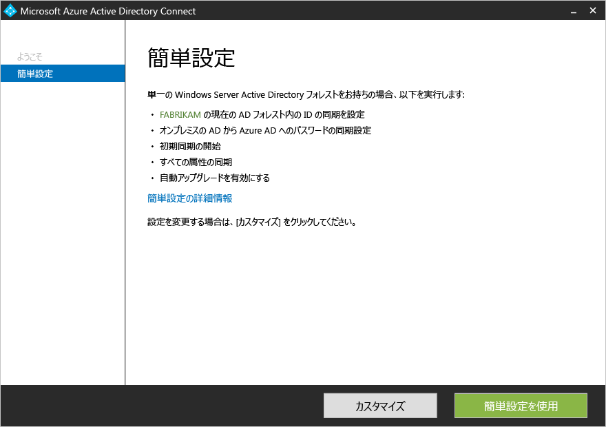
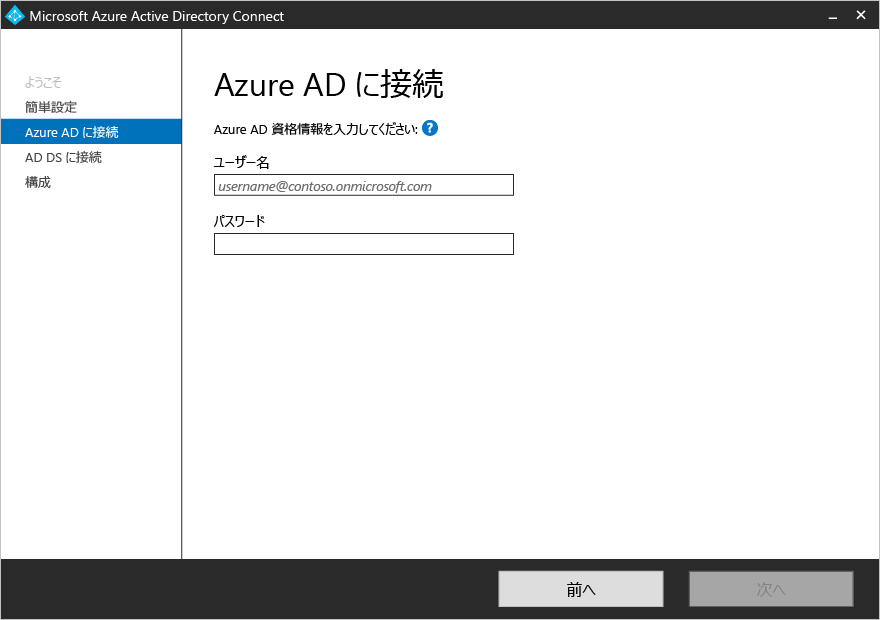
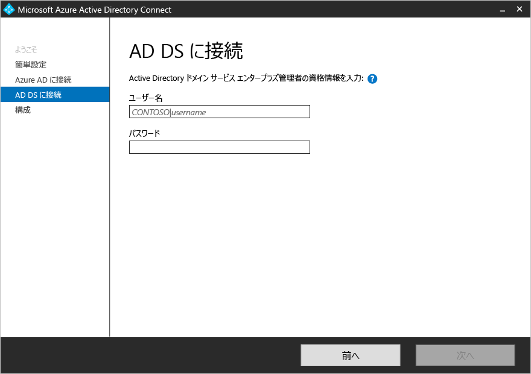
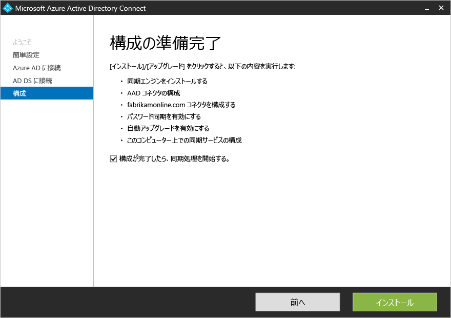

<properties
	pageTitle="Azure AD Connect: 簡単設定を使用した開始 | Microsoft Azure"
	description="Azure AD Connect のセットアップ ウィザードをダウンロード、インストール、および実行する方法について説明します。"
	services="active-directory"
	documentationCenter=""
	authors="billmath"
	manager="stevenpo"
	editor="curtand"/>

<tags
	ms.service="active-directory"
	ms.workload="identity"
	ms.tgt_pltfrm="na"
	ms.devlang="na"
	ms.topic="get-started-article"
	ms.date="04/25/2016"
	ms.author="billmath;andkjell"/>

# 簡単設定を使用した Azure AD Connect の開始
このトピックでは、Azure Active Directory Connect を導入するにあたって最初に必要になる事柄について取り上げています。このドキュメントでは、Azure AD Connect の高速インストールの使用について説明します。シングル フォレスト トポロジとパスワード同期を組み合わせた環境では簡単設定を使用します。数回クリックするだけで、オンプレミスのディレクトリをクラウドに拡張できます。

## 関連ドキュメント
[オンプレミス ID と Azure Active Directory の統合](active-directory-aadconnect.md)に関するドキュメントをまだお読みでない方のために、次の表に関連トピックへのリンクを示します。インストールを開始する前に、太字で表示した最初の 2 つのトピックをお読みいただく必要があります。

| トピック | |
| --------- | --------- |
| **Azure AD Connect のダウンロード** | [Azure AD Connect のダウンロード](http://go.microsoft.com/fwlink/?LinkId=615771) |
| **ハードウェアと前提条件** | [Azure AD Connect: ハードウェアと前提条件](active-directory-aadconnect-prerequisites.md) |
| カスタマイズした設定を使用したインストール | [Azure AD Connect のカスタム インストール](active-directory-aadconnect-get-started-custom.md) |
| DirSync からのアップグレード | [Azure AD 同期ツール (DirSync) からのアップグレード](active-directory-aadconnect-dirsync-upgrade-get-started.md) |
| インストール後 | [インストールの確認とライセンスの割り当て](active-directory-aadconnect-whats-next.md) |
| インストールで使用するアカウント | [Azure AD Connect アカウントとアクセス許可の詳細](active-directory-aadconnect-accounts-permissions.md) |

## Azure AD Connect の高速インストール
**[簡単設定]** は既定のオプションであり、ごく一般的なデプロイ シナリオで使用されます。簡単設定を使用した場合、シングル フォレスト トポロジを想定した同期が Azure AD Connect によってデプロイされます。[パスワード同期](active-directory-aadconnectsync-implement-password-synchronization.md)が有効になるため、ユーザーはそれぞれオンプレミスのパスワードを使用してクラウドにサインインすることができます。また、[自動アップグレード](active-directory-aadconnect-feature-automatic-upgrade.md)が有効になるため、メンテナンスがしやすくなります。簡単設定を使用した場合、インストールが完了すると、自動的に同期が開始されます (ただし、開始されないようにすることもできます)。

### 簡単設定を使用して Azure AD Connect をインストールするには

1. Azure AD Connect をインストールするサーバーにローカル管理者としてサインインします。この作業は、同期サーバーとなるサーバーに対して行う必要があります。
2. **AzureADConnect.msi** を検索し、ダブルクリックします。
3. [ようこそ] 画面で、ライセンス条項に同意するチェック ボックスをオンにし、**[続行]** をクリックします。
4. [簡単設定] 画面で、**[簡単設定を使う]** をクリックします。
5. [Azure AD に接続] 画面で、Azure AD のグローバル管理者のユーザー名とパスワードを入力します。**[次へ]** をクリックします。 接続の問題によってエラーが発生する場合は、「[Azure AD Connect での接続に関する問題のトラブルシューティング](active-directory-aadconnect-troubleshoot-connectivity.md)」を参照してください。
6. [AD DS に接続] 画面で、エンタープライズ管理者アカウントのユーザー名とパスワードを入力します。ドメインの部分は NetBios または FQDN の形式で入力できます (FABRIKAM\\administrator または fabrikam.com\\administrator)。**[次へ]** をクリックします。
7. [構成の準備完了] 画面で、**[インストール]** をクリックします。
	- 必要に応じて、[構成の準備完了] 画面の **[Start the synchronization process as soon as configuration completes]** (構成が完了したらすぐに同期プロセスを開始する) チェック ボックスをオフにします。続けて[フィルター処理](active-directory-aadconnectsync-configure-filtering.md)などの構成作業を行う場合は、このチェック ボックスをオフにする必要があります。このオプションをオフにした場合、同期の構成は実行されますが、スケジューラは無効のままとなります。スケジューラを実行するには、もう一度インストール ウィザードを実行して手動で有効にする必要があります。
	- また、必要に応じて、**[Exchange ハイブリッド展開]** チェック ボックスをオンにすると、その同期サービスを構成することも選択できます。クラウドとオンプレミスの両方に Exchange メールボックスを同時に配置する場合は、このオプションを有効にしてください。 
8. インストールが完了したら、**[終了]** をクリックします。
9. インストールが完了した後、 Synchronization Service Manager または同期規則エディターを使用する前に、サインアウトし、もう一度サインインします。

高速インストールの使用方法については、以下のビデオをご覧ください。

>[AZURE.VIDEO azure-active-directory-connect-express-settings]

## 次のステップ
Azure AD Connect がインストールされたので、[インストールを確認し、ライセンスを割り当てる](active-directory-aadconnect-whats-next.md)ことができます。

「[オンプレミス ID と Azure Active Directory の統合](active-directory-aadconnect.md)」をご覧ください。

<!---HONumber=AcomDC_0427_2016-->