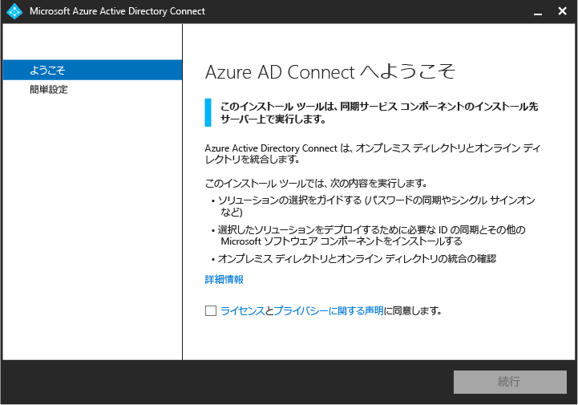
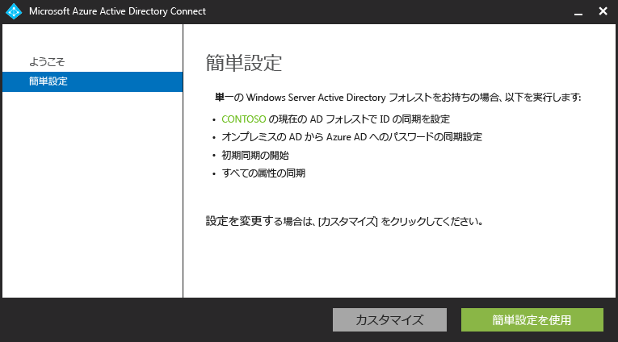
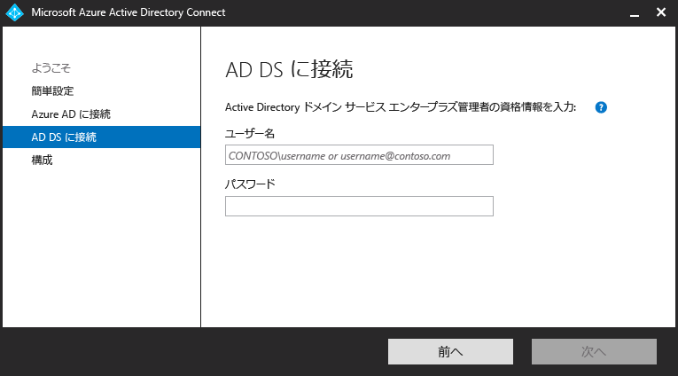
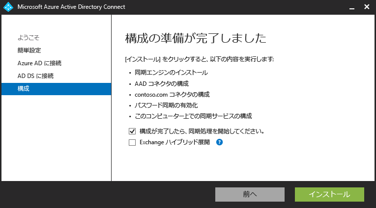
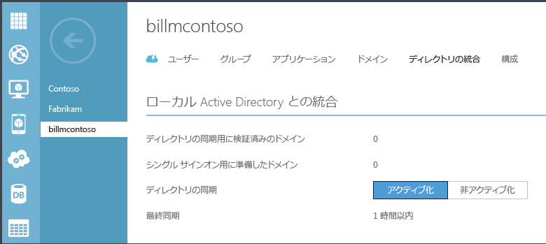

<properties 
	pageTitle="Azure AD Connect の使用"
	description="Azure AD Connect のセットアップ ウィザードをダウンロード、インストール、および実行する方法について説明します。"
	services="active-directory"
	documentationCenter=""
	authors="billmath"
	manager="stevenpo"
	editor="curtand"/>

<tags 
	ms.service="active-directory"
	ms.workload="identity"
	ms.tgt_pltfrm="na"
	ms.devlang="na"
	ms.topic="article"
	ms.date="08/24/2015"
	ms.author="billmath"/>

# Azure AD Connect の使用

次のドキュメントは、Azure Active Directory Connect の使用を開始する際に役立ちます。このドキュメントでは、Azure AD Connect の高速インストールの使用について説明します。カスタム インストールについては、[Azure AD Connect のカスタム インストール](active-directory-aadconnect-get-started-custom.md)に関するページを参照してください。DirSync から Azure AD Connect へのアップグレードについては、[DirSync から Azure Active Directory Connect へのアップグレード](active-directory-aadconnect-dirsync-upgrade-get-started.md)に関するページを参照してください。

## Azure AD Connect のダウンロード

Azure AD Connect の使用を開始するには、[Azure AD Connect のダウンロード](http://go.microsoft.com/fwlink/?LinkID=615771) のページから最新バージョンをダウンロードします。

## Azure AD Connect をインストールする前に
簡単設定を使用して Azure AD Connect をインストールする前に、必要なものがいくつかあります。

 
- Azure サブスクリプションまたは [Azure 試用版サブスクリプション](http://azure.microsoft.com/pricing/free-trial/): Azure ポータルにアクセスする場合にのみ必要です。Azure AD Connect の使用には必要ありません。PowerShell または Office 365 を使用している場合は、Azure サブスクリプションがなくても Azure AD Connect を使用できます。
- 統合する Azure AD テナントの Azure AD 全体管理者アカウント
- Windows Server 2008 以降を使用している AD ドメイン コントローラーまたはメンバー サーバー
- ローカルの Active Directory のエンタープライズ管理者アカウント
- 省略可能: 同期を検証するテスト ユーザー アカウント。 

### Azure AD Connect のハードウェア要件
次の表は、Azure AD Connect コンピューターの最小要件を示しています。

| Active Directory 内のオブジェクトの数 | CPU | メモリ | ハード ドライブのサイズ |
| ------------------------------------- | --- | ------ | --------------- |
| 10,000 未満 | 1\.6 GHz | 4 GB | 70 GB |
| 10,000 ～ 50,000 | 1\.6 GHz | 4 GB | 70 GB |
| 50,000 ～ 100,000 | 1\.6 GHz | 16 GB | 100 GB |
| オブジェクトが 100,000 個以上の場合は完全バージョンの SQL Server が必要| | | |
| 100,000 ～ 300,000 | 1\.6 GHz | 32 GB | 300 GB |
| 300,000 ～ 600,000 | 1\.6 GHz | 32 GB | 450 GB |
| 600,000 を超過 | 1\.6 GHz | 32 GB | 500 GB |

複数のフォレストやフェデレーション サインオンなどのカスタム オプションについては、[こちら](active-directory-aadconnect-get-started-custom.md)で追加要件を参照してください。

## Azure AD Connect の高速インストール
[簡単設定] の選択は、既定のオプションであり、最も一般的なシナリオの 1 つです。このとき、Azure AD Connect により、パスワード ハッシュ同期オプションと共に同期をデプロイします。これは、単一のフォレスト用のみであり、ユーザーはオンプレミスのパスワードを使用して、クラウドにサインインできます。簡単設定を使用した場合、インストールが完了すると、自動的に同期が開始されます (ただし、開始されないようにすることもできます)。このオプションでは、数回クリックするだけで、オンプレミスのディレクトリをクラウドに拡張できます。

### 簡単設定を使用して Azure AD Connect をインストールするには
--------------------------------------------------------------------------------------------

1. Azure AD Connect をインストールするサーバーにエンタープライズ管理者としてログインします。これには、同期サーバーにするサーバーを使用します。
2. AzureADConnect.msi を検索し、ダブルクリックします。
3. [ようこそ] 画面で、ライセンス条項に同意するチェック ボックスをオンにし、**[続行]** をクリックします。
4. [簡単設定] 画面で、**[簡単設定を使う]** をクリックします。

6. [Azure AD に接続] 画面で、Azure AD の Azure グローバル管理者のユーザー名とパスワードを入力します。**[次へ]** をクリックします。
8. [AD DS に接続] 画面で、エンタープライズ管理者アカウントのユーザー名とパスワードを入力します。**[次へ]** をクリックします。

9. [構成の準備完了] 画面で、**[インストール]** をクリックします。
	- 必要に応じて、[構成の準備完了] 画面の **[構成が完了したらすぐに同期プロセスを開始する]** チェック ボックスをオフにします。このチェック ボックスをオフにすると、ウィザードでは、同期が構成されますが、タスクは無効のままになります。そのため、タスクは、タスク スケジューラで手動で有効にするまで実行されません。タスクを有効にすると、同期は 3 時間ごとに実行されます。
	- また、必要に応じて、**[Exchange ハイブリッド展開]** チェック ボックスをオンにすると、その同期サービスを構成することも選択できます。Exchange メールボックスをクラウドにもオンプレミスにも配置する予定がない場合は、このチェック ボックスをオンにする必要はありません。

8. インストールが完了したら、**[終了]** をクリックします。

   

高速インストールの使用方法に関するビデオについては、以下を確認してください。

[AZURE.VIDEO azure-active-directory-connect-express-settings]

## インストールを検証する

Azure AD Connect を正常にインストールした後は、Azure ポータルにサインインして最後の同期時刻を確認すると、同期が実行されていることを確認できます。

1.  Azure ポータルにサインインします。
2.  左側で、[Active Directory] を選択します。
3.  Azure AD Connect のセットアップに使用したディレクトリをダブルクリックします。
4.  上部にある [ディレクトリ統合] を選択します。最後の同期時刻に注目します。

## 次に必要な作業
Azure AD Connect がインストールされたので、[こちら](active-directory-aadconnect-whats-next.md)のリンクを使用して、ユーザーへの Azure AD Premium または Enterprise Mobility のライセンスの割り当てやその他のオプションの構成などのインストール後のタスクに着手できます。

**その他のリソース**

[ディレクトリ統合ツールの比較](active-directory-aadconnect-get-started-tools-comparison.md)

 

<!---HONumber=August15_HO9-->