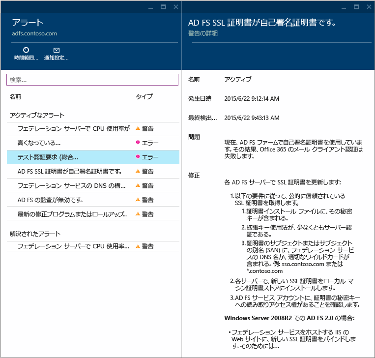
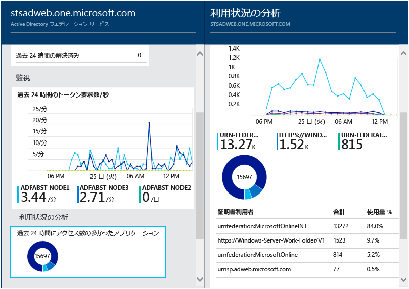
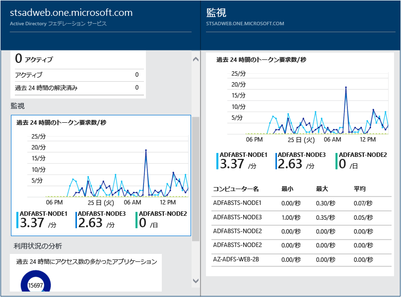

<properties
	pageTitle="AD FS での Azure AD Connect Health の使用 | Microsoft Azure"
	description="オンプレミスの AD FS インフラストラクチャを監視する方法を説明する Azure AD Connect Health のページです。"
	services="active-directory"
	documentationCenter=""
	authors="billmath"
	manager="stevenpo"
	editor="curtand"/>

<tags
	ms.service="active-directory"
	ms.workload="identity"
	ms.tgt_pltfrm="na"
	ms.devlang="na"
	ms.topic="get-started-article"
	ms.date="02/17/2016"
	ms.author="billmath"/>

# AD FS での Azure AD Connect Health の使用
次のドキュメントは、Azure AD Connect Health を使用した AD FS インフラストラクチャの監視に固有のドキュメントです。

## AD FS のアラート
Azure AD Connect Health アラート セクションには、アクティブなアラートの一覧が表示されます。各アラートには、関連情報、解決の手順、関連ドキュメントのリンクが含まれます。アクティブまたは解決済みのアラートを選択すると、新しいブレードが開き、アラートの解決に利用できる手順やその他のドキュメントへのリンクなどの追加情報が表示されます。過去に解決されたアラートの履歴データも表示できます。

アラートを選択すると、アラートの解決に利用できる手順やその他のドキュメントへのリンクなどの追加情報が表示されます。

## AD FS の利用状況分析
Azure AD Connect Health 利用状況分析では、フェデレーション サーバーの認証トラフィックを分析できます。[利用状況分析] ボックスを選択すると、[利用状況分析] ブレードが開き、メトリックとグループ分けが表示されます。

>[AZURE.NOTE] AD FS で利用状況分析を使用するためには、AD FS 監査が有効になっている必要があります。詳細については、「[AD FS の監査の有効化](active-directory-aadconnect-health-operations.md#enable-auditing-for-ad-fs)」を参照してください。

追加のメトリックを選択するには、時間範囲を指定します。グループ分けを変更するには、利用状況の分析グラフを右クリックし、[グラフの編集] を選択します。次に時間範囲を指定し、メトリックを変更または選択して、グループ分けを変更します。さまざまな "メトリック" に基づいて認証トラフィックの分布を確認し、次に示す "グループ化" という関連パラメーターを使用して各メトリックをグループ化できます。

| メトリック | グループ化 | グループ化の意味と役立つ理由 |
| ------ | -------- | -------------------------------------------- |
| 合計要求数: フェデレーション サービスによって処理された要求の合計数 | すべて | グループ化されていない要求の合計数が表示されます。 |
| | アプリケーション | このオプションは、対象となる証明書利用者に基づいて、要求の合計をグループ化します。このグループ化は、どのアプリケーションがトラフィック全体のどの程度の割合を受信しているかを把握するのに役立ちます。 |
| | サーバー | このオプションは、要求を処理したサーバーに基づいて、要求の合計をグループ化します。このグループ化は、トラフィック全体の負荷分散を把握するのに役立ちます。 |
| | 社内参加 | このオプションは、社内参加している (既知の) デバイスから要求が行われたかどうかに基づいて、要求の合計をグループ化します。このグループ化は、ID インフラストラクチャに対して未知のデバイスを使用してリソースがアクセスされているかどうかを把握するのに役立ちます。 |
| | 認証方法 | このオプションは、認証に使用された認証方法に基づいて、要求の合計をグループ化します。このグループ化は、認証に使用される共通の認証方法を把握するのに役立ちます。考えられる認証方法を以下に示します。<ol> <li>Windows 統合認証 (Windows)</li> <li>フォーム ベース認証 (フォーム)</li> <li>SSO (シングル サインオン)</li> <li>X509 証明書認証 (証明書)</li>  フェデレーション サーバーで SSO の Cookie を含む要求を受信する場合、要求が SSO (シングル サインオン) としてカウントされることに注意してください。このような場合、Cookie が有効であれば、ユーザーは資格情報の提供を要求されずに、シームレスにアプリケーションにアクセスできます。これは、フェデレーション サーバーによって保護される証明書利用者が複数ある場合でも共通です。 |
| | ネットワークの場所 | このオプションは、ユーザーのネットワークの場所に基づいて、要求の合計をグループ化します。イントラネットまたはエクストラネットを指定できます。このグループ化は、イントラネットからのトラフィックとエクストラネットからのトラフィックの割合を把握するのに役立ちます。 |
| 失敗した要求の合計数: フェデレーション サービスによって処理され、失敗した要求の合計数。  (このメトリックは、Windows Server 2012 R2 の AD FS でのみ使用できます)| エラーの種類 | あらかじめ定義されたエラーの種類に基づいて、エラーの数を表示します。このグループ化は、一般的なエラーの種類を把握するのに役立ちます。<ul><li>"ユーザー名またはパスワードが正しくない": 正しくないユーザー名またはパスワードによるエラー。</li> <li>"エクストラネット ロックアウト": エクストラネットからロックアウトされたユーザーから受信した要求によるエラー。</li><li> "パスワードの有効期限が切れている": ユーザーが期限切れのパスワードを使用してログインしたことによるエラー。</li><li>"無効なアカウント": ユーザーが無効なアカウントを使用してログインしたことによるエラー。</li><li>"デバイス認証": ユーザーがデバイス認証を使用した認証に失敗したことによるエラー。</li><li>"ユーザー証明書の認証": ユーザーが無効な証明書が原因で認証に失敗したことによるエラー。</li><li>"MFA": ユーザーが Multi-Factor Authentication を使用した認証に失敗したことによるエラー。</li><li>"その他の資格情報": "発行承認": 承認の失敗によるエラー。</li><li>"発行委任": 発行委任エラーによるエラー。</li><li>"トークンの承認": サード パーティの ID プロバイダーからのトークンを ADFS が拒否したことによるエラー。</li><li>"プロトコル": プロトコル エラーによるエラー。</li><li>"不明": あらゆるものに対応します。定義済みのカテゴリに分類されない、その他すべてのエラー。</li> |
| | サーバー | サーバーに基づいて、エラーをグループ化します。サーバー間でのエラー分布を把握するのに役立ちます。分布が均等でない場合は、サーバーが障害のある状態であることを示す可能性があります。 |
| | ネットワークの場所 | 要求のネットワークの場所 (イントラネットまたはエクストラネット) に基づいて、エラーをグループ化します。エラーになる要求の種類を把握するのに役立ちます。 |
| | アプリケーション | ターゲット アプリケーション (証明書利用者) に基づいて、エラーをグループ化します。エラーの数が最も多いターゲット アプリケーションを把握するのに役立ちます。 |
| ユーザー数: システムでアクティブな一意のユーザー数の平均 | すべて | 選択したタイム スライスにフェデレーション サービスを使用するユーザー数の平均を示します。ユーザーはグループ化されません。 平均は、選択したタイム スライスによって異なります。 |
| | アプリケーション | ターゲット アプリケーション (証明書利用者) に基づいて、ユーザー数の平均をグループ化します。これは、どのアプリケーションを何人のユーザーが使用しているかを把握するのに役立ちます。 |

## AD FS のパフォーマンスの監視
Azure AD Connect Health のパフォーマンスの監視は、メトリックに関する監視情報を提供します。[監視] ボックスを選択すると、ブレードが開き、メトリックに関する詳細情報が表示されます。

ブレードの上部にある [フィルター] を選択すると、サーバーごとにフィルター処理して個々のサーバーのメトリックを表示することができます。メトリックを変更するには、監視ブレードの監視グラフを右クリックし、[グラフの編集] を選択します。次に、開いた新しいブレードのドロップダウンから追加のメトリックを選択し、パフォーマンス データを表示する時間範囲を指定します。

## 関連リンク

* [Azure AD Connect Health](active-directory-aadconnect-health.md)
* [Azure AD Connect Health エージェントのインストール](active-directory-aadconnect-health-agent-install.md)
* [Azure AD Connect Health の操作](active-directory-aadconnect-health-operations.md)
* [Azure AD Connect Health for Sync の使用](active-directory-aadconnect-health-sync.md)
* [Azure AD Connect Health の FAQ](active-directory-aadconnect-health-faq.md)
* [Azure AD Connect Health のバージョンの履歴](active-directory-aadconnect-health-version-history.md)

<!---HONumber=AcomDC_0224_2016-->