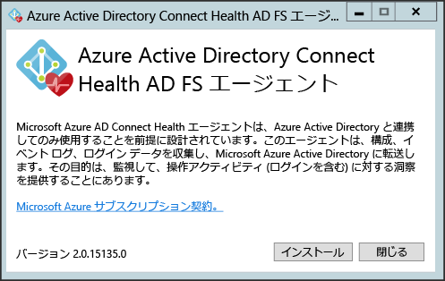
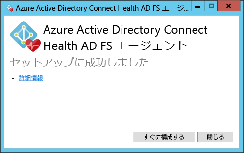
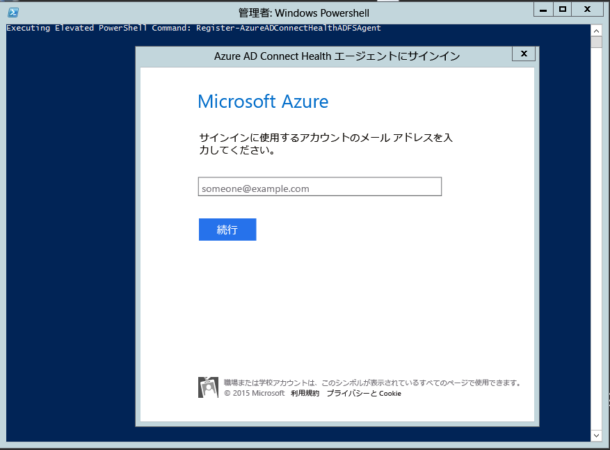
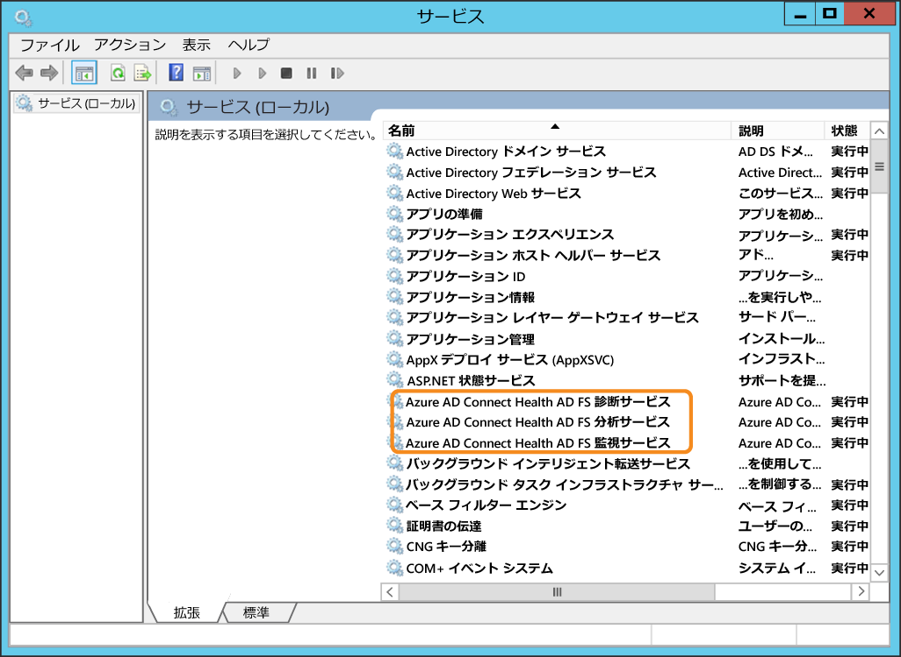
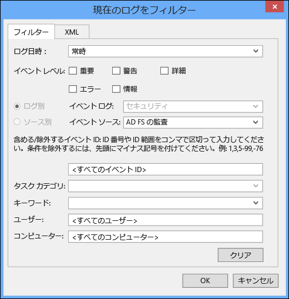
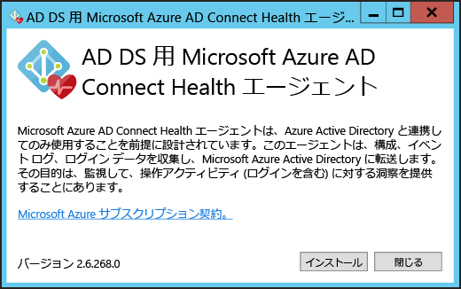
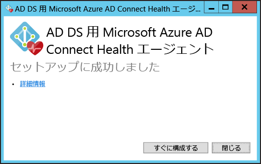
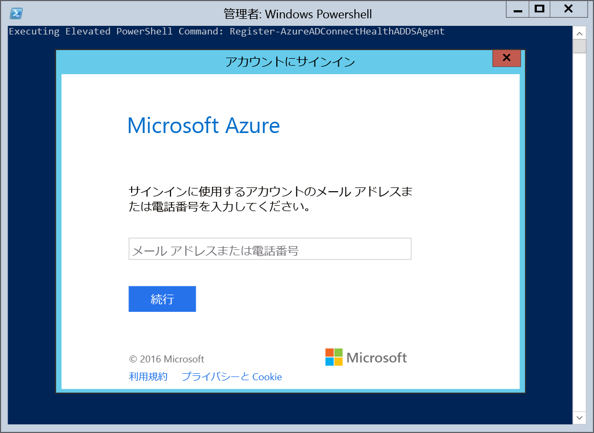

<properties
	pageTitle="Azure AD Connect Health エージェントのインストール | Microsoft Azure"
	description="このページでは、Azure AD Connect Health for AD FS と for Sync のエージェントのインストールについて説明します。"
	services="active-directory"
	documentationCenter=""
	authors="karavar"
	manager="femila"
	editor="karavar"/>

<tags
	ms.service="active-directory"
	ms.workload="identity"
	ms.tgt_pltfrm="na"
	ms.devlang="na"
	ms.topic="get-started-article"
	ms.date="08/05/2016"
	ms.author="vakarand"/>

# Azure AD Connect Health エージェントのインストール

このドキュメントでは、Azure AD Connect Health エージェントをインストールして構成する手順を紹介します。エージェントは[こちら](active-directory-aadconnect-health.md#download-and-install-azure-ad-connect-health-agent)からダウンロードできます。

## 	必要条件
次の表に、Azure AD Connect Health を使用するための要件の一覧を示します。

| 要件 | Description|
| ----------- | ---------- |
|Azure AD Premium| Azure AD Connect Health は Azure AD Premium の機能です。使用するためには Azure AD Premium が必要となります。  詳細については、「[Azure Active Directory Premium の概要](active-directory-get-started-premium.md)」を参照してください。 30 日間の無料試用版を開始するには、「[Azure Active Directory Premium が 1 か月間無料](https://azure.microsoft.com/trial/get-started-active-directory/)」を参照してください。|
|Azure AD Connect Health の使用を開始するには、Azure AD のグローバル管理者であること|既定では、Azure AD Connect Health の使用を開始してポータルにアクセスし、操作を実行するために Health エージェントのインストールと構成を行うことができるのは、グローバル管理者のみです。詳細については、[Azure AD ディレクトリの管理](active-directory-administer.md)に関するページを参照してください。   ロールベースのアクセス制御を使用して、Azure AD Connect Health へのアクセスを組織の他のユーザーに許可できます。詳細については、[Azure AD Connect Health のロール ベースのアクセス制御](active-directory-aadconnect-health-operations.md#manage-access-with-role-based-access-control)に関するページを参照してください。   **重要:** エージェントのインストール時に使用するアカウントは、職場または学校アカウントである必要があります。Microsoft アカウントを使用することはできません。詳細については、「[Azure への組織としてのサインアップ](sign-up-organization.md)」を参照してください。
|Azure AD Connect Health エージェントが対象となる個々のサーバーにインストールされていること| ポータルに表示されるデータを Azure AD Connect Health から得るためには、対象となるサーバーにエージェントがインストールされている必要があります。  たとえば、AD FS オンプレミス インフラストラクチャに関するデータを入手するためには、AD FS サーバー、AD FS プロキシ サーバー、Web アプリケーション プロキシ サーバーがインストールされている必要があります。同様に、オンプレミス AD DS インフラストラクチャに関するデータを入手するためには、ドメイン コントローラーにエージェントがインストールされている必要があります。  **重要:** エージェントのインストール時に使用するアカウントは、職場または学校アカウントである必要があります。Microsoft アカウントを使用することはできません。詳細については、「[Azure への組織としてのサインアップ](sign-up-organization.md)」を参照してください。|
|Azure サービスのエンドポイントに対する送信接続|エージェントをインストールしたり実行したりするためには、以下に示した、Azure AD Connect Health サービスのエンド ポイントへの接続が必要となります。送信接続をブロックしている場合は、以下の項目を許可リストに追加してください。  <li>&#42;.blob.core.windows.net </li><li>&#42;.queue.core.windows.net</li><li>adhsprodwus.servicebus.windows.net - ポート: 5671 </li><li>https://management.azure.com </li><li>https://s1.adhybridhealth.azure.com/</li><li>https://policykeyservice.dc.ad.msft.net/</li><li>https://login.windows.net</li><li>https://login.microsoftonline.com</li><li>https://secure.aadcdn.microsoftonline-p.com</li> |
|エージェントを実行するサーバー上のファイアウォール ポート| エージェントが Azure AD Health サービス エンドポイントと通信するには、次のファイアウォール ポートが開いている必要があります。  <li>TCP/UDP ポート 443</li><li>TCP/UDP ポート 5671</li>
|IE セキュリティ強化が有効になっている場合は以下の Web サイトが許可されていること|エージェントのインストール対象となるサーバーで IE セキュリティ強化が有効になっている場合、次の Web サイトを許可する必要があります。  <li>https://login.microsoftonline.com</li><li>https://secure.aadcdn.microsoftonline-p.com</li><li>https://login.windows.net</li><li>Azure Active Directory によって信頼されている組織のフェデレーション サーバー(例: https://sts.contoso.com</li>)。

## Azure AD Connect Health エージェント for AD FS のインストール
エージェントのインストールを開始するには、ダウンロードした .exe ファイルをダブルクリックします。最初の画面で [インストール] をクリックします。

インストールが完了したら、[すぐに構成する] をクリックします。

コマンド プロンプトが起動され、続けて PowerShell の Register-AzureADConnectHealthADFSAgent が実行されます。Azure へのサインインを要求されます。要求に従ってサインインしてください。

サインイン後も、PowerShell は続行されます。完了したら PowerShell を閉じます。これで構成は完了です。

この時点でサービスが自動的に開始され、エージェントによる監視とデータの収集が実行されます。前のセクションで挙げた前提条件が満たされていない場合、PowerShell ウィンドウに警告が表示されます。[こちら](active-directory-aadconnect-health-agent-install.md#requirements)に記した要件が満たされていることを必ず確認したうえでエージェントをインストールしてください。次のスクリーンショットはこれらのエラーの例です。

エージェントがインストール済みであることを確認するには、[サービス] を開いて次のサービスを探します。エージェントの構成が完了していれば、これらのサービスが実行されています。構成が完了するまでは開始されません。

- Azure AD Connect Health AD FS Diagnostics Service
- Azure AD Connect Health AD FS Insights Service
- Azure AD Connect Health AD FS Monitoring Service

### Windows Server 2008 R2 サーバーへのエージェントのインストール

Windows Server 2008 R2 サーバーの場合、次の手順に従います。

1. Service Pack 1 以降がサーバーで実行されていることを確認します。
1. エージェントをインストールするために、[IE セキュリティ強化の構成] をオフにします。
1. AD Health エージェントをインストールする前に、それぞれのサーバーに Windows PowerShell 4.0 をインストールします。Windows PowerShell 4.0 をインストールするには:
 - 次のリンクを使用してオフライン インストーラーをダウンロードし、[Microsoft .NET Framework 4.5](https://www.microsoft.com/download/details.aspx?id=40779) をインストールします。
 - ([Windows の機能] から) PowerShell ISE をインストールします。
 - [Windows Management Framework 4.0](https://www.microsoft.com/download/details.aspx?id=40855) をインストールします。
 - Internet Explorer Version 10 以降をサーバーにインストールします。ヘルス サービスが、ユーザーの Azure Admin 資格情報を使用してユーザーを認証するために必須となります。
1. Windows Server 2008 R2 への Windows PowerShell 4.0 のインストールについて、さらに詳しい情報については、[こちら](http://social.technet.microsoft.com/wiki/contents/articles/20623.step-by-step-upgrading-the-powershell-version-4-on-2008-r2.aspx)の wiki 記事を参照してください。

### AD FS の監査の有効化

利用状況分析機能でデータを収集し、分析するには、AD FS 監査ログ内の情報に Azure AD Connect Health エージェントからアクセスできることが必要です。既定では、これらのログが有効になっていません。この要件が該当するのは AD FS フェデレーション サーバーのみです。AD FS プロキシ サーバーや Web アプリケーション プロキシ サーバーで監査を有効にする必要はありません。AD FS の監査を有効にしたり、AD FS の監査ログを特定したりするには、以下の手順に従ってください。

#### AD FS 2.0 の監査を有効にするには

1. **[スタート]** ボタンをクリックし、**[プログラム]**、**[管理ツール]** の順にポイントして、**[ローカル セキュリティ ポリシー]** をクリックします。
2. **"セキュリティの設定\\ローカル ポリシー\\ユーザー権利の管理"** フォルダーに移動し、[セキュリティ監査の生成] をダブルクリックします。
3. **[ローカル セキュリティの設定]** タブで、AD FS 2.0 サービス アカウントが表示されていることを確認します。表示されない場合は、**[ユーザーまたはグループの追加]** をクリックしてこのアカウントをリストに追加し、**[OK]** をクリックします。
4. 昇格された特権でコマンド プロンプトを開き、次のコマンドを実行して監査を有効にします。<code>auditpol.exe /set /subcategory:"Application Generated" /failure:enable /success:enable</code>
5. ローカル セキュリティ ポリシーを閉じて、管理スナップインを開きます。管理スナップインを開くには、**[スタート]** ボタンをクリックし、**[プログラム]**、**[管理ツール]** の順にポイントして、[AD FS 2.0 管理] をクリックします。
6. 操作ウィンドウで、[フェデレーション サービス プロパティの編集] をクリックします。
7. **[フェデレーション サービス プロパティ]** ダイアログ ボックスの **[イベント]** タブをクリックします。
8. **[成功の監査]** チェック ボックスと **[失敗の監査]** チェック ボックスをオンにします。
9. **[OK]** をクリックします。

#### Windows Server 2012 R2 で AD FS の監査を有効にするには

1. スタート画面の **[サーバー マネージャー]** またはデスクトップのタスク バーにある [サーバー マネージャー] を開いて **[ローカル セキュリティ ポリシー]** を開き、**[ツール]、[ローカル セキュリティ ポリシー]** の順にクリックします。
2. **"セキュリティの設定\\ローカル ポリシー\\ユーザー権利の割り当て"** フォルダーに移動し、**[セキュリティ監査の生成]** をダブルクリックします。
3. **[ローカル セキュリティの設定]** タブで、AD FS サービス アカウントが表示されていることを確認します。表示されない場合は、**[ユーザーまたはグループの追加]** をクリックしてこのアカウントをリストに追加し、**[OK]** をクリックします。
4. 昇格された特権でコマンド プロンプトを開き、次のコマンドを実行して監査を有効にします。<code>auditpol.exe /set /subcategory:"Application Generated" /failure:enable /success:enable</code>
5. **[ローカル セキュリティ ポリシー]** を閉じて、**AD FS 管理**スナップインを開きます (サーバー マネージャーの [ツール] をクリックし、[AD FS 管理] を選択します)。
6. 操作ウィンドウで、**[フェデレーション サービス プロパティの編集]** をクリックします。
7. [フェデレーション サービス プロパティ] ダイアログ ボックスの **[イベント]** タブをクリックします。
8. **[成功の監査] チェックボックスと [失敗の監査] チェックボックス**をオンにし、**[OK]** をクリックします。

#### AD FS の監査ログを特定するには

1. **イベント ビューアー**を開きます。
2. [Windows ログ] に移動し、**[セキュリティ]** を選択します。
3. 右側の **[現在のログをフィルター]** をクリックします。
4. [イベント ソース] の **[AD FS の監査]** を選択します。

> [AZURE.WARNING] グループ ポリシーで AD FS の監査が無効にされている場合、Azure AD Connect Health エージェントが情報を収集できません。監査を無効にするグループ ポリシーが設定されていないことを確認してください。

[//]: # "エージェントのプロキシ構成セクションの開始"

## Azure AD Connect Health エージェント for Sync のインストール
Azure AD Connect Health エージェント for Sync は、最新ビルドの Azure AD Connect に自動的にインストールされます。Azure AD Connect for Sync を使用するには、最新バージョンの Azure AD Connect をダウンロードし、インストールする必要があります。最新バージョンは[こちら](http://www.microsoft.com/download/details.aspx?id=47594)からダウンロードできます。

エージェントがインストール済みであることを確認するには、[サービス] を開いて次のサービスを探します。エージェントの構成が完了していれば、これらのサービスが実行されています。構成が完了するまでは開始されません。

- Azure AD Connect Health Sync 分析サービス
- Azure AD Connect Health Sync 監視サービス

> [AZURE.NOTE] Azure AD Connect Health を使用するには、Azure AD Premium が必要です。Azure AD Premium を持っていない場合、Azure ポータルで構成を完了できません。詳細については、[ここ](active-directory-aadconnect-health-agent-install.md#requirements)で要件を参照してください。

## 主導による Azure AD Connect Health for Sync の登録
Azure AD Connect が正常にインストールされた後で、Azure AD Connect Health for Sync エージェントの登録に失敗した場合は、次の PowerShell コマンドを使用してエージェントを手動で登録できます。

>[AZURE.IMPORTANT] この PowerShell コマンドは、Azure AD Connect をインストールした後でエージェントの登録が失敗した場合にのみ使用してください。

下記の PowerShell コマンドは、Azure AD Connect のインストールと構成が正常に完了した後に Health エージェントの登録が失敗した場合にのみ実行する必要があります。このような場合、エージェントが正常に登録されるまで Azure AD Connect Health サービスは開始されません。

次の PowerShell コマンドを使用して、Azure AD Connect Health for Sync エージェントを手動で登録することができます。

`Register-AzureADConnectHealthSyncAgent -AttributeFiltering $false -StagingMode $false`

このコマンドは次のパラメーターを受け取ります。

- AttributeFiltering: $true (既定) - Azure AD Connect が既定の属性セットを同期しておらず、フィルター処理された属性セットを使用するようにてカスタマイズされている場合。それ以外の場合は $false です。
- StagingMode: $false (既定) - Azure AD Connect サーバーがステージング モードになっていない場合。サーバーがステージング モードになるよう構成されている場合は $true です。

認証情報の入力を求められたら、Azure AD Connect の構成に使用したのと同じグローバル管理者アカウントを使用する必要があります (admin@domain.onmicrosoft.com など)。

## Azure AD Connect Health エージェント for AD DS のインストール
エージェントのインストールを開始するには、ダウンロードした .exe ファイルをダブルクリックします。最初の画面で [インストール] をクリックします。

インストールが完了したら、[すぐに構成する] をクリックします。

コマンド プロンプトが起動され、続けて PowerShell の Register-AzureADConnectHealthADDSAgent が実行されます。Azure へのサインインを要求されます。要求に従ってサインインしてください。

サインイン後も、PowerShell は続行されます。完了したら PowerShell を閉じます。これで構成は完了です。

この時点でサービスが自動的に開始され、エージェントによる監視とデータの収集が実行されます。次のスクリーンショットは出力の例です。前のセクションで挙げた前提条件が満たされていない場合、PowerShell ウィンドウに警告が表示されます。[こちら](active-directory-aadconnect-health-agent-install.md#requirements)に記した要件が満たされていることを必ず確認したうえでエージェントをインストールしてください。

エージェントがインストール済みであることを確認するには、[サービス] を開いて次のサービスを探します。

- Azure AD Connect Health AD DS Insights Service
- Azure AD Connect Health AD DS Monitoring Service

この 2 つのサービスは、構成が完了するまで開始されません。

## Server Core への Azure AD Connect Health エージェント for AD DS のインストール 
.exe ファイルをインストールした後で、次の PowerShell コマンドを使用して、登録プロセスを完了できます。

`Register-AzureADConnectHealthADDSAgent -Credentials $cred

## HTTP プロキシを使用するための Azure AD Connect Health エージェントの構成
HTTP プロキシを使用するように Azure AD Connect Health エージェントを構成できます。

>[AZURE.NOTE]
- エージェントが Microsoft Windows HTTP サービスではなく System.Net を使用して Web 要求を行うので、"Netsh WinHttp set ProxyServerAddress" は使用できません。
- 構成済みの Http プロキシ アドレスを使用して、暗号化された Https メッセージがパススルーされます。
- 認証されたプロキシ (HTTPBasic を使用) はサポートされていません。

### Health エージェントのプロキシ構成の変更
HTTP プロキシを使用するように Azure AD Connect Health エージェントを構成する場合、以下のオプションがあります。

>[AZURE.NOTE] プロキシ設定を更新するには、すべての Azure AD Connect Health エージェント サービスを再起動する必要があります。次のコマンドを実行します。  Restart-Service AdHealth*

#### 既存のプロキシ設定のインポート

##### Internet Explorer からのインポート
Internet Explorer の HTTP プロキシ設定をインポートし、Azure AD Connect Health エージェントで使用するには、Health エージェントを実行している各サーバーで、次の PowerShell コマンドを実行します。

	Set-AzureAdConnectHealthProxySettings -ImportFromInternetSettings

##### WinHTTP からのインポート
WinHTTP プロキシ設定をインポートするには、Health エージェントを実行している各サーバーで、次の PowerShell コマンドを実行します。

	Set-AzureAdConnectHealthProxySettings -ImportFromWinHttp

#### プロキシ アドレスの手動での指定
プロキシ サーバーを手動で指定するには、Health エージェントを実行している各サーバーで、次の PowerShell コマンドを実行します。

	Set-AzureAdConnectHealthProxySettings -HttpsProxyAddress address:port

例: *Set-AzureAdConnectHealthProxySettings -HttpsProxyAddress myproxyserver:443*

- "address" には、DNS で解決可能なサーバー名または IPv4 アドレスを指定できます。
- "port" は省略できます。省略した場合、既定のポートとして 443 が選択されます。

#### 既存のプロキシ構成のクリア
次のコマンドを実行することで、既存のプロキシ構成をクリアすることができます。

	Set-AzureAdConnectHealthProxySettings -NoProxy

### 現在のプロキシ設定の読み取り
次のコマンドを使用して、現在構成されているプロキシ設定を読み取ることができます。

	Get-AzureAdConnectHealthProxySettings

## Azure AD Connect Health サービスへの接続テスト
Azure AD Connect Health エージェントが Azure AD Connect Health サービスとの接続を失うことになるような問題が発生することがあります。ネットワークの問題、アクセス許可の問題や、その他のさまざまな理由があります。

エージェントが Azure AD Connect Health サービスに 2 時間以上データを送信できない場合は、"ヘルス サービス データが最新ではありません" というアラートが表示されます。 その場合は、エージェントの問題が発生しているコンピューターで以下の PowerShell コマンドを実行して、Azure AD Connect Health エージェントが Azure AD Connect Health サービスにデータをアップロードできるかどうかをテストできるようになりました。

    Test-AzureADConnectHealthConnectivity -Role Adfs

role パラメーターは、現在、以下の値を受け取ります。

- Adfs
- 同期
- ADDS

コマンドで - ShowResults フラグを使用すると、詳細ログが表示されます。次の例を使用してください。

    Test-AzureADConnectHealthConnectivity -Role Sync -ShowResult

>[AZURE.NOTE]接続ツールを使用するには、まず、エージェントの登録を完了する必要があります。エージェントの登録を完了できない場合は、Azure AD Connect Health のすべての[要件](active-directory-aadconnect-health-agent-install.md#requirements)が満たされていることを確認してください。この接続テストは、既定ではエージェントの登録中に実行されます。

## 関連リンク

* [Azure AD Connect Health](active-directory-aadconnect-health.md)
* [Azure AD Connect Health の操作](active-directory-aadconnect-health-operations.md)
* [AD FS での Azure AD Connect Health の使用](active-directory-aadconnect-health-adfs.md)
* [Azure AD Connect Health for Sync の使用](active-directory-aadconnect-health-sync.md)
* [AD DS での Azure AD Connect Health の使用](active-directory-aadconnect-health-adds.md)
* [Azure AD Connect Health の FAQ](active-directory-aadconnect-health-faq.md)
* [Azure AD Connect Health のバージョンの履歴](active-directory-aadconnect-health-version-history.md)

<!---HONumber=AcomDC_0928_2016-->