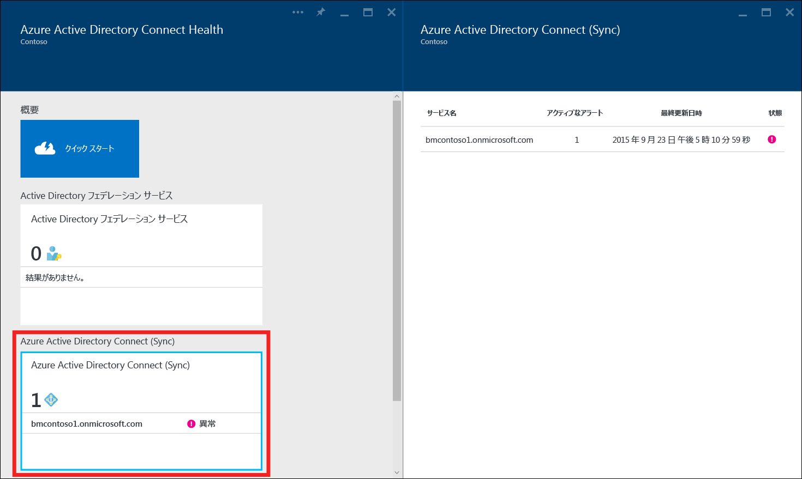
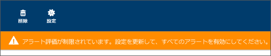
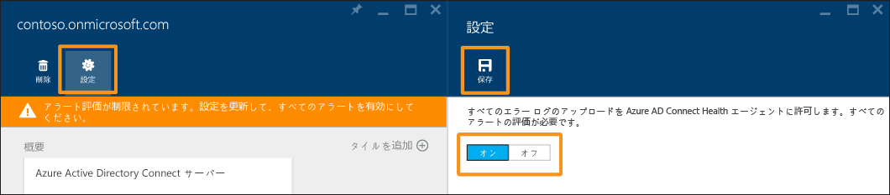

<properties
	pageTitle="同期での Azure AD Connect Health の使用 | Microsoft Azure"
	description="Azure AD Connect 同期を監視する方法を説明する Azure AD Connect Health のページです。"
	services="active-directory"
	documentationCenter=""
	authors="billmath"
	manager="femila"
	editor="curtand"/>

<tags
	ms.service="active-directory"
	ms.workload="identity"
	ms.tgt_pltfrm="na"
	ms.devlang="na"
	ms.topic="get-started-article"
	ms.date="08/08/2016"
	ms.author="billmath"/>

# Azure AD Connect Health for Sync の使用
次のドキュメントは、Azure AD Connect Health を使用した Azure AD Connect (同期) の監視について記述しています。Azure AD Connect Health を使用して AD FS を監視する方法の詳細については、「[AD FS での Azure AD Connect Health の使用](active-directory-aadconnect-health-adfs.md)」を参照してください。また、Azure AD Connect Health での Active Directory ドメイン サービスの監視については、「[AD DS での Azure AD Connect Health の使用](active-directory-aadconnect-health-adds.md)」を参照してください。

## Azure AD Connect Health for Sync のアラート
Azure AD Connect Health for Sync アラート セクションには、アクティブなアラートの一覧が表示されます。各アラートには、関連情報、解決の手順、関連ドキュメントのリンクが含まれます。アクティブまたは解決済みのアラートを選択すると、新しいブレードが開き、アラートの解決に利用できる手順やその他のドキュメントへのリンクなどの追加情報が表示されます。過去に解決されたアラートの履歴データも表示できます。

アラートを選択すると、アラートの解決に利用できる手順やその他のドキュメントへのリンクなどの追加情報が表示されます。

### アラートの評価が限定される状況
Azure AD Connect で既定の構成が使用されていない場合 (たとえば、属性フィルターが既定の構成からカスタム構成に変更されている場合)、Azure AD Connect Health エージェントは Azure AD Connect に関連するエラー イベントをアップロードしません。

その結果、サービスによるアラートの評価は限定的なものになります。このような状況にある場合は、それを示すバナーが該当するサービスの Azure ポータルに表示されます。

この状況を変更するには、[設定] をクリックし、Azure AD Connect Health エージェントがすべてのエラー ログをアップロードできるようにします。

## 同期に関する洞察
最新バージョンの Azure AD Connect Health for Sync には、次の新機能が追加されています。

- 同期処理の遅延
- オブジェクト変更傾向

### 同期の遅延
この機能は、コネクタの同期処理 (インポート、エクスポートなど) に伴う遅延の傾向をグラフィカルに表示します。処理の遅延をすばやく簡単に把握できることに加え (変更が大量に発生している場合などに有効)、待機時間が異常に長く調査が必要なケースを検出することができます。

既定では、Azure AD コネクタの "エクスポート" 処理の遅延のみ表示されます。コネクタに関してそれ以外の処理を確認したり、他のコネクタからの処理を確認したりするには、グラフを右クリックし、具体的な処理とコネクタを選択してください。

### 同期オブジェクトの変更
評価後 Azure AD にエクスポートされている変更の数の傾向は、この機能によってグラフィカルに表示することができます。現在、同期ログからこの情報を収集することは困難です。このグラフを見れば、ご利用の環境内で生じている変更の数を簡単に監視できるだけでなく、発生しているエラーを視覚的に確認することができます。

## 関連リンク

* [Azure AD Connect Health](active-directory-aadconnect-health.md)
* [Azure AD Connect Health エージェントのインストール](active-directory-aadconnect-health-agent-install.md)
* [Azure AD Connect Health の操作](active-directory-aadconnect-health-operations.md)
* [AD FS での Azure AD Connect Health の使用](active-directory-aadconnect-health-adfs.md)
* [AD DS での Azure AD Connect Health の使用](active-directory-aadconnect-health-adds.md)
* [Azure AD Connect Health の FAQ](active-directory-aadconnect-health-faq.md)
* [Azure AD Connect Health のバージョンの履歴](active-directory-aadconnect-health-version-history.md)

<!---HONumber=AcomDC_0928_2016-->