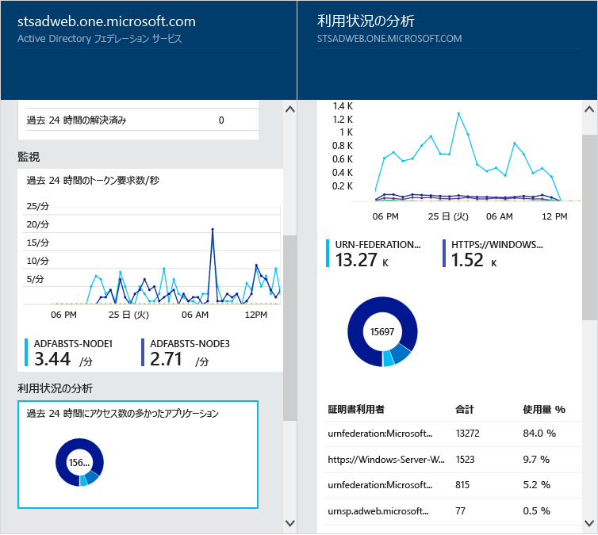
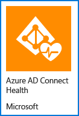
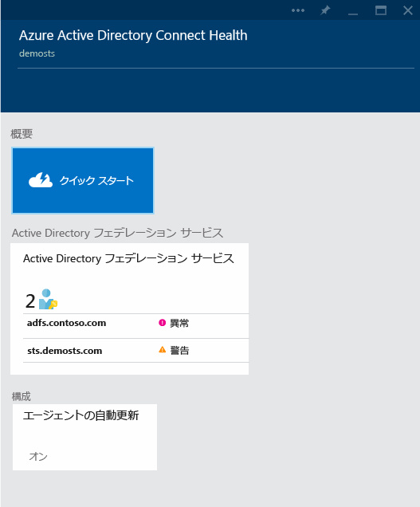

<properties 
	pageTitle="クラウド内のオンプレミスの ID インフラストラクチャの監視"
	description="これは、Azure AD Connect Health の内容と使用する理由を説明するページです。"
	services="active-directory"
	documentationCenter=""
	authors="billmath"
	manager="stevenpo"
	editor="curtand"/>

<tags 
	ms.service="active-directory"
	ms.workload="identity"
	ms.tgt_pltfrm="na"
	ms.devlang="na"
	ms.topic="get-started-article"
	ms.date="08/12/2015"
	ms.author="billmath"/>

# クラウド内のオンプレミスの ID インフラストラクチャと同期サービスの監視

Azure AD Connect Health では、オンプレミスの ID インフラストラクチャと、Azure AD Connect から使用できる同期サービスを監視、分析できます。アラート、パフォーマンス、使用パターン、構成設定を表示する機能があり、Office 365 に対して信頼性の高い接続を維持するなどさまざまなことができます。これらは、対象のサーバーにインストールされているエージェントを使用して実現されます。

この情報は、すべて Azure AD Connect Health ポータルで参照できます。Azure AD Connect Health ポータルを使用すると、アラート、パフォーマンスの監視、および使用状況の分析を表示できます。この情報はすべて 1 つの使いやすい場所に表示されるので、必要な情報を探して時間を無駄にすることはありません。

Azure AD Connect Health の今後の更新には、監視の追加と、他の ID コンポーネントやサービス (Azure AD Connect の同期サービスなど) の分析が含まれる予定です。このように ID というレンズを通した単一のダッシュボードが提供されることで、より堅牢で健全な統合環境を設定できるようになります。ユーザーはこの環境を利用して作業能力を向上させることができます。

## Azure AD Connect Health を使用する理由

オンプレミスのディレクトリと Azure AD を統合すると、クラウドとオンプレミス両方のリソースにアクセスするための共通の ID が提供されるため、ユーザーの生産性が向上します。ただし、この統合には課題があります。ユーザーが任意のデバイスからオンプレミスとクラウド両方のリソースに安全にアクセスできるように、環境を健全に保つ必要があります。Azure AD Connect Health では、Office 365 や他の Azure AD アプリケーションにアクセスするときに使用するオンプレミスの ID インフラストラクチャを、簡単なクラウドベースのアプローチで監視し分析することができます。オンプレミスの各 ID サーバーにエージェントをインストールするぐらいにシンプルです。

Azure AD Connect Health for AD FS は、Windows Server 2008/2008 R2 の AD FS 2.0 と Windows Server 2012/2012R2 の AD FS をサポートします。これらには、エクストラネット アクセスの認証をサポートする AD FS プロキシまたは Web アプリケーション プロキシ サーバーも含まれます。Azure AD Connect Health for AD FS の主な機能セットは次のとおりです。

- Azure AD などの AD FS が保護するアプリケーションへの信頼性の高いアクセスを保証するためにアラートを表示し対処する
- 重大なアラートの電子メール通知を送信する
- 容量計画を決定するパフォーマンス データを表示する
- 異常を判定するため、または容量計画のベースラインを確立するために AD FS ログイン パターンを詳細に表示する

次のビデオでは、Azure AD Connect Health の概要について説明します。

[AZURE.VIDEO azure-ad-connect-health--monitor-you-identity-bridge]

## Azure ポータルでの作業開始
Azure Active Directory Connect Health の使用を開始するには、次の手順に従います。

1. [Microsoft Azure ポータル](https://portal.azure.com/)にサインインします。
2. Azure Active Directory Connect Health にアクセスするには、Marketplace に移動して検索するか、Marketplace を選択して [セキュリティ + ID] を選択します。
3. 概要ブレード (ブレードは、全体的なビューの 1 つの部分です。ウィンドウまたはフライアウトと考えることができます) で、**[作成]** をクリックします。ディレクトリの情報を含む別のブレードが開きます。
4. ディレクトリのブレードで、**[作成]** をクリックします。Azure Active Directory Premium ライセンスをお持ちでない場合、Azure AD Connect Health を使用するにはこのライセンスが必要になります。Azure AD Premium の詳細については、Azure AD Premium の概要に関するページを参照してください。

>[AZURE.NOTE]Azure AD Connect Health のインスタンスでデータを表示するためには、あらかじめ対象サーバーに Azure AD Connect Health エージェントをインストールしておく必要があります。Azure AD Connect Health エージェントをダウンロードするには、最初のブレードで [クイック スタート]、[ツールの取得] の順に選択します。エージェントは、下にある[リンク](#download-the-agent)を使用して直接ダウンロードすることもできます。Azure Active Directory Connect Health を使用するには、次の手順に従います。

### Azure AD Connect Health ポータルおよびサービス
Azure AD Connect Health ポータルを使用すると、アラート、パフォーマンスの監視、および使用状況の分析を表示できます。Azure AD Connect Health に初めてアクセスすると、最初のブレードが表示されます。ブレードは、ウィンドウと考えることができます。最初のブレードには、クイック スタート、サービス、構成が表示されます。スクリーン ショットの下に、それぞれの簡単な説明を示します。サービスのセクションには、Azure AD Connect Health が監視しているアクティブなサービスとそのサービスのインスタンスが表示されます。

- **[クイック スタート]** – これを選択すると [クイック スタート] ブレードが開きます。ここで、[ツールの取得] を選択して Azure AD Connect Health エージェントをダウンロードしたり、ドキュメントにアクセスしたり、フィードバックを提供したりできます。
- **[Active Directory フェデレーション サービス]** – Azure AD Connect Health が現在監視しているすべての AD FS サービスを表します。いずれかのインスタンスを選択すると、ブレードが開き、そのサービス インスタンスに関する情報が表示されます。この情報には、概要、プロパティ、アラート、監視、使用状況の分析などが含まれます。 
- [構成] – 以下の機能のオン/オフを切り替えることができます。
<ol>
1. Azure AD Connect Health エージェントを最新バージョンに自動更新する - Azure AD Connect Health エージェントの最新バージョンが使用可能になると、自動的に更新されます。この機能は、既定では有効になっています。
2. Microsoft がトラブルシューティングの目的でのみ Azure AD ディレクトリの正常性データにアクセスすることを許可する - この機能が有効になっていると、ユーザーに表示されているデータと同じデータを Microsoft でも表示できます。これは問題のトラブルシューティングと支援に役立ちます。この機能は、既定では無効になっています。

## 必要条件
次の表に、Azure AD Connect Health を使用するための要件を示します。

| 要件 | 説明|
| ----------- | ---------- |
|Azure AD Premium| Azure AD Connect Health は Azure AD Premium の機能です。使用するためには Azure AD Premium が必要となります。  詳細については、[Azure AD Premium の概要](active-directory-get-started-premium.md)に関するページを参照してください。  30 日間の無料試用版を開始するには、[試用版の開始](https://azure.microsoft.com/trial/get-started-active-directory/)に関するページを参照してください。|.
|Azure AD ディレクトリの全体管理者であること|Azure AD Connect Health から得られる情報には、全体管理者が既定でアクセスできます。Azure AD ディレクトリの全体管理者でない場合は、Azure AD Connect Health のサービス インスタンスを作成できません。自分が全体管理者であることを確認してください。詳細については、[Azure AD ディレクトリの管理](active-directory-administer.md)に関するページを参照してください。  **重要:** エージェントのインストール時に使用するアカウントは、職場または組織アカウントである必要があります。Microsoft アカウントを使用することはできません。詳細については、「[Azure への組織としてのサインアップ](sign-up-organization.md)」を参照してください。|
|AD FS で利用状況分析機能を使用する場合、AD FS 監査が有効になっていること| AD FS で利用状況分析機能を使用する予定がある場合は、AD FS の監査を有効にする必要があります。  「[AD FS の監査の有効化](active-directory-aadconnect-health-operations.md#enable-auditing-for-ad-fs)」を参照してください。
|Azure AD Connect Health エージェントの要件を満たしていること|エージェント固有の要件については、次の表を参照してください。

次の表に、Azure AD Connect Health を使用するためのエージェントの要件を示します。

| 要件 | 説明|
| ----------- | ---------- |
|Azure AD Connect Health エージェントが個々のサーバーにインストールされていること| ポータルに表示されるデータを Azure AD Connect Health から得るためには、対象となるサーバーにエージェントがインストールされている必要があります。  たとえば、AD FS オンプレミス インフラストラクチャに関するデータを入手するには、AD FS サーバーにエージェントがインストールされている必要があります。これには AD FS プロキシ サーバーや Web アプリケーション プロキシ サーバーが含まれます。  エージェントのインストールについては、[Azure AD Connect Health エージェントのインストール](active-directory-aadconnect-health-agent-install.md)に関するページを参照してください。  **重要:** エージェントのインストール時に使用するアカウントは、職場または学校アカウントである必要があります。Microsoft アカウントを使用することはできません。詳細については、「[Azure への組織としてのサインアップ](sign-up-organization.md)」を参照してください。|
|Azure サービスのエンドポイントに対する送信接続|エージェントをインストールしたり実行したりするためには、以下に示した、Azure AD Connect Health サービスのエンド ポイントへの接続が必要となります。送信接続をブロックしている場合は、以下の項目を許可リストに追加してください。  <li>&#42;.servicebus.windows.net - ポート: 5671</li><li>https://&#42;.adhybridhealth.azure.com/</li><li>https://&#42;.table.core.windows.net/</li><li>https://policykeyservice.dc.ad.msft.net/</li><li>https://login.windows.net</li><li>https://login.microsoftonline.com</li><li>https://secure.aadcdn.microsoftonline-p.com</li> |
|エージェントを実行するサーバー上のファイアウォール ポート| エージェントが Azure AD Health サービス エンドポイントと通信するには、次のファイアウォール ポートが開いている必要があります。  <li>TCP/UDP ポート 80</li><li>TCP/UDP ポート 443</li>
|IE セキュリティ強化が有効になっている場合は以下の Web サイトが許可されていること|エージェントのインストール対象となるサーバーで IE セキュリティ強化が有効になっている場合、次の Web サイトを許可する必要があります。  <li>https://login.microsoftonline.com</li><li>https://secure.aadcdn.microsoftonline-p.com</li><li>https://login.windows.net</li><li>Azure Active Directory によって信頼されている組織のフェデレーション サーバー (例: https://sts.contoso.com</li>) 

## エージェントのダウンロード

Azure AD Connect Health の使用を開始するには、こちら ([Azure AD Connect Health エージェントのダウンロード](http://go.microsoft.com/fwlink/?LinkID=518973)) から最新のバージョンのエージェントをダウンロードします。 エージェントをインストールする前に、Marketplace からサービスを追加したことを確認します。

## 関連リンク

* [AD FS の Azure AD Connect Health エージェントのインストール](active-directory-aadconnect-health-agent-install-adfs.md)
* [Azure AD Connect Health の操作](active-directory-aadconnect-health-operations.md)
* [AD FS での Azure AD Connect Health の使用](active-directory-aadconnect-health-adfs.md)
* [Azure AD Connect Health の FAQ](active-directory-aadconnect-health-faq.md)

 

<!---HONumber=August15_HO9-->