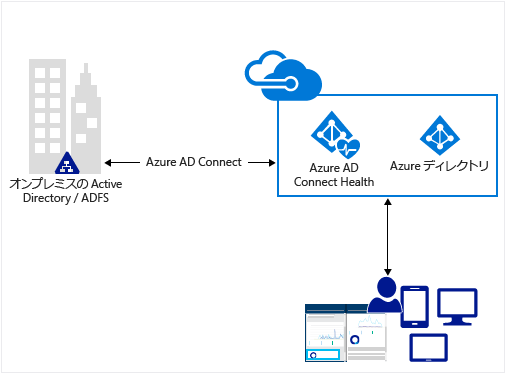
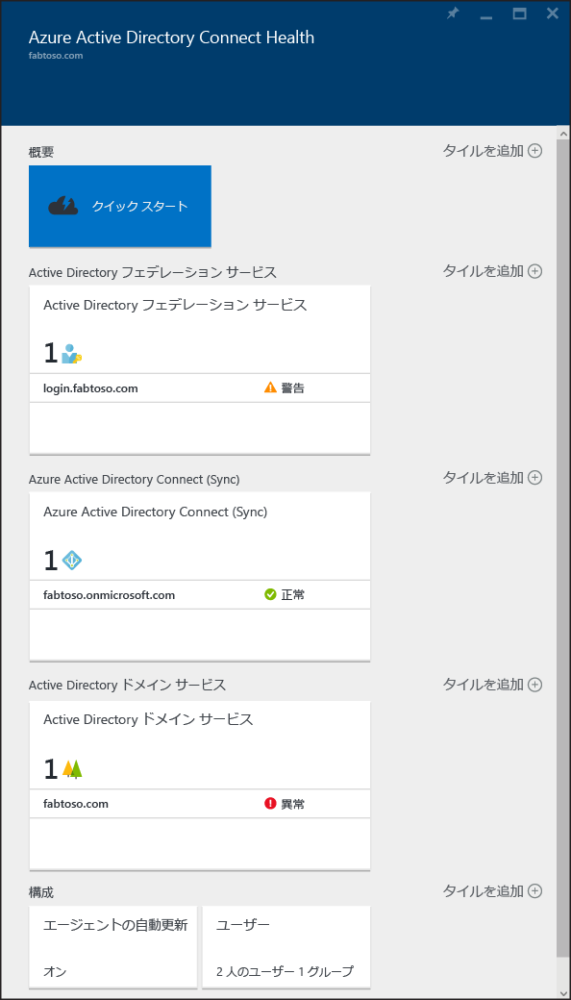

# クラウド内のオンプレミスの ID インフラストラクチャと同期サービスの監視
Azure AD Connect Health では、オンプレミスの ID インフラストラクチャと同期サービスを監視、分析できます。  これを使用すると、AD FS サーバー、Azure AD Connect サーバー (同期エンジン)、Active Directory ドメイン コントローラーなど、お使いの主要な ID コンポーネントの監視機能が用意されているため、Office 365 と Microsoft Online Services への信頼性の高い接続を維持できます。また、これらの ID コンポーネントの主要なデータ ポイントにアクセスしやすくなるため、使用状況やその他の重要な分析を簡単に取得でき、しかるべき情報に基づく判断ができるようになります。

この情報は、 [Azure AD Connect Health ポータル](https://aka.ms/aadconnecthealth)に表示されます。 Azure AD Connect Health ポータルを使用すると、アラート、パフォーマンスの監視、使用状況の分析などを表示できます。 Azure AD Connect Health では、1 つのレンズで主要な ID コンポーネントの正常性をまとめて確認できます。

Azure AD Connect Health の今後の更新には、他の ID コンポーネントの監視や分析が追加される予定です。 このように ID というレンズを通した単一のダッシュボードが提供されることで、より堅牢で健全な統合環境を設定できるようになります。ユーザーはこの環境を利用して作業能力を向上させることができます。

## Azure AD Connect Health を使用する理由
オンプレミスのディレクトリと Azure AD を統合すると、クラウドとオンプレミス両方のリソースにアクセスするための共通の ID が提供されるため、ユーザーの生産性が向上します。 ただし、この統合には課題があります。ユーザーが任意のデバイスからオンプレミスとクラウド両方のリソースに安全にアクセスできるように、環境を健全に保つ必要があります。 Azure AD Connect Health では、Office 365 や他の Azure AD アプリケーションにアクセスするときに使用するオンプレミスの ID インフラストラクチャを、簡単なクラウドベースのアプローチで監視し、分析することができます。 オンプレミスの各 ID サーバーにエージェントをインストールするぐらいにシンプルです。

## [Azure AD Connect Health for AD FS](active-directory-aadconnect-health-adfs.md)
Azure AD Connect Health for AD FS では、Windows Server 2008 R2 の AD FS 2.0 のほか、Windows Server 2012 と Windows Server 2012R2 の AD FS がサポートされています。 また、エクストラネット アクセスの認証をサポートする AD FS プロキシまたは Web アプリケーション プロキシ サーバーの監視もサポートの対象に含まれます。 Health エージェントを簡単に低コストでインストールできる Azure AD Connect Health for AD FS の主な機能は次のとおりです。

* AD FS と AD FS プロキシ サーバーが正常に動作していない場合に通知されるアラートを使用して監視する
* 重大なアラートの電子メール通知を送信する
* AD FS の容量計画に役立つ、パフォーマンス データの傾向を表示する
* AD FS の利用方法を把握するのに役立つように、さまざまなピボット (アプリ、ユーザー、ネットワークの場所など) で AD FS ログインの使用状況を分析する
* 無効なユーザー名とパスワードによる試行を行った上位 50 人のユーザーと直近の IP アドレスなど、AD FS に関するレポートを作成する

次のビデオでは、Azure AD Connect Health for AD FS の概要について説明します。

> [!VIDEO https://channel9.msdn.com/Series/Azure-Active-Directory-Videos-Demos/Azure-AD-Connect-Health--Monitor-you-identity-bridge/player]
>
>

## [Azure AD Connect Health for Sync](active-directory-aadconnect-health-sync.md)
Azure AD Connect Health for Sync は、オンプレミスの Active Directory と Azure Active Directory の間で実行された同期を監視し、情報を提供します。 Azure AD Connect Health for Sync の主な機能は次のとおりです。

* Azure AD Connect サーバー (同期エンジン) が正常に動作していない場合に通知されるアラートを使用して監視する
* 重大なアラートの電子メール通知を送信する
* 同期操作の待機時間を示すグラフや各種操作 (追加、更新、削除など) の傾向を含む、同期操作の分析を行う
* 同期プロパティ、最後に正常に行われた Azure AD へのエクスポートについての概要情報を表示する
* オブジェクト レベルの同期エラーについてレポートする \(Azure AD Premium は不要\)

次のビデオでは、Azure AD Connect Health for Sync の概要について説明します。

> [!VIDEO https://channel9.msdn.com/Series/Azure-Active-Directory-Videos-Demos/Azure-Active-Directory-Connect-Health-Monitoring-the-sync-engine/player]
>
>

## [Azure AD Connect Health for AD DS (プレビュー)](active-directory-aadconnect-health-adds.md)
Windows Server 2008 R2、Windows Server 2012、Windows Server 2012 R2 にインストールされているドメイン コントローラーは、Azure AD Connect Health for AD DS で監視することができます。 手軽で経済的な正常性エージェントをインストールすることによって、オンプレミスの AD DS 環境をクラウドから直接監視することができます。 Azure AD Connect Health for AD DS の主な機能は次のとおりです。

* ドメイン コントローラーの異常を検出する監視アラートと重大なアラートを知らせる電子メール通知。
* [ドメイン コントローラー] ダッシュボード。ドメイン コントローラーの正常性と運用状態を把握できるクイック ビューアーが用意されています。
* [レプリケーションの状態] ダッシュボード。レプリケーションに関する直近の情報のほか、エラーが検出された場合はトラブルシューティング ガイドへのリンクが表示されます。
* トラブルシューティングや監視用途で、使用頻度の高いパフォーマンス カウンターのパフォーマンス データ グラフにすばやくアクセス可能。

次のビデオでは、Azure AD Connect Health for AD DS の概要について説明します。

> [!VIDEO https://channel9.msdn.com/Series/Azure-Active-Directory-Videos-Demos/Azure-AD-Connect-Health-monitors-on-premises-AD-Domain-Services/player]
>
>

## Azure AD Connect Health の使用開始
Azure AD Connect Health は簡単に使用を開始できます。 次の手順に従ってください。

1. [Azure AD Premium](active-directory-get-started-premium.md) を入手するか、[試用版の利用を開始](https://azure.microsoft.com/trial/get-started-active-directory/)します。
2. [Azure AD Connect Health エージェントをダウンロードし、ID サーバーにインストール](#download-and-install-azure-ad-connect-health-agent) します。
3.  [https://aka.ms/aadconnecthealth](https://aka.ms/aadconnecthealth)

> [!NOTE]
> Azure AD Connect Health ダッシュボードでデータを表示するためには、あらかじめ対象サーバーに Azure AD Connect Health エージェントをインストールしておく必要があります。
>
>

## Azure AD Connect Health エージェントのダウンロードとインストール
* Azure AD Connect Health の要件を必ず満たしてください。
* Azure AD Connect Health for AD FS の使用を開始するには、こちら ([Azure AD Connect Health for AD FS エージェントのダウンロード](http://go.microsoft.com/fwlink/?LinkID=518973)
  ) から最新バージョンのエージェントをダウンロードします。
* Azure AD Connect Health for Sync の使用を開始するには、 [Azure AD Connect の最新バージョン](http://go.microsoft.com/fwlink/?linkid=615771)をダウンロードしてインストールします。  Health エージェントは、Azure AD Connect のインストールの一環としてインストールされます (バージョン 1.0.9125.0 以降)。  Azure AD Connect では、以前のバージョンからのインプレース アップグレードがサポートされています。
* Azure AD Connect Health for AD DS の使用を開始するには、こちら ([Azure AD Connect Health for AD DS エージェントのダウンロード](http://go.microsoft.com/fwlink/?LinkID=820540)
  ) から最新バージョンのエージェントをダウンロードします。

## Azure AD Connect Health ポータル
Azure AD Connect Health ポータルを使用すると、アラート、パフォーマンスの監視、使用状況の分析を表示できます。 https://aka.ms/aadconnecthealth から Azure AD Connect Health のメイン ブレードに移動できます。  ブレードは、ウィンドウと考えることができます。 メイン ブレードでは、[クイック スタート]、Azure AD Connect Health で提供されるサービス、その他の構成オプションが表示されます。 スクリーン ショットの下に、それぞれの簡単な説明を示します。  エージェントのデプロイ後、Azure AD Connect Health で監視されているサービスが、Health サービスによって自動的に識別されます。

* **[クイック スタート]** – これを選択すると [クイック スタート] ブレードが開きます。 ここで、[ツールの取得] を選択して Azure AD Connect Health エージェントをダウンロードしたり、ドキュメントにアクセスしたり、フィードバックを提供したりできます。
* **[Active Directory フェデレーション サービス]** – Azure AD Connect Health が現在監視しているすべての AD FS サービスを表します。 いずれかのインスタンスを選択すると、ブレードが開き、そのサービス インスタンスに関する情報が表示されます。  この情報には、概要、プロパティ、アラート、監視、使用状況の分析などが含まれます。 機能の詳細については [こちら](active-directory-aadconnect-health-adfs.md)
* **Azure Active Directory Connect (Sync)** – Azure AD Connect Health が現在監視している Azure AD Connect サーバーを表します。 エントリを選択すると、ブレードが開き、Azure AD Connect サーバーに関する情報が表示されます。 機能の詳細については [こちら](active-directory-aadconnect-health-sync.md)
* **[Active Directory ドメイン サービス]** – Azure AD Connect Health が現在監視しているすべての AD DS フォレストを表します。 いずれかのフォレストを選択すると、ブレードが開き、そのフォレストに関する情報が表示されます。  この情報には、重要度のきわめて高い情報や、ドメイン コントローラーのダッシュボード、レプリケーションの状態のダッシュボード、アラート、監視の概要が含まれます。 機能の詳細については [こちら](active-directory-aadconnect-health-adds.md)
* **[構成]** – 以下の機能のオン/オフを切り替えることができます。

  1. Azure AD Connect Health エージェントを最新バージョンに自動更新する - Azure AD Connect Health エージェントの最新バージョンが使用可能になると、自動的に更新されます。 この機能は、既定では有効になっています。
  2. Microsoft がトラブルシューティングの目的でのみ Azure AD ディレクトリの正常性データにアクセスすることを許可する - この機能が有効になっていると、ユーザーに表示されているデータと同じデータを Microsoft でも表示できます。 これは問題のトラブルシューティングと支援に役立ちます。 この機能は、既定では無効になっています。

## 関連リンク
* [Azure AD Connect Health エージェントのインストール](active-directory-aadconnect-health-agent-install.md)
* [Azure AD Connect Health の操作](active-directory-aadconnect-health-operations.md)
* [AD FS での Azure AD Connect Health の使用](active-directory-aadconnect-health-adfs.md)
* [Azure AD Connect Health for Sync の使用](active-directory-aadconnect-health-sync.md)
* [AD DS での Azure AD Connect Health の使用](active-directory-aadconnect-health-adds.md)
* [Azure AD Connect Health の FAQ](active-directory-aadconnect-health-faq.md)
* [Azure AD Connect Health のバージョンの履歴](active-directory-aadconnect-health-version-history.md)

<!--HONumber=Nov16_HO2-->

