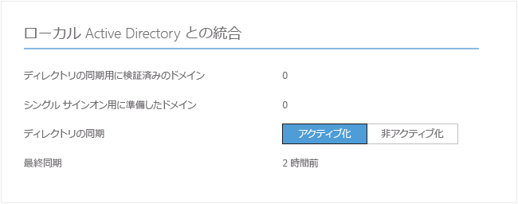
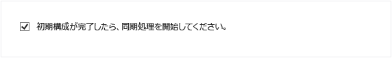
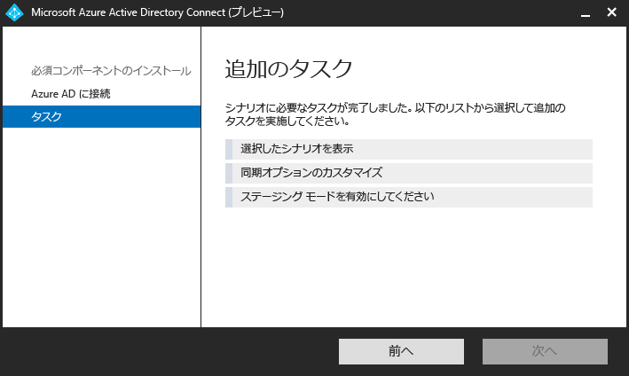

<properties 
	pageTitle="オンプレミス ID と Azure Active Directory の統合" 
	description="これは、Azure AD Connect の内容と使用する理由を説明するページです。" 
	services="active-directory" 
	documentationCenter="" 
	authors="billmath" 
	manager="swadhwa" 
	editor="curtand"/>

<tags 
	ms.service="active-directory" 
	ms.workload="identity" 
	ms.tgt_pltfrm="na" 
	ms.devlang="na" 
	ms.topic="article" 
	ms.date="07/13/2015" 
	ms.author="billmath"/>

# オンプレミス ID と Azure Active Directory の統合

現在、ユーザーはオンプレミスとクラウドの両方でアプリケーションにアクセスできることを望んでいます。ノート PC、スマート フォン、タブレットなど、あらゆるデバイスからアクセスできることが期待されています。この状況に伴い、組織はユーザーがこのようなアプリにアクセスする手段を提供できるようにする必要がありますが、クラウドへの完全移行を必ずしも選択できるわけではありません。

Azure Active Directory Connect の導入により、これらのアプリへのアクセス実現とクラウドへの移行がこれまで以上に簡単になりました。Azure AD Connect には、次の利点があります。

- ユーザーは、共通 ID を使用してクラウドとオンプレミスの両方にサインオンできます。ユーザーは複数のパスワードまたはアカウントを覚える必要がなく、管理者は複数のアカウント使用に伴う追加のオーバーヘッドを心配する必要がありません。
- Azure Active Directory によるオンプレミスのディレクトリの接続は、1 つのツールで簡単に行うことができます。インストールすると、ウィザードを通じて、同期サービス、パスワードの同期または AD FS、Azure AD PowerShell モジュールなどの必須コンポーネントを含む、ディレクトリ統合の開始に必要なすべてのコンポーネントをデプロイして構成します。

## Azure AD Connect を使用する理由 

オンプレミスのディレクトリと Azure AD を統合すると、クラウドとオンプレミス両方のリソースにアクセスするための共通の ID が提供されるため、ユーザーの生産性が向上します。この統合によって、ユーザーや組織には次の利点があります。
	
* 組織は、Windows Server Active Directory を利用した後に Azure Active Directory に接続して、オンプレミスとクラウドベースのサービス全体で共通するハイブリッド ID をユーザーに提供できます。 
* 管理者は、アプリケーション リソース、デバイスおよびユーザーの ID、ネットワークの場所、多要素認証に基づき、条件付きアクセスを提供できます。
* ユーザーは、共通 ID を Azure AD、Office 365、Intune、SaaS アプリ、サードパーティ アプリケーションのアカウントで利用できます。  
* 開発者は、共通 ID モデルを利用したアプリケーションを構築し、アプリケーションをオンプレミスの Active Directory またはクラウドベース アプリケーション向け Azure に統合できます。

Azure AD Connect を使用すると、このような統合が簡単になり、オンプレミスとクラウドの ID インフラストラクチャの管理が簡素化されます。

----------------------------------------------------------------------------------------------------------
## Azure AD Connect のダウンロード

Azure AD Connect の使用を開始するには、[Azure AD Connect のダウンロード](http://go.microsoft.com/fwlink/?LinkId=615771) ページから最新バージョンをダウンロードすることができます。

----------------------------------------------------------------------------------------------------------

## Azure AD Connect の動作

Azure Active Directory Connect は 3 つの主要な部分で構成されます。この 3 つの部分とは、同期サービス、オプションの Active Directory フェデレーション サービス、および [Azure AD Connect Health](https://msdn.microsoft.com/library/azure/dn906722.aspx) を使用して行う監視です。

 

- 同期 - この部分は、以前 Dirsync と AAD Sync としてリリースされたコンポーネントと機能で構成されます。これは、ユーザーとグループの作成を担当している部分です。オンプレミス環境のユーザーとグループに関する情報とクラウド内の情報が一致することも保証します。
- AD FS - これは Azure AD Connect のオプションの部分であり、オンプレミスの AD FS インフラストラクチャを使用して、ハイブリッド環境をセットアップするために使用できます。この部分は、ドメイン参加 SSO、AD のログインのポリシーの適用、スマート カードやサード パーティの MFA などを含む複雑なデプロイに対応するために、組織で使用できます。SSO の構成に関する詳細については、「[シングル サインオンを使用した DirSync](https://msdn.microsoft.com/library/azure/dn441213.aspx)」を参照してください。
- 正常性の監視 - AD FS を使用した複雑なデプロイメントでは、Azure AD Connect Health により、フェデレーション サーバーを強力に監視し、このアクティビティを Azure ポータルで一元的に表示できます。詳細については、「[Azure Active Directory Connect Health](https://msdn.microsoft.com/library/azure/dn906722.aspx)」を参照してください。

### Azure AD Connect でサポートされるコンポーネント

次は、前提条件と Azure AD Connect をセットアップしたサーバーでインストールするサポートされたコンポーネントの一覧です。この一覧は、基本的な高速インストール用です。[同期サービスのインストール］ ページで異なる SQL Server の使用を選択した場合は、次に示す SQL Server 2012 のコンポーネントはインストールされません。

- Azure AD Connect の Azure AD コネクタ
- Microsoft SQL Server 2012 のコマンド ライン ユーティリティ
- Microsoft SQL Server 2012 Native Client
- Microsoft SQL Server 2012 Express LocalDB
- Windows PowerShell 用の Azure Active Directory モジュール
- IT プロフェッショナル向け Microsoft Online Services サインイン アシスタント
- Microsoft Visual C++ 2013 再配布パッケージ

## Azure AD Connect の使用

次のドキュメントは、Azure Active Directory Connect の使用を開始する際に役立ちます。このドキュメントでは、Azure AD Connect の高速インストールの使用について説明します。カスタム インストールについては、[Azure AD Connect のカスタム インストール](active-directory-aadconnect-get-started-custom.md)に関するページを参照してください。DirSync から Azure AD Connect へのアップグレードについては、[DirSync から Azure Active Directory Connect へのアップグレード](active-directory-aadconnect-dirsync-upgrade-get-started.md)に関するページを参照してください。

### Azure AD Connect をインストールする前に
簡単設定を使用して Azure AD Connect をインストールする前に、必要なものがいくつかあります。

 
- Azure サブスクリプションまたは [Azure 試用版サブスクリプション](http://azure.microsoft.com/pricing/free-trial/): Azure ポータルにアクセスする場合にのみ必要です。Azure AD Connect の使用には必要ありません。PowerShell または Office 365 を使用している場合は、Azure サブスクリプションがなくても Azure AD Connect を使用できます。
- 統合する Azure AD テナントの Azure AD 全体管理者アカウント
- Azure AD Connect は、Windows Server 2008 以降にインストールする必要があります。このサーバーをドメイン コントローラーやメンバー サーバーにすることができます。
- AD スキーマのバージョンとフォレスト レベルは、Windows Server 2003 以降である必要があります。ドメイン コント ローラーは、スキーマとフォレスト レベルの要件を満たしていれば、任意のバージョンを実行できます。
- Active Directory フェデレーション サービスをデプロイする場合、AD FS をインストールするサーバーは、Windows Server 2012 以降である必要があります。
- ローカルの Active Directory のエンタープライズ管理者アカウント
- 省略可能: 同期を検証するテスト ユーザー アカウント。 

#### Azure AD Connect のハードウェア要件
次の表は、Azure AD Connect コンピューターの最小要件を示しています。

| Active Directory 内のオブジェクトの数 | CPU | メモリ | ハード ドライブのサイズ |
| ------------------------------------- | --- | ------ | --------------- |
| 10,000 未満 | 1\.6 GHz | 4 GB | 70 GB |
| 10,000 ～ 50,000 | 1\.6 GHz | 4 GB | 70 GB |
| 50,000 ～ 100,000 | 1\.6 GHz | 16 GB | 100 GB |
| オブジェクトが 100,000 個以上の場合は完全バージョンの SQL Server が必要| | | |
| 100,000 ～ 300,000 | 1\.6 GHz | 32 GB | 300 GB |
| 300,000 ～ 600,000 | 1\.6 GHz | 32 GB | 450 GB |
| 600,000 を超過 | 1\.6 GHz | 32 GB | 500 GB |

複数のフォレストやフェデレーション サインオンなどのカスタム オプションについては、[こちら](active-directory-aadconnect-get-started-custom.md)で追加要件を参照してください。

### Azure AD Connect の高速インストール
[簡単設定] の選択は、既定のオプションであり、最も一般的なシナリオの 1 つです。このとき、Azure AD Connect により、パスワード ハッシュ同期オプションと共に同期をデプロイします。これは、単一のフォレスト用のみであり、ユーザーはオンプレミスのパスワードを使用して、クラウドにサインインできます。簡単設定を使用した場合、インストールが完了すると、自動的に同期が開始されます (ただし、開始されないようにすることもできます)。このオプションでは、数回クリックするだけで、オンプレミスのディレクトリをクラウドに拡張できます。

#### 簡単設定を使用して Azure AD Connect をインストールするには
--------------------------------------------------------------------------------------------

1. Azure AD Connect をインストールするサーバーにエンタープライズ管理者としてログインします。これには、同期サーバーにするサーバーを使用します。
2. AzureADConnect.msi を検索し、ダブルクリックします。
3. [ようこそ] 画面で、ライセンス条項に同意するチェック ボックスをオンにし、**[続行]** をクリックします。
4. [簡単設定] 画面で、**[簡単設定を使う]** をクリックします。

6. [Azure AD に接続] 画面で、Azure AD の Azure グローバル管理者のユーザー名とパスワードを入力します。**[次へ]** をクリックします。
8. [AD DS に接続] 画面で、エンタープライズ管理者アカウントのユーザー名とパスワードを入力します。**[次へ]** をクリックします。

9. [構成の準備完了] 画面で、**[インストール]** をクリックします。
	- 必要に応じて、[構成の準備完了] 画面の \*\*[構成が完了したらすぐに同期プロセスを開始する]\*\* チェック ボックスをオフにします。このチェック ボックスをオフにすると、ウィザードでは、同期が構成されますが、タスクは無効のままになります。そのため、タスクは、タスク スケジューラで手動で有効にするまで実行されません。タスクを有効にすると、同期は 3 時間ごとに実行されます。
	- また、必要に応じて、**[Exchange ハイブリッド展開]** チェック ボックスをオンにすると、その同期サービスを構成することも選択できます。Exchange メールボックスをクラウドにもオンプレミスにも配置する予定がない場合は、このチェック ボックスをオンにする必要はありません。

8. インストールが完了したら、**[終了]** をクリックします。

   

高速インストールの使用方法に関するビデオについては、以下を確認してください。

[AZURE.VIDEO azure-active-directory-connect-express-settings]

### インストールを検証する

Azure AD Connect を正常にインストールした後は、Azure ポータルにサインインして最後の同期時刻を確認すると、同期が実行されていることを確認できます。

1.  Azure ポータルにサインインします。
2.  左側で、[Active Directory] を選択します。
3.  Azure AD Connect のセットアップに使用したディレクトリをダブルクリックします。
4.  上部にある [ディレクトリ統合] を選択します。最後の同期時刻に注目します。

## Azure AD Connect の管理 

組織のニーズや要件を満たすように Azure Active Directory Connect をカスタマイズするための高度な運用に関するトピックを次に示します。

### Azure AD Premium および Enterprise Mobility のユーザーにライセンスを割り当てる

ユーザーがクラウドに同期されたため、Office 365 などのクラウド アプリを利用できるように、そのユーザーにライセンスを割り当てる必要があります。

#### Azure AD Premium または Enterprise Mobility Suite のライセンスを割り当てるには
--------------------------------------------------------------------------------
1. Azure ポータルに管理者としてサインインします。
2. 左側で、**[Active Directory]** を選択します。
3. [Active Directory] ページで、有効にするユーザーが存在するディレクトリをダブルクリックします。
4. ディレクトリ ページの上部にある **[ライセンス]** を選択します。
5. [ライセンス] ページで、[Active Directory Premium] または [Enterprise Mobility Suite] を選択し、**[割り当て]** をクリックします。
6. ダイアログ ボックスで、ライセンスを割り当てるユーザーを選択し、チェック マーク アイコンをクリックして変更を保存します。

### スケジュールされた同期タスクを確認する
同期の状態を確認する場合は、Azure ポータルで確認します。

#### スケジュールされた同期タスクを確認するには
--------------------------------------------------------------------------------

1. Azure ポータルに管理者としてサインインします。
2. 左側で、**[Active Directory]** を選択します。
3. [Active Directory] ページで、有効にするユーザーが存在するディレクトリをダブルクリックします。
4. ディレクトリ ページの上部にある **[ディレクトリ統合]** を選択します。
5. [ローカル Active Directory との統合] で、最後の同期時刻を確認します。

### スケジュールされた同期タスクの開始
同期タスクを実行する必要がある場合は、Azure AD Connect ウィザードを再度実行して行うことができます。Azure AD 資格情報を入力する必要があります。ウィザードで、**[同期オプションのカスタマイズ]** タスクを選択し、[次へ] をクリックします。最後に、**[初期構成が完了したら、同期処理を開始してください。]** チェック ボックスがオンになっていることを確認してください。

### Azure AD Connect で利用可能なその他のタスク
Azure AD Connect の初回インストール後は、Azure AD Connect のスタート ページまたはデスクトップのショートカットから、いつでもウィザードを再び起動できます。再度ウィザードを実行すると、追加のタスクの形式で新しいオプションがいくつか表示されます。

次の表に、これらのタスクの概要と各タスクの簡単な説明を示します。

 

その他のタスク | 説明 
------------- | ------------- |
選択したシナリオを表示する |現在の Azure AD Connect のソリューションを表示できます。これには、全般設定、同期されたディレクトリ、同期設定などが含まれます。
同期オプションをカスタマイズする | 構成への Active Directory フォレストの追加、ユーザー、グループ、デバイス、パスワード ライトバックなどの同期オプションの有効化など、現在の構成を変更できます。
ステージング モードを有効にする | これを使用すると、後で同期される情報をステージングできますが、Azure AD または Active Directory には何もエクスポートされません。事前に同期をプレビューすることができます。

 
### その他のドキュメント
Azure AD Connect の操作に関するその他のドキュメントについては、次を参照してください。

- [Azure AD Connect の既定の構成の変更](active-directory-aadconnect-whats-next-change-default-config.md)
- [Azure AD Connect 同期規則エディターの使用](active-directory-aadconnect-whats-next-synch-rules-editor.md)
- [宣言型のプロビジョニングの使用](active-directory-aadconnect-whats-next-declarative-prov.md)

また、Azure AD Sync 用に作成されたドキュメントの一部は、まだ Azure AD Connect と関連があり、Azure AD Connect に当てはまります。Azure.com にこのドキュメントを提供するためにあらゆる努力を重ねていますが、このドキュメントの一部は、現在も MSDN の範囲のライブラリに掲載されています。その他のドキュメントについては、「[MSDN の Azure AD Connect](https://msdn.microsoft.com/library/azure/dn832695.aspx)」と「[MSDN の Azure AD Sync](https://msdn.microsoft.com/library/azure/dn790204.aspx)」を参照してください。

**その他のリソース**

オンプレミスのディレクトリのクラウドへの拡張に関する 2015 年のプレゼンテーションをご覧ください。

[AZURE.VIDEO microsoft-ignite-2015-extending-on-premises-directories-to-the-cloud-made-easy-with-azure-active-directory-connect]

[シングル サインオンを使用したマルチ フォレストのディレクトリ同期のシナリオ](https://msdn.microsoft.com/library/azure/dn510976.aspx) -複数のディレクトリを Azure AD と統合します。

[Azure AD Connect Health](active-directory-aadconnect-health.md) - オンプレミスの AD FS インフラストラクチャの正常性を監視します。

[Azure AD Connect の FAQ](active-directory-aadconnect-faq.md) - Azure AD Connect に関するよく寄せられる質問。

 

<!---HONumber=July15_HO5-->