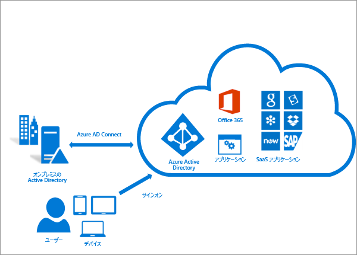
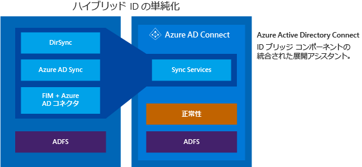

<properties
	pageTitle="Azure AD Connect: オンプレミス ID と Azure Active Directory の統合 | Microsoft Azure"
	description="Azure AD Connect は、オンプレミスのディレクトリと Azure Active Directory を統合する機能です。Office 365、Azure、SaaS など Azure AD と連動するアプリケーションの ID を共通化することができます。"
    keywords="Azure AD Connect の紹介, Azure AD Connect の概要, Azure AD Connect とは, Active Directory のインストール"
	services="active-directory"
	documentationCenter=""
	authors="andkjell"
	manager="femila"
	editor=""/>

<tags
	ms.service="active-directory"
	ms.workload="identity"
	ms.tgt_pltfrm="na"
	ms.devlang="na"
	ms.topic="get-started-article"
	ms.date="07/14/2016"
	ms.author="andkjell;billmath"/>

# オンプレミス ID と Azure Active Directory の統合
Azure AD Connect は、オンプレミスのディレクトリと Azure Active Directory を統合する機能です。Office 365、Azure、SaaS など Azure AD と連動するアプリケーションに関して、ユーザーの ID を共通化することができます。このトピックでは、計画、デプロイ、運用の各手順を紹介しています。関連するトピックのリンク集としてご利用ください。

<!-- The hardcoded link is a workaround for campaign ids not working in acom links-->

> [AZURE.IMPORTANT] [Azure AD Connect is the best way to connect your on-premises directory with Azure AD and Office 365. This is a great time to upgrade to Azure AD Connect from Windows Azure Active Directory Sync (DirSync) or Azure AD Sync as these tools are now deprecated and will reach end of support on April 13, 2017.](https://azure.microsoft.com/documentation/articles/active-directory-aadconnect-dirsync-deprecated/?WT.mc_id=DirSyncDepACOM)

## Azure AD Connect を使用する理由
オンプレミスのディレクトリと Azure AD を統合すると、クラウドとオンプレミス両方のリソースにアクセスするための共通の ID が提供されるため、ユーザーの生産性が向上します。ユーザーや組織にとっては次の利点があります。

- ユーザーは、単一の ID を使ってオンプレミスのアプリケーションとクラウド サービス (Office 365 など) にアクセスできます。

- 単一のツールにより、同期とサインインのための容易なデプロイメントを実現できます。

- それぞれのシナリオに適した最新の機能が手に入ります。Azure AD Connect は、DirSync や Azure AD Sync など、旧バージョンの ID 統合ツールの後継ツールです。詳細については、「[ハイブリッド ID ディレクトリ統合ツールの比較](active-directory-hybrid-identity-design-considerations-tools-comparison.md)」を参照してください。

### Azure AD Connect の動作
Azure Active Directory Connect は、同期サービスと Active Directory フェデレーション サービス コンポーネント (オプション)、監視コンポーネント ([Azure AD Connect Health](active-directory-aadconnect-health.md)) という主に 3 つのコンポーネントで構成されています。

 

- 同期 - ユーザーやグループなどのオブジェクトを作成するためのコンポーネントです。さらに、オンプレミス ユーザーやオンプレミス グループの ID 情報をクラウド側と一致させる働きをします。
- AD FS - Azure AD Connect のオプション コンポーネントです。オンプレミスの AD FS インフラストラクチャと組み合わせることでハイブリッド環境を構成できます。ドメイン参加による SSO や AD サインイン ポリシーの適用、スマート カードやサード パーティの MFA など、複雑なデプロイに対応する組織で利用できます。
- 正常性の監視 - Azure AD Connect Health により、強力に監視し、Azure ポータルでこのアクティビティを一元的に表示できます。詳細については、「[Azure Active Directory Connect Health](active-directory-aadconnect-health.md)」を参照してください。

## Azure AD Connect のインストール

Azure AD Connect は [Microsoft ダウンロード センター](http://go.microsoft.com/fwlink/?LinkId=615771)からダウンロードできます。

解決策 | シナリオ
----- | ----- |
開始する前に - [ハードウェアと前提条件](active-directory-aadconnect-prerequisites.md) | <li>Azure AD Connect のインストールを開始する前に実行する手順です。</li>
[簡単設定](active-directory-aadconnect-get-started-express.md) | <li>シングル フォレストの AD が存在する場合、この方法をお勧めします。</li> <li>ユーザーは、パスワード同期により、同じパスワードを使ってサインインします。</li>
[カスタマイズした設定](active-directory-aadconnect-get-started-custom.md) | <li>複数のフォレストがある場合に使用されます。多くのオンプレミス [トポロジ](active-directory-aadconnect-topologies.md)がサポートされます。</li> <li>フェデレーション用の ADFS などのサインイン オプションをカスタマイズするか、サード パーティの ID プロバイダーを使います。</li> <li>フィルター処理やライトバックなどの同期機能をカスタマイズします。</li>
[DirSync からのアップグレード](active-directory-aadconnect-dirsync-upgrade-get-started.md) | <li>既存の DirSync サーバーが既に実行されている場合に使用します。</li>
[Azure AD Sync または Azure AD Connect からのアップグレード](active-directory-aadconnect-upgrade-previous-version.md)| <li>複数の方法から自由に選択できます。</li>

[インストール後に](active-directory-aadconnect-whats-next.md)想定どおりに動作していることをことを確認し、ユーザーにライセンスを割り当てる必要があります。

### Azure AD Connect のインストールの次のステップ

トピック |  
--------- | ---------
Azure AD Connect のダウンロード | [Azure AD Connect のダウンロード](http://go.microsoft.com/fwlink/?LinkId=615771)
Express 設定を使用したインストール | [Azure AD Connect の高速インストール](active-directory-aadconnect-get-started-express.md)
カスタマイズした設定を使用したインストール | [Azure AD Connect のカスタム インストール](active-directory-aadconnect-get-started-custom.md)
DirSync からのアップグレード | [Azure AD 同期ツール (DirSync) からのアップグレード](active-directory-aadconnect-dirsync-upgrade-get-started.md)
インストール後 | [インストールの確認とライセンスの割り当て](active-directory-aadconnect-whats-next.md)

### Azure AD Connect のインストールの詳細

[運用](active-directory-aadconnectsync-operations.md)上の問題への備えも必要になることがあります。[障害](active-directory-aadconnectsync-operations.md#disaster-recovery)が発生したときに切り替えられるように、スタンバイ サーバーを用意するという方法もあります。頻繁に構成を変更する予定がある場合は、[ステージング モード](active-directory-aadconnectsync-operations.md#staging-mode) サーバーについて計画してください。

トピック |  
--------- | ---------
サポートされているトポロジ | [Azure AD Connect のトポロジ](active-directory-aadconnect-topologies.md)
設計概念 | [Azure AD Connect の設計概念](active-directory-aadconnect-design-concepts.md)
インストールで使用するアカウント | [Azure AD Connect の資格情報とアクセス許可の詳細](active-directory-aadconnect-accounts-permissions.md)
運用計画 | [Azure AD Connect Sync: 操作タスクおよび考慮事項](active-directory-aadconnectsync-operations.md)
ユーザーのサインイン オプション | [Azure AD Connect ユーザーのサインイン オプション](active-directory-aadconnect-user-signin.md)

## 同期機能を構成する
Azure AD Connect には、必要に応じて有効にすることができる機能や、既定で有効になっている機能があります。ただし一部の機能は、特定のシナリオやトポロジを実現するために、特別な構成が必要となります。

[フィルター処理](active-directory-aadconnectsync-configure-filtering.md)は、Azure AD に同期するオブジェクトを制限する場合に使用します。既定では、すべてのユーザー、連絡先、グループ、Windows 10 コンピューターが同期の対象となります。フィルター処理は、ドメインや OU、属性に基づいて変更することができます。

[パスワード同期](active-directory-aadconnectsync-implement-password-synchronization.md)は、Active Directory のパスワード ハッシュを Azure AD と同期させる機能です。エンド ユーザーがオンプレミスとクラウドで同じパスワードを使用でき、しかもそれを 1 か所で管理することができます。オンプレミスの Active Directory が認証機関として使用されているため、独自のパスワード ポリシーを使用することもできます。

[パスワード ライトバック](active-directory-passwords-getting-started.md)により、ユーザーはクラウドでパスワードを変更およびリセットし、オンプレミスのパスワード ポリシーを適用できます。

[デバイスの書き戻し](active-directory-aadconnect-feature-device-writeback.md)により、Azure AD に登録されているデバイスをオンプレミスの Active Directory にライトバックできます。これにより、そのデバイスを条件付きアクセスに使用できるようになります。

[誤って削除されないように保護する](active-directory-aadconnectsync-feature-prevent-accidental-deletes.md)機能は既定で有効になっており、多数のクラウド ディレクトリが同時に削除されるのを防ぐことができます。1 回の実行で削除できるディレクトリは、既定では 500 個です。この設定は、組織の規模に応じて変更できます。

[自動アップグレード](active-directory-aadconnect-feature-automatic-upgrade.md)は、簡単設定を使用したインストールでは既定で有効になっており、Azure AD Connect が最新のリリースで常に最新の状態になるようにします。

### 同期機能を構成する次のステップ

トピック |  
--------- | --------- |
フィルター処理の構成 | [Azure AD Connect Sync: フィルター処理の構成](active-directory-aadconnectsync-configure-filtering.md)
パスワードの同期 | [Azure AD Connect Sync: パスワード同期の実装](active-directory-aadconnectsync-implement-password-synchronization.md)
パスワードの書き戻し | [パスワード管理の概要](active-directory-passwords-getting-started.md)
デバイスの書き戻し | [Azure AD Connect でのデバイスの書き戻しの有効化](active-directory-aadconnect-feature-device-writeback.md)
誤って削除されないように保護する | [Azure AD Connect Sync: 誤って削除されないように保護する](active-directory-aadconnectsync-feature-prevent-accidental-deletes.md)
自動アップグレード | [Azure AD Connect: 自動アップグレード](active-directory-aadconnect-feature-automatic-upgrade.md)

## Azure AD Connect Sync のカスタマイズ
Azure AD Connect Sync には、ほとんどのお客様とトポロジに対応した既定の構成が設定されています。とはいえ、既定の構成ではうまくいかず、調整が必要な場面も必ず存在します。このセクションとリンク先のトピックにまとめられているように、構成は変更できます。

これまでに同期トポロジを扱った経験がない場合は、[技術的概念](active-directory-aadconnectsync-technical-concepts.md)で説明されている基本情報と用語を確認してください。Azure AD Connect は、MIIS2003、ILM2007、FIM2010 が進化したものです。同じ要素もあるものの、多数の変更が加えられています。

この[既定の構成](active-directory-aadconnectsync-understanding-default-configuration.md)は、複数のフォレストが存在する可能性があることを前提としています。これらのトポロジでは、ユーザー オブジェクトが別のフォレスト内の連絡先として表されることがあります。ユーザーは、別のリソース フォレストにリンクされたメールボックスを持っている場合もあります。既定の構成の動作については、[ユーザーと連絡先](active-directory-aadconnectsync-understanding-users-and-contacts.md)に関するページを参照してください。

同期の構成モデルは、[宣言型のプロビジョニング](active-directory-aadconnectsync-understanding-declarative-provisioning-expressions.md)と呼ばれています。高度な属性のフローでは、[関数](active-directory-aadconnectsync-functions-reference.md)を使って属性の変換を表現します。Azure AD Connect に付属するツールを使って、構成全体を確認、検証できます。構成を変更する必要がある場合は、新しいリリースを採用しやすいように、[ベスト プラクティス](active-directory-aadconnectsync-best-practices-changing-default-configuration.md)に従ってください。

### Azure AD Connect Sync のカスタマイズの次のステップ

トピック |  
--------- | ---------
Azure AD Connect Sync に関するすべての記事 | [Azure AD Connect Sync](active-directory-aadconnectsync-whatis.md)
技術的概念 | [Azure AD Connect Sync: 技術的概念](active-directory-aadconnectsync-technical-concepts.md)
既定の構成について | [Azure AD Connect Sync: 既定の構成について](active-directory-aadconnectsync-understanding-default-configuration.md)
ユーザーと連絡先について | [Azure AD Connect Sync: ユーザーと連絡先について](active-directory-aadconnectsync-understanding-users-and-contacts.md)
宣言型のプロビジョニング | [Azure AD Connect Sync: 宣言型のプロビジョニングの式について](active-directory-aadconnectsync-understanding-declarative-provisioning-expressions.md)
既定の構成の変更 | [既定の構成の変更するためのベスト プラクティス](active-directory-aadconnectsync-best-practices-changing-default-configuration.md)

## フェデレーション機能を構成する
ADFS は[複数のドメイン](active-directory-aadconnect-multiple-domains.md)をサポートするように構成できます。たとえば、フェデレーションに利用する複数の上位ドメインが必要になることがあります。

Azure AD から証明書を自動更新するように ADFS サーバーを更新していない場合、または非 ADFS ソリューションを使用している場合、[証明書の更新](active-directory-aadconnect-o365-certs.md)が必要になったときに通知されます。

### フェデレーション機能を構成する次のステップ

トピック |  
--------- | ---------
AD FS に関するすべての記事 | [Azure AD Connect とフェデレーション](active-directory-aadconnectfed-whatis.md)
サブドメインで ADFS を構成する | [Azure AD とのフェデレーションに使用する複数ドメインのサポート](active-directory-aadconnect-multiple-domains.md)
AD FS ファームを管理する | [AD FS management and customizaton with Azure AD Connect (Azure AD Connect を使用した AD FS の管理とカスタマイズ)](active-directory-aadconnect-federation-management.md)
フェデレーション証明書を手動で更新する | [Office 365 および Azure AD 用のフェデレーション証明書の更新](active-directory-aadconnect-o365-certs.md)

## 詳細情報とリファレンス

トピック |  
--------- | --------- |
バージョン履歴 | [バージョン履歴](active-directory-aadconnect-version-history.md)
DirSync、Azure ADSync、Azure AD Connect の比較 | [ディレクトリ統合ツールの比較](active-directory-hybrid-identity-design-considerations-tools-comparison.md)
Azure AD の非 ADFS 互換性リスト | [Azure AD のフェデレーション互換性リスト](active-directory-aadconnect-federation-compatibility.md)
同期される属性 | [同期される属性](active-directory-aadconnectsync-attributes-synchronized.md)
Azure AD Connect Health を使用した監視 | [Azure AD Connect Health](active-directory-aadconnect-health.md)
よく寄せられる質問 | [Azure AD Connect の FAQ](active-directory-aadconnect-faq.md)

**その他のリソース**

オンプレミスのディレクトリのクラウドへの拡張に関する 2015 年のプレゼンテーションをご覧ください。

>[AZURE.VIDEO microsoft-ignite-2015-extending-on-premises-directories-to-the-cloud-made-easy-with-azure-active-directory-connect]

<!---HONumber=AcomDC_0928_2016-->