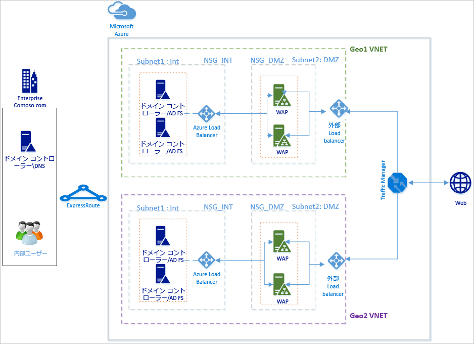
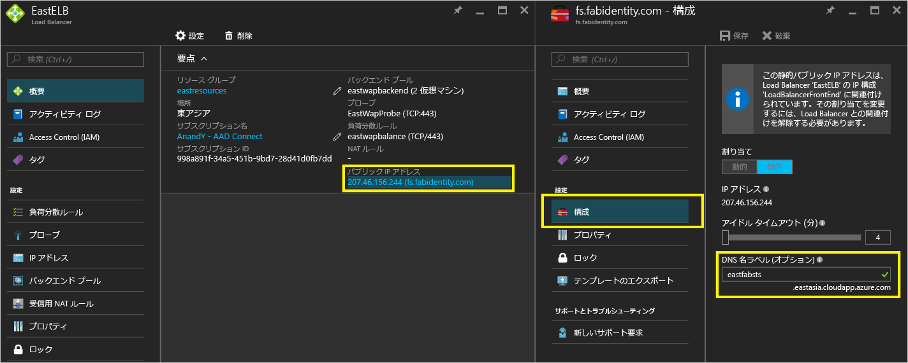
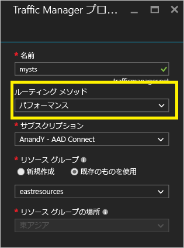
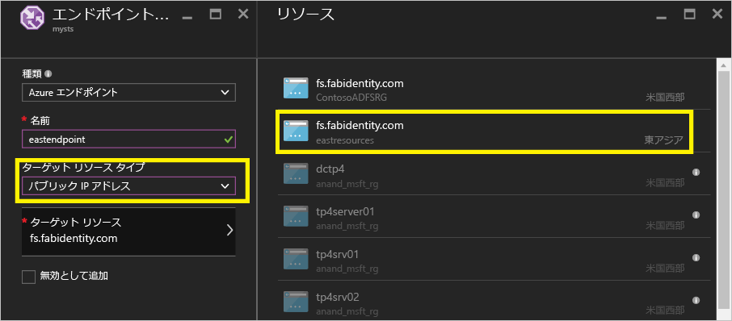
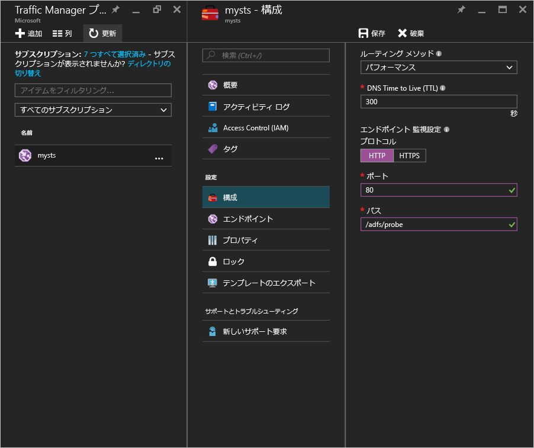
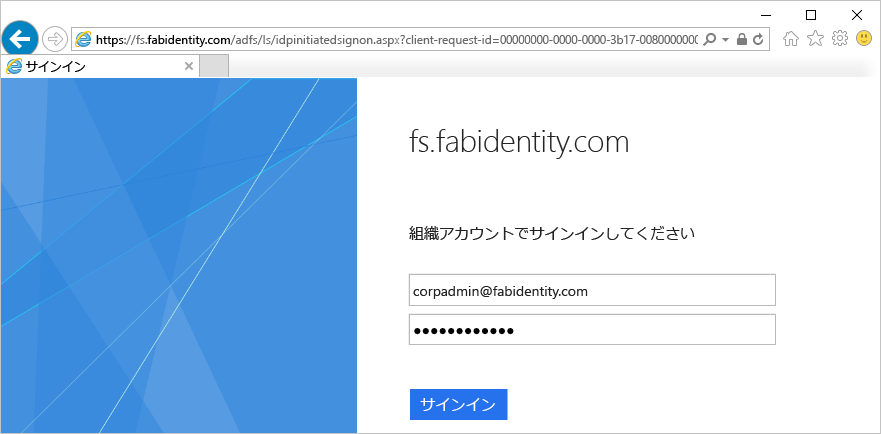
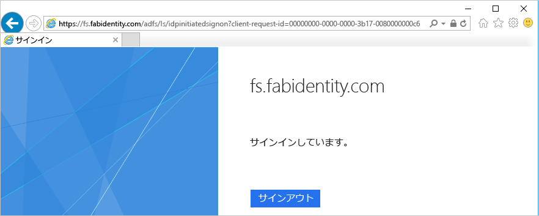

# Azure Traffic Manager を使用した Azure への可用性に優れた地域間 AD FS デプロイ
[Azure への AD FS のデプロイ](active-directory-aadconnect-azure-adfs.md) 」では、組織の簡単な AD FS インフラストラクチャを Azure にデプロイする方法について、詳細なガイドラインを示しています。 この記事では、その次の手順として、 [Azure Traffic Manager](../traffic-manager/traffic-manager-overview.md)を使用して Azure で AD FS の地域間デプロイを作成する手順について説明します。 Azure Traffic Manager を使用すると、インフラストラクチャのさまざまなニーズに合わせて使用可能な各種ルーティング方法を利用して、地理的に分散し、高い可用性とパフォーマンスを誇る AD FS インフラストラクチャを組織向けに作成できます。

可用性に優れた地域間 AD FS インフラストラクチャにより、次のことを実現できます。

* **単一障害点の排除:** Azure Traffic Manager のフェールオーバー機能により、世界のどこかでデータセンターが 1 か所ダウンした場合でも、高可用性 AD FS インフラストラクチャを実現できます。
* **パフォーマンスの向上:** この記事で推奨しているデプロイを使用すると、ユーザーの認証を高速化できる高パフォーマンスの AD FS インフラストラクチャを実現可能です。 

## 設計原則

基本的な設計原則は、「Azure への AD FS のデプロイ」の設計原則に記載されているものと同じです。 上記の図は、基本的なデプロイを別の地理的リージョンに単純に拡張したものを示しています。 デプロイを新しい地理的リージョンに拡張する際の考慮事項をいくつか次に示します。

* **仮想ネットワーク:** 追加の AD FS インフラストラクチャをデプロイする地理的リージョンに新しい仮想ネットワークを作成する必要があります。 上記の図では、一方の地理的リージョンに Geo1 VNET、もう一方に Geo2 VNET という 2 つの仮想ネットワークがあります。
* **新しい地域の VNET のドメイン コントローラーと AD FS サーバー:** 新しい地理的リージョンにドメイン コントローラーをデプロイすることをお勧めします。これにより、新しいリージョンの AD FS サーバーが認証を完了させるために遠くにある別のネットワークのドメイン コントローラーに問い合わせる必要がなくなるため、パフォーマンスが向上します。
* **ストレージ アカウント:** ストレージ アカウントは、リージョンに関連付けられています。 新しい地理的リージョンにマシンをデプロイするため、そのリージョンで使用する新しいストレージ アカウントを作成する必要があります。  
* **ネットワーク セキュリティ グループ:** ストレージ アカウントと同様に、あるリージョンで作成したネットワーク セキュリティ グループを別の地理的リージョンで使用することはできません。 そのため、最初の地理的リージョンのネットワーク セキュリティ グループに似た、INT と DMZ サブネットの新しいネットワーク セキュリティ グループを新しい地理的リージョンに作成する必要があります。
* **パブリック IP アドレスの DNS ラベル:** Azure Traffic Manager は、エンドポイントを参照する際に、必ず DNS ラベルを利用します。 そのため、外部ロード バランサーのパブリック IP アドレスの DNS ラベルを作成する必要があります。
* **Azure Traffic Manager:** Microsoft Azure Traffic Manager では、世界各地のさまざまなデータセンターで実行されているサービス エンドポイントへのユーザー トラフィックの分散を制御できます。 Azure Traffic Manager は、DNS レベルで動作します。 これは、DNS 応答を使用して、エンドユーザーのトラフィックをグローバルに分散されたエンドポイントに送信します。 その後、クライアントは、それらのエンドポイントに直接接続します。 パフォーマンス、重み付け、優先度という各種ルーティング オプションが用意されており、組織のニーズに最適なルーティング オプションを簡単に選択できます。 
* **2 つのリージョン間の VNET 間接続:** 仮想ネットワーク自体の間の接続は不要です。 各仮想ネットワークはドメイン コントローラーにアクセスでき、仮想ネットワーク内に AD FS および WAP サーバーが存在します。そのため、異なるリージョンの仮想ネットワーク間の接続がなくても、機能します。 

## Azure Traffic Manager を統合する手順
### 新しい地理的リージョンに AD FS をデプロイする
「 [Azure への AD FS のデプロイ](active-directory-aadconnect-azure-adfs.md) 」の手順とガイドラインに従って、新しい地理的リージョンに同じトポロジをデプロイします。

### インターネットに接続された (パブリック) ロード バランサーのパブリック IP アドレスの DNS ラベル
前述のように、Azure Traffic Manager はエンドポイントとして DNS ラベルしか参照できないため、外部ロード バランサーのパブリック IP アドレスの DNS ラベルを作成することが重要です。 下のスクリーンショットは、パブリック IP アドレスの DNS ラベルを構成する方法を示しています。 

### Azure Traffic Manager をデプロイする
以下の Traffic Manager プロファイルの作成手順に従います。 詳細については、「 [Azure Traffic Manager プロファイルの管理](../traffic-manager/traffic-manager-manage-profiles.md)」もご覧ください。

1. **Traffic Manager プロファイルの作成:** Traffic Manager プロファイルに一意の名前を付けます。 このプロファイルの名前は、DNS 名の一部となり、Traffic Manager ドメイン名のラベルのプレフィックスとして機能します。 この名前/プレフィックスが .trafficmanager.net に追加され、Traffic Manager の DNS ラベルが作成されます。 次のスクリーンショットでは Traffic Manager の DNS プレフィックスが mysts に設定されているため、DNS ラベルは mysts.trafficmanager.net になります。 
   
    
2. **トラフィック ルーティング方法:** Traffic Manager では、次の 3 つのルーティング オプションを使用できます。
   
   * 優先順位 
   * パフォーマンス
   * 重み付け
     
     **パフォーマンス** は、応答性の高い AD FS インフラストラクチャを実現する場合にお勧めのオプションです。 ただし、デプロイ ニーズに最適なルーティング方法を選択できます。 AD FS 機能は、選択したルーティング オプションの影響を受けません。 詳細については、「 [Traffic Manager のトラフィック ルーティング方法](../traffic-manager/traffic-manager-routing-methods.md) 」をご覧ください。 上記のサンプルのスクリーンショットでは、方法として **[パフォーマンス]** が選択されています。
3. **エンドポイントの構成:** Traffic Manager のページで、エンドポイントをクリックし、[追加] をクリックします。 次のスクリーンショットのような [エンドポイントの追加] ページが開きます。
   
   
   
   さまざまな入力項目については、次のガイドラインに従います。
   
   **[種類]:** ここでは Azure のパブリック IP アドレスを指定するため、[Azure エンドポイント] を選択します。
   
   **[名前]:** エンドポイントに関連付ける名前を作成します。 これは DNS 名ではありません。また、DNS レコードに影響することもありません。
   
   **[ターゲット リソースの種類]:** このプロパティの値として [パブリック IP アドレス] を選択します。 
   
   **[ターゲット リソース]:** サブスクリプションで使用できるさまざまな DNS ラベルから選択できます。 構成しているエンドポイントに対応する DNS ラベルを選択します。
   
   Azure Traffic Manager でトラフィックをルーティングする地理的リージョンごとにエンドポイントを追加します。
   Traffic Manager のエンドポイントを構成および追加する方法の詳細と手順については、「 [エンドポイントの追加と削除、有効化と無効化](../traffic-manager/traffic-manager-endpoints.md)
4. **プローブの構成:** Traffic Manager のページで、[構成] をクリックします。 構成ページで、HTTP ポート 80 と相対パス /adfs/probe でプローブするようにモニターの設定を変更する必要があります。
   
     
   
   > [!NOTE]
   > **構成が完了したら、エンドポイントの状態がオンラインであることを確認します**。 すべてのエンドポイントが "低下" 状態の場合、Azure Traffic Manager は、診断が間違っており、すべてのエンドポイントが到達可能であると想定して、トラフィックをルーティングしようとします。
   > 
   > 
5. **Azure Traffic Manager の DNS レコードの変更:** フェデレーション サービスは、Azure Traffic Manager の DNS 名に対する CNAME である必要があります。 だれがフェデレーション サービスへのアクセスを試みても Azure Traffic Manager に実際にアクセスできるように、パブリック DNS レコードで CNAME を作成します。
   
    たとえば、フェデレーション サービス fs.fabidentity.com が Traffic Manager を参照するようにするには、DNS リソース レコードを次のように更新する必要があります。
   
    <code>fs.fabidentity.com IN CNAME mysts.trafficmanager.net</code>

## ルーティングと AD FS のサインインをテストする
### ルーティング テスト
ルーティングの非常に基本的なテストでは、各地理的リージョンのコンピューターからフェデレーション サービスの DNS 名に対して ping を実行します。 ping の表示には、選択したルーティング方法に応じて、実際に ping を実行するエンドポイントが反映されます。 たとえば、パフォーマンス ルーティングを選択した場合、クライアントのリージョンに最も近いエンドポイントにアクセスします。 次のスナップショットは、2 つの異なるリージョン (東アジアと米国西部) のクライアント コンピューターからの 2 つの ping を示しています。 

### AD FS のサインイン テスト
AD FS をテストする最も簡単な方法は、IdpInitiatedSignon.aspx ページを使用する方法です。 そのためには、AD FS のプロパティで IdpInitiatedSignOn を有効にする必要があります。 以下の手順に従って AD FS の設定を確認してください。

1. AD FS サーバーで PowerShell から以下のコマンドレットを実行し、このプロパティを有効にします。 
   Set-AdfsProperties -EnableIdPInitiatedSignonPage $true
2. 外部のコンピューターから https://<yourfederationservicedns>/adfs/ls/IdpInitiatedSignon.aspx にアクセスします。
3. 以下の AD FS ページが表示されたら成功です。
   
    
   
    サインインに成功すると、その旨のメッセージが表示されます (下図)。
   
    

## 関連リンク
* [Azure への基本的な AD FS のデプロイ](active-directory-aadconnect-azure-adfs.md)
* [Microsoft Azure のトラフィック マネージャー](../traffic-manager/traffic-manager-overview.md)
* [Traffic Manager のトラフィック ルーティング方法](../traffic-manager/traffic-manager-routing-methods.md)

## 次のステップ
* [Azure Traffic Manager プロファイルの管理](../traffic-manager/traffic-manager-manage-profiles.md)
* [エンドポイントの追加と削除、有効化と無効化](../traffic-manager/traffic-manager-endpoints.md) 

<!--HONumber=Nov16_HO4-->

