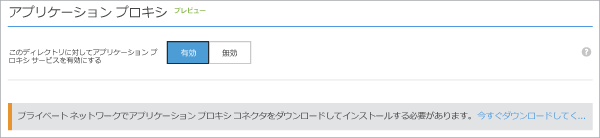

# Azure ポータルでアプリケーション プロキシを有効にする
この記事では、Microsoft Azure AD アプリケーション プロキシを Azure AD のクラウド ディレクトリに対して有効にする手順について説明します。

アプリケーション プロキシが何に役立つのかよくわからない場合は、「 [オンプレミス アプリケーションへの安全なリモート アクセスを実現する方法](active-directory-application-proxy-get-started.md)」で詳細を確認してください。

## アプリケーション プロキシの前提条件
アプリケーション プロキシ サービスを有効にして使用するためには、次の条件を満たしておく必要があります。

* [Microsoft Azure AD の Basic または Premium サブスクリプション](active-directory-editions.md) に加え、自分が全体管理者となっている Azure AD ディレクトリ。
* アプリケーション プロキシ コネクタをインストールできる Windows Server 2012 R2 または Windows 8.1 以降が実行されているサーバー。 このサーバーは、クラウド内のアプリケーション プロキシ サービスに要求を送信します。また、発行するアプリケーションには HTTP または HTTPS で接続する必要があります。
  
  * 発行したアプリケーションへのシングル サインオンを実行するには、そのアプリケーションと同じ AD ドメインにこのコンピューターが参加済みであることが必要です。 詳細については、「[アプリケーション プロキシを使用したシングル サインオン](active-directory-application-proxy-sso-using-kcd.md)」を参照してください。
* 経路上にファイアウォールがある場合、コネクタからアプリケーション プロキシに HTTPS (TCP) 要求を送信できるように、ファイアウォールを開放する必要があります。 コネクタは、上位ドメイン msappproxy.net および servicebus.windows.net に属しているサブドメインと併せて、以下のポートを使用します。 以下の各ポートを **送信** トラフィックに対して開放してください。
  
  | ポート番号 | 説明 |
  | --- | --- |
  | 80 |セキュリティ検証用の送信 HTTP トラフィックに使用されます。 |
  | 443 |Azure AD に対するユーザー認証に使用されます (コネクタ登録プロセスでのみ必要)。 |
  | 10100–10120 |プロキシに送り返される LOB HTTP 応答に使用されます。 |
  | 9352、5671 |コネクタと Azure サービスの間で受信要求の通信に使用されます。 |
  | 9350 |省略可能。受信要求のパフォーマンス向上に使用されます。 |
  | 8080 |コネクタのブートストラップ シーケンスのほか、コネクタの自動更新に使用されます。 |
  | 9090 |コネクタの登録に使用されます (コネクタ登録プロセスでのみ必要)。 |
  | 9091 |コネクタの信頼証明書の自動更新に使用されます。 |
  
    ご利用のファイアウォールが送信元ユーザーに応じてトラフィックを監視している場合は、Network Service として実行されている Windows サービスを送信元とするトラフィックに対してこれらのポートを開放します。 また、NT Authority\System に対しては必ずポート 8080 を有効にしてください。
* [Azure AD アプリケーション プロキシ コネクタ ポート テスト ツール](https://aadap-portcheck.connectorporttest.msappproxy.net/)を使用して、コネクタが、アプリケーション プロキシ サービスにアクセスできることを確認します。 少なくとも、米国中部リージョンと自分に最も近いリージョンにすべて緑色のチェックマークが表示されていることを確認します。 さらに、緑色のチェックマークが多いほど、リカバリ性が高いことを意味します。 
* 組織でインターネットへの接続にプロキシ サーバーを使用している場合、その構成方法の詳細については、[既存のオンプレミス プロキシ サーバーの操作](https://blogs.technet.microsoft.com/applicationproxyblog/2016/03/07/working-with-existing-on-prem-proxy-servers-configuration-considerations-for-your-connectors/)に関するブログ記事を参照してください。

## 手順 1: Azure AD でのアプリケーション プロキシの有効化
1. [Azure クラシック ポータル](https://manage.windowsazure.com/)に管理者としてサインインします。
2. Active Directory に移動し、アプリケーション プロキシを有効にするディレクトリを選択します。
   
    
3. ディレクトリ ページから **[構成]** を選択し、下へスクロールして **[アプリケーション プロキシ]** まで移動します。
4. **[このディレクトリに対してアプリケーション プロキシ サービスを有効にする]** を **[有効]** に切り替えます。
   
    
5. **[今すぐダウンロード]**を選択します。 これにより、 **Azure AD アプリケーション プロキシ コネクタのダウンロード**ページが表示されます。 ライセンス条項を読んで同意し、 **[ダウンロード]** をクリックして、コネクタの Windows インストーラー ファイル (.exe) を保存します。

## 手順 2: コネクタのインストールと登録
1. 前提条件に従って用意したサーバーで、 **AADApplicationProxyConnectorInstaller.exe** を実行します。
2. ウィザードの指示に従ってインストールします。
3. インストール時に、Azure AD テナントのアプリケーション プロキシにコネクタを登録するように求められます。
   
   * Azure AD グローバル管理者の資格情報を指定します。 グローバル管理者のテナントは、Microsoft Azure の資格情報とは異なる場合があります。
   * コネクタを登録する管理者が属しているディレクトリは、アプリケーション プロキシ サービスを有効にしたディレクトリと同じになるようにしてください。 たとえば、テナントのドメインが contoso.com の場合、管理者は admin@contoso.com またはそのドメイン上の他のエイリアスであることが必要です。
   * コネクタをインストールするサーバーで **[IE セキュリティ強化の構成]** を **[オン]** に設定している場合、登録画面がブロックされることがあります。 エラー メッセージに示された指示に従って、アクセスを許可してください。 Internet Explorer セキュリティ強化の構成が無効になっていることを確認します。
   * コネクタの登録が成功しない場合は、「 [アプリケーション プロキシのトラブルシューティング](active-directory-application-proxy-troubleshoot.md)」をご覧ください。  
4. インストールが完了すると、次に示す&2; つの新しいサービスがサーバーに追加されます。
   
   * **Microsoft AAD アプリケーション プロキシ コネクタ** : 接続を有効にします。
     
     * **Microsoft AAD アプリケーション プロキシ コネクタ アップデーター** : 定期的にコネクタの新しいバージョンをチェックし、必要に応じてコネクタを更新する自動更新サービスです。
     
     
5. インストール ウィンドウで、 **[完了]** をクリックします。

コネクタの詳細については、「[Understand Azure AD Application Proxy connectors (Azure AD アプリケーション プロキシ コネクタについて)](application-proxy-understand-connectors.md)」を参照してください。 

高可用性を確保するには、コネクタを少なくとも&2; つデプロイする必要があります。 追加のコネクタをデプロイするには、上記の手順 2. と手順 3. を繰り返します。 各コネクタは個別に登録する必要があります。

コネクタをアンインストールする場合は、コネクタ サービスと更新サービスの両方をアンインストールします。 コンピューターを再起動して、サービスを完全に削除します。

## 次のステップ
[アプリケーション プロキシを使用してアプリケーションを発行](active-directory-application-proxy-publish.md)する準備がこれで整いました。

別のネットワークや異なる場所にアプリケーションがある場合、コネクタ グループを使用すると、さまざまなコネクタで論理ユニットを編成することができます。 アプリケーション プロキシ コネクタの使用方法の詳細については、 [こちら](active-directory-application-proxy-connectors.md)を参照してください。

