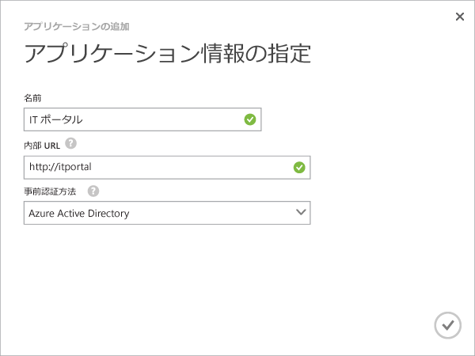
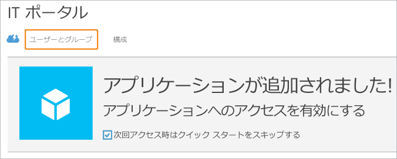
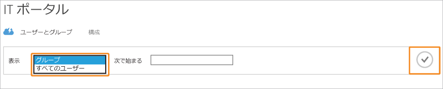
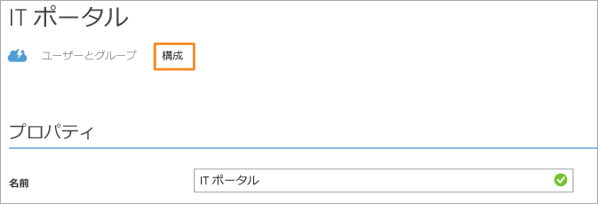

# Azure AD アプリケーション プロキシを使用してアプリケーションを発行する

> [!div class="op_single_selector"]
> * [Azure ポータル](application-proxy-publish-azure-portal.md)
> * [Azure クラシック ポータル](active-directory-application-proxy-publish.md)

Azure AD アプリケーション プロキシでは、オンプレミスのアプリケーションを発行してインターネット経由でアクセスできるため、リモート ワーカーのサポートに役立ちます。 この記事を読んでいる時点では、既に [Azure クラシック ポータルでアプリケーション プロキシを有効にした](active-directory-application-proxy-enable.md)状態になっています。 この記事では、ローカル ネットワークで実行中のアプリケーションを発行し、ネットワークの外部からのセキュリティで保護されたリモート アクセスを有効にする手順について説明します。 この記事の手順を最後まで実行すると、個人用に設定した情報やセキュリティ要件でアプリケーションを構成する準備が整います。

> [!NOTE]
> アプリケーション プロキシは、Azure Active Directory の Premium または Basic エディションにアップグレードしている場合にのみ利用できる機能です。 詳細については、「 [Azure Active Directory のエディション](active-directory-editions.md)」をご覧ください。
> 
> 

## ウィザードを使用してアプリを発行する
1. [Azure クラシック ポータル](https://manage.windowsazure.com/)に管理者としてサインインします。
2. Active Directory に移動し、アプリケーション プロキシを有効にしたディレクトリを選択します。
   
    
3. **[アプリケーション]** タブをクリックし、画面下部にある **[追加]** をクリックします。
   
    ![[アプリケーションの追加]](./media/active-directory-application-proxy-publish/aad_appproxy_selectdirectory.png)
4. **[ネットワーク外部からアクセスできるアプリケーションを発行します]**を選択します。
   
    ![[ネットワーク外部からアクセスできるアプリケーションを発行します]](./media/active-directory-application-proxy-publish/aad_appproxy_addapp.png)
5. アプリケーションについて以下の情報を入力します。
   
   * **名前**: アプリケーションのわかりやすい名前。 ディレクトリ内で一意の名前にする必要があります。
   * **内部 URL**: プライベート ネットワーク内からアプリケーションにアクセスするために、アプリケーション プロキシ コネクタで使用されるアドレス。 バックエンド サーバー上の特定のパスを指定して発行できます。この場合、サーバーのそれ以外のパスは発行されません。 この方法では、同じサーバー上の複数のサイトを発行し、それぞれのサイトに独自の名前とアクセス規則を付与することができます。
     
     > [!TIP]
     > パスを発行する場合は、アプリケーションに必要な画像、スクリプト、スタイル シートが、すべてそのパスに含まれていることを確認してください。 たとえば、アプリケーションが https://yourapp/app にあり、https://yourapp/media にある画像を使用する場合は、パスとして https://yourapp/ を発行する必要があります。
     > 
     > 
   * **事前認証方法**: アプリケーション プロキシでユーザーにアプリケーションへのアクセス権を付与する前に、そのユーザーを確認する方法。 ドロップダウン メニューから、いずれかのオプションを選択します。
     
     * Azure Active Directory: アプリケーション プロキシによってユーザーが Azure AD のサインイン ページにリダイレクトされます。これにより、ディレクトリとアプリケーションに対するユーザーのアクセス許可が認証されます。
     * パススルー: ユーザーは、アプリケーションにアクセスするために認証を行う必要はありません。
     
       
6. ウィザードを終了するには、画面下部にあるチェック マークをクリックします。 これで、アプリケーションが Azure AD で定義されました。

## アプリケーションにユーザーとグループを割り当てる
発行したアプリケーションにユーザーがアクセスできるようにするには、それらのユーザーを個別またはグループで割り当てる必要があります。 (自分自身へのアクセス権の割り当ても忘れずに行ってください)。これを実行するには、各ユーザーに Azure Basic 以上のライセンスが必要です。 ライセンスは個別に割り当てることも、グループに対して割り当てることもできます。 詳細については、 [アプリケーションへのユーザーの割り当て](active-directory-applications-guiding-developers-assigning-users.md) に関するページを参照してください。 

事前認証を必要とするアプリの場合は、これによって、アプリを使用するためのアクセス許可がユーザーに付与されます。 事前認証を必要としないアプリの場合でも、ユーザーをアプリに割り当てることで、そのアプリが各ユーザーのアプリケーションの一覧 (MyApps など) に表示されるようになります。

1. アプリの追加ウィザードを終了すると、アプリケーションの [クイック スタート] ページが表示されます。 アプリにアクセスできるユーザーを管理するには、 **[ユーザーとグループ]**を選択します。
   
    
2. ディレクトリ内の特定のグループを検索するか、すべてのユーザーを表示します。 検索結果を表示するには、チェック マークをクリックします。
   
      
3. このアプリに割り当てる各ユーザーまたはグループを選択し、 **[割り当て]**をクリックします。 このアクションを確認するように求められます。

> [!NOTE]
> 統合 Windows 認証アプリでは、オンプレミスの Active Directory から同期したユーザーとグループのみを割り当てることができます。 Microsoft アカウントでサインインしているユーザーやゲストを、Azure Active Directory アプリケーション プロキシを使用して発行したアプリに割り当てることはできません。 サインイン時に、発行するアプリと同じドメインの資格情報をユーザーが使用するようにしてください。
> 
> 

## 発行したアプリケーションをテストする
アプリケーションを発行した後は、発行した URL に移動することで、そのアプリケーションをテストできます。 アプリケーションにアクセスできること、正しくレンダリングされること、すべてが期待どおりに動作することを確認します。 問題が発生したり、エラー メッセージが表示されたりする場合は、 [トラブルシューティング ガイド](active-directory-application-proxy-troubleshoot.md)を参照してください。

## アプリケーションの作成
[構成] ページで、発行したアプリの変更や詳細オプションの設定が可能です。 このページでは、名前の変更やロゴのアップロードによってアプリをカスタマイズできます。 また、事前認証方法や多要素認証のようなアクセス ルールを管理することもできます。

Azure Active Directory アプリケーション プロキシを使用してアプリケーションを発行すると、それらのアプリケーションが Azure AD の [アプリケーション] リストに表示され、そこで管理できるようになります。

アプリケーションの発行後にアプリケーション プロキシ サービスを無効にした場合、プライベート ネットワークの外部からは、そのアプリケーションにアクセスできなくなります。 これによって、アプリケーションが削除されることはありません。

アプリケーションを表示し、アクセス可能かどうかを確認するには、そのアプリケーションの名前をダブルクリックします。 アプリケーション プロキシ サービスが無効になっていて、アプリケーションが使用できない場合は、画面上部に警告メッセージが表示されます。

アプリケーションを削除するには、リスト内のアプリケーションを選択し、 **[削除]**をクリックします。

## 次のステップ
* [独自のドメイン名でアプリケーションを発行する](active-directory-application-proxy-custom-domains.md)
* [シングル サインオンを有効にする](active-directory-application-proxy-sso-using-kcd.md)
* [条件付きアクセスを有効にする](active-directory-application-proxy-conditional-access.md)
* [要求に対応するアプリケーションを利用する](active-directory-application-proxy-claims-aware-apps.md)

最新のニュースと更新情報については、 [アプリケーション プロキシに関するブログ](http://blogs.technet.com/b/applicationproxyblog/)

<!--HONumber=Jan17_HO2-->

