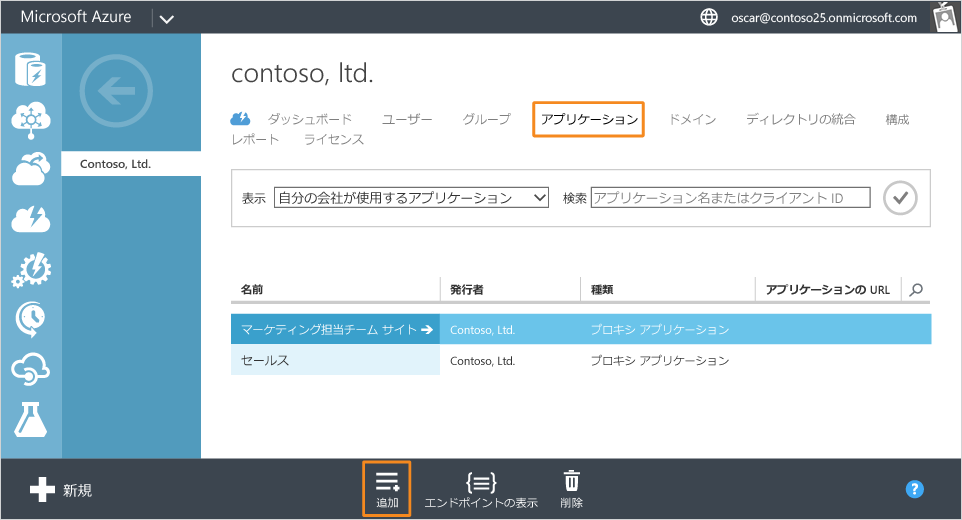
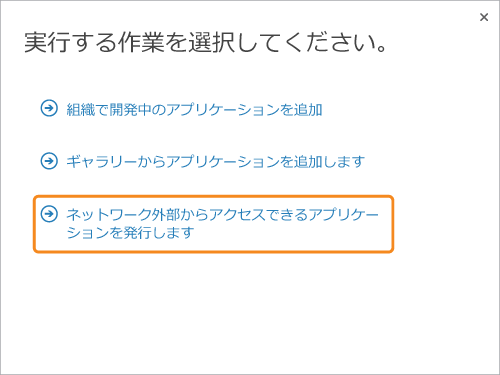

<properties
	pageTitle="Azure AD アプリケーション プロキシを使用したアプリの発行 | Microsoft Azure"
	description="Azure AD アプリケーション プロキシを使用してオンプレミスのアプリケーションを発行する方法について説明します。"
	services="active-directory"
	documentationCenter=""
	authors="kgremban"
	manager="stevenpo"
	editor=""/>

<tags
	ms.service="active-directory"
	ms.workload="identity"
	ms.tgt_pltfrm="na"
	ms.devlang="na"
	ms.topic="article"
	ms.date="02/09/2016"
	ms.author="kgremban"/>

# Azure AD アプリケーション プロキシを使用してアプリケーションを発行する

> [AZURE.NOTE] アプリケーション プロキシは、Azure Active Directory の Premium または Basic エディションにアップグレードしている場合にのみ利用できる機能です。詳細については、「[Azure Active Directory のエディション](active-directory-editions.md)」をご覧ください。

Microsoft Azure Active Directory (AD) アプリケーション プロキシを有効にすると、プライベート ネットワークの外部のユーザーからアクセスできるように、アプリケーションを発行できます。

この記事では、ネットワークの外部からのセキュリティで保護されたリモート アクセスを有効にする、ローカル ネットワークで実行中のアプリケーションを発行するための手順について説明します。

> [AZURE.NOTE] コネクタが正しく動作しているか確認するには、実際のアプリケーションを発行する前に、最初に発行するアプリケーションをプライベート ネットワーク内からアクセス可能な任意の Web サイトにすることで、ユーザーがインターネットからアクセスできるようにする必要があります。

## ウィザードを使用してアプリを発行する

1. 任意のブラウザーを開いて、Azure クラシック ポータルに移動します。
2. Azure クラシック ポータルの左側のペインで、**[Active Directory]** タブをクリックします。
3. アプリケーション プロキシを有効にした、アプリケーションの発行先のディレクトリ (Wingtip Toys など) をクリックします。
4. **[アプリケーション]** タブをクリックし、画面下部にある **[追加]** をクリックします

	

5. **[作業内容]** ダイアログ ボックスで、**[ネットワークの外部からアクセス可能なアプリケーションを発行]** をクリックします。

	

6. 画面上の指示に従い、アプリケーションに関する以下の情報を入力します。

| **プロパティ** | **詳細** |
|---|---|
| 外部 URL | これはクラウド サービスの URL で、プライベート ネットワークの外部からアプリケーションにアクセスする際に使用します。この URL は、指定した名前に基づき、サフィックス msappproxy.net を使用して自動生成されます。 |
| 事前認証方法 | アプリケーションで使用する事前認証方法の種類を設定します。  a. Azure Active Directory – ユーザーがアプリケーションにアクセスしようとすると、ユーザーは Azure AD を使用してログインするようアプリケーション プロキシによってリダイレクトされます。これによってユーザーが認証され、ディレクトリとアプリケーションに対して必要なアクセス許可を持っていることが確認されます。   b. パス スルー – 事前認証は実行されません。 |
| 外部 URL プロトコル | 既定では、アプリケーションは HTTPS プロトコルを使用して発行されます。サービスは、http を含む URL を入力したユーザーを自動的にリダイレクトします。  内部アプリケーションに対して HTTP を有効にするには、[事前認証] を [パススルー] に設定する必要があります。これにより、外部 URL プロトコルを HTTPS から HTTP に変更できるようになります。HTTP を使用してアプリケーションを発行すると、アプリケーションおよびユーザーに対してセキュリティ上の問題が発生する場合があります。  既定のサフィックス Msappproxy.net を使用する代わりに、カスタム ドメインを挿入することができます。詳細については、「[Azure AD アプリケーション プロキシでのカスタム ドメインの使用](active-directory-application-proxy-custom-domains.md)」を参照してください。 |
| 内部 URL | これは、アプリケーション プロキシ コネクタがアプリケーションへの内部的なアクセスのために使用する内部 URL です。プライベート ネットワークの内部からアプリケーションにアクセスするために使用する、発行済みアプリケーションの URL にする必要があります。これは、スペースや記号が含まれていない有効な URL です。  バックエンド サーバー上の特定のパスを指定して発行できます。この場合、サーバーのそれ以外のパスは発行されません。これにより、たとえば、同じ SharePoint サーバー上にある、名前とアクセス規則が異なるさまざまなサイトを発行することができます。  パスは、内部 URL フィールドで指定され、外部 URL に表示されます。内部と外部のパスが同一である必要があります。 |

  

  ウィザードを終了するには、画面下部にあるチェック マークをクリックします。これで、アプリケーションが Azure AD で定義されました。

## アプリケーションにユーザーとグループを割り当てる

1. 事前認証済みのアプリには、アプリにアクセスできるようにするユーザーとグループを割り当てる必要があります。パススルーのアプリには、すべてのユーザーがアクセスできます。ただし、アプリケーション リスト内のアプリをユーザーに表示するためには、そのユーザーにアプリを割り当てる必要があります。

2. アプリの追加ウィザードを終了すると、[アプリケーション プロキシのクイック スタート] ページが表示されます。ユーザーを割り当てるには、**[ユーザーの割り当て]** をクリックします。

	

3. このアプリに割り当てる各ユーザーまたはグループを選択し、**[割り当て]** をクリックします。

> [AZURE.NOTE] 統合 Windows 認証アプリでは、オンプレミスの Active Directory から同期したユーザーとグループのみを割り当てることができます。Microsoft アカウントでログインしているユーザーやゲストを、Azure Active Directory アプリケーション プロキシを使用して発行したアプリに割り当てることはできません。割り当てるユーザーが、発行するアプリと同じドメインに含まれる資格情報を、ログイン時に使用するようにしてください。

## 詳細な構成

1. [構成] ページから、発行済みのアプリの変更や、オンプレミスのアプリケーションへの SSO などの高度なオプションの構成ができます。

	

2. アプリを選択し、**[構成]** をクリックします。以下のオプションを使用できます。

**設定** | **詳細**
---|---
名前 | アプリケーションのわかりやすい名前を指定します。
外部 URL | これはクラウド サービスの URL で、プライベート ネットワークの外部からアプリケーションにアクセスする際に使用します。この URL は、指定した名前に基づき、サフィックス msappproxy.net を使用して自動生成されます。
事前認証方法 | アプリケーションで使用する事前認証方法の種類を設定します。  a. Azure Active Directory – ユーザーがアプリケーションにアクセスしようとすると、ユーザーは Azure AD を使用してログインするようアプリケーション プロキシによってリダイレクトされます。これによってユーザーが認証され、ディレクトリとアプリケーションに対して必要なアクセス許可を持っていることが確認されます。   b. パス スルー – 事前認証は実行されません。
外部 URL プロトコル | 既定では、アプリケーションは HTTPS プロトコルを使用して発行されます。サービスは、http を含む URL を入力したユーザーを自動的にリダイレクトします。  内部アプリケーションに対して HTTP を有効にするには、[事前認証] を [パススルー] に設定する必要があります。これにより、外部 URL プロトコルを HTTPS から HTTP に変更できるようになります。HTTP を使用してアプリケーションを発行すると、アプリケーションおよびユーザーに対してセキュリティ上の問題が発生する場合があります。  既定のサフィックス Msappproxy.net を使用する代わりに、カスタム ドメインを挿入することができます。詳細については、「[Azure AD アプリケーション プロキシでのカスタム ドメインの使用](active-directory-application-proxy-custom-domains.md)」を参照してください。
内部 URL | これは、アプリケーション プロキシ コネクタがアプリケーションへの内部的なアクセスのために使用する内部 URL です。プライベート ネットワークの内部からアプリケーションにアクセスするために使用する、発行済みアプリケーションの URL にする必要があります。これは、スペースや記号が含まれていない有効な URL です。  バックエンド サーバー上の特定のパスを指定して発行できます。この場合、サーバーのそれ以外のパスは発行されません。これにより、たとえば、同じ SharePoint サーバー上にある、名前とアクセス規則が異なるさまざまなサイトを発行することができます。  パスは、内部 URL フィールドで指定され、外部 URL に表示されます。内部と外部のパスが同一である必要があります。
ヘッダーの URL を変換する | HTTP ホスト ヘッダーが変換されていないことが必要なアプリケーション (一部の SharePoint 構成など) については、これを **[いいえ]** に設定します。この設定により、要求ヘッダーと応答ヘッダーの両方に対するヘッダー変換が無効になります。
内部認証方法 | 事前認証にアプリケーション プロキシを使用する場合、内部認証方法を設定すると、ユーザーがこのアプリケーションへのシングル サインオン (SSO) を活用できるようになります。  アプリケーションで IWA を使用する場合、**[統合 Windows 認証 (IWA)]** を選択すると、このアプリケーションに対する SSO が有効になるように Kerberos の制約付き委任 (KCD) を構成することができます。IWA を使用するアプリケーションは KCD を使用して構成する必要があります。そうしないと、アプリケーション プロキシでこれらのアプリケーションを発行できません。  アプリケーションで IWA を使用しない場合、**[なし]** を選択します。  詳細については、「[アプリケーション プロキシを使用したシングル サインオン](active-directory-application-proxy-sso-using-kcd.md)」を参照してください。
内部アプリケーション SPN | これは、オンプレミスのアプリケーション プロキシで構成されている、内部アプリケーションのサービス プリンシパル名 (SPN) です。SPN は、Kerberos の制約付き委任 (KCD) を使用してアプリケーションの Kerberos トークンを取得するため、アプリケーション プロキシ コネクタによって使用されます。  詳細については、「[アプリケーション プロキシを使用したシングル サインオン](active-directory-application-proxy-sso-using-kcd.md)」をご覧ください。

Azure Active Directory アプリケーション プロキシを使用してアプリケーションを発行すると、それらのアプリケーションが Azure AD の [アプリケーション] リストに表示され、そこで管理できるようになります。

アプリケーションの発行後にアプリケーション プロキシ サービスを無効にした場合、アプリケーションは削除されませんが、プライベート ネットワークの外部からそのアプリケーションにアクセスできなくなります。

アプリケーションを表示し、アクセス可能かどうかを確認するには、そのアプリケーションの名前をダブルクリックします。アプリケーション プロキシ サービスが無効になっていて、アプリケーションが使用できない場合は、画面上部に警告メッセージが表示されます。

アプリケーションを削除するには、リスト内のアプリケーションを選択し、**[削除]** をクリックします。

## 関連項目
アプリケーション プロキシを使ってできることは他にもたくさんあります。

- [アプリケーション プロキシを有効にする](active-directory-application-proxy-enable.md)
- [独自のドメイン名でアプリケーションを発行する](active-directory-application-proxy-custom-domains.md)
- [シングル サインオンを有効にする](active-directory-application-proxy-sso-using-kcd.md)
- [条件付きアクセスを有効にする](active-directory-application-proxy-conditional-access.md)
- [要求に対応するアプリケーションを利用する](active-directory-application-proxy-claims-aware-apps.md)
- [アプリケーション プロキシで発生した問題のトラブルシューティングを行う](active-directory-application-proxy-troubleshoot.md)

## アプリケーション プロキシに関するその他の情報
- [オンライン ヘルプ](active-directory-application-proxy-enable.md)
- [アプリケーション プロキシに関するブログ](http://blogs.technet.com/b/applicationproxyblog/)
- [Channel 9 ビデオ](http://channel9.msdn.com/events/Ignite/2015/BRK3864)

## その他のリソース
- [Article Index for Application Management in Azure Active Directory](active-directory-apps-index.md)
- [Kerberos の制約付き委任について](http://technet.microsoft.com/library/cc995228.aspx)

<!---HONumber=AcomDC_0211_2016-->