<properties
   pageTitle="Azure Active Directory B2B コラボレーション プレビューの使用方法に関する詳細なチュートリアル | Microsoft Azure"
   description="Azure Active Directory B2B コラボレーションは、会社のアプリケーションにビジネス パートナーが選択的にアクセスできるようにすることで会社間のリレーションシップをサポートします"
   services="active-directory"
   documentationCenter=""
   authors="viv-liu"
   manager="cliffdi"
   editor=""
   tags=""/>

<tags
   ms.service="active-directory"
   ms.devlang="NA"
   ms.topic="get-started-article"
   ms.tgt_pltfrm="NA"
   ms.workload="identity"
   ms.date="02/10/2016"
   ms.author="viviali"/>

# Azure AD B2B コラボレーション プレビュー: 詳細なチュートリアル

このチュートリアルでは、Azure AD B2B コラボレーションの使用方法について説明します。Contoso の IT 管理者は、パートナー企業 3 社の従業員とアプリケーションを共有することを検討しています。パートナー企業側が Azure AD を導入する必要はありません。

- Simple Partner Org の Alice
- Medium Partner Org の Bob は、複数のアプリに対するアクセス権が必要です
- Complex Partner Org の Carol は、複数のアプリに対するアクセス権だけでなく、Contoso 社内のグループのメンバーシップも必要です

パートナー ユーザーに招待を送信した後に、Azure AD でそれらのユーザーを構成し、Azure ポータルを使用してアプリに対するアクセス権とグループのメンバーシップを付与することができます。まず Alice を追加してみましょう。

## Alice を Contoso のディレクトリに追加する
1. 次のような見出しの .csv ファイルを作成し、Alice の **[Email]**、**[DisplayName]**、**[InviteContactUsUrl]** のみを登録します。**[DisplayName]** は、招待に記載する名前です。Contoso 社の Azure AD ディレクトリに表示される名前にもなります。**[InviteContactUsUrl]** は、Alice から Contoso に連絡するときの窓口です。次の例では、Contoso 社の LinkedIn プロフィールを指定しています。.csv ファイルの 1 行目の見出しは、この例と同じ順序、同じスペルで作成することが重要です。以下の CSV 形式のセクションを参照してください。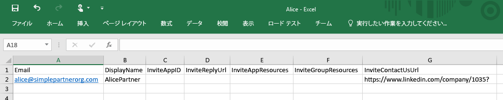

2. Azure ポータルで、Contoso 社のディレクトリにユーザーを追加します ([Active Directory] > [Contoso] > [ユーザー] > [ユーザーの追加])。[ユーザーの種類] ドロップダウンで [パートナー会社のユーザー] を選択します。.csv ファイルをアップロードします。.csv ファイルを閉じてから、アップロードしてください。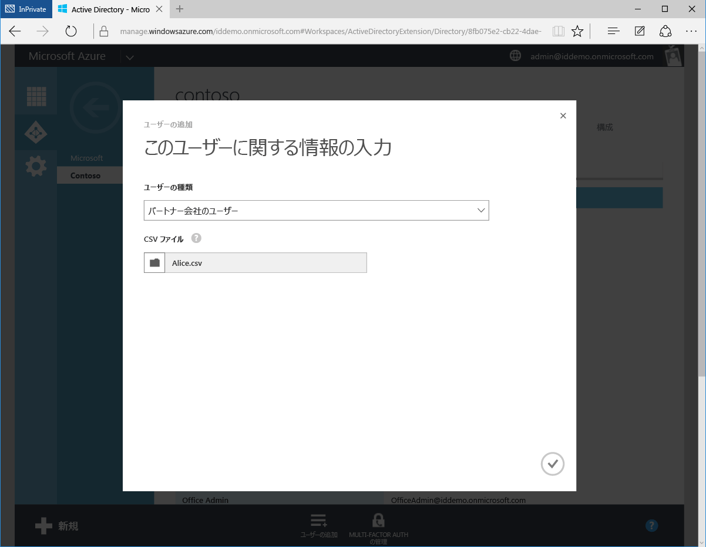

3. Alice は、Contoso 社の Azure AD ディレクトリに外部ユーザーとして表示されるようになりました。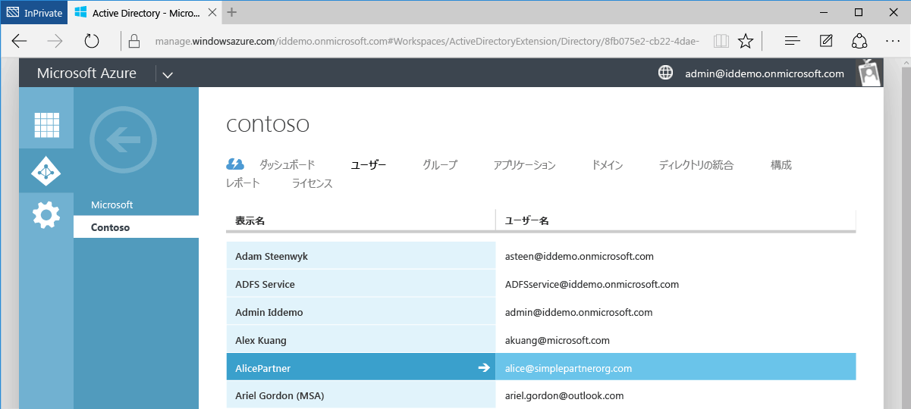

4. Alice 側から見ると、Alice は次の電子メールを受信します。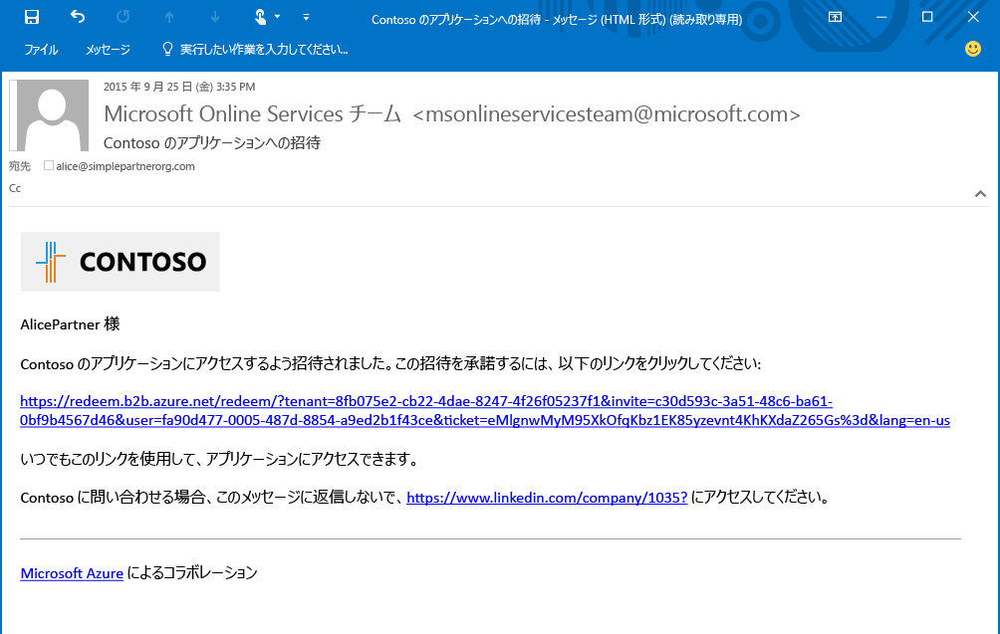

5. Alice がリンクをクリックすると、招待を受け、会社の資格情報を使用してサインインするように求められます。Alice が Azure AD ディレクトリに登録されていない場合、サインアップするように求められます。

6. Alice はアプリ アクセス パネルにリダイレクトされます。アプリへのアクセス権が付与されるまで、空のページが表示されます。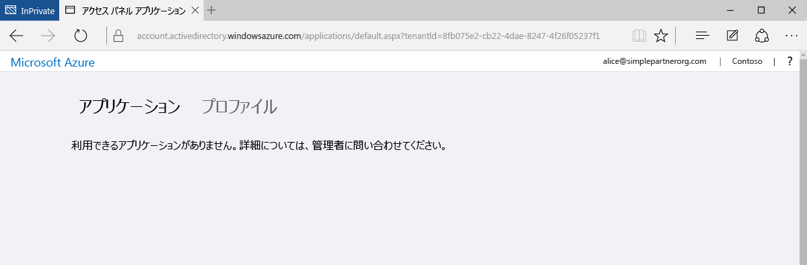

これが B2B コラボレーションの最も単純な形式です。Alice は Contoso 社の Azure AD ディレクトリのユーザーになったので、Azure ポータルでアプリケーションやグループに対するアクセス権を Alice に付与できます。次に Bob を追加してみましょう。Bob は、アプリケーション Moodle と Salesforce に対するアクセス権が必要です。

## Bob を Contoso 社のディレクトリに追加し、アプリへのアクセスを許可する
1. Azure AD モジュールがインストールされている Windows PowerShell を使用して、Moodle と Salesforce のアプリケーション ID を検索します。次のコマンドレットを使用して ID を取得できます。`Get-MsolServicePrincipal | fl DisplayName, AppPrincipalId` このコマンドレットの結果、Contoso 社で使用できるすべてのアプリケーションと、その AppPrincialId の一覧が表示されます。

2. .csv ファイルを作成して、Bob の [Email]、[DisplayName]、**[InviteAppID]**、**[InviteAppResources]**、[InviteContactUsUrl] を登録します。**InviteAppResources** には、Moodle と Salesforce の AppPrincipalId (PowerShell で確認できます) をスペース区切りで入力します。下図の下線は、上の PowerShell のスクリーンショットに示されている緑色と青色の枠の ID に対応しています。**InviteAppId** には、電子メールとサインイン ページのブランド設定と同じ AppPrincipalId を入力します。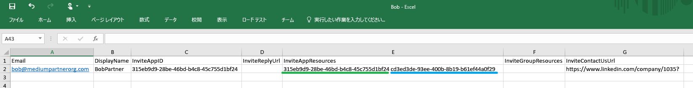

3. Alice の場合と同様に、Azure ポータルで .csv ファイルをアップロードします。Bob は Contoso 社の Azure AD ディレクトリの外部ユーザーになりました。

4. Bob は次の電子メールを受信します。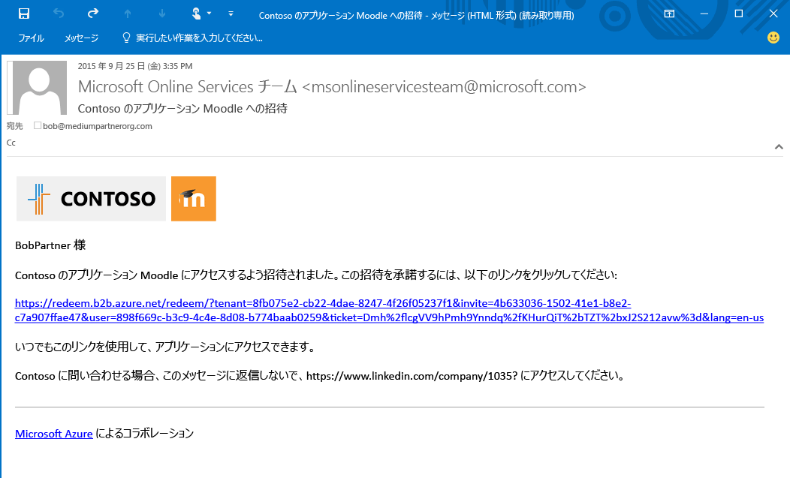

5. Bob はリンクをクリックし、招待を受けるように求められます。サインインすると、アクセス パネルが表示され、Moodle と Salesforce 使用できる状態になります。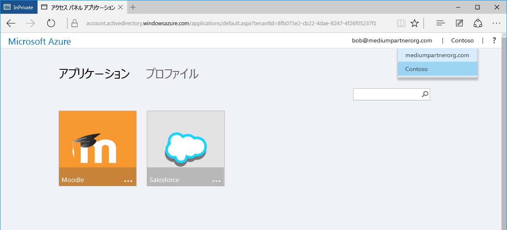

次に Carol を追加しましょう。Carol は、アプリケーションに対するアクセス権だけでなく、Contoso 社のディレクトリ内にあるグループのメンバーシップも必要です。

## Carol を Contoso 社のディレクトリに追加し、アプリケーションに対するアクセス権を付与し、グループのメンバーシップを与える

1. Azure AD モジュールがインストールされている Windows PowerShell を使用して、Contoso 社内のアプリケーション ID とグループ ID を検索します。
 - Bob の場合と同様に、`Get-MsolServicePrincipal | fl DisplayName, AppPrincipalId` コマンドレットを使用して AppPrincipalId を取得します。
 - `Get-MsolGroup | fl DisplayName, ObjectId` コマンドレットを使用して、グループの ObjectId を取得します。その結果、Contoso 社社内のすべてのグループとその ObjectId の一覧が表示されます。グループ ID を取得するには、Azure ポータルのグループの [プロパティ] タブで [オブジェクト ID] を確認する方法もあります。

2. .csv ファイルを作成して、Carol の [Email]、[DisplayName]、[InviteAppID]、[InviteAppResources]、**[InviteGroupResources]**、[InviteContactUsUrl] を登録します。**[InviteGroupResources]** には、グループ MyGroup1 と Externals の ObjectId をスペース区切りで入力します。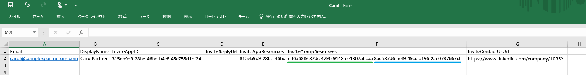

3. Azure ポータルで .csv ファイルをアップロードします。

4. Carol は、Contoso 社のディレクトリのユーザーになり、次の Azure ポータルの図のように、グループ MyGroup1 と Externals のメンバーになりました。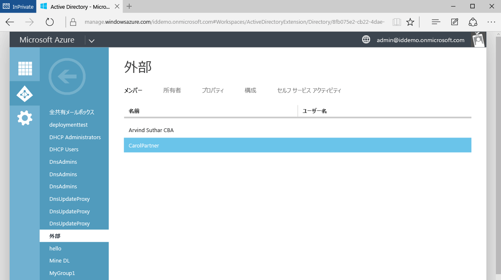

5. Carol は、招待を受けるリンクが記載された電子メールを受信します。サインイン後は、アプリ アクセス パネルにリダイレクトされ、Moodle と Salesforce へのアクセス権が付与されます。

Azure AD B2B コラボレーションのパートナー企業のユーザーを追加する手順は以上です。このチュートリアルでは、Alice、Bob、Carol を 3 つの .csv ファイルで追加しましたが、実際には 1 つの .csv ファイルで簡単に 3 人を追加することができます。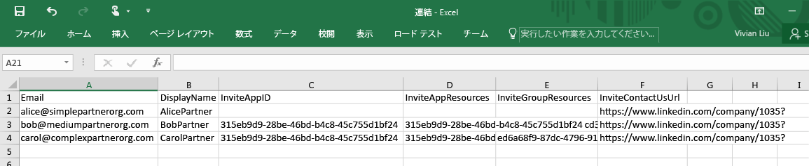

## 関連記事:
Azure AD B2B コラボレーションに関する他の記事を参照してください。

- [Azure AD B2B コラボレーションとは](active-directory-b2b-what-is-azure-ad-b2b.md)
- [動作のしくみ](active-directory-b2b-how-it-works.md)
- [CSV ファイル形式リファレンス](active-directory-b2b-references-csv-file-format.md)
- [外部ユーザー トークンの形式](active-directory-b2b-references-external-user-token-format.md)
- [外部ユーザー オブジェクト属性の変更](active-directory-b2b-references-external-user-object-attribute-changes.md)
- [現在のプレビューの制限事項](active-directory-b2b-current-preview-limitations.md)
- [Azure Active Directory のアプリケーション構成の管理に関する記事の索引](active-directory-apps-index.md)

<!----HONumber=AcomDC_0218_2016-->