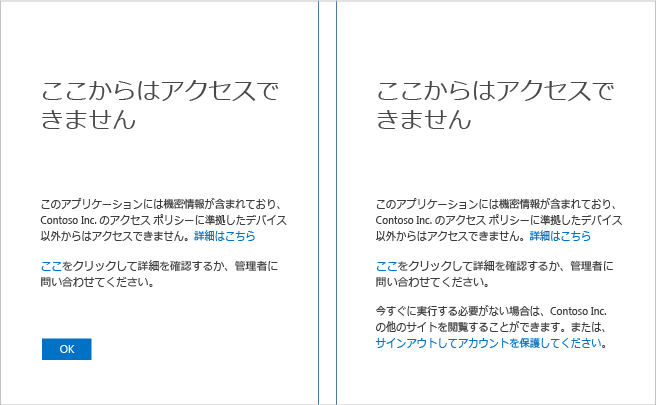
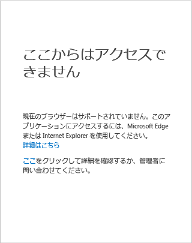

<properties
	pageTitle="トラブルシューティング: 目的の場所にアクセスできない | Microsoft Azure"
	description="このトピックは、アプリケーションにアクセスできるようにするための修復手順を確認する際に役立ちます。"
	services="active-directory"
	keywords="デバイス ベースの条件付きアクセス, デバイス登録, デバイス登録の有効化, デバイス登録と MDM"
	documentationCenter=""
	authors="markusvi"
	manager="femila"
	editor=""/>

<tags
	ms.service="active-directory"
	ms.workload="identity"
	ms.tgt_pltfrm="na"
	ms.devlang="na"
	ms.topic="get-started-article"
	ms.date="08/23/2016"
	ms.author="markvi"/>

# トラブルシューティング: 目的の場所にアクセスできない

SharePoint Online などのアプリケーションにアクセスする際にアクセス拒否ページが表示された場合は、どうすればよいのでしょうか。

このガイドは、アプリケーションにアクセスできるようにするための修復手順を確認する際に役立ちます。

デバイスで実行されているデバイス プラットフォームは何ですか。 この質問に対する回答によって、このトピック内の適切なセクションが決まります。

-	Windows デバイス
-	iOS デバイス (iPhone または iPad)
-	Android デバイス

## Windows デバイスからのアクセス

デバイスで Windows 10、Windows 8.1、Windows 8.0、Windows 7、Windows Server 2016、Windows Server 2012 R2、Windows Server 2012、Windows Server 2008 R2 のいずれかを実行している場合は、アプリケーションにアクセスしようとしたときに表示されたページを確認することで、適切な原因を特定します。

### デバイスが登録されていない

デバイスが Azure Active Directory (Azure AD) に登録されていない場合、アプリケーションがデバイス ベースのポリシーで保護されていると、次の内容のページが表示される可能性があります。

デバイスが組織の Active Directory ドメインに参加している場合は、次の手順を試すことができます。

1.	職場アカウント (Active Directory アカウント) を使用して Windows にサインインしていることを確認します。
2.	VPN または DirectAccess を使用して企業ネットワークに接続します。
3.	接続したら、Windows キーと L キーを同時に押して Windows セッションをロックします。
4.	職場アカウントの資格情報を入力して、Windows セッションのロックを解除します。
5.	しばらく待ってから、アプリケーションにもう一度アクセスしてみます。
6.	同じページが表示された場合は、管理者に連絡し、**[詳細]** リンクをクリックすると表示される詳細情報をお伝えください。

デバイスがドメインに参加しておらず、Windows 10 を実行している場合、次の 2 つの選択肢があります。

- Azure AD Join を実行する。
- 職場または学校アカウントを Windows に追加する。

この 2 つの違いについては、「[職場での Windows 10 デバイスの使用](active-directory-azureadjoin-windows10-devices.md)」を参照してください。

Azure AD Join を実行するには、次の手順に従います (Windows Phone では実行できません)。

**Windows 10 Anniversary Update**

1.	**[設定]** アプリを開きます。
2.	**[アカウント]**、**[職場または学校にアクセスする]** の順にクリックします。
3.	**[接続]** をクリックします。
4.	ページの下部にある **[Join this device to Azure AD (このデバイスを Azure AD に参加させる)]** をクリックします。
5.	組織に対して認証し、必要に応じて Multi-Factor Authentication を証明するものを提示して、完了するまで手順に従います。
6.	サインアウトしてから、職場アカウントを使用してサインインします。
7.	アプリケーションにもう一度アクセスしてみます。

**Windows 10 November 2015 Update**

1.	**[設定]** アプリを開きます。
2.	**[システム]**、**[バージョン情報]** の順にクリックします。
3.	**[Azure AD に参加]** をクリックします。
4.	組織に対して認証し、必要に応じて Multi-Factor Authentication を証明するものを提示して、完了するまで手順に従います。
5.	サインアウトしてから、職場アカウント (Azure AD アカウント) を使用してサインインします。
6.	アプリケーションにもう一度アクセスしてみます。

職場または学校アカウントを追加するには、次の手順を実行します。

**Windows 10 Anniversary Update**

1.	**[設定]** アプリを開きます。
2.	**[アカウント]**、**[職場または学校にアクセスする]** の順にクリックします。
3.	**[接続]** をクリックします。
4.	組織に対して認証し、必要に応じて Multi-Factor Authentication を証明するものを提示して、完了するまで手順に従います。
5.	アプリケーションにもう一度アクセスしてみます。

**Windows 10 November 2015 Update**

1.	**[設定]** アプリを開きます。
2.	**[アカウント]**、**[Your accounts (自分のアカウント)]** の順にクリックします。
3.	**[Add work or school account (職場または学校アカウントを追加)]** をクリックします。
4.	組織に対して認証し、必要に応じて Multi-Factor Authentication を証明するものを提示して、完了するまで手順に従います。
5.	アプリケーションにもう一度アクセスしてみます。

デバイスがドメインに参加しておらず、Windows 8.1 を実行している場合は、Workplace Join を実行し、次の手順に従って、Microsoft Intune に登録できます。

1.	**[PC 設定]** を開きます。
2.	**[ネットワーク]**、**[社内]** の順にクリックします。
3.	**[結合]** をクリックします。
4.	組織に対して認証し、必要に応じて Multi-Factor Authentication を証明するものを提示して、完了するまで手順に従います。
5.	**[オン]** をクリックします。
6.	完了するまで待ちます。
7.	アプリケーションにもう一度アクセスしてみます。

## サポートされていないブラウザー

次のブラウザーからアプリケーションにアクセスすると、前に表示されたものと似たページが表示されます。

- Windows 10 または Windows Server 2016 の場合、Chrome や Firefox など、Microsoft Edge および Microsoft Internet Explorer 以外のブラウザー。
- Windows 8.1、Windows 7、Windows Server 2012 R2、Windows Server 2012、または Windows Server 2008 R2 の場合、Firefox。

唯一の修復方法は、デバイスのプラットフォーム向けにアプリケーションでサポートされているブラウザーを使用することです。

## iOS デバイスからのアクセス
iPhone または iPad の手順については、後日このページでもう一度ご確認ください。

## Android デバイスからのアクセス
Android フォンまたはタブレットの手順については、後日このページでもう一度ご確認ください。

## 次のステップ

[Azure Active Directory の条件付きアクセス](active-directory-conditional-access.md)

<!-------HONumber=AcomDC_0831_2016-->