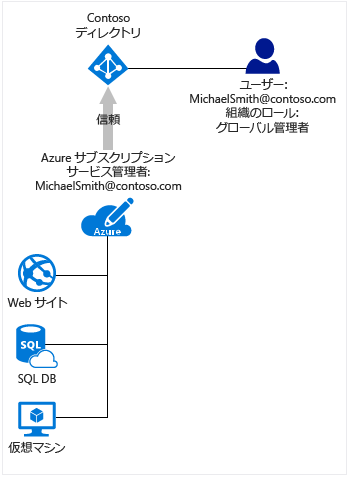

# Azure サブスクリプションを Azure Active Directory に関連付ける方法
この記事では、Azure サブスクリプションと Azure Active Directory (Azure AD) との関係、および既存のサブスクリプションを Azure AD ディレクトリに追加する方法について取り上げます。

## Azure サブスクリプションと Azure AD の関係
ご利用の Azure サブスクリプションには、Azure AD との間に信頼関係があります。つまり、Azure サブスクリプションは、ユーザー、サービス、デバイスの認証に関して Azure AD ディレクトリを信頼します。 複数のサブスクリプションが同じディレクトリを信頼することはできますが、各サブスクリプションが信頼するディレクトリは 1 つだけです。 

サブスクリプションとディレクトリの間の信頼関係は、サブスクリプションと Azure 内の他のリソース (Web サイト、データベースなど) の間の関係とは異なります。 サブスクリプションの有効期限が切れた場合、サブスクリプションに関連付けられた他のリソースへのアクセスも停止します。 一方、Azure AD ディレクトリは Azure 内に残っており、別のサブスクリプションをそのディレクトリに関連付けたうえで、新しいサブスクリプションを使ってディレクトリを管理することができます。

すべてのユーザーにはそのユーザーを認証する 1 つのホーム ディレクトリがありますが、ユーザーは他のディレクトリのゲストになることもできます。 Azure AD で見えるのは、自分のユーザー アカウントが従属している (または guest になっている) ディレクトリだけです。

## Azure AD とクラウド サービスのサブスクリプション
Azure AD は、ほとんどの Microsoft クラウド サービスの背後にある、次のようなコア ディレクトリおよび ID 管理機能を提供します。

* Azure
* Microsoft Office 365
* Microsoft Dynamics CRM オンライン
* Microsoft Intune

これらの Microsoft クラウド サービスのいずれかにサインアップすると、Azure AD サービスが無料で提供されます。 別の Azure サブスクリプションを Azure AD ディレクトリに追加する場合は、Microsoft アカウントでサインインする必要があります。 職場または学校アカウントで Azure にサインインした場合は、既存のディレクトリに Azure サブスクリプションを追加することはできません。職場または学校アカウントを Azure で直接認証することはできないためです。 

## 既存のサブスクリプションを Azure AD ディレクトリに追加するには
対象サブスクリプションが関連付けられている現在のディレクトリとその追加先となるディレクトリとの両方に存在するアカウントでサインインする必要があります。 

1. 所有権を譲渡するサブスクリプションのアカウント管理者であるアカウントで [Azure アカウント センター](https://account.windowsazure.com/Home/Index)にサインインします。
2. サブスクリプションの所有者となるユーザーが、譲渡先のディレクトリに存在することを確認します。
3. **[サブスクリプションの譲渡]** をクリックします。
4. 譲渡先を指定します。 譲渡先には、承認用のリンクが記載された電子メールが自動的に送信されます。
5. 譲渡先のユーザーは、リンクをクリックして指示に従います (支払情報の入力など)。 受信者が継承すると、サブスクリプションが譲渡されます。 
6. サブスクリプションの既定のディレクトリが、譲渡先のユーザーが属しているディレクトリに変更されます。

## サブスクリプションとディレクトリの両方を管理するうえでの推奨事項
Azure サブスクリプションの管理ロールは、Azure サブスクリプションに関連付けられているリソースを管理します。 このセクションでは、Azure サブスクリプションの管理者と Azure AD ディレクトリの管理者との違いについて説明します。 管理者ロールについて、また、それらを使ってサブスクリプションを管理するうえでのその他の推奨事項については、「[Azure Active Directory での管理者ロールの割り当て](active-directory-assign-admin-roles.md)」を参照してください。

既定では、サインアップすると、サービス管理者ロールを割り当てられます。 他のユーザーが同じサブスクリプションを使用してサインインし、サービスにアクセスする必要がある場合は、共同管理者として追加できます。 

Azure AD には、ディレクトリおよび ID 関連の機能を管理するために異なる管理ロールのセットがあります。 たとえば、ディレクトリのグローバル管理者は、ディレクトリにユーザーとグループを追加でき、ユーザーに多要素認証を要求できます。 ディレクトリを作成するユーザーはグローバル管理者ロールに割り当てられ、他のユーザーに管理者ロールを割り当てることができます。 Azure AD 管理ロールは、Office 365 や Microsoft Intune などの他のサービスによっても使用されます。 

Azure サブスクリプション管理者と Azure AD ディレクトリ管理者は 2 つの異なるロールです。 
* Azure サブスクリプション管理者は、Azure 内のリソースを管理できるほか、Azure Portal で Azure AD を使用することができます (Azure Portal 自体も Azure リソースであるため)。 
* ディレクトリ管理者が管理できるプロパティは、Azure AD ディレクトリ内のプロパティだけです。

1 人のユーザーが両方のロールになることができますが、これは必須ではありません。 ディレクトリのグローバル管理者を、Azure サブスクリプションのサービス管理者または共同管理者として割り当てることはできません。その逆も同様です。 ユーザーは、サブスクリプションの管理者にならなくても Azure Portal にサインインできますが、そのサブスクリプションのディレクトリをポータルから管理することはできません。 ただし、そのユーザーは Azure AD PowerShell や Office 365 管理センターなど他のツールを使用して、ディレクトリを管理することができます。

## 次のステップ
* Azure サブスクリプションの管理者を変更する方法について詳しくは、「[Azure サブスクリプションの所有権を別のアカウントに譲渡する](../billing/billing-subscription-transfer.md)」を参照してください。
* Microsoft Azure でリソース アクセスを制御する方法の詳細については、「 [Azure でのリソース アクセスについて](active-directory-understanding-resource-access.md)
* Azure AD でロールを割り当てる方法の詳細については、「 [Azure Active Directory (Azure AD) の管理者ロールの割り当て](active-directory-assign-admin-roles-azure-portal.md)

<!--Image references-->
[1]: ./media/active-directory-how-subscriptions-associated-directory/WAAD_PassThruAuth.png
[2]: ./media/active-directory-how-subscriptions-associated-directory/WAAD_OrgAccountSubscription.png
[3]: ./media/active-directory-how-subscriptions-associated-directory/WAAD_SignInDisambiguation.PNG

