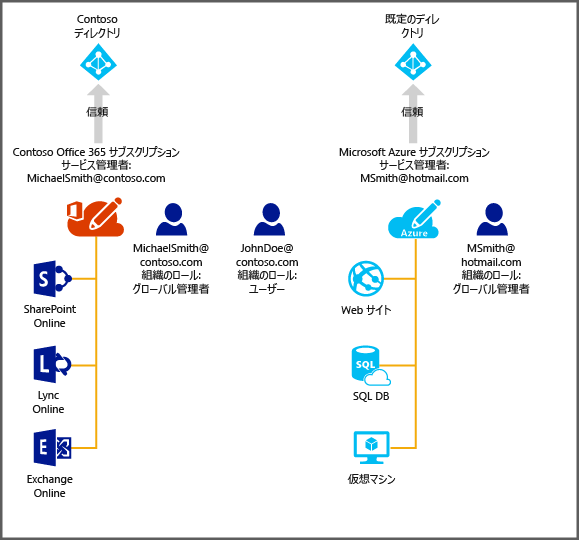

# Azure での Office 365 サブスクリプションのディレクトリの管理
この記事では、Office 365 サブスクリプションに対して作成されたディレクトリを Azure クラシック ポータルを使用して管理する方法について説明します。 Azure クラシック ポータルにサインインするには、Azure サブスクリプションのサービス管理者または共同管理者であることが必要です。 Azure サブスクリプションをお持ちでない場合、 [30 日間無料試用版](https://azure.microsoft.com/trial/get-started-active-directory/) に今すぐサインアップすると、このリンクを使用して、初めてのクラウド ソリューションを 5 分以内にデプロイできます。 Office 365 へのサインインに使用している職場または学校アカウントを使用してください。

Azure サブスクリプションの手続きが完了したら、Azure クラシック ポータルにサインインして、Azure のサービスにアクセスできます。 Office 365 ユーザーを認証するディレクトリと同じディレクトリを管理するには、Active Directory 拡張機能をクリックします。

Azure サブスクリプションを既に持っている場合、追加のディレクトリを管理するプロセスも単純です。 たとえば、Michael Smith は Contoso.com の Office 365 サブスクリプションを持っています。 また、自分の Microsoft アカウント msmith@hotmail.com を使ってサインアップした Azure サブスクリプションを持っています。 この場合、彼は&2; つのディレクトリを管理します。

| サブスクリプション | Office 365 | Azure |
| --- | --- | --- |
|   表示名 |Contoso |既定の Azure Active Directory (Azure AD) ディレクトリ |
|   ドメイン名 |contoso.com |msmithhotmail.onmicrosoft.com |

彼は、自分の Microsoft アカウントを使って Azure にサインインしているときに Contoso ディレクトリ内のユーザー ID を管理したいと考えています。これは、多要素認証などの Azure AD の機能を有効にできるためです。 プロセスを確認するには次の図が役立ちます。

この場合、2 つのディレクトリは相互に独立しています。

## 2 つの独立したディレクトリを管理するには
Michael Smith が msmith@hotmail.com, として Azure にサインインしているときに両方のディレクトリを管理するには、次の手順を実行する必要があります。

> [!NOTE]
> この手順は、ユーザーが Microsoft アカウントでサインインしているときにのみ実行できます。 ユーザーが職場または学校アカウントでサインインしている場合、 **[既存のディレクトリの使用]** オプションは利用できません。 職場または学校アカウントは、アカウントのホーム ディレクトリ (職場または学校アカウントが格納されている、企業または学校が所有するディレクトリ) でのみ認証できます。
>
>

1. [Azure クラシック ポータル](https://manage.windowsazure.com)に msmith@hotmail.com としてサインインします。
2. **[新規]** > **[App Services]** > **[Active Directory]** > **[ディレクトリ]** > **[カスタム作成]** をクリックします。
3. [既存のディレクトリの使用] をクリックし、 **[サインアウトする準備ができました]** チェック ボックスをオンにします。
4. Contoso.onmicrosoft.com のグローバル管理者 (たとえば、msmith@contoso.com) として Azure クラシック ポータルにサインインします。
5. **[Azure で Contoso ディレクトリを使用しますか?]** というメッセージが表示されたら、**[続行]** をクリックします。
6. **[今すぐサインアウト]**をクリックします。
7. Azure クラシック ポータルに msmith@hotmail.com としてサインインします。 Contoso ディレクトリと既定のディレクトリが Active Directory 拡張機能に表示されます。

これらの手順を完了すると、msmith@hotmail.com は Contoso ディレクトリのグローバル管理者になります。

## グローバル管理者としてリソースを管理するには
今度は、Jane Doe が msmith@hotmail.com の Azure サブスクリプションに関連付けられている管理者用 Web サイトとデータベース リソースを必要としているとします。 彼女がこれを行うには、Michael Smith が以下の追加手順を実行する必要があります。

1. Azure サブスクリプションのサービス管理者アカウント (この例では msmith@hotmail.com)) を使用して、[Azure クラシック ポータル](https://manage.windowsazure.com)にサインインします。
2. サブスクリプションを Contoso ディレクトリに移行します。**[設定]** > **[サブスクリプション]** をクリックし、サブスクリプションを選択します。**[ディレクトリの編集]** をクリックし、**[Contoso (Contoso.com)]** を選択します。 移行の一環として、サブスクリプションの共同管理者である職場または学校アカウントはすべて削除されます。
3. Jane Doe をサブスクリプションの共同管理者として追加します。**[設定]** > **[管理者]** をクリックし、サブスクリプションを選択します。**[追加]** をクリックし、「**JohnDoe@Contoso.com**」と入力します。

## 次のステップ
サブスクリプションとディレクトリの関係の詳細については、 [サブスクリプションをディレクトリに関連付ける方法](active-directory-how-subscriptions-associated-directory.md)に関するページを参照してください。

<!--HONumber=Feb17_HO2-->

