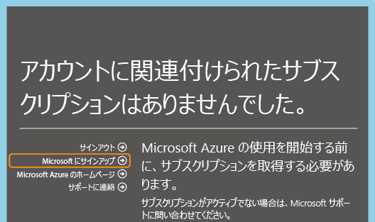

<properties
   pageTitle="Azure での Office 365 サブスクリプションのディレクトリの管理 | Microsoft Azure"
   description="Azure Active Directory と Azure クラシック ポータルを使用して Office 365 サブスクリプションのディレクトリを管理する方法"
   services="active-directory"
   documentationCenter=""
   authors="curtand"
   manager="femila"
   editor=""/>

<tags
   ms.service="active-directory"
   ms.devlang="na"
   ms.topic="get-started-article"
   ms.tgt_pltfrm="na"
   ms.workload="identity"
   ms.date="05/26/2016"
   ms.author="curtand"/>

# Azure での Office 365 サブスクリプションのディレクトリの管理

この記事では、Office 365 サブスクリプションに対して作成されたディレクトリを管理する方法について説明します。ここでは Azure クラシック ポータルを使用します。Azure クラシック ポータルにサインインするには、Azure サブスクリプションのサービス管理者または共同管理者である必要があります。Azure サブスクリプションをお持ちでない場合は、

1. Office 365 へのサインインに使用している職場または学校アカウントを使用してサインアップできます。

対応する Azure サブスクリプションは見つかりませんが、**[Microsoft Azure にサインアップ]** をクリックすると、Office 365 アカウントからの関連情報がサインアップ フォームに事前入力されます。同じアカウントがサービス管理者ロールに既定で割り当てられます。

Azure サブスクリプションの手続きが完了したら、Azure クラシック ポータルにサインインして、Azure のサービスにアクセスできます。Office 365 ユーザーを認証する同じディレクトリを管理するには、Active Directory 拡張機能をクリックします。

Azure サブスクリプションを既に持っている場合、追加のディレクトリを管理するプロセスも単純です。たとえば、Michael Smith は Contoso.com の Office 365 サブスクリプションを持っています。また、自分の Microsoft アカウント msmith@hotmail.com を使ってサインアップした Azure サブスクリプションを持っています。この場合、彼は 2 つのディレクトリを管理します。

 [サブスクリプション] | Office 365 | Azure
  -------------- | ------------- | -------------------------------
 表示名 | Contoso | 既定の Azure Active Directory (Azure AD) ディレクトリ
 ドメイン名 | contoso.com | msmithhotmail.onmicrosoft.com

彼は、自分の Microsoft アカウントを使って Azure にサインインしているときに Contoso ディレクトリ内のユーザー ID を管理したいと考えています。これは、多要素認証などの Azure AD の機能を有効にできるためです。プロセスを確認するには次の図が役立ちます。

この場合、2 つのディレクトリは相互に独立しています。

## 2 つの独立したディレクトリを管理するには
Michael Smith が msmith@hotmail.com で Azure にサインインしているときに両方のディレクトリを管理するには、次の手順を実行する必要があります。

> [AZURE.NOTE]
この手順は、ユーザーが Microsoft アカウントでサインインしているときにのみ実行できます。ユーザーが会社または学校のアカウントを使用してサインインしている場合、**[既存のディレクトリの使用]** オプションは使用できません。会社または学校のアカウントはそのホーム ディレクトリ (つまり、会社または学校のアカウントが保存され、会社または学校が所有しているディレクトリ) でのみ認証できるためです。

1.	[Azure クラシック ポータル](https://manage.windowsazure.com)に msmith@hotmail.com としてサインインします。
2.	**[新規]**、**[App Services]**、**[Active Directory]**、**[ディレクトリ]**、**[カスタム作成]** の順にクリックします。
3.	[既存のディレクトリの使用] をクリックし、**[サインアウトする準備ができました]** チェック ボックスをオンにします。
4.	Contoso.onmicrosoft.com のグローバル管理者 (たとえば、msmith@contoso.com) として Azure クラシック ポータルにサインインします。
5.	"**Azure で Contoso ディレクトリを使用しますか?**" という確認を求められたら、**[続行]** をクリックします。
6.	**[今すぐサインアウト]** をクリックします。
7.	Azure クラシック ポータルに msmith@hotmail.com としてサインインします。Contoso ディレクトリと既定のディレクトリが Active Directory 拡張機能に表示されます。

これらの手順を完了すると、msmith@hotmail.com は Contoso ディレクトリのグローバル管理者になります。

## グローバル管理者としてリソースを管理するには
今度は、Jane Doe が Azure クラシック ポータルにサインインし、msmith@hotmail.com の Azure サブスクリプションに関連付けられている Web サイトとデータベース リソースを管理する必要があるとします。彼女がこれを行うには、Michael Smith が以下の追加手順を実行する必要があります。

1.	Azure サブスクリプションのサービス管理者アカウント (この例では msmith@hotmail.com) を使って [Azure クラシック ポータル](https://manage.windowsazure.com)にサインインします。
2.	サブスクリプションを Contoso ディレクトリに移行します。**[設定]**、**[サブスクリプション]** の順にクリックし、サブスクリプションを選択します。**[ディレクトリの編集]** をクリックし、**[Contoso (Contoso.com)]** を選択します。移行の一環として、サブスクリプションの共同管理者である会社または学校のアカウントはすべて削除されます。
3.	Jane Doe をサブスクリプションの共同管理者として追加します。**[設定]**、**[管理者]** の順にクリックし、サブスクリプションを選択します。**[追加]** をクリックし、「****JohnDoe@Contoso.com**」と入力します。

##次のステップ
サブスクリプションとディレクトリの関係の詳細については、[サブスクリプションをディレクトリに関連付ける方法](active-directory-how-subscriptions-associated-directory.md)に関するページを参照してください。

<!---HONumber=AcomDC_0601_2016-->