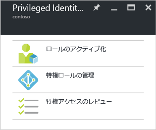

<properties
   pageTitle="Azure AD Privileged Identity Management の使用 | Microsoft Azure"
   description="Azure ポータルの Azure Active Directory Privileged Identity Management アプリケーションで特権 ID を管理する方法について説明します。"
   services="active-directory"
   documentationCenter=""
   authors="kgremban"
   manager="femila"
   editor=""/>

<tags
   ms.service="active-directory"
   ms.devlang="na"
   ms.topic="get-started-article"
   ms.tgt_pltfrm="na"
   ms.workload="identity"
   ms.date="09/16/2016"
   ms.author="kgremban"/>

# Azure AD Privileged Identity Management の使用

組織内のアクセス権は、Azure Active Directory (AD) Privileged Identity Management で管理、制御、監視することができます。その対象には、Azure AD をはじめとする Microsoft の各種オンライン サービス (Office 365、Microsoft Intune など) 内のリソースへのアクセスが含まれます。

この記事では、Azure AD PIM アプリを Azure ポータル ダッシュボードに追加する方法を説明します。

## Privileged Identity Management アプリケーションの追加

Azure AD Privileged Identity Management を使用するには、まず Azure ポータル ダッシュボードにアプリケーションを追加する必要があります。

1. ディレクトリのグローバル管理者として [Azure ポータル](https://portal.azure.com/)にサインインします。
2. 組織に複数のディレクトリがある場合は、Azure ポータルの右上隅に表示されているユーザー名を選択し、PIM を使用するディレクトリを選択します。
3. **[その他のサービス]** を選択し、[フィルター] テキスト ボックスを使用して **[Azure AD Privileged Identity Management]** を検索します。
4. **[ダッシュボードにピン留めする]** チェックボックスをオンにして、**[作成]** をクリックします。Privileged Identity Management アプリケーションが起動します。

ディレクトリ内で Azure AD Privileged Identity Management を使用する最初のユーザーには、[セキュリティ ウィザード](active-directory-privileged-identity-management-security-wizard.md)に最初の割り当て操作の手順が表示されます。手順を実行した後、ディレクトリの最初の**セキュリティ管理者**と**特権ロール管理者**に自動的に設定されます。特権ロール管理者だけが、このアプリケーションにアクセスして他の管理者のアクセスを管理できます。

## タスクへの移動

Azure AD Privileged Identity Management を設定すると、アプリケーションを開くたびにナビゲーション ブレードが表示されます。このブレードを使用して、ID 管理タスクを実行します。

- **[ロールをアクティブ化する]** を使用すると、自分に割り当てられているロールの一覧が表示されます。ここで、権限がある任意のロールをアクティブ化できます。

- **[特権ロールの管理]** は、特権ロール管理者がロール割り当ての管理、ロールのアクティブ化設定の変更、アクセス レビューの開始などを行うためのダッシュボードです。このダッシュボードのオプションは、特権ロール管理者以外に対しては無効になっています。

- **[特権アクセスのレビュー]** は、完了する必要がある保留中のすべてのアクセス レビューを表示します。自分自身のアクセスをレビューすることも、他のユーザーのアクセスをレビューすることもできます。

<!--Every topic should have next steps and links to the next logical set of content to keep the customer engaged-->
## 次のステップ

[Azure AD Privileged Identity Management の概要](active-directory-privileged-identity-management-configure.md)に関するページに、組織で管理アクセスを管理する方法の詳細が記載されています。

[AZURE.INCLUDE [active-directory-privileged-identity-management-toc](../../includes/active-directory-privileged-identity-management-toc.md)]

<!--Image references-->

[1]: ./media/active-directory-privileged-identity-management-configure/PIM_EnablePim.png

<!-------HONumber=AcomDC_0921_2016-->