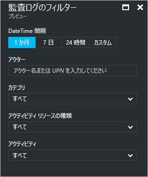
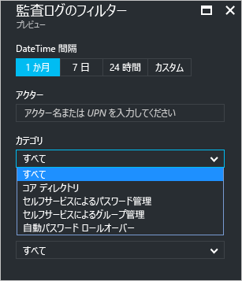
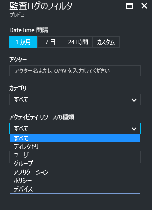
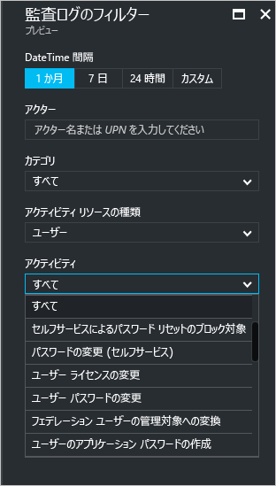
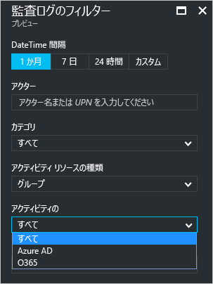

# Azure Active Directory ポータルの監査アクティビティ レポート - プレビュー

Azure Active Directory [プレビュー](active-directory-preview-explainer.md)のレポートでは、環境の動作状況を判断するために必要なすべての情報を取得できます。

Azure Active Directory のレポート アーキテクチャは、次のコンポーネントで構成されます。

- **アクティビティ** 
    - **サインイン アクティビティ** – マネージ アプリケーションの使用状況とユーザー サインイン アクティビティに関する情報
    - **監査ログ** - ユーザーとグループの管理、マネージ アプリケーション、およびディレクトリのアクティビティに関するシステム アクティビティ情報です。
- **セキュリティ** 
    - **リスクの高いサインイン** - リスクの高いサインインは、ユーザー アカウントの正当な所有者ではない人によって行われた可能性があるサインイン試行の指標です。 詳細については、「Risky sign-ins (リスクの高いサインイン)」を参照してください。
    - **リスクのフラグ付きユーザー** - リスクの高いユーザーは、侵害された可能性があるユーザー アカウントの指標です。 詳細については、「Users flagged for risk (リスクのフラグ付きユーザー)」を参照してください。

このトピックでは、監査アクティビティの概要を説明します。
 
## 監査ログ

Azure Active Directory の監査ログは、コンプライアンスのためにシステム アクティビティのレコードを提供します。

Azure Portal には、監査関連のアクティビティとして、次の&3; つの主要カテゴリがあります。

- [概要]   

- アプリケーション

- Directory   

監査レポート アクティビティの完全な一覧については、 [監査レポートのイベントの一覧](active-directory-reporting-audit-events.md#list-of-audit-report-events)を参照してください。

すべての監査データへのエントリ ポイントは、**[Azure Active Directory]** の **[アクティビティ]** セクションの **[監査ログ]** です。

監査ログには、アクター ("*だれが*")、アクティビティ ("*どうした*")、および対象を示すリスト ビューがあります。

リスト ビュー内の項目をクリックすると、その詳細が表示されます。

## ユーザーとグループの監査ログ

ユーザーとグループ ベースの監査レポートを使用すると、次のような疑問に対する答えを得ることができます。

- どの種類の更新プログラムがユーザーによって適用されているか。

- 何人のユーザーが変更されたか。

- 何個のパスワードが変更されたか。

- 管理者がディレクトリで何を行ったか。

- 追加されたのはどのグループか。

- メンバーシップが変更されたグループはあるか。

- グループの所有者は変更されたか。

- グループまたはユーザーにどのライセンスが割り当てられているか。

ユーザーとグループに関連する監査データだけを確認する場合は、**[ユーザーとグループ]** の **[アクティビティ]** セクションの **[監査ログ]** に、フィルター処理されたビューがあります。

## アプリケーションの監査ログ
アプリケーション ベースの監査レポートを使用すると、次のような疑問に対する答えを得ることができます。

* 追加または更新されたのはどのアプリケーションか。
* 削除されたのはどのアプリケーションか。
* アプリケーションのサービス プリンシパルは変更されたか。
* アプリケーションの名前は変更されたか。
* アプリケーションに同意したのはだれか。

アプリケーションに関連する監査データだけを確認する場合は、**[エンタープライズ アプリケーション]** の **[アクティビティ]** セクションの **[監査ログ]** に、フィルター処理されたビューがあります。

## 監査ログのフィルター処理
表示されるデータの量を制限するために、次のフィールドを使用してサインインをフィルター処理できます。

- 日付と時刻

- アクターのユーザー プリンシパル名

- カテゴリ

- アクティビティのリソースの種類

- アクティビティ

**[カテゴリ]** フィルターを使用すると、次のカテゴリに基づいて監査レポートの範囲を絞り込むことができます。

- コア ディレクトリ

- Self-service Password Management (セルフサービスによるパスワード管理)

- セルフサービスによるグループ管理

- 自動パスワード ロールオーバー 

**[Activity resource type (アクティビティのリソースの種類)]** 一覧の内容は、このブレードへのエントリ ポイントに関連付けられています。  
エントリ ポイントが Azure Active Directory の場合、この一覧には使用可能なすべてのアクティビティの種類が含まれます。

- Directory

- User

- グループ 

- アプリケーション 

- [ポリシー]

- デバイス

一覧に表示されるアクティビティのスコープは、アクティビティの種類に基づいて決定されます。
たとえば、**[アクティビティのリソースの種類]** として **[ユーザー]** が選択されている場合、**[アクティビティ]** 一覧にはユーザー関連のアクティビティだけが含まれます。   

**[アクティビティのリソースの種類]** として **[グループ]** が選択されている場合、次の **[アクティビティ ソース]** に基づいてフィルター処理できる追加のフィルター オプションが示されます。

- Azure AD

- O365

監査ログのエントリをフィルター処理するためのもう&1; つの方法は、特定のエントリを検索することです。

## 次のステップ
「 [Azure Active Directory レポート ガイド](active-directory-reporting-guide.md)」を参照してください。

