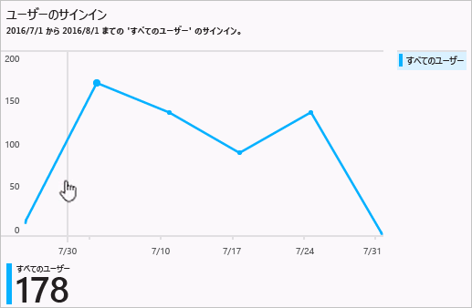
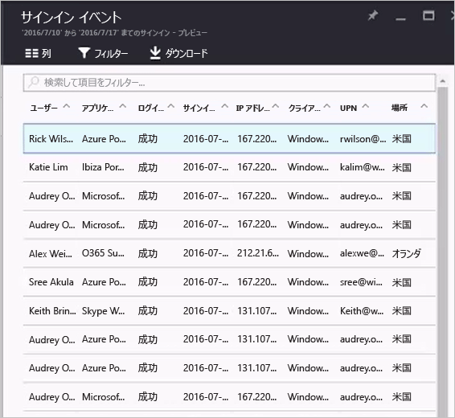

# Azure Active Directory ポータルのサインイン アクティビティ レポート - プレビュー

Azure Active Directory [プレビュー](active-directory-preview-explainer.md)のレポートでは、環境の動作状況を判断するために必要なすべての情報を取得できます。

Azure Active Directory のレポート アーキテクチャは、次のコンポーネントで構成されます。

- **アクティビティ** 
    - **サインイン アクティビティ** – マネージ アプリケーションの使用状況とユーザー サインイン アクティビティに関する情報
    - **監査ログ** - ユーザーとグループの管理、マネージ アプリケーション、およびディレクトリのアクティビティに関するシステム アクティビティ情報です。
- **セキュリティ** 
    - **リスクの高いサインイン** - リスクの高いサインインは、ユーザー アカウントの正当な所有者ではない人によって行われた可能性があるサインイン試行の指標です。 詳細については、「Risky sign-ins (リスクの高いサインイン)」を参照してください。
    - **リスクのフラグ付きユーザー** - リスクの高いユーザーは、侵害された可能性があるユーザー アカウントの指標です。 詳細については、「Users flagged for risk (リスクのフラグ付きユーザー)」を参照してください。

このトピックでは、サインイン アクティビティの概要を説明します。

## サインイン アクティビティ

ユーザー サインイン レポートによって提供される情報を使用すると、次のような疑問への答えを得ることができます。

* ユーザーのサインインにどのようなパターンがあるか。
* 1 週間で何人のユーザーがユーザー サインインを行ったか。
* これらのサインインはどのような状態か。

このデータへのエントリ ポイントは、**[ユーザーとグループ]** の **[概要]** セクションにあるユーザー サインイン グラフです。

 

ユーザー サインイン グラフは、特定期間内のすべてのユーザーのサインインについて、週単位の集計を示します。 期間の既定値は 30 日です。

サインイン グラフ内の日付をクリックすると、サインイン アクティビティの詳細な一覧が表示されます。

サインイン アクティビティの一覧内の各行には、選択したサインインに関する次のような詳細情報が表示されます。

* サインインしたのはだれか。
* 関連する UPN は何だったか。
* サインインの対象となったのはどのアプリケーションか。
* サインインの IP アドレスは何か。
* サインインはどのような状態だったか。

## マネージ アプリケーションの使用状況

アプリケーションを中心にしてサインイン データを表示すると、次のような疑問に答えることができます。

* アプリケーションをだれが使用しているか。
* 組織内の上位 3 つのアプリケーションはどれか。
* 最近ロールアウトしたアプリケーションは、 どのような状況か。

このデータへのエントリ ポイントは、**[エンタープライズ アプリケーション]** の **[概要]** セクションにある過去 30 日間のレポートに示される、組織内の上位 3 つのアプリケーションです。

 

アプリ使用状況グラフは、特定の期間の上位 3 つのアプリへのサインインを週ごとに集計します。 期間の既定値は 30 日です。

必要に応じて、特定のアプリケーションにフォーカスを設定できます。

アプリ使用状況グラフ内の日付をクリックすると、サインイン アクティビティの詳細な一覧が表示されます。

**[サインイン]** オプションを使用すると、アプリケーションへのすべてのサインイン イベントの完全な概要を表示できます。

列選択機能を使用すると、表示するデータ フィールドを選択できます。

## サインインのフィルター処理
表示されるデータの量を制限するために、次のフィールドを使用してサインインをフィルター処理できます。

* 日付と時刻 
* ユーザーのユーザー プリンシパル名
* アプリケーション名
* クライアント名
* サインインの状態

サインイン アクティビティのエントリをフィルター処理するためのもう&1; つの方法は、特定のエントリを検索することです。
検索機能を使用すると、表示するサインインを特定の**ユーザー**、**グループ**、または**アプリケーション**に限定できます。

## 次のステップ
「 [Azure Active Directory レポート ガイド](active-directory-reporting-guide.md)」を参照してください。

