# Azure Active Directory レポート - プレビュー

*このドキュメントは、[Azure Active Directory レポート ガイド](active-directory-reporting-guide.md)の一部です。*

Azure Active Directory プレビューのレポートでは、環境の動作状況を判断するために必要なすべての情報を取得できます。 [プレビューにはどのような機能があるのでしょうか。](active-directory-preview-explainer.md)

レポートには、次の&2; つの主要な領域があります。

* **サインイン アクティビティ** – マネージ アプリケーションの使用状況とユーザー サインイン アクティビティに関する情報
* **監査ログ** - ユーザーとグループの管理や、マネージ アプリケーションとディレクトリのアクティビティに関するシステム アクティビティ情報

必要なデータのスコープに応じて、[Azure Portal](https://portal.azure.com) のサービス一覧で **[ユーザーとグループ]** または **[エンタープライズ アプリケーション]** をクリックして、これらのレポートにアクセスできます。

## サインイン アクティビティ
### ユーザー サインイン アクティビティ
ユーザー サインイン レポートによって提供される情報を使用すると、次のような疑問への答えを得ることができます。

* ユーザーのサインインにどのようなパターンがあるか。
* 1 週間で何人のユーザーがユーザー サインインを行ったか。
* これらのサインインはどのような状態か。

このデータへのエントリ ポイントは、**[ユーザーとグループ]** の **[概要]** セクションにあるユーザー サインイン グラフです。

 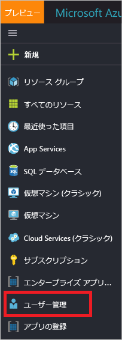

ユーザー サインイン グラフは、特定期間内のすべてのユーザーのサインインについて、週単位の集計を示します。 期間の既定値は 30 日です。

サインイン グラフ内の日付をクリックすると、サインイン アクティビティの詳細な一覧が表示されます。

サインイン アクティビティの一覧内の各行には、選択したサインインに関する次のような詳細情報が表示されます。

* サインインしたのはだれか。
* 関連する UPN は何だったか。
* サインインの対象となったのはどのアプリケーションか。
* サインインの IP アドレスは何か。
* サインインはどのような状態だったか。

### マネージ アプリケーションの使用状況
アプリケーションを中心にしてサインイン データを表示すると、次のような疑問に答えることができます。

* アプリケーションをだれが使用しているか。
* 組織内の上位 3 つのアプリケーションはどれか。
* 最近ロールアウトしたアプリケーションは、 どのような状況か。

このデータへのエントリ ポイントは、**[エンタープライズ アプリケーション]** の **[概要]** セクションにある過去 30 日間のレポートに示される、組織内の上位 3 つのアプリケーションです。

 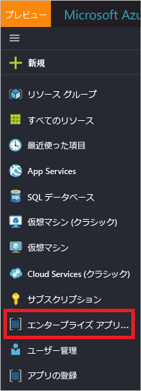

アプリ使用状況グラフは、特定の期間の上位 3 つのアプリへのサインインを週ごとに集計します。 期間の既定値は 30 日です。

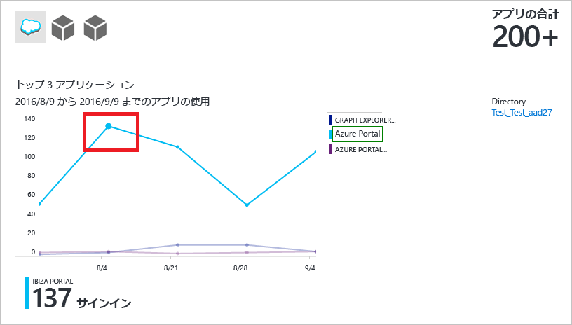

必要に応じて、特定のアプリケーションにフォーカスを設定できます。

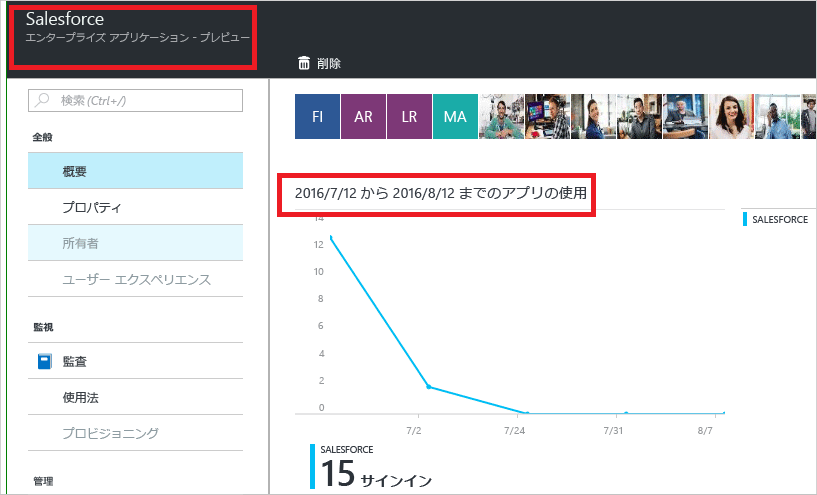

アプリ使用状況グラフ内の日付をクリックすると、サインイン アクティビティの詳細な一覧が表示されます。

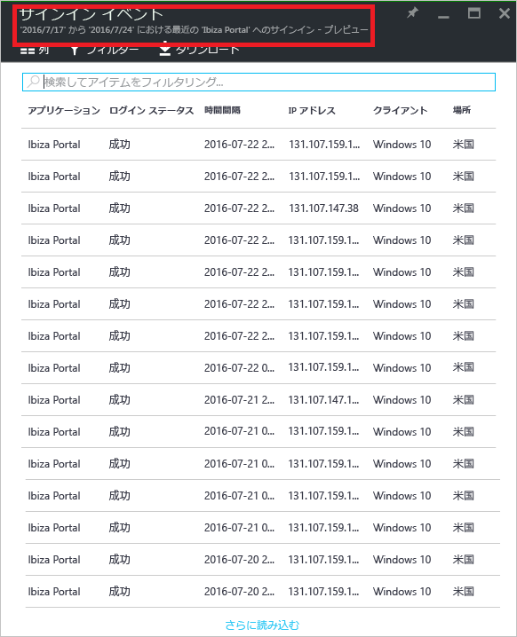

**[サインイン]** オプションを使用すると、アプリケーションへのすべてのサインイン イベントの完全な概要を表示できます。

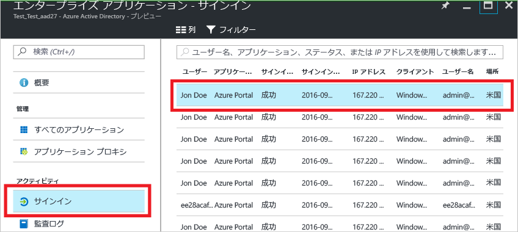

列選択機能を使用すると、表示するデータ フィールドを選択できます。

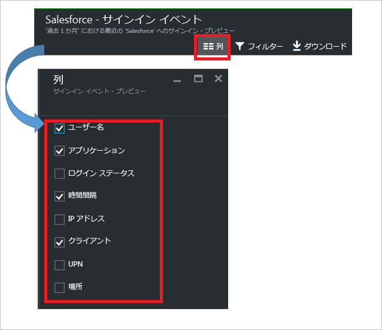

### サインインのフィルター処理
表示されるデータの量を制限するために、次のフィールドを使用してサインインをフィルター処理できます。

* 日付と時刻 
* ユーザーのユーザー プリンシパル名
* アプリケーション名
* クライアント名
* サインインの状態

サインイン アクティビティのエントリをフィルター処理するためのもう&1; つの方法は、特定のエントリを検索することです。
検索機能を使用すると、表示するサインインを特定の**ユーザー**、**グループ**、または**アプリケーション**に限定できます。

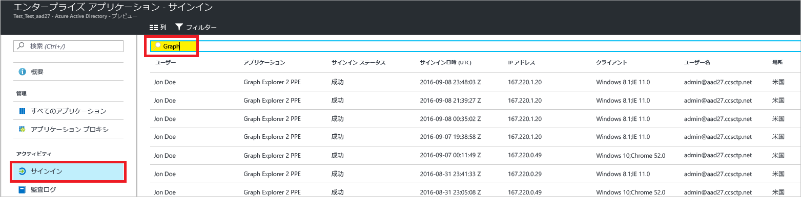

## 監査ログ
Azure Active Directory の監査ログは、コンプライアンスのためにシステム アクティビティのレコードを提供します。

Azure Portal には、監査関連のアクティビティとして、次の&3; つの主要カテゴリがあります。

* [概要]   
* アプリケーション
* Directory   

監査レポート アクティビティの完全な一覧については、 [監査レポートのイベントの一覧](active-directory-reporting-audit-events.md#list-of-audit-report-events)を参照してください。

すべての監査データへのエントリ ポイントは、**[Azure Active Directory]** の **[アクティビティ]** セクションの **[監査ログ]** です。

監査ログには、アクター (だれが)、アクティビティ (どうした)、および対象を示すリスト ビューがあります。

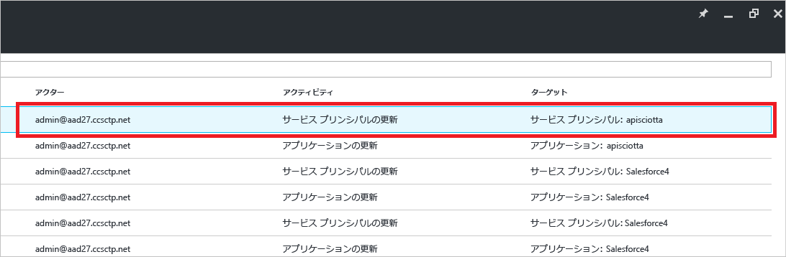

リスト ビュー内の項目をクリックすると、その詳細が表示されます。

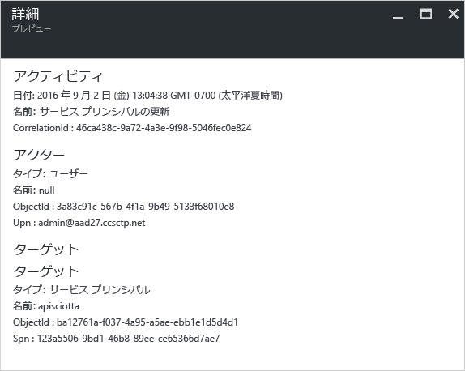

### ユーザーとグループの監査ログ
ユーザーとグループ ベースの監査レポートを使用すると、次のような疑問に対する答えを得ることができます。

* どの種類の更新プログラムがユーザーによって適用されているか。
* 何人のユーザーが変更されたか。
* 何個のパスワードが変更されたか。
* 管理者がディレクトリで何を行ったか。
* 追加されたのはどのグループか。
* メンバーシップが変更されたグループはあるか。
* グループの所有者は変更されたか。
* グループまたはユーザーにどのライセンスが割り当てられているか。

ユーザーとグループに関連する監査データだけを確認する場合は、**[ユーザーとグループ]** の **[アクティビティ]** セクションの **[監査ログ]** に、フィルター処理されたビューがあります。

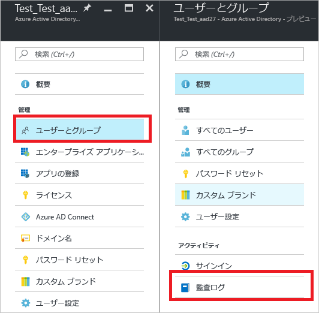

### アプリケーションの監査ログ
アプリケーション ベースの監査レポートを使用すると、次のような疑問に対する答えを得ることができます。

* 追加または更新されたのはどのアプリケーションか。
* 削除されたのはどのアプリケーションか。
* アプリケーションのサービス プリンシパルは変更されたか。
* アプリケーションの名前は変更されたか。
* アプリケーションに同意したのはだれか。

アプリケーションに関連する監査データだけを確認する場合は、**[エンタープライズ アプリケーション]** の **[アクティビティ]** セクションの **[監査ログ]** に、フィルター処理されたビューがあります。

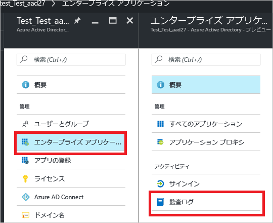

### 監査ログのフィルター処理
表示されるデータの量を制限するために、次のフィールドを使用してサインインをフィルター処理できます。

* 日付と時刻
* アクターのユーザー プリンシパル名
* アクティビティの種類
* アクティビティ

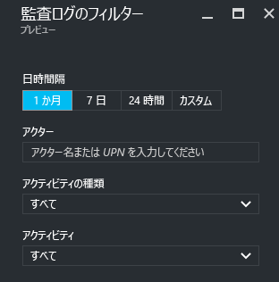

**[アクティビティの種類]** 一覧の内容は、このブレードへのエントリ ポイントに関連付けられています。  
エントリ ポイントが Azure Active Directory の場合、この一覧には使用可能なすべてのアクティビティの種類が含まれます。

* アプリケーション 
* グループ 
* User
* デバイス
* Directory
* [ポリシー]
* その他

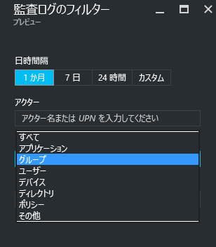

一覧に表示されるアクティビティのスコープは、アクティビティの種類に基づいて決定されます。
たとえば、**[アクティビティの種類]** として **[グループ]** が選択されている場合、**[アクティビティ]** 一覧にはグループ関連のアクティビティだけが含まれます。   

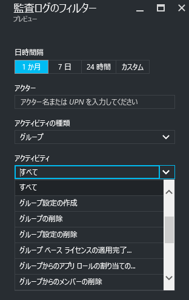

監査ログのエントリをフィルター処理するためのもう&1; つの方法は、特定のエントリを検索することです。

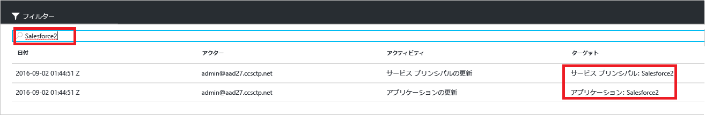

## 次のステップ
「 [Azure Active Directory レポート ガイド](active-directory-reporting-guide.md)」を参照してください。

