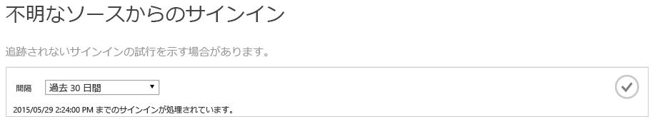
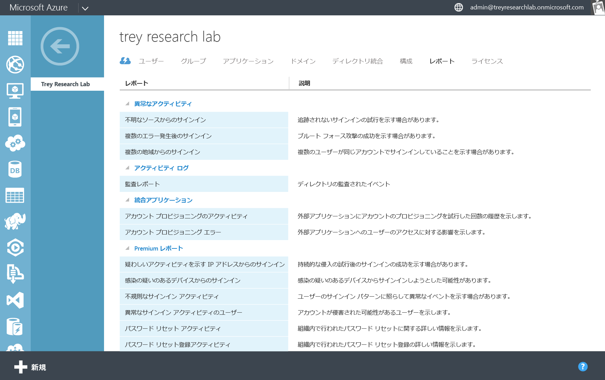

<properties
   pageTitle="Azure Active Directory レポート: 使用の開始 | Microsoft Azure"
   description="Azure Active Directory レポートで使用可能なさまざまなレポートが一覧表示します。"
   services="active-directory"
   documentationCenter=""
   authors="dhanyahk"
   manager="femila"
   editor=""/>

<tags
   ms.service="active-directory"
   ms.devlang="na"
   ms.topic="get-started-article"
   ms.tgt_pltfrm="na"
   ms.workload="identity"
   ms.date="03/07/2016"
   ms.author="dhanyahk"/>

# Azure Active Directory レポートの使用の開始

## 説明

Azure Active Directory (Azure AD) には、ディレクトリに関するセキュリティ レポート、アクティビティ レポート、および監査レポートが含まれています。含まれているレポートの一覧を次に示します。

### セキュリティ レポート

- 不明なソースからのサインイン
- 複数のエラー後のサインイン
- 複数の地域からのサインイン
- 不審なアクティビティのある IP アドレスからのサインイン
- 不規則なサインイン アクティビティ
- 感染している可能性があるデバイスからのサインイン
- 異常なサインイン アクティビティがあるユーザー

### アクティビティ レポート

- アプリケーションの使用状況: 概要
- アプリケーションの使用状況: 詳細
- アプリケーション ダッシュボード
- アカウント プロビジョニング エラー
- 個々のユーザー デバイス
- 個々のユーザー アクティビティ
- グループのアクティビティ レポート
- パスワード リセット登録アクティビティ レポート
- パスワード リセット アクティビティ

### 監査レポート

- ディレクトリ監査レポート

> [AZURE.TIP] Azure AD レポートの詳細については、「[アクセスおよび使用状況レポートの表示](active-directory-view-access-usage-reports.md)」を参照してください。

## 動作のしくみ

### レポート パイプライン

レポート パイプラインは、次の 3 つの主要な手順で構成されます。ユーザーがサインインするたびに、または認証が行われるたびに、次の処理が実行されます。

- 最初に、ユーザーの認証が行われ、その結果 (成功または失敗) が Azure Active Directory サービスのデータベースに格納されます。
- 定期的に、最新のすべてのサインインが処理されます。この時点で、Microsoft のセキュリティおよび異常アクティビティ アルゴリズムにより、最新のすべてのサインインについて疑わしいアクティビティが検索されます。
- 処理が終わると、レポートが生成され、キャッシュに格納され、Azure クラシック ポータルで提供されます。

### レポートの生成時間

Azure AD プラットフォームによって処理される認証およびサインインは膨大な量になるため、平均で 1 時間前のサインインが最新の処理済みサインインとして示されます。まれに、最新のサインインを処理するのに最大で 8 時間かかる場合があります。

各レポートの最上部のヘルプ テキストを調べることで、最新の処理済みサインインを確認できます。

> [AZURE.TIP] Azure AD レポートの詳細については、「[アクセスおよび使用状況レポートの表示](active-directory-view-access-usage-reports.md)」を参照してください。

## 使用の開始

### Azure クラシック ポータルにサインインする

最初に、グローバル管理者またはコンプライアンス管理者として [Azure クラシック ポータル](https://manage.windowsazure.com)にサインインする必要があります。このとき、Azure サブスクリプションのサービス管理者または共同管理者であるか、"Azure AD へのアクセス" Azure サブスクリプションを使用している必要があります。

### レポートに移動する

レポートを表示するには、ディレクトリの上部の [レポート] タブに移動します。

今回初めてレポートを表示する場合、レポートを表示する前に、ダイアログ ボックスに示される条件に同意する必要があります。これは、一部の国において個人情報と見なされる可能性のあるこのデータを組織の管理者が表示することが許容されることを確認するためです。

### 各レポートを表示する

各レポートに移動して、収集されているデータおよび処理済みのサインインを表示します。[すべてのレポートの一覧をここで](active-directory-reporting-guide.md)確認できます。

### レポートを CSV としてダウンロードする

各レポートは、CSV (コンマ区切り値) ファイルとしてダウンロードすることができます。これらのファイルを Excel、PowerBI、またはサードパーティの分析プログラムで使用して、さらにデータを分析することができます。

任意のレポートを CSV としてダウンロードするには、レポートに移動し、下部にある [ダウンロード] をクリックします。

![[ダウンロード] ボタン](./media/active-directory-reporting-getting-started/downloadButton.png)

> [AZURE.TIP] Azure AD レポートの詳細については、「[アクセスおよび使用状況レポートの表示](active-directory-view-access-usage-reports.md)」を参照してください。

## 次のステップ

### 異常なサインイン アクティビティのアラートをカスタマイズする

ディレクトリの [構成] タブに移動します。

[通知] セクションまでスクロールします。

[異常なサインインの電子メール通知] を有効または無効にします。

![[通知] セクション](./media/active-directory-reporting-getting-started/notificationsSection.png)

### Azure AD Reporting API と統合する

[Reporting API の概要](active-directory-reporting-api-getting-started.md)に関するページを参照してください。

### ユーザーに Multi-Factor Authentication を適用する

レポート内のユーザーを選択します。

画面の下部の [MFA を有効にする] をクリックします。

![画面下部の[多要素認証] ボタン](./media/active-directory-reporting-getting-started/mfaButton.png)

> [AZURE.TIP] Azure AD レポートの詳細については、「[アクセスおよび使用状況レポートの表示](active-directory-view-access-usage-reports.md)」を参照してください。

## 詳細情報

### イベントを監査する

ディレクトリで監査対象となるイベントについては、[Azure Active Directory レポートの監査イベント](active-directory-reporting-audit-events.md)に関するページを参照してください。

### API の統合

[Reporting API の概要](active-directory-reporting-api-getting-started.md)に関するページおよび [API リファレンス ドキュメント](https://msdn.microsoft.com/library/azure/mt126081.aspx)を参照してください。

### お問い合わせ

ご意見ご感想、サポート、またはご質問については、[aadreportinghelp@microsoft.com](mailto:aadreportinghelp@microsoft.com) までメールをお送りください。

> [AZURE.TIP] Azure AD レポートの詳細については、「[アクセスおよび使用状況レポートの表示](active-directory-view-access-usage-reports.md)」を参照してください。

<!---HONumber=AcomDC_0928_2016-->