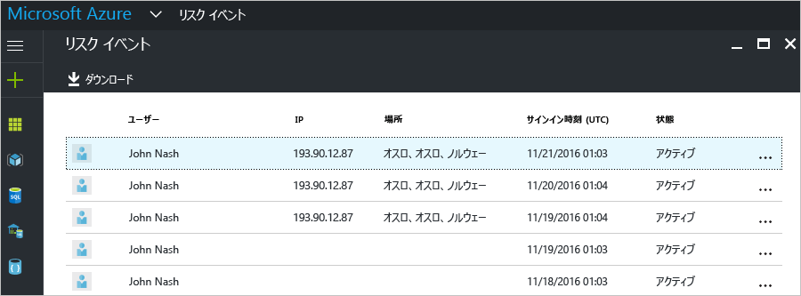
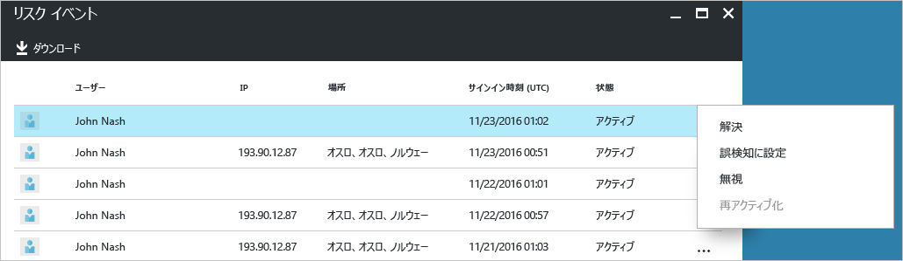
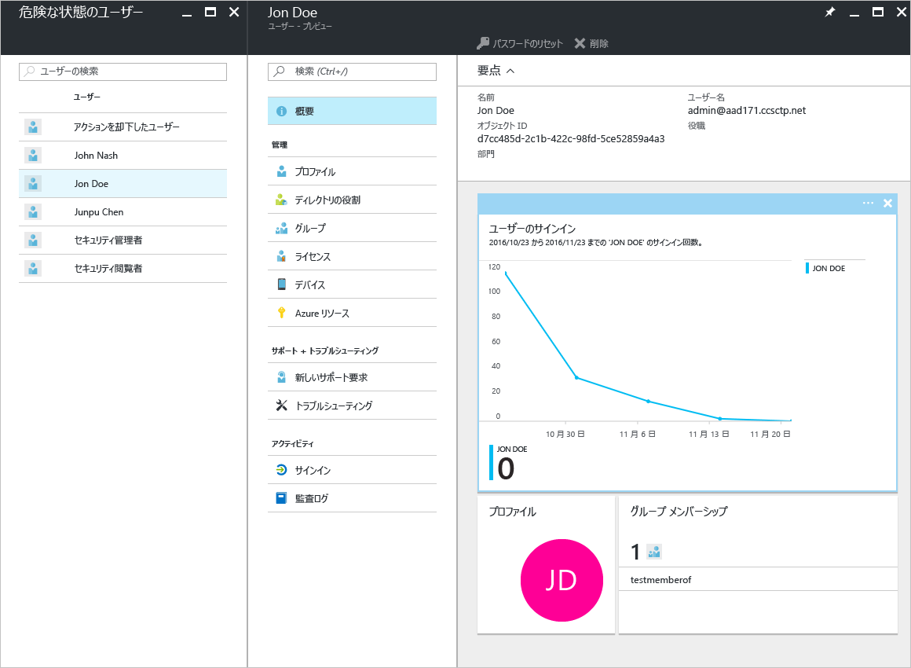

# Azure Active Directory の Free および Basic エディションでのセキュリティ レポート - プレビュー

Azure Active Directory [プレビュー](active-directory-preview-explainer.md)のセキュリティ レポートでは、環境内でユーザー アカウントが侵害されている確率を調べることができます。 

Azure Active Directory は、ユーザー アカウントに関連する疑わしい動作を検出します。 検出された動作ごとに、"*リスク イベント*" と呼ばれるレコードが作成されます。 詳細については、「[Azure Active Directory risk events (Azure Active Directory リスク イベント)](active-directory-identity-protection-risk-events.md)」を参照してください。 

検出されたリスク イベントは、以下のものの計算に使用されます。

- **リスクの高いサインイン** - リスクの高いサインインは、ユーザー アカウントの正当な所有者ではない人によって行われた可能性があるサインイン試行の指標です。 詳細については、「[Risky sign-ins (リスクの高いサインイン)](active-directory-identityprotection.md#risky-sign-ins)」を参照してください。 

- **リスクのフラグ付きユーザー** - リスクの高いユーザーは、侵害された可能性があるユーザー アカウントの指標です。 詳細については、「[Users flagged for risk (リスクのフラグ付きユーザー)](active-directory-identityprotection.md#users-flagged-for-risk)」を参照してください。  

## リスクの高いサインイン レポート

Azure Active Directory の Free および Basic エディションでは、管理対象ユーザーに関して検出および報告された、リスクの高いサインインの一覧を提供します。 リスク イベント レポートでは、以下の情報が提供されます。

- **ユーザー** - サインイン操作中に使用されたユーザーの名前
- **IP** - Azure Active Directory への接続に使用されたデバイスの IP アドレス
- **場所** - Azure Active Directory への接続に使用された場所
- **サインイン時刻** - サインインが実行された時刻
- **状態** - サインインの状態

このレポートでは、レポート データをダウンロードすることもできます。

リスクの高いサインインの調査に基づき、次の対処方法の形式で Azure Active Directory にフィードバックを提出できます。

- 解決
- 誤検知に設定
- 無視
- 再度有効にする

詳細については、「[リスク イベントの手動クローズ](active-directory-identityprotection.md#closing-risk-events-manually)」を参照してください。

## 危険な状態のユーザー レポート

Azure Active Directory の Free エディションでは、侵害された可能性があるユーザー アカウントの一覧を提供します。 

一覧でユーザーをクリックすると、関連するユーザー データ ブレードが開かれます。
危険な状態のユーザーに関して、ユーザーのサインイン履歴を確認し、必要に応じてパスワードをリセットします。

## 次のステップ

- Azure Active Directory のレポートの詳細については、「[Azure Active Directory レポート ガイド](active-directory-reporting-guide.md)」を参照してください。
- Azure Active Directory Identity Protection の詳細については、「[Azure Active Directory Identity Protection](active-directory-identityprotection.md)」を参照してください。

<!--HONumber=Jan17_HO3-->

