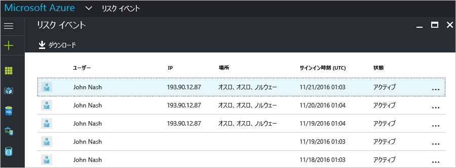
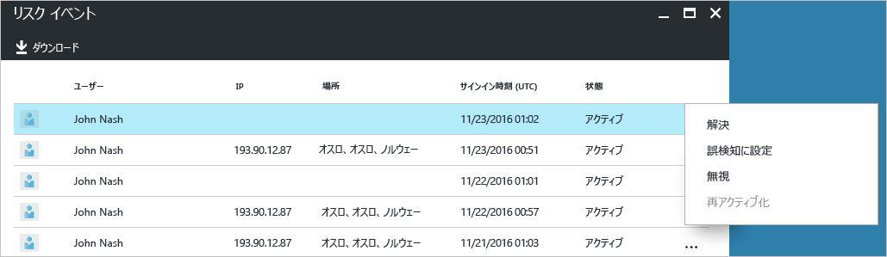
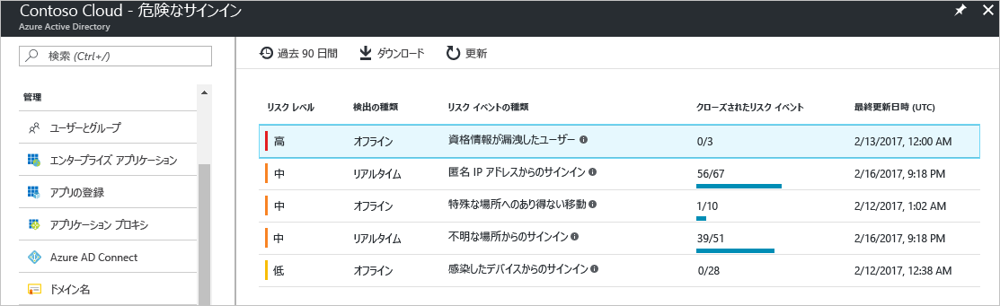
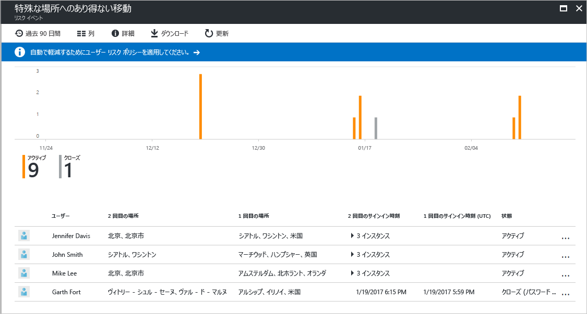
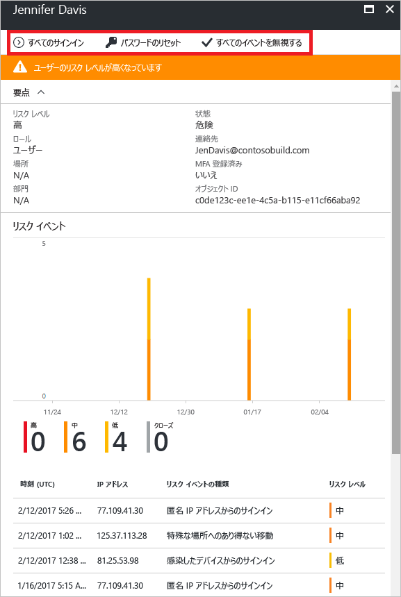
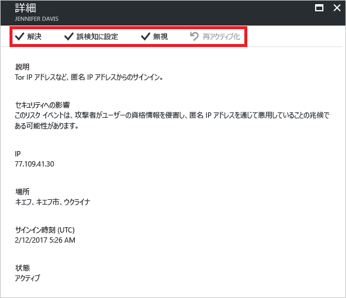

# Azure Active Directory ポータルのリスクの高いサインイン レポート - プレビュー

Azure Active Directory [プレビュー](active-directory-preview-explainer.md)のセキュリティ レポートでは、環境内でユーザー アカウントが侵害されている確率を調べることができます。 

Azure Active Directory は、ユーザー アカウントに関連する疑わしい動作を検出します。 検出された動作ごとに、"*リスク イベント*" と呼ばれるレコードが作成されます。 詳細については、「[Azure Active Directory risk events (Azure Active Directory リスク イベント)](active-directory-identity-protection-risk-events.md)」を参照してください。 

検出されたリスク イベントは、以下のものの計算に使用されます。

- **リスクの高いサインイン** - リスクの高いサインインは、ユーザー アカウントの正当な所有者ではない人によって行われた可能性があるサインイン試行の指標です。 詳細については、「[Risky sign-ins (リスクの高いサインイン)](active-directory-identityprotection.md#risky-sign-ins)」を参照してください。 

- **リスクのフラグ付きユーザー** - リスクの高いユーザーは、侵害された可能性があるユーザー アカウントの指標です。 詳細については、「[Users flagged for risk (リスクのフラグ付きユーザー)](active-directory-identityprotection.md#users-flagged-for-risk)」を参照してください。  

Azure Portal では、**[Azure Active Directory]** ブレードの **[セキュリティ]** セクションで、セキュリティ レポートを確認できます。 

## Azure Active Directory の Free および Basic エディション

Azure Active Directory の Free および Basic エディションでは、管理対象ユーザーに関して検出された、リスクの高いサインインの一覧を提供します。 リスク イベント レポートでは、以下の情報が提供されます。

- **ユーザー** - サインイン操作中に使用されたユーザーの名前
- **IP** - Azure Active Directory への接続に使用されたデバイスの IP アドレス
- **場所** - Azure Active Directory への接続に使用された場所
- **サインイン時刻** - サインインが実行された時刻
- **状態** - サインインの状態

このレポートでは、レポート データをダウンロードすることもできます。

リスクの高いサインインの調査に基づき、次の対処方法の形式で Azure Active Directory にフィードバックを提出できます。

- 解決
- 誤検知に設定
- 無視
- 再度有効にする

詳細については、「[リスク イベントの手動クローズ](active-directory-identityprotection.md#closing-risk-events-manually)」を参照してください。

## Azure Active Directory Premium エディション

Azure Active Directory Premium エディションのリスクの高いサインイン レポートで提供される情報を以下に示します。

- 検出された[リスク イベントの種類](active-directory-identity-protection-risk-events.md)に関する集計情報

- レポートをダウンロードするオプション

リスク イベントを選択すると、そのリスク イベントの詳細なレポート ビューが表示されます。ここから次の機能を利用できます。

- [ユーザー リスク修復ポリシー](active-directory-identityprotection.md#user-risk-security-policy)を構成するオプション  

- リスク イベントの検出のタイムラインを確認する  

- このリスク イベントが検出されたユーザーの一覧を確認する

- [リスク イベントを手動で閉じる](active-directory-identityprotection.md#closing-risk-events-manually)、または手動で終了したリスク イベントを再アクティブ化する 

ユーザーを選択すると、そのユーザーの詳細なレポート ビューが表示されます。ここから次の機能を利用できます。

- [All sign-ins (すべてのサインイン)] ビューを開く

- ユーザーのパスワードをリセットする

- すべてのイベントを閉じる

- そのユーザーについて報告されたリスク イベントを調査する 

リスク イベントを調査するには、一覧からリスク イベントを&1; つ選択します。  
このリスク イベントの **[詳細]** ブレードが開きます。 **[詳細]** ブレードで、[リスク イベントを手動で閉じる](active-directory-identityprotection.md#closing-risk-events-manually)か、手動で閉じたリスク イベントを再アクティブ化することができます。 

## 次のステップ

- Azure Active Directory Identity Protection の詳細については、「[Azure Active Directory Identity Protection](active-directory-identityprotection.md)」を参照してください。

