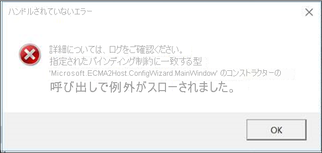
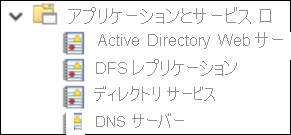
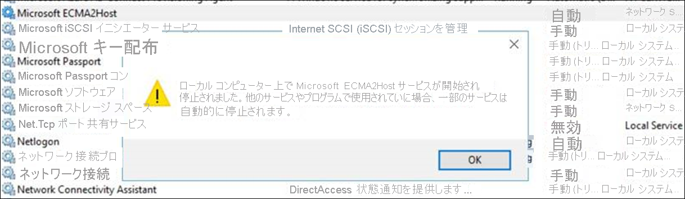
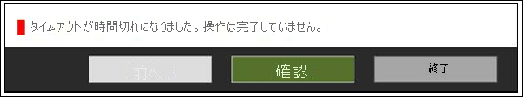

# <a name="troubleshoot-on-premises-application-provisioning"></a>オンプレミス アプリケーションのプロビジョニングのトラブルシューティング

>[!IMPORTANT]
> オンプレミス プロビジョニング プレビューは現在、招待のみのプレビューとなります。 この機能へのアクセスを要求するには、[アクセス要求フォーム](https://aka.ms/onpremprovisioningpublicpreviewaccess)を使用してください。 今後数か月の間に、より多くのお客様および接続ユーザーにプレビューを公開し、一般提供に向けて準備を進めていく予定です。

## <a name="troubleshoot-test-connection-issues"></a>テスト接続の問題をトラブルシューティングする
プロビジョニング エージェントと ECMA ホストを構成したら、Azure Active Directory (Azure AD) プロビジョニング サービスからプロビジョニング エージェント、ECMA ホスト、アプリケーションへの接続をテストします。 このエンド ツー エンド テストを実行するには、Azure portal でアプリケーションの **[テスト接続]** を選択します。 テスト接続に失敗した場合は、次のトラブルシューティング手順を試してください。

 1. エージェントと ECMA ホストが実行中であることを確認します。
     1. エージェントがインストールされているサーバーの **スタート** ボタンをクリックし、 **[ファイル名を指定して実行]** で「**Services.msc**」と入力して、 **[サービス]** を開きます。
     2. **[サービス]** で、**Microsoft Azure AD Connect エージェント アップデーター**、**Microsoft Azure AD Connect プロビジョニング エージェント**、**Microsoft ECMA2Host** の各サービスが存在し、それらの状態が *[実行中]* になっていることを確認します。
    
        

 2. **[トラブルシューティング]**  >  **[スクリプト]**  >  **[TestECMA2HostConnection]** を選択して、ECMA ホストをインストールしたフォルダーに移動します。 スクリプトを実行します。 このスクリプトでは、SCIM GET または POST 要求を送信して、ECMA Connector Host が動作していて、要求に応答することを確認します。 ECMA Connector Host サービス自体と同じコンピューターで実行されている必要があります。
 3. Azure portal でアプリケーションに移動し、 **[admin connectivity]\(管理者接続\)** を選択し、エージェントのドロップダウン リストを選択して、お使いのエージェントをアクティブにすることにより、エージェントを確実にアクティブにします。
 4. 指定したシークレット トークンがオンプレミスのシークレット トークンと同じであるかどうかを確認します。 オンプレミスに移動し、シークレット トークンを再度指定し、Azure portal にそれをコピーします。
 5. Azure portal で、必ず 1 つ以上のエージェントをアプリケーションに割り当てます。
 6. エージェントを割り当てた後、登録が完了するまで 10 分から 20 分待つ必要があります。 登録が完了するまで、接続テストは機能しません。
 7. 必ず、有効な証明書を使用してください。 ECMA ホストの **[設定]** タブに移動して、新しい証明書を生成します。
 8. VM 上のタスク バーに移動し、Microsoft Azure AD Connect プロビジョニング エージェントを検索して、プロビジョニング エージェントを再起動します。 **[停止]** を右クリックして、 **[開始]** を選択します。
 9. Azure portal でテナントの URL を指定する場合は、必ず次のパターンに従ってください。 `localhost` を、お使いのホスト名に置き換えることができますが、必須ではありません。 `connectorName` を、ECMA ホストで指定したコネクタの名前に置き換えます。 エラー メッセージ 'invalid resource' (無効なリソース) は、一般に、URL が想定される形式に従っていないことを示しています。
 
    ```
    https://localhost:8585/ecma2host_connectorName/scim
    ```

## <a name="unable-to-configure-the-ecma-host-view-logs-in-event-viewer-or-start-the-ecma-host-service"></a>ECMA ホストの構成、イベント ビューアーでのログの表示、または ECMA ホスト サービスの起動ができない

次の問題を解決するには、管理者として ECMA ホストを実行します。

* ECMA ホスト ウィザードを開くとエラーが発生する。

   

* ECMA ホスト ウィザードは構成できたが、ECMA ホスト ログを表示できない: この場合は、管理者としてホストを開き、コネクタをエンド ツー エンドでセットアップする必要があります。 この手順は、既存のコネクタをエクスポートし、再度インポートすることで簡単に行うことができます。 

   

* ECMA ホスト ウィザードは構成できたが、ECMA ホスト サービスを開始できない:

   


## <a name="turn-on-verbose-logging"></a>詳細ログ記録を有効にする 

既定では、ECMA Connector Host の `switchValue` は `Error` に設定されます。 この設定が意味するのは、ログに記録されるイベントはエラーのみということです。 ECMA ホスト サービスまたはウィザードに対して詳細ログを有効にするには、次に示すように、両方の場所で `switchValue` を `Verbose` に設定します。

サービスの詳細ログ ファイルは、C:\Program Files\Microsoft ECMA2Host\Service\Microsoft.ECMA2Host.Service.exe.config にあります。
  ```
  <?xml version="1.0" encoding="utf-8"?> 
  <configuration> 
      <startup>  
          <supportedRuntime version="v4.0" sku=".NETFramework,Version=v4.6" /> 
      </startup> 
      <appSettings> 
        <add key="Debug" value="true" /> 
      </appSettings> 
      <system.diagnostics> 
        <sources> 
      <source name="ConnectorsLog" switchValue="Verbose"> 
            <listeners> 
              <add initializeData="ConnectorsLog" type="System.Diagnostics.EventLogTraceListener, System, Version=2.0.0.0, Culture=neutral, PublicKeyToken=b77a5c561934e089" name="ConnectorsLog" traceOutputOptions="LogicalOperationStack, DateTime, Timestamp, Callstack"> 
                <filter type=""/> 
              </add> 
            </listeners> 
          </source> 
          <!-- Choose one of the following switchTrace:  Off, Error, Warning, Information, Verbose --> 
          <source name="ECMA2Host" switchValue="Verbose"> 
            <listeners>  
              <add initializeData="ECMA2Host" type="System.Diagnos
  ```

ウィザードの詳細ログ ファイルは、C:\Program Files\Microsoft ECMA2Host\Wizard\Microsoft.ECMA2Host.ConfigWizard.exe.config にあります。
  ```
        <source name="ConnectorsLog" switchValue="Verbose"> 
          <listeners> 
            <add initializeData="ConnectorsLog" type="System.Diagnostics.EventLogTraceListener, System, Version=2.0.0.0, Culture=neutral, PublicKeyToken=b77a5c561934e089" name="ConnectorsLog" traceOutputOptions="LogicalOperationStack, DateTime, Timestamp, Callstack"> 
              <filter type=""/> 
            </add> 
          </listeners> 
        </source> 
        <!-- Choose one of the following switchTrace:  Off, Error, Warning, Information, Verbose --> 
        <source name="ECMA2Host" switchValue="Verbose"> 
          <listeners> 
            <add initializeData="ECMA2Host" type="System.Diagnostics.EventLogTraceListener, System, Version=4.0.0.0, Culture=neutral, PublicKeyToken=b77a5c561934e089" name="ECMA2HostListener" traceOutputOptions="LogicalOperationStack, DateTime, Timestamp, Callstack" /> 
  ```

## <a name="target-attribute-is-missing"></a>ターゲット属性がない 
ターゲット アプリケーションの属性は、プロビジョニング サービスによって自動的に検出されます。 Azure portal のターゲット属性リストにターゲット属性が存在しないことがわかったら、次のトラブルシューティング手順を実行してください。

 1. ECMA ホスト構成の **[属性の選択]** ページを確認し、Azure portal に公開する属性が選択されていることを確認します。
 1. ECMA ホスト サービスが有効になっていることを確認します。 
 1. ECMA ホストのログを確認して、/schemas 要求が行われたことを確認し、その応答で属性を確認します。 これは、問題のトラブルシューティングをサポートするうえで有益な情報です。

## <a name="collect-logs-from-event-viewer-as-a-zip-file"></a>イベント ビューアーから ZIP ファイルとしてログを収集する

**[トラブルシューティング]**  >  **[スクリプト]** を選択して、ECMA ホストをインストールしたフォルダーに移動します。 管理者として `CollectTroubleshootingInfo` スクリプトを実行します。これで、ログを ZIP ファイルにキャプチャしてエクスポートすることができます。

## <a name="review-events-in-event-viewer"></a>イベント ビューアーでイベントを確認する

ECMA Connector Host のスキーマ マッピングが構成されたら、サービスを開始して受信接続をリッスンします。 そのうえで、受信要求を監視します。

  1. **スタート** メニューを選択し、「**イベント ビューアー**」と入力して、 **[イベント ビューアー]** を選択します。 
  1. **イベント ビューアー** で、 **[アプリケーションとサービス ログ]** を展開し、 **[Microsoft ECMA2Host ログ]** を選択します。 
  1. コネクタ ホストで変更が受信されると、イベントがアプリケーション ログに書き込まれます。 

### <a name="common-errors"></a>一般的なエラー

| エラー      | 解像度 |
| ----------- | ----------- |
| ファイルまたはアセンブリ 'file:///C:\Program Files\Microsoft ECMA2Host\Service\ECMA\Cache\8b514472-c18a-4641-9a44-732c296534e8\Microsoft.IAM.Connector.GenericSql.dll' またはその依存関係の 1 つを読み込めませんでした。 アクセスが拒否されました。      | ネットワーク サービス アカウントに、キャッシュ フォルダーに対する 'フル コントロール' のアクセス許可があることを確認します。 |
| オブジェクトの DN の LDAP スタイルが無効です。 DN: username@domain.com"   | ECMA ホストの [connectivity]\(接続\) ページで [DN is Anchor]\(DN はアンカー\) チェックボックスがオフになっていることを確認します。 ECMA ホストの [object types]\(オブジェクトの種類\) ページで [autogenerated]\(自動生成\) チェックボックスがオンになっていることを確認します。  詳細については、「[アンカー属性と識別名について](on-premises-application-provisioning-architecture.md#about-anchor-attributes-and-distinguished-names)」を参照してください。|

## <a name="understand-incoming-scim-requests"></a>受信 SCIM 要求について

Azure AD からプロビジョニング エージェントやコネクタ ホストに対して行われる要求には、SCIM プロトコルが使用されます。 ホストからアプリに対して行われる要求には、アプリでサポートされるプロトコルが使用されます。 ホストからエージェントへ、さらに Azure AD に対して行われる要求には、SCIM が使用されます。 SCIM の実装の詳細については、「[チュートリアル: Azure Active Directory の SCIM エンドポイントのプロビジョニングを開発および計画する](use-scim-to-provision-users-and-groups.md)」を参照してください。

各プロビジョニング サイクルの最初、オンデマンド プロビジョニングの実行前、テスト接続の実行時に、Azure AD プロビジョニング サービスは、通常、[ダミー ユーザー](use-scim-to-provision-users-and-groups.md#request-3)の get-user 呼び出しを実行して、ターゲット エンドポイントを確実に利用可能にして、SCIM に準拠した応答が返されるようにします。 


## <a name="how-do-i-troubleshoot-the-provisioning-agent"></a>プロビジョニング エージェントをトラブルシューティングする方法
次のエラー シナリオが発生する場合があります。

### <a name="agent-failed-to-start"></a>エージェントが起動しない

次の内容のエラー メッセージが表示されることがあります。

"Service 'Microsoft Azure AD Connect Provisioning Agent' failed to start.\(サービス 'Microsoft Azure AD Connect Provisioning Agent' を開始できませんでした。\) Check that you have sufficient privileges to start the system services. \(システム サービスを起動するために十分な特権を持っていることを確認してください。\)" 

この問題は、通常、インストーラー (NT SERVICE\AADConnectProvisioningAgent) によって作成されたローカル NT サービスのサインイン アカウントにアクセス許可が適用されないようにするグループ ポリシーが原因で発生します。 サービスを開始するには、これらのアクセス許可が必要です。

これを解決するには、次の手順に従います。

 1. 管理者アカウントでサーバーにサインインします。
 2. **[サービス]** を開きます。これには、そこに直接移動するか、**スタート** ボタンをクリックし、 **[ファイル名を指定して実行]** で「**Services.msc**」と入力します。
 3. **[サービス]** で **[Microsoft Azure AD Connect プロビジョニング エージェント]** をダブルクリックします。
 4. **[ログオン]** タブで、 **[このアカウント]** をドメイン管理者に変更します。その後、サービスを再起動します。 

このテストでは、エージェントがポート 443 を介して Azure と通信できることを確認します。 ブラウザーを開き、エージェントがインストールされているサーバーから前の URL に移動します。

### <a name="agent-times-out-or-certificate-is-invalid"></a>エージェントがタイムアウトになるか証明書が無効である

エージェントを登録しようとしたときに、次のエラー メッセージが表示されることがあります。



この問題は、通常、エージェントがハイブリッド ID サービスに接続できないことが原因で発生し、HTTP プロキシを構成する必要があります。 この問題を解決するには、送信プロキシを構成します。 

プロビジョニング エージェントでは、送信プロキシの使用がサポートされます。 構成するには、エージェントの構成ファイル *C:\Program Files\Microsoft Azure AD Connect Provisioning Agent\AADConnectProvisioningAgent.exe.config* を編集します。ファイルの末尾近くにある `</configuration>` の終了タグの直前に次の行を追加します。
`[proxy-server]` 変数と `[proxy-port]` 変数をお使いのプロキシ サーバー名とポート値に置き換えてください。

```xml
    <system.net>
        <defaultProxy enabled="true" useDefaultCredentials="true">
            <proxy
                usesystemdefault="true"
                proxyaddress="http://[proxy-server]:[proxy-port]"
                bypassonlocal="true"
            />
        </defaultProxy>
    </system.net>
```
### <a name="agent-registration-fails-with-security-error"></a>セキュリティ エラーが発生してエージェントの登録が失敗する

クラウド プロビジョニング エージェントのインストール時にエラー メッセージが表示されることがあります。

この問題は、通常、ローカルの PowerShell 実行ポリシーのせいで、エージェントで PowerShell 登録スクリプトを実行できないことが原因で発生します。

この問題を解決するには、サーバー上の PowerShell 実行ポリシーを変更します。 マシンとユーザーのポリシーを *Undefined* または *RemoteSigned* に設定する必要があります。 *Unrestricted* として設定されている場合、このエラーが表示されます。 詳細については、[PowerShell 実行ポリシー](/powershell/module/microsoft.powershell.core/about/about_execution_policies)に関する記事を参照してください。 

### <a name="log-files"></a>ログ ファイル

既定では、エージェントによって発行されるエラー メッセージとスタック トレース情報は最小限に抑えられています。 トレース ログは、C:\ProgramData\Microsoft\Azure AD Connect Provisioning Agent\Trace フォルダーにあります。

エージェント関連の問題をトラブルシューティングするための詳細な情報を入手するには、次の手順に従います。

 1. 「[Azure AD Connect クラウド同期用 AADCloudSyncTools PowerShell モジュール](../../active-directory/cloud-sync/reference-powershell.md#install-the-aadcloudsynctools-powershell-module)」の説明に従って、AADCloudSyncTools PowerShell モジュールをインストールします。
 2. `Export-AADCloudSyncToolsLogs` PowerShell コマンドレットを使用して情報をキャプチャします。 次のスイッチを使用してデータ収集を微調整します。 次のコマンドを使用します。

      - **SkipVerboseTrace**: 詳細ログをキャプチャせずに現在のログのみをエクスポートします (既定値 = false)。
      - **TracingDurationMins**: 別のキャプチャ期間を指定します (既定値 = 3 分)。
      - **OutputPath**: 別の出力パスを指定します (既定値 = ユーザーのドキュメント)。

---------------------

Azure AD を使用することにより、クラウドでプロビジョニング サービスを監視し、オンプレミスでログを収集できます。 プロビジョニング サービスは、同期プロセスの一環として評価された各ユーザーのログを出力します。 それらのログは、[Azure portal の UI、API、Log Analytics](../reports-monitoring/concept-provisioning-logs.md) を通じて利用することができます。 ECMA ホストでも、オンプレミスでログが生成されます。 これは、受信された各プロビジョニング要求および Azure AD に送信された応答を示す。

### <a name="agent-installation-fails"></a>エージェントのインストールの失敗
* エラー "`System.ComponentModel.Win32Exception: The specified service already exists`" は、以前の ECMA ホストが正しくアンインストールされなかったことを示します。 ホスト アプリケーションをアンインストールします。 Program Files に移動し、ECMA ホストのフォルダーを削除します。 バックアップ用に構成ファイルを保存することもできます。 
* 次のエラーは、前提条件が満たされていないことを示します。 .NET 4.7.1 がインストールされていることを確認してください。

  ```
    Method Name : <>c__DisplayClass0_1 : 
    RegisterNotLoadedAssemblies Error during load assembly: System.Management.Automation.resources.dll
    --------- Outer Exception Data ---------
    Message: Could not load file or assembly 'file:///C:\Program Files\Microsoft ECMA2Host\Service\ECMA\System.Management.Automation.resources.dll' or one of its dependencies. The system cannot find the file specified.

  ```

### <a name="i-am-getting-an-invalid-ldap-style-dn-error-when-trying-to-configure-the-ecma-connector-host-with-sql"></a>SQL で ECMA Connector Host を構成しようとすると、無効な LDAP スタイルの DN エラーが発生する
既定では、genericSQL コネクタでは、LDAP スタイルを使用して DN が設定されていると想定されています (最初の接続ページで [DN is anchor]\(DN はアンカー\) 属性がオフの場合)。 上のエラー メッセージでは、コネクタで求められる LDAP スタイルの DN ではなく、DN が UPN であることがわかります。 

これを解決するには、コネクタを構成する際に [object types]\(オブジェクトの種類\)ページで **[Autogenerated]\(自動生成\)** が選択されていることを確認してください。

詳細については、「[アンカー属性と識別名について](on-premises-application-provisioning-architecture.md#about-anchor-attributes-and-distinguished-names)」を参照してください。

## <a name="next-steps"></a>次のステップ

- [チュートリアル: ECMA Connector Host の汎用 SQL コネクタ](tutorial-ecma-sql-connector.md)
