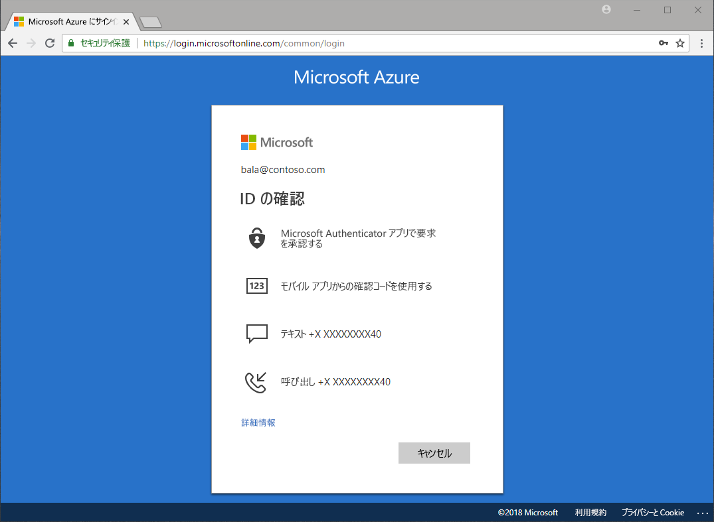

# 認証には、どのような方式がありますか。

パスワードが盗まれたとか、ID が不正アクセスされたという報告をニュースで耳にします。 パスワードに加えて 2 つ目の要素を要求すると、組織のセキュリティは、直ちに向上します。 Microsoft Azure Active Directory (Azure AD) には、Azure Multi-Factor Authentication (Azure MFA) や Azure AD のセルフサービスによるパスワードのリセット (SSPR) などの機能が組み込まれています。これにより、管理者は、追加の認証方式を使用して、組織とユーザーを保護することができます。

さまざまなシナリオが考えられます。アプリケーションにサインインするときや、パスワードをリセットするとき、Windows Hello を有効にするときなど、ユーザーは、身元を証明する追加の検証を求められる場合があります。

追加の検証は、以下のような認証方式の形式で行われます。

* メールまたはテキスト メッセージで提供されるコード
* 音声通話
* 電話での通知またはコード
* セキュリティの質問に回答する

Azure MFA と Azure AD のセルフサービスによるパスワードのリセットにより、管理者は、Azure AD と Azure Portal を使用して構成、ポリシー、監視、レポートを制御し、組織を保護することができます。

## セルフサービスのパスワード リセット

セルフサービスによるパスワードのリセットにより、ユーザーは、いつでも、どこでも、管理者の介入なしでパスワードをリセットできます。

> [!VIDEO https://www.youtube.com/embed/hc97Yx5PJiM]

セルフサービスによるパスワードのリセットには、次のものがあります。

* **パスワードの変更:** 自分のパスワードを知っているが、新しいパスワードに変更する場合に使用します。
* **パスワードのリセット:** サインインできないため、承認されている 1 つ以上の認証方式を使用して、パスワードをリセットする場合に使用します。
* **アカウントのロック解除:** アカウントがロックされていてサインインできないため、承認されている 1 つ以上の認証方式を使用して、アカウントをロック解除する場合に使用します。

## Multi-Factor Authentication

Azure Multi-Factor Authentication (MFA) は、Microsoft の 2 段階認証ソリューションです。 管理者が承認した認証方式を使用することにより、Azure MFA では、データやアプリケーションへのアクセスを保護しながら、シンプルなサインイン プロセスへの要求に応えることができます。

## ライセンスの要件

[!INCLUDE [Active Directory P1 license](../../../includes/active-directory-p1-license.md)]

## 次の手順

次の手順では、セルフサービスによるパスワードのリセットと Azure Multi-Factor Authentication の説明および構成を行います。

セルフサービスによるパスワードのリセットを始めるには、「[enable SSPR quickstart article](quickstart-sspr.md)」 (クイック スタート: SSPR を有効にする) を参照してください。

この記事で説明したセルフサービスによるパスワードのリセットの詳細については、「[機能: Azure AD のセルフ サービスによるパスワードのリセット](concept-sspr-howitworks.md)」を参照してください。

この記事で説明した Azure Multi-Factor Authentication の詳細については、「[しくみ: Azure Multi-Factor Authentication](concept-mfa-howitworks.md)」を参照してください。
