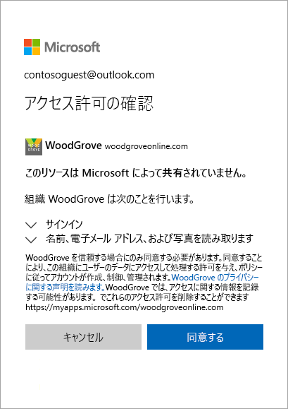

# クイック スタート: Azure Portal でディレクトリにゲスト ユーザーを追加する

組織とコラボレーションするユーザーをゲスト ユーザーとしてディレクトリに追加することで、そのユーザーを招待できます。 受諾リンクを含む招待メールを送信するか、共有するアプリへの直接リンクを送信できます。 ゲスト ユーザーは、自分の職場、学校、またはソーシャルの ID を使用してサインインできます。

このクイック スタートでは、Azure AD に新しいゲスト ユーザーを追加し、招待メールを送信し、ゲスト ユーザーの招待の受諾プロセスがどのようになるかを確認します。

Azure サブスクリプションがない場合は、開始する前に[無料アカウント](https://azure.microsoft.com/free/?WT.mc_id=A261C142F)を作成してください。

## 前提条件

このチュートリアルのシナリオを完了するための要件を次に示します。

 - グローバル管理者ロールやいずれかの制限付き管理者ディレクトリ ロールなどの、ディレクトリ内にユーザーを作成できるロール。
 - テナント ディレクトリに追加でき、テスト招待メールを受信するために使用できる有効な電子メール アカウント。

## Azure AD に新しいゲスト ユーザーを追加する

1. [Azure Portal](https://portal.azure.com/) に Azure AD 管理者としてサインインします。
2. 左ウィンドウで、**[Azure Active Directory]** を選択します。
3.  **[管理]** にある **[Users]** を選択します。

    ![[Azure Active Directory] を選択します。](media/quickstart-add-users-portal/quickstart-users-portal-user.png)

4.  **[新しいゲスト ユーザー]** を選択します。

    ![[Azure Active Directory] を選択します。](media/quickstart-add-users-portal/quickstart-users-portal-user-3.png)

5.  **[ユーザー名]** に外部ユーザーの電子メール アドレスを入力します。 **[招待状に個人的なメッセージを含めます]** の下に、ようこそメッセージを入力します。 

    ![[Azure Active Directory] を選択します。](media/quickstart-add-users-portal/quickstart-users-portal-user-4.png)

6. **[招待]** を選択して、招待をゲスト ユーザーに自動的に送信します。 右上隅に**ユーザーが正常に招待された**ことを示す通知が表示します。 
7.  招待を送信すると、ユーザー アカウントがディレクトリにゲストとして自動的に追加されます。

## ゲスト ユーザーにアプリを割り当てる
テスト テナントに Salesforce アプリを追加し、テスト用のゲスト ユーザーをアプリに割り当てます。
1.  Azure Portal に Azure AD 管理者としてサインインします。
2.  左側のウィンドウで、**[エンタープライズ アプリケーション]** を選択します。
3.  **[新しいアプリケーション]** を選択します。
4. **[ギャラリーから追加する]** で、「**Salesforce**」を検索して選択します。

    ![[Azure Active Directory] を選択します。](media/quickstart-add-users-portal/quickstart-users-portal-select-salesforce.png)
5. **[追加]** を選択します。
6. **[管理]** で **[シングル サインオン]** を選択し、**[シングル サインオン モード]** で **[パスワードに基づくサインオン]** を選択し、**[保存]** をクリックします。
7. **[管理]** で、**[ユーザーとグループ]** > **[ユーザーの追加]** > **[ユーザーとグループ]** を選択します。
8. 検索ボックスを使用してテスト ユーザーを検索し (必要な場合)、一覧のテスト ユーザーを選択します。 **[選択]** をクリックします。
9. **[割り当て]** を選択します。 

## 招待を承認する
次に、ゲスト ユーザーとしてサインインして、招待を確認します。
1.  テスト用のゲスト ユーザーの電子メール アカウントにサインインします。
2.  受信トレイで、"招待されました" 電子メールを見つけます。

    

3.  電子メールの本文で、**[開始]** を選択します。 **[アクセス許可の確認]** ページがブラウザーで開きます。 

    

4. **[Accept]\(承認\)** を選択します。 ゲスト ユーザーがアクセスできるアプリケーションを一覧表示するアクセス パネルが開きます。

## リソースのクリーンアップ
不要になったら、テスト用のゲスト ユーザーとテスト アプリを削除します。
1.  Azure Portal に Azure AD 管理者としてサインインします。
2.  左ウィンドウで、**[Azure Active Directory]** を選択します。
3.  **[管理]** で、**[エンタープライズ アプリケーション]** を選択します。
4.  **Salesforce** アプリケーションを開き、**[削除]** を選択します。
5.  左ウィンドウで、**[Azure Active Directory]** を選択します。
6.  **[管理]** にある **[Users]** を選択します。
7.  テスト ユーザーを選択し、**[ユーザーの削除]** を選択します。

## 次の手順
このチュートリアルでは、Azure Portal でゲスト ユーザーを作成し、アプリを共有するための招待を送信しました。 その後、ゲスト ユーザーの視点から受諾プロセスをレビューし、ゲスト ユーザーのアクセス パネルにアプリが表示されることを確認しました。 コラボレーションするためのゲスト ユーザーを追加する方法の詳細については、「[Azure Portal で Azure Active Directory B2B コラボレーション ユーザーを追加する](add-users-administrator.md)」を参照してください。