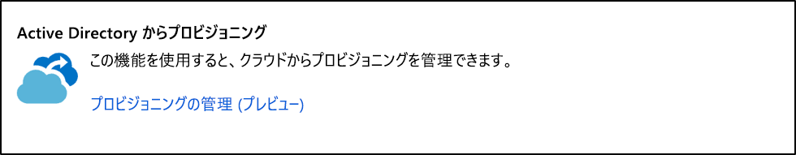
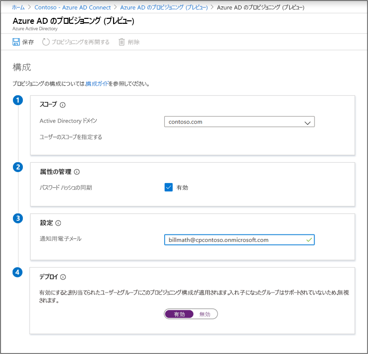
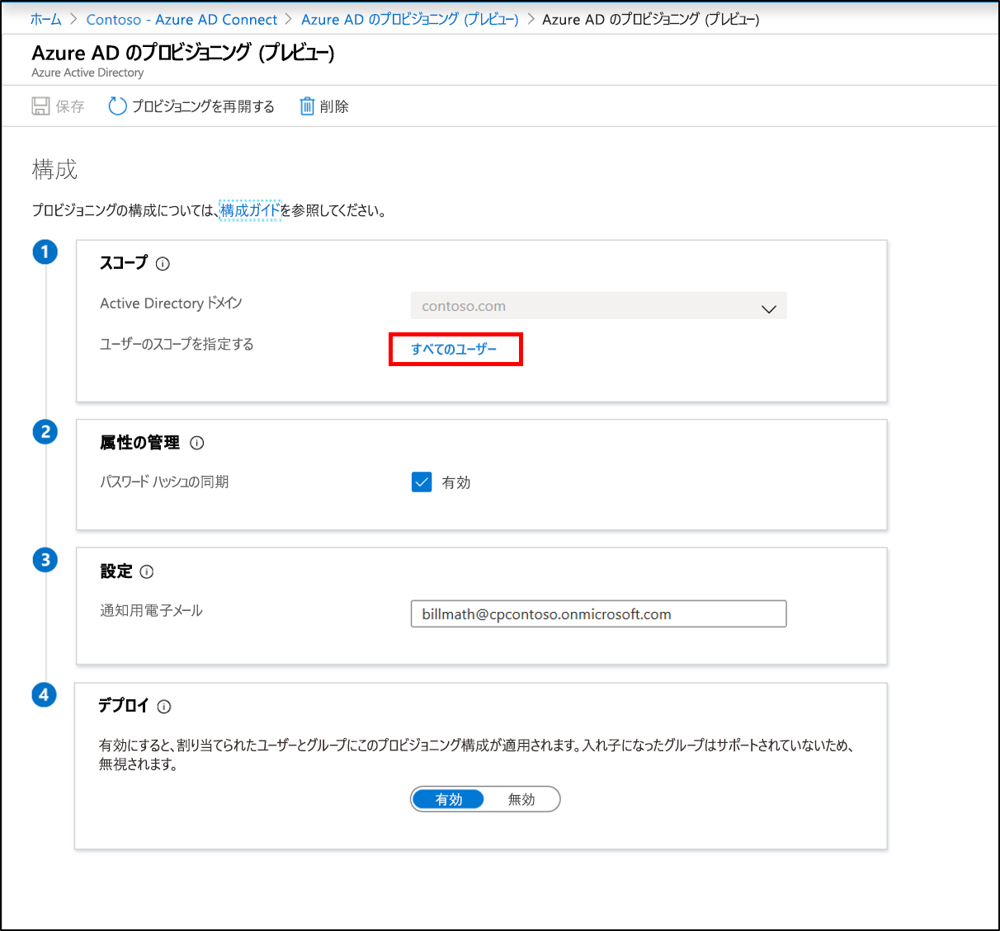

# Azure AD Connect クラウド プロビジョニングの新しい構成

エージェントをインストールしたら、Azure Portal にサインインしてプロビジョニングを構成する必要があります。  エージェントを有効にするには、次の手順に従います。

## プロビジョニングの構成
プロビジョニングを構成するには次の手順に従います。

1.  Azure AD ポータルで **[Azure Active Directory]** をクリックします。
2.  **[Azure AD Connect]** をクリックします。
3.  **[プロビジョニングの管理 (プレビュー)]** を選択します。

4.  **[新しい構成]** をクリックします。
5.  構成画面では、オンプレミス ドメインが事前に設定されています。
6. **[通知用メール]** に入力します。 このメールに通知が送信されます 
7. プロビジョニングが正常でない場合。  
8. セレクターを **[有効]** に移動し、 **[保存]** をクリックします。

## 特定のユーザーとグループに対するプロビジョニングのスコープ設定
特定のユーザーとグループだけを同期するようにエージェントをスコープ設定したい場合は、それを行うことができます。 オンプレミスの AD グループまたは組織単位を使用して、スコープを設定できます。 1 つの構成内でグループと組織単位を構成することはできません。 

1.  Azure AD ポータルで **[Azure Active Directory]** をクリックします。
2.  **[Azure AD Connect]** をクリックします。
3.  **[プロビジョニングの管理 (プレビュー)]** を選択します。
4.  **[構成]** の下で、自分の構成をクリックします。  

5.  **[構成]** で **[すべてのユーザー]** を選択して、構成規則のスコープを変更します。

6. 右側で、グループの識別名を入力して **[追加]** をクリックし、セキュリティ グループだけを含むようにスコープを変更できます。

7. または、特定の OU だけを含むように変更します。 **[完了]** 、 **[保存]** の順にクリックします。

## プロビジョニングを再開する 
スケジュールされた次回の実行を待ちたくない場合は、[プロビジョニングを再開する] ボタンを使用してプロビジョニングの実行をトリガーできます。 
1.  Azure AD ポータルで **[Azure Active Directory]** をクリックします。
2.  **[Azure AD Connect]** をクリックします。
3.  **[プロビジョニングの管理 (プレビュー)]** を選択します。
4.  **[構成]** の下で、自分の構成をクリックします。  

5.  上部にある **[プロビジョニングを再開する]** をクリックします。

## 構成の削除
構成を削除する場合は、次の手順に従って行うことができます。

1.  Azure AD ポータルで **[Azure Active Directory]** をクリックします。
2.  **[Azure AD Connect]** をクリックします。
3.  **[プロビジョニングの管理 (プレビュー)]** を選択します。
4.  **[構成]** の下で、自分の構成をクリックします。  

5.  上部にある **[削除]** をクリックします。

>[!IMPORTANT]
>構成を削除する前に確認が行われないため、 **[削除]** をクリックする前に、これが行いたいアクションであることを必ず確認してください。

## 次の手順 

- [プロビジョニングとは](what-is-provisioning.md)
- [Azure AD Connect クラウド プロビジョニングとは](what-is-cloud-provisioning.md)
